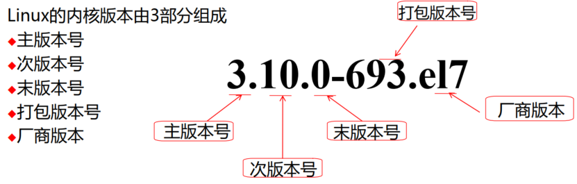
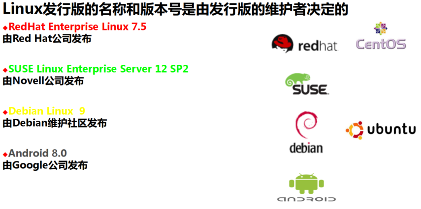

# 第3节. linux介绍


https://www.kernel.org/


slackware:SUSE

debian:ubuntu

redhat:REHEL、CentOS


```shell
[11:02:17 root@pyConsole ~]#uname -r
4.18.0-193.el8.x86_64
```





-----------


linux只是一个内核，加上GNU工具、附加软件和软件包管理组成的操作系统才是发行版。




##### CentOS
https://wiki.centos.org/Download
http://mirrors.aliyun.com
http://mirrors.sohu.com
http://mirrors.163.com
https://mirrors.tuna.tsinghua.edu.cn/centos/
##### Ubuntu
http://cdimage.ubuntu.com/releases/18.04.1/release/?_ga=2.56783850.1533668672.1544323446-1412352718.1543052421  


