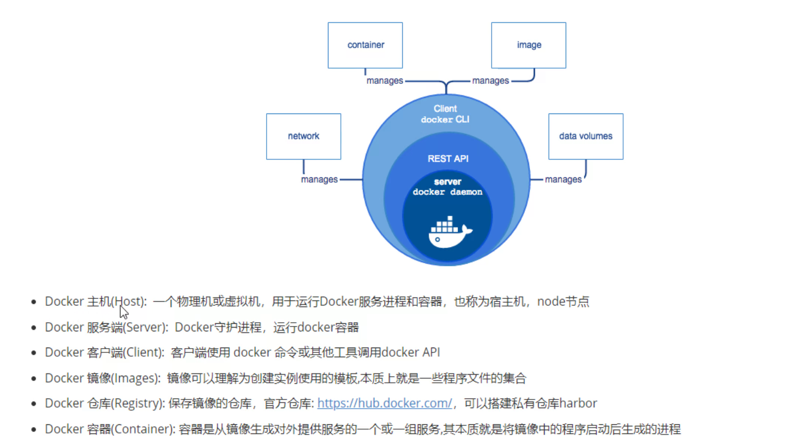
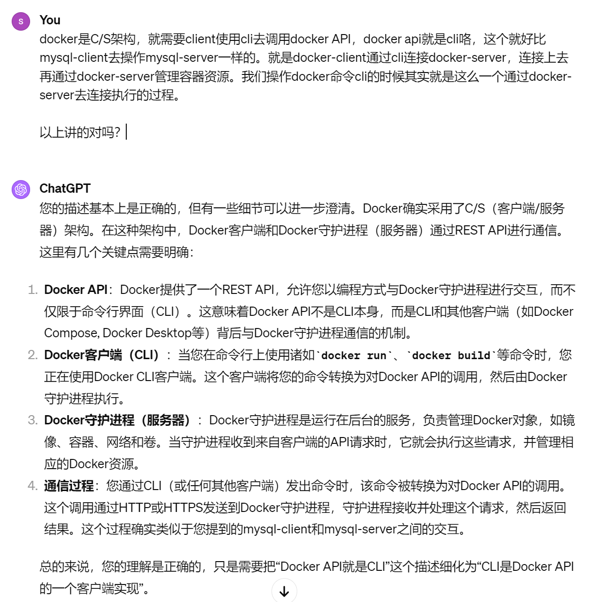

# 第2节 Docker组成和容器运行规范

# docker组成

1、Docker主机**host**，就是宿主，宿主可以是物理机也可以是虚拟机。你是node节点哦

2、docker是C/S结构的，所以还需要一个Docker 服务端 **server**：就是一个守护进程。

docker属于容器技术类里的一种，docker自己的工作机制就是C/S，而其他容器的工作机制可能就没有什么客户端服务端的情况。

3、docker是C/S架构，就需要**client**使用cli去调用docker API，docker api就是cli咯，这个就好比mysql-client去操作mysql-server一样的。就是Docker-client通过cli连接docker-server，连接上去再通过docker-server管理容器资源。我们操作docker命令cli的时候其实就是这么一个通过docker-server去连接执行的过程。

4、docker除了上面的c/s和API外还引入了模板思想。这就是Docker 镜像 **images**

模板：镜像，表现形式就是 文件 ；       静态文件 	  不运行知识占用一定的磁盘空间而已。

容器：镜像副本，实例，表现为 进程 多实例。    	  运行了就会还会占用内存空间了。占不占磁盘空间呢，占！因为容器运行起来，基于同一个镜像创建的多个容器的话，那么这些容器各有各的log，可能配置文件也不同，所以磁盘空间也是占用的。

5、docker容器**container**就是从镜像复制出来的一份运行起来而已。镜像复制很多份(你创建容器的时候就会复制的)，每一份就是一个容器。

6、docker镜像放哪呢，放在仓库里Docker 仓库 **registry**，方便重复使用。类似yum仓库。harbor是私有内部仓库。

容器的生命周期很短，生产中平均下来也就是1 2天，这个说法对吗？肯定不对啊，我docker跑gitlab，你觉的会是1 2天，1 2年还差不多。

容器的IP不想虚拟机是固定的，所以需要一个服务注册，自动发现的机制，可以实现如何访问容器。

因为你要追求容器的灵活性动态性，所以一整套的方案就要考虑清楚。

