# 第2节 Docker容器查看常见用法


# 容器里的root

docker 运行的时候，在容器里面，通常是以root运行的。


容器本身的文件还是分层落在宿主机上的overlay2目录里的👇，至于为什么是2个m53.txt这个后面再说，涉及分层结构的梳理。


该文件的所有者也是root


就是容器里的m53.txt所有者是root，容器外面宿主机上看到的m53.txt所有者也是root。

是一个root嘛？容器里的root是用的宿主机上的root嘛？并不是，容器里的root是一个假root就是一个普通用户。证明👇。


而宿主机是可以的👇，所以证明了容器里的root并不是传统意义的root超级用户。


df看不到挂载覆盖的效果，lsblk可以


顺便知道下dm0 dm1这些


所以dm-0  dm-1  这种就是lvm了，逻辑块。


## privileged--容器里使用宿主机的root，除非特地这么要求，否则别加该选项。


索然/dev/mapper下面没有lvm的逻辑块，但是要知道这个目录下面其实就是软连接

真正的rl-root其实是连接到dm-0去的

这一点，在宿主机上可以看到👇


所以容器里直接mount /dev/dm-0就行了


然后


此时再到宿主上直接就看到了


**这样容器里的某些操作就危险了，比如**


此时宿主上的echo就没了


但是发现echo还能用，


忽然反应过来，type 一下看到了builtin，说明什么，说明echo是buildin在/bin/bash里的，是内部命令。

**好，mv echo看不到效果，mv /bin/bash吧哈哈**


直接GG👇


所以除非生产中有明确要求容器里可以操作宿主机的权限，否则别加该--privilieged选项。


### 那么如何知道run的时候加了那些选项，比如是否加了危险的provilieged


看全部的run的时候加的选项


不过还不是太明显，不是tmd一目了然，使用一个第三方工具runlike来一目了然。


-p就是--pretty 更清晰点排版


# 查看容器信息


前面一直在用ps images这些，

这里再补充下-f选项的过滤


https://docs.docker.com/reference/cli/docker/container/ls/

下图链接有问题，纠正为👆

然后支持--filter选项的又有很多dockers cli  ：  https://docs.docker.com/config/filter/


-f等价于--filter，就是短选项和长选项的意思，好比-h ＝ --help

然后--format就是不想其他的，它只有短选项。


### 推荐的cli


**删除所有退出的容器**

```shell
docker ps -f 'status=exited' -q  # 退出容器的编号，删除👇起来方便
docker rm $(docker ps -f 'status=exited' -q)
```


**查看容器空间占用**

容器分层，image共用，所以括号里的是image大小，容器自身的可写层，一般是一些log，占用501B


# 题外话-网络故障处理-could not resolve host


1、最近总是收到故障

开发隔三岔五说 ： could not resolve host ，比如gitrunner里的pipline走不下去，报错看就是dns解析问题。


2、观察、分析

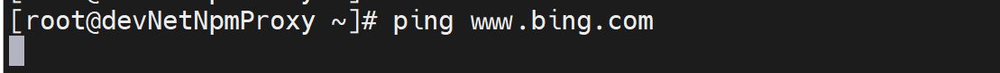

发现ping也是会卡5s，且很稳定

解决方法就是写host就ok了，但是不能总是些host啊，于是抓包


开两个窗口

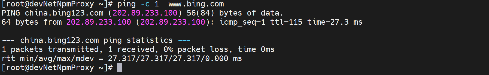

同时抓包


发现如图5s后二次dns请求，这不是所有linux都这么倒霉。   **# 这里其实分析有问题的👇**

进一步研究，发现有个参数optonst timeout 默认就是5s，就是超时5s后重试，可是实际情况是第一次有拿不到IP的情况的，然后5s二次查询是对的，但是很多时候第一次就拿到IP了，还是会二次查询的。

​		不知道为啥一定是2次，所以优化就是改为1s timeout就能加快了，就是2次查询间隔缩短为1s，然后通过single-request-reopen将1s也缩减到20ms的间隔。也算解决问题了


**解决方法**：

错误示范1：

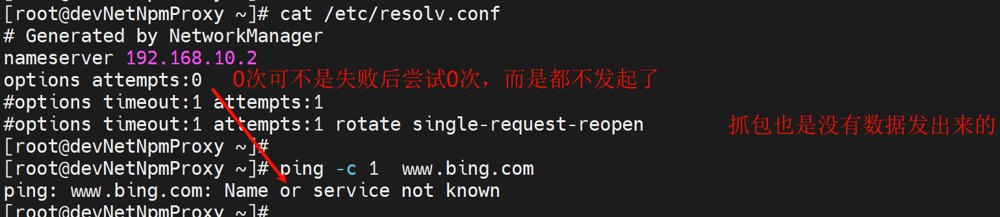


继续优化配置👇，下图注释也有问题，不是肉眼已经感知不到2次dns，而是就是一次，只不过一次里面存在了A和AAAA请求。

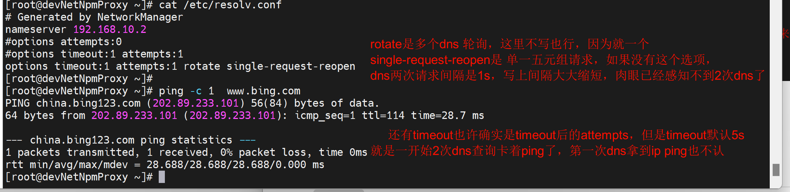

同时抓包可见


关于single-request-reopen的分析，正确的结论在文尾，这里仅作过程记录，看看就行。

不加这个参数的dns行为👇还是这个图，注意看两次（一个A和AAAA算一次）dns的源端口都是39125


加了这个参数👇，两次dns的报文的源端口是变化的。

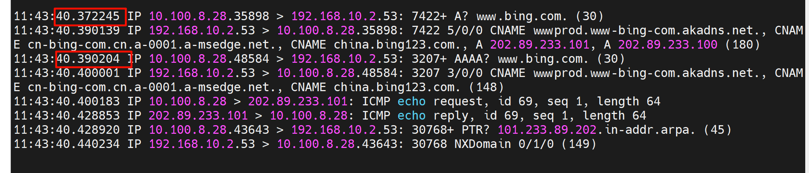


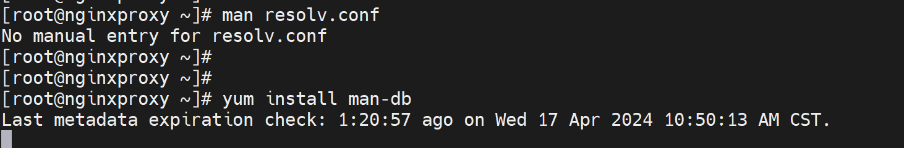

也不行

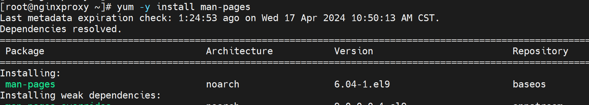

可以了👇

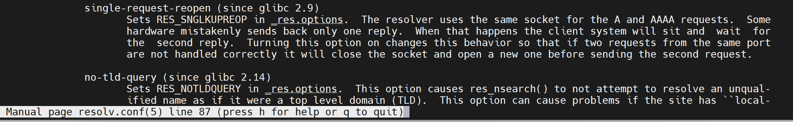

这是对这个参数的解释

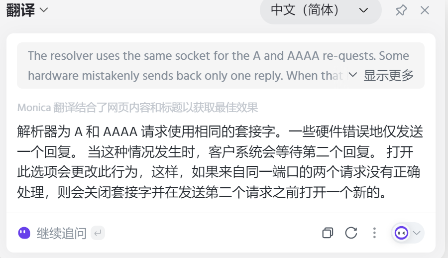


## ★进一步优化，最终的解决方法来了👇

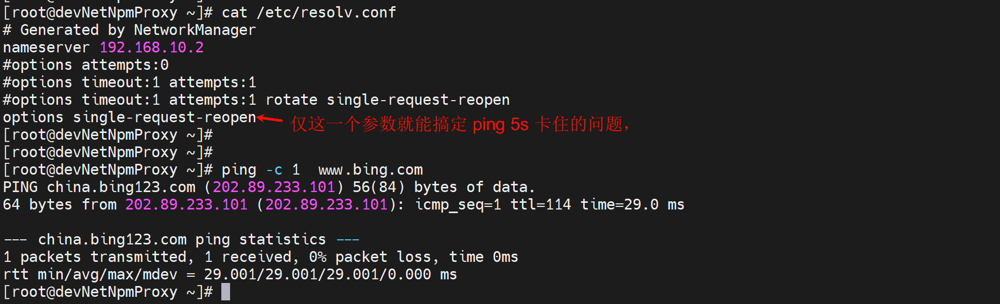

于此同时抓包，下图👇，也有不准确的描述，不叫"时间大大缩减"，而是就一次查询里发送了A和AAAA。


此时遗留一个问题，就是第二次的dns请求就是拿不到IP地址的，但也是也不影响结果的。


以上梳理存在问题，就是AAAA没有看到，也没有理清楚V6和AAAA的关系。


**还有一个问题，上面没有解释清楚为什么是2次dns，为什么很多linux就发送一次dns**👇

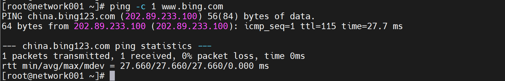

于此同时抓包

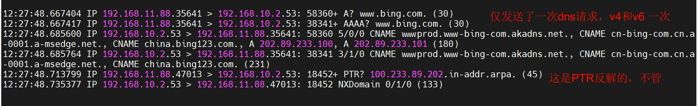


## 这里是最终结果，以上过程里很多是不正确的，看看就好

首先看这张图，这是ping卡住5s的抓包

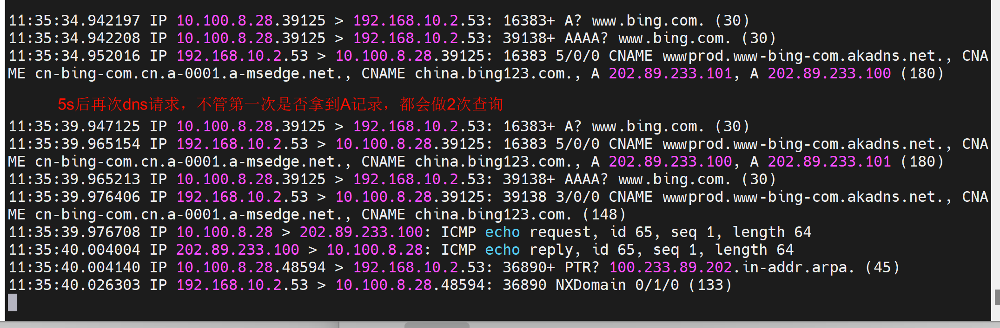

为什么存在两次dns查询，因为第一次失败了；其实第一次查询里既有V4也有V6（V6的AAAA也走的v4的socket，因为没有v6的GW），而AAAA没有拿到响应，所以人家判定了超时timeout是对的，这才触发了2次查询，所以**关闭IPV6**也许也是一个办法，或者**防火墙放开IPV6**（这个机器是在内网的，请求dns server是要经过防火墙到达外网的）。  # 不是防火墙放开IPv6，而是A和AAAA走的一个socket，FW认为是一个session的重复reply可能就直接drop掉了。但是为什么第二次就不drop了？？**这是个遗留问题。**

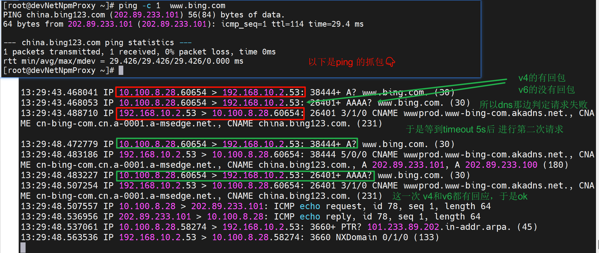


**---------一次ping的完整的抓包，涉及节点的抓包---------**

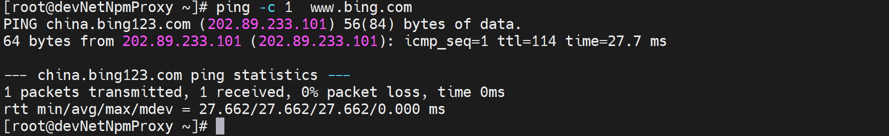

于此同时自己本地抓包

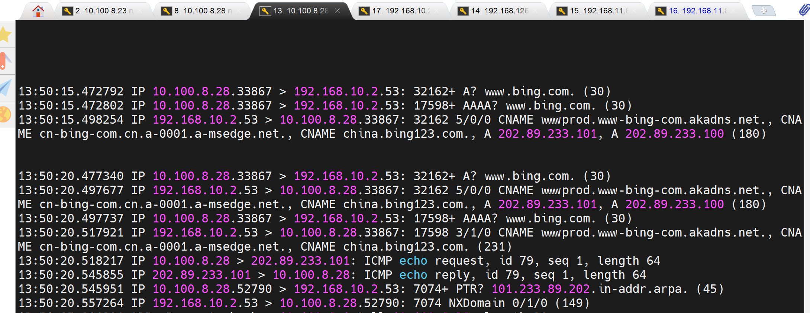

于此同时dnsserver上抓包，注意dnsserver上时间要快5s，date time 验证过了，上图的13:50:15时间对应下图12:50:21👇  **★我猜测哦**，可能第一组A和AAAA的一个socket的时间离得太近了只有0.000010s=10μs，而第二组的A和AAAA虽然共用也给socket但时间相隔有个497737-477340=0.20397s=20397μs 也就是微妙

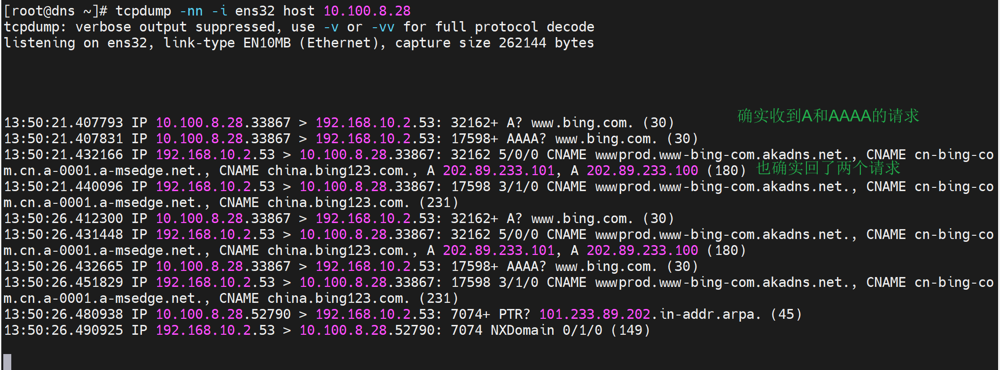

所以就是dns明明回了A和AAAA，但是由于A和AAAA共用的一个socket，注意都是33867，可能就是这里出了问题，防火墙那边可能基于同样的socket也就是五元组就丢弃了。导致client没有收到，但是为什么第二次又可以了呢！也许有时候5s超时第二次都不行的情况也是粗在的。

​		所以处理方法：区分A和AAAA的socket，这样就避免了FW的误判丢包--这点只是猜测。

**----↑-----一次ping的，涉及节点的抓包----↑-----**


**然后我又抓了两次**

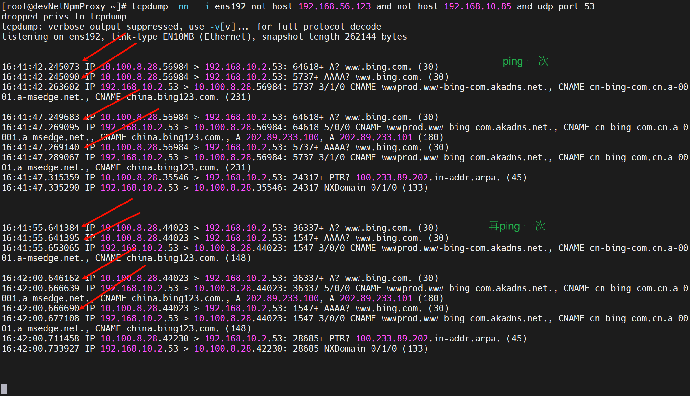

当然上图的dns 配置就是

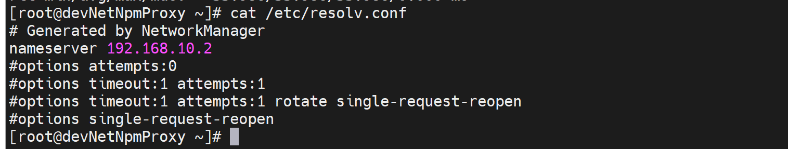

所以可以得出上面的猜测很可能是对的，就是第一次两个dns查询（A和AAAA)间隔时间太短了10毫秒，防火墙干掉了第AAAA的那个回包，为什么是回包而不是去包，因为dnsserver上抓包能稳定地抓到2个请求，并回了两个reply，而client第一次没有看到AAAA地replay就是fw干掉了啊，还能是什么原因呢；系统判定查询里存在失败，所以再次timeout 5s后发起查询，这次系统肯定做了offset这种东西，就是A和AAAA发起的间隔拉开了，一定代码里有这个参数！在0.2s级别所以FW没有干掉，能够跟上这个节奏，我判定还是我的SSG干掉的，不能自己发的自己判断不出来的。  ★★


我处理的方法是再/etc/resolv.conf文件里添加一行**options single-request-reopen**

此时抓包就变成了，只发送一次dns查询了，注意一次里既有v4也有v6，不过v6和v4的不再共用一个socket了，也就是不再使用相同的源端口。

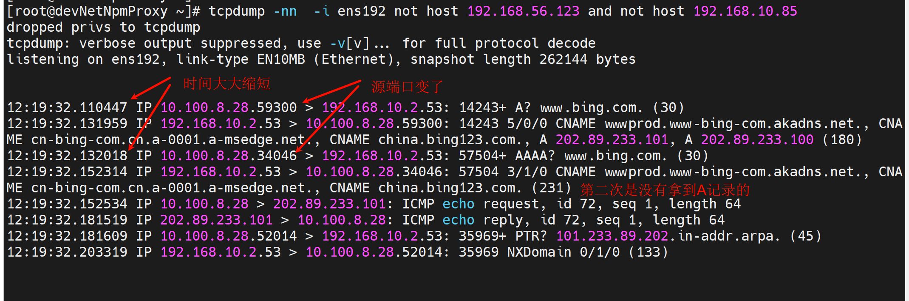

**结论再次总结**：

①因为fw只放行了内网机器到外网dns的ipv4的dns流量，或者压根FW的接口就没有V6地址；  # 这种说法也是不对的，虽然是AAAA，但是走的还是v4的socket；就是AAAA是v6的解析查询，但是走的还是v4的socket，就是ipv6的dns查询此时此刻用的是ipv4地址去问的。所以A和AAAA的查询其实在外界看来就是一个socket，所以可能就是fw丢弃了一个reply，一个socket里的两个报文里的太近了，去的时候确实没有被FW干掉，dnsserver也收到了并回了，但是回来两个报文经过FW的时候被认为重复了，干掉了第二个，FW肯定是针对回包有判定机制一个socket的判定机制，去包没有肯定。


②所以在默认dns查询的时候v4和v6由于使用的一个socket；


③系统基于v6没有响应判定为请求失败，因为fw丢弃了一个socket；


④于是系统进行第二次查询，而两次查询间隔默认是5s；


⑤这就是为什么ping卡住5s的原因；


⑥处理方法，将v4和v6的socket区分开来后，区分后FW自然不会再丢弃，系统不再认为第一次请求失败，于是不再发送第二次请求，也就是没有默认5s的timeout了。于是就解决了故障了。


## DNS解析超时排查/etc/resolv.conf里的single-request-reopen参数说明


将👇

options rotate timeout:1 attempts:3 single-request-reopen

添加到/etc/resolv.conf 中

\#释义： 循环查询 超时时间1s 重试次数3 只收到一个IPV4应答或者只收到一个IPV6应答，重新开一个socket查询


*妈的还是别人讲的好,但是也有细节不对，上面我的一些分析也OK的。*

https://www.cnblogs.com/zhangmingda/p/9725746.html

以下是复制出来的内容，复制出来反而图片出来了，好奇怪，哈哈哈

## 


**说明：**
		在RHLE6/CENTOS6的环境里，需要在/etc/resolv.conf添加以下参数options single-request-reopen。具体原因请看下面。 

​		*其实不仅仅是6，7，rocky 9.3 一直都是如此默认就是一个socket。*

**具体：**
**一. 在RHEL5/CentOS5/Ubuntu 10.04等linux下，dns的解析请求过程如下**
[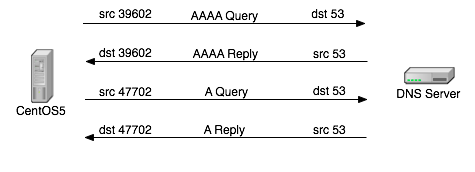](http://coolnull.com/wp-content/uploads/2015/05/v11.png)
1 主机从一个随机的源端口，请求 DNS的AAAA 记录，
2 主机接受dns服务器返回AAAA记录，
3 主机从一个另一个随机的源端口，请求 DNS的A 记录，
4 主机dns 服务器返回A记录，

**二. 如果是RHEL6/CentOS6，交互过程有所不同**，如图：
[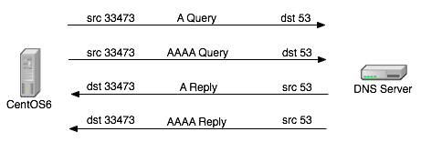](http://coolnull.com/wp-content/uploads/2015/05/v21.png)
1 主机从一个随机的源端口，请求 DNS的A 记录，
2 主机从同一个源端口，请求 DNS的AAAA 记录，
3 主机接受dns服务器返回A记录，
4 主机接受 dns服务器返回AAAA记录，

**三. 上面3,4并没有严格的先后顺序，实际的顺序受网络环境，服务器环境的影响**
理论上讲centos6的这种工作机制，效率更高，端口复用度更高，能节省更多的资源。
但是这里也同样存在着一个问题。比如在存在防火墙等机制的网络环境中，同样源目的ip,同样源目的port，同样的第4层协议的连接会被防火墙看成是同一个会话，因此会存在返回包被丢弃现象。如下图。
[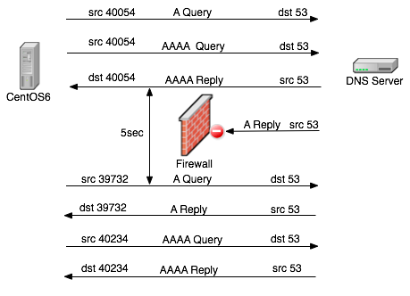](http://coolnull.com/wp-content/uploads/2015/05/v3.png)
此时的整个dns解析过程如下：
1 主机从一个随机的源端口，请求 DNS的A 记录，
2 主机从同一个源端口，请求 DNS的AAAA 记录，
3 **主机先收到dns返回的AAAA记录**，
4 防火墙认为本次交互通信已经完成，关闭连接，  # 这个说法很nice，和上面我的猜测吻合
5 **于是剩下的dns服务器返回的A记录响应包被防火墙丢弃**
6 等待5秒超时之后，**主机因为收不到A记录的响应，重新**通过<font color=red>新</font>的端口发起A记录查询请求，此后的机制等同于centos5）       # 新的端口，我抓包可见并不是新端口   
7 主机收到dns的A记录响应；
8 主机从**另一个新的源端口发起AAAA**         *# 并没有，还是A和AAAA连个查询，源端口还是原来的，只不过间隔时间变长了，从10毫秒变成了0.2s量级。*
9 主机收到dns的AAAA记录响应；
我们看到在这个解析的序列里面，dns解析有5秒的延迟发生。所以当用linux系统安装大量远程包的时候宏观上看延迟就非常大了（linux是不缓存dns解析记录的）。

**总结：**
那么到底options single-request-reopen这个参数的作用是什么的，man 5 resolv.conf的结果如下

```
#man 5 resolv.conf
              single-request-reopen (since glibc 2.9)
                     The resolver uses the same socket for the A and AAAA requests.  Some hardware mistakenly only sends back  one reply.  When that happens the client sytem will sit and wait for the second reply.  Turning this option on changes this behavior so that if two requests from the same port are not handledcorrectly it will close the  socket and open a new one before sending the second request.
```


## 一句话总结

就是ipv4和ipv6的请求和在一个五元组里，回包在经过fw的时候被干掉了第二个；所以使用参数将其分开为两个socket。

