# 第5节 Docker制作镜像方法说明和手动制作镜像


比如开发了一套系统，如何迁移到容器里，如何制作成容器镜像，这就是本章的目标。


# **手动制作镜像**


不推荐


## 概述

​		好比虚拟机的模板制作：手动安装虚拟机、定制(关闭selinux、iptables安全加固、优化内核等基本初始化配置、常用软件包)、关机，以此虚拟机为模板，后续克隆即可。

​		然后手动制作容器镜像的话，比如，找一个alpine镜像，启动后，进入容器，进行定制化，安装软件、账号创建、仓库优化等。基于这个定制的容器来生成镜像。

​		存在的问题，就是每次镜像需求发送细微变化，你都要进到容器里再次修改后生成。纯手动，不推荐使用，说它纯手动是因为基于交互式方式进去操作这种，脚本化不方便，其实真要说起来，什么操作不能自动化，手动制作镜像的方式也可以改成脚本，只不过有docker build的方式才不会这么弄罢了。


**pull镜像**

下载ubuntu镜像，啥，tag版本号怎么得知的，hub.docker.com里找lastest然后对比MD5找到版本号。或者skopeo list-tags docker://ubuntu看看也行。


## **run进去定制**

其实镜像的CMD就是/bin/bash，所以run后面的bash可敲可不敲：


至于当前的shell是啥要大写去查echo $SHELL


好了，下面使用我们熟悉的bash来定制，

时间校准下，ss命令、curl、wget、vim 、vi也没有


ubuntu的国内镜像可以修改为👇


或者用清华的https://mirrors.tuna.tsinghua.edu.cn/help/ubuntu/


我这边就不改了，就用默认的

**apt update下**


算了还是用国内的吧


再次apt update

还是有问题


看看这个

https://mirrors.ustc.edu.cn/help/ubuntu.html

```shell
sed -i 's@//.*archive.ubuntu.com@//mirrors.ustc.edu.cn@g' /etc/apt/sources.list.d/ubuntu.sources
```


还是老样子


其实是时间不对，容器里的时间是从宿主来的，宿主安装chrony后，再创建容器就行了  # 这话其实不一定对，因为后面还是安装不了软件，我最终的方法是使用默认的不挂在时区文件，反而又成功了[看下面段落的再来一遍的独立测试过程](#1)


不过时区如果也要改的话就这样

### 容器时区和时间怎么同步宿主

时区就行，时间自动的


这个其实还是用的宿主的时区，和时间，所以GMT+8要保证宿主机上的设置好先。


定制化安装一些常用工具命令行

```shell
apt -y install wget curl net-tools procps psmisc iputils-ping iproute2 vim tzdata tcpdump telnet traceroute tree iotop unzip zip nfs-common lrzsz && apt clean
```


我让GPT分析了原因，

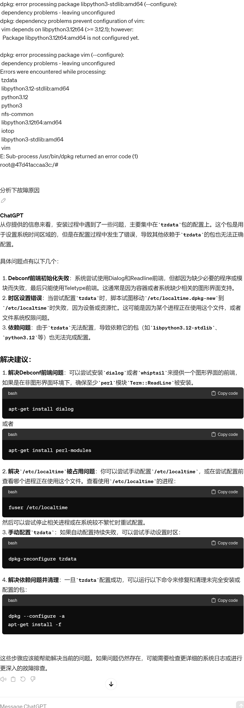


通过阅读GPT的回答，可知可能正式我用

```shell
 docker run -it --name test01 -v /etc/localtime:/etc/localtime:ro ubuntu:24.04
```

只读挂载容器里的/etc/localtime文件，导致tzdata无法修改这个文件。

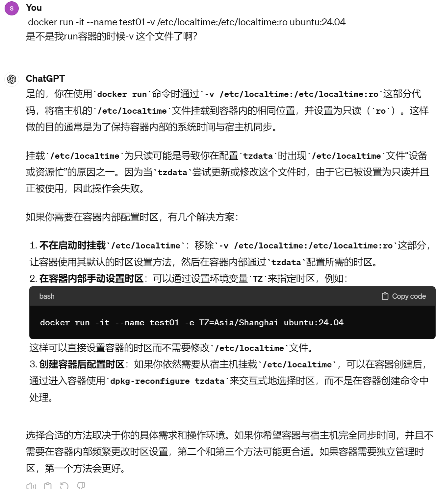


反正是tzdata设置不了导致的<span id=1>👇以下是再来一遍的</span>

### apt安装软件失败和成功的对比-寻找故障点

**1、寻找故障点**

**挂载时区文件**
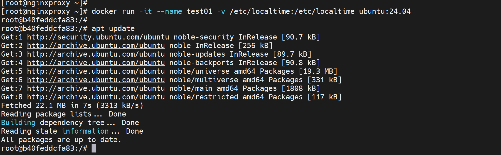

然后发现安装软件到这些都OK，

apt -y install wget curl net-tools procps psmisc iputils-ping iproute2 **vim tzdata** tcpdump telnet traceroute tree **iotop** unzip zip **nfs-common** lrzsz && apt clean


以上粗体的软件，安装都依赖tzdate，所以都会涉及localtime文件的覆盖，而localtime当初创建容器的时候就是被宿主机给占用了的，即使没有ro的方式也是被占用的，也无法被覆盖。

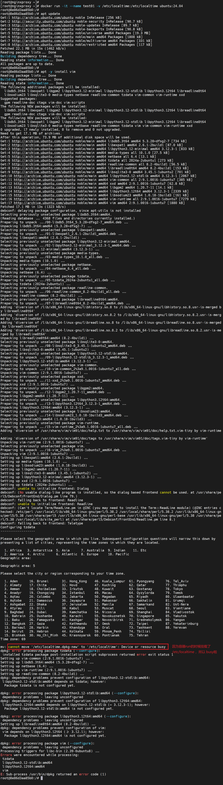


**2、应对措施**
1、时间不对可能导致apt update出错；但没必要修改时区。

2、如果进一步修改时区，就可能导致apt install 的包依赖到tzdate就无法mv覆盖

这真是个大聪明的机制。

3.1、解决方法也有：使用docker cp 将时区文件复制进去，而不是-v挂载进去，这样tzdate安装的时候就可以mv 覆盖这个时区文件了。

3.2 、其实解决方法也可以：不要修改时区，UTC也好GMT也罢，都是准确的时间，无非是可读性不好吧。


## 以上故障总结

### 1、apt update报错及解决

答案就是时间不对


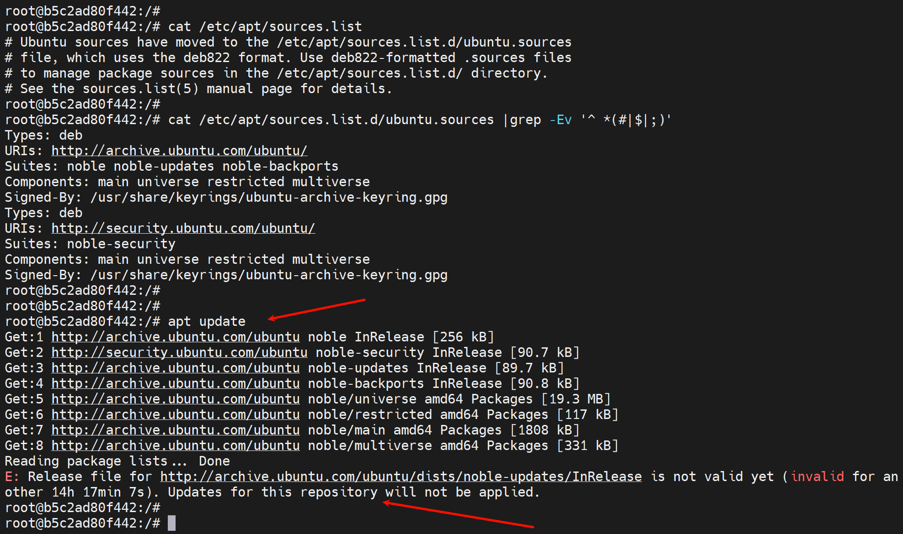


**尝试复现上面的报错**

①先明确容器的时间哪来的：系统时间的UTC时间，是不看系统时区的，只看UTC对应的时间。

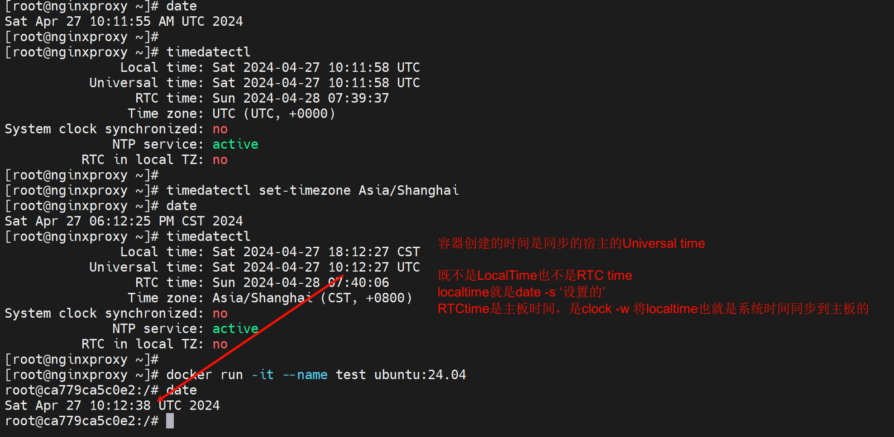

②再复现报错，date -s 改掉系统时间，然后utc时间自然跟着变，就能看到报错

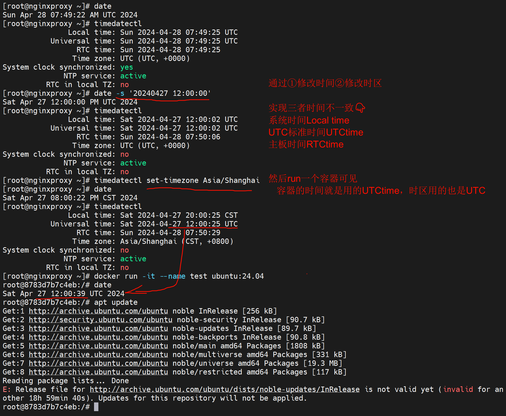

进一步分析，时间判断机制，人家apt update的时候又文件里写着时间的，对比你的时间不对就报错。

https://linux.cn/article-12666-1.html

根据这个大兄弟提供的思路，我找到了docker里的判断基准文件

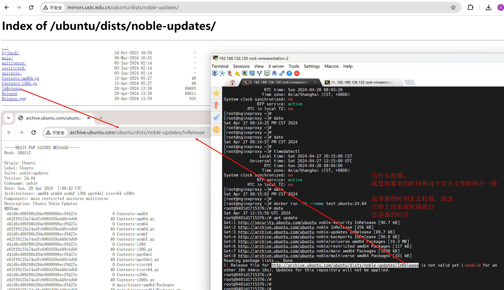


**通过修改宿主机的时间，无需修改时区，然后直接run容器，就可以apt update成功**

```shell
chronyc makestep   # 手动同步网络时间校准下
```

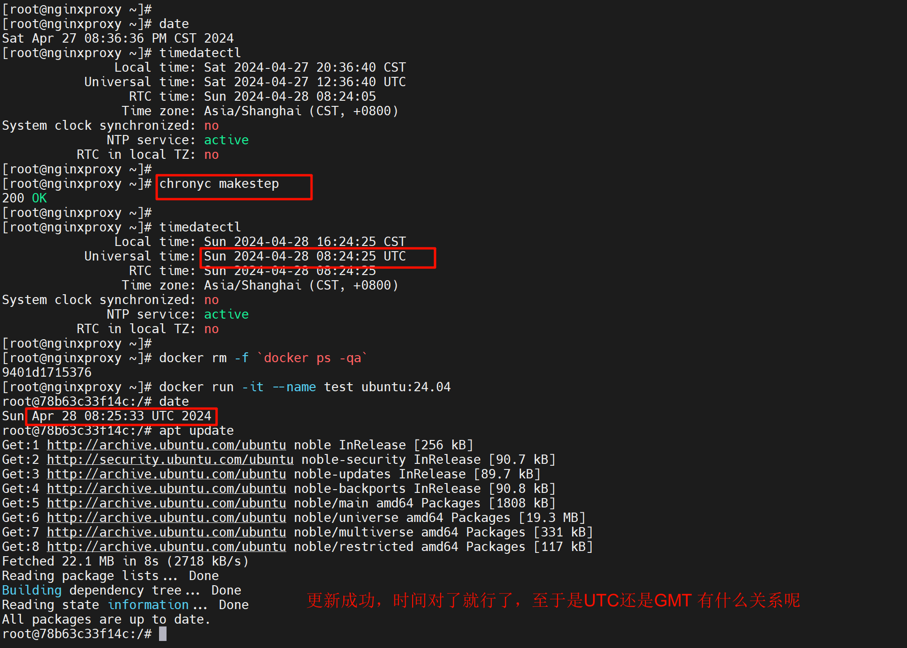


### 2、挂载时区文件导致依赖tzdate包无法安装及解决

首先不挂在时区文件，就不会存在这个问题👇

**不映射时区文件tzdate安装ok👇**

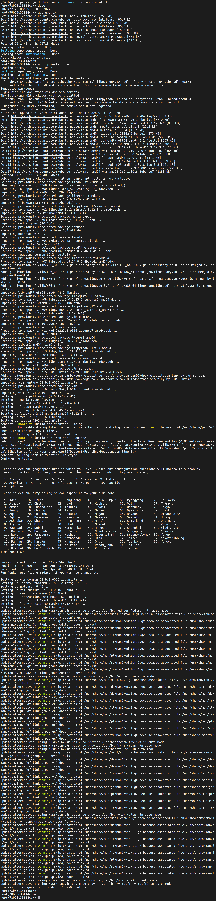


**映射时区文件，导致安装tzdate依赖包出错**

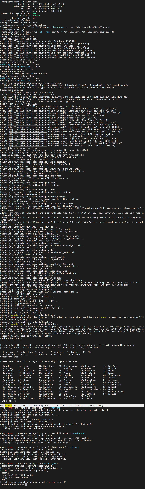


**处理方法**

使用docker cp 将时区文件复制进去，而不是-v挂载进去，这样tzdate安装的时候就可以mv 覆盖这个时区文件了。

👇下图是cp -L将软连接的源文件内容复制进去了，仅cp -a这种是没用的，因为软连接进不去，因为容器里没有软连接指向的源文件。

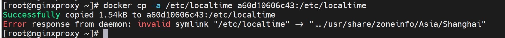

所以要用-L复制：

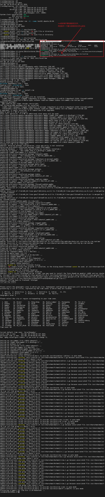


此时再次安装

```shell
apt -y install wget curl net-tools procps psmisc iputils-ping iproute2 vim tzdata tcpdump telnet traceroute tree iotop unzip zip nfs-common lrzsz && apt clean
```

就很丝滑~也会涉及tzdate的安装，它会修改一些东西，比如

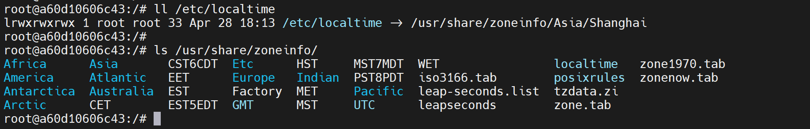

这些都是tzdate设置的，也不知道他基于什么给我设置成上海时区，也许是从宿主拿的，测试一下

并不是人家tzdata默认时区就是上海，哈哈

**将外面宿主的时区改成掉**

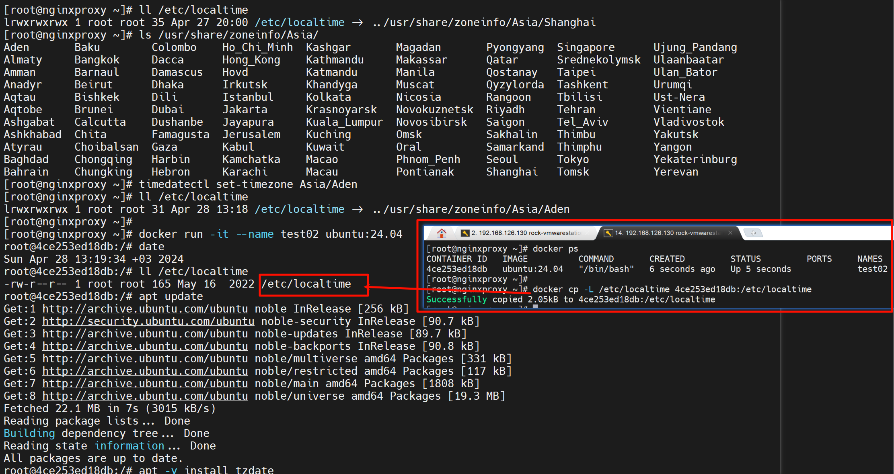

然后再将容器里的时区改掉👆，最后安装tzdata发现时区还是上海，而且最终信息人家也告诉你了就是默认的上海时区👇

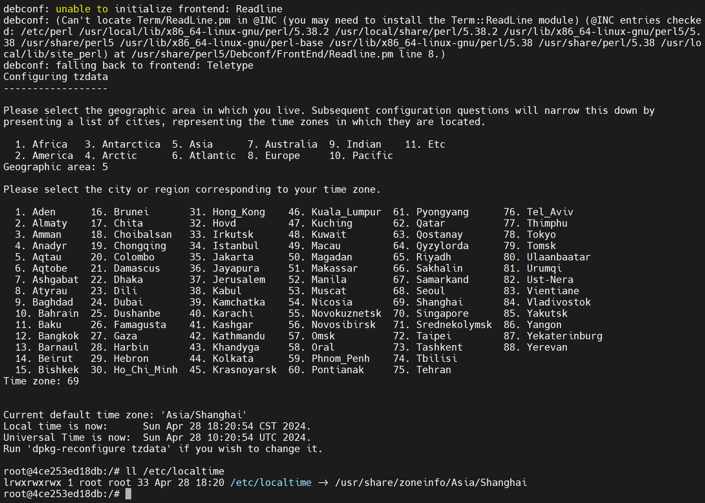

### 所以关于容器的时间，其实就简单了

1、宿主时间要对就行。

2、容器进去apt updata后，直接安装tzdata时区时间就都OK了，此为无脑操作，也挺香。


**自动制作镜像**

​		


# wifi故障案例

**故障现象：**开大会的时候，FTP传文件速度只有100KB/s；


**故障复盘：**

1、笔记本在夹层楼道第二个台阶处连接到1F夹层会议室里的AP后，此时信号处于中接近弱的状态，此时FTP传输文件就是50KB/S，

2、然后将笔记本移动到夹层会议室里，此时WIFI信号开始变强，但是FTP的速度并不会上涨

3、然后删除ftp的任务，重新传输，此时速度才会肉眼可见很快的达到2MB/s的样子。


用户行为导致的故障可能分析1：

1、用户的笔记拿到休息区的柜子上的时候，wifi信号还吊死在别的AP上，导致信号弱。

2、用户打开FTP后进行传输的时候，wifi信号是弱的，此时ftp速度很慢。

3、等到wifi连接稳定(切换到最近的AP)信号变强，但是FTP速度只会随着信号变弱而变慢，并不会随着信号变强而变强。

4、此时需要删除FTP任务，重新进行文件传输，让FTP重新协商。


用户行为导致的故障可能分析2（**该故障方式已复盘**）：

1、用户在二楼的时候就已经开始用wifi传输文件了，然后笔记本移动到1楼休息区的时候经过楼道wifi变弱了导致FTP速度变慢；

2、等到用户wifi稳定后(切换到最近的AP)信号变强，但是FTP速度只会随着信号变弱而变慢，并不会随着信号变强而变强。

3、此时需要删除FTP任务，重新进行文件传输，让FTP重新协商。


**应对方法：**

用户到哪里，就断开WIFI重连一下(该操作确保终端就近连接AP)，然后再进行FTP或者其他文件的传输  （ ”然后“  的道理就是：确保wifi稳定后再传输数据，防止信号不稳定的时候，那时软件传输数据的时候是认为网络通道是狭窄的，等信号强了有的软件可不一定能够快速探测到通道OK了从而给你加速传输）。


# 国内paypal电信拨号线路突然打不开


**1、故障现象**

用户所在线路未电信拨号线路，之前可以登入国内的paypal，今天打开很慢一直转圈圈好久才出页面，登入就登不进去


**2、分析**

首先了解：虽然和本次故障不相干

https://zhuanlan.zhihu.com/p/663322201


其实F12看到www.paypalobjects.com很多URL都是走的的这个域名，但是该域名通过电信线路就打开很慢，加载慢，但肯定不是DNS问题，发现该域名IP是美国IP：内部解析和外部解析一致，也就是说内部并没有做任何dns的设置。

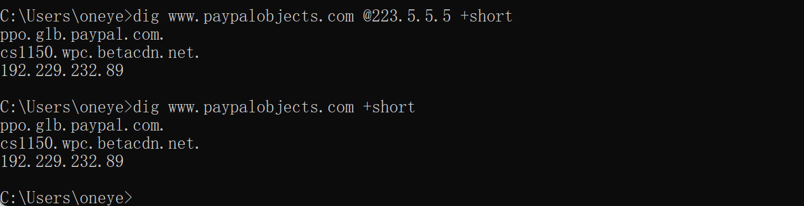

结合联通海外线路一般是比电信要好的这么一个普遍共识，所以切到联通测试发现打开速度杠杠的。


**3、处理方法**

切换到联通线路就行

至于电信拨号打开慢，登入不上，又不是公司网络问题，理由很简单：ip一直有监控60多天地址没变过，用户之前ok，现在不行，经测试发现确实不行，说明就是ISP自己的问题。此类故障统一切换线路就行了。怎么切？切用户啊，因为paypal涉及很多地址，不可能全部一条条打到联通线路去，只能且用户，并告知用户他的出口线路已切的情况。


