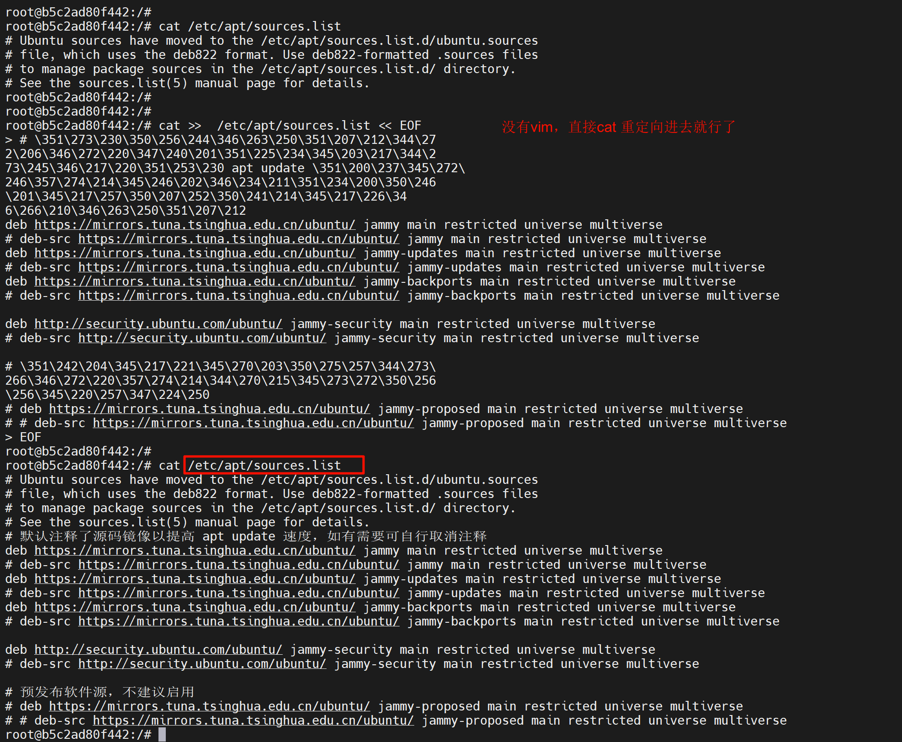

# 第5节 Docker制作镜像方法说明和手动制作镜像


比如开发了一套系统，如何迁移到容器里，如何制作成容器镜像，这就是本章的目标。


# **手动制作镜像**


不推荐


## 概述

​		好比虚拟机的模板制作：手动安装虚拟机、定制(关闭selinux、iptables安全加固、优化内核等基本初始化配置、常用软件包)、关机，以此虚拟机为模板，后续克隆即可。

​		然后手动制作容器镜像的话，比如，找一个alpine镜像，启动后，进入容器，进行定制化，安装软件、账号创建、仓库优化等。基于这个定制的容器来生成镜像。

​		存在的问题，就是每次镜像需求发送细微变化，你都要进到容器里再次修改后生成。纯手动，不推荐使用，说它纯手动是因为基于交互式方式进去操作这种，脚本化不方便，其实真要说起来，什么操作不能自动化，手动制作镜像的方式也可以改成脚本，只不过有docker build的方式才不会这么弄罢了。


**pull镜像**

下载ubuntu镜像，啥，tag版本号怎么得知的，hub.docker.com里找lastest然后对比MD5找到版本号。或者skopeo list-tags docker://ubuntu看看也行。


**run进去定制**
其实镜像的CMD就是/bin/bash，所以run后面的bash可敲可不敲：


至于当前的shell是啥要大写去查echo $SHELL


好了，下面使用我们熟悉的bash来定制，

时间校准下，ss命令、curl、wget、vim 、vi也没有


ubuntu的国内镜像可以修改为👇


或者用清华的https://mirrors.tuna.tsinghua.edu.cn/help/ubuntu/


我这边就不改了，就用默认的

**apt update下**


算了还是用国内的吧



再次apt update

还是有问题


看看这个

https://mirrors.ustc.edu.cn/help/ubuntu.html

```shell
sed -i 's@//.*archive.ubuntu.com@//mirrors.ustc.edu.cn@g' /etc/apt/sources.list.d/ubuntu.sources
```


还是老样子


其实是时间不对，容器里的时间是从宿主来的，宿主安装chrony后，再创建容器就行了


不过时区如果也要改的话就这样

### 容器时区和时间怎么同步宿主

时区就行，时间自动的


这个其实还是用的宿主的时区，和时间，所以GMT+8要保证宿主机上的设置好先。


定制化安装一些常用工具命令行

```shell
apt -y install wget curl net-tools procps psmisc iputils-ping iproute2 vim tzdata tcpdump telnet traceroute tree iotop unzip zip nfs-common lrzsz && apt clean
```


有一些报错了


**自动制作镜像**

​		


# wifi故障案例

**故障现象：**开大会的时候，FTP传文件速度是由100KB/s；


**故障复盘：**

1、笔记本在夹层楼道第二个台阶处连接到1F夹层会议室里的AP后，此时信号处于中接近弱的状态，此时FTP传输文件就是50KB/S，

2、然后将笔记本移动到夹层会议室里，此时WIFI信号开始变强，但是FTP的速度并不会上涨

3、然后删除ftp的任务，重新传输，此时速度才会肉眼可见很快的达到2MB/s的样子。


用户行为导致的故障可能分析1：

1、用户的笔记拿到休息区的柜子上的时候，wifi信号还吊死在别的AP上，导致信号弱。

2、用户打开FTP后进行传输的时候，wifi信号是弱的，此时ftp速度很慢。

3、等到wifi连接稳定(切换到最近的AP)信号变强，但是FTP速度只会随着信号变弱而变慢，并不会随着信号变强而变强。

4、此时需要删除FTP任务，重新进行文件传输，让FTP重新协商。


用户行为导致的故障可能分析2（**该故障方式已复盘**）：

1、用户在二楼的时候就已经开始用wifi传输文件了，然后笔记本移动到1楼休息区的时候经过楼道wifi变弱了导致FTP速度变慢；

2、等到用户wifi稳定后(切换到最近的AP)信号变强，但是FTP速度只会随着信号变弱而变慢，并不会随着信号变强而变强。

3、此时需要删除FTP任务，重新进行文件传输，让FTP重新协商。


**应对方法：**

用户到哪里，就断开WIFI重连一下(该操作确保终端就近连接AP)，然后再进行FTP或者其他文件的传输  （ ”然后“  的道理就是：确保wifi稳定后再传输数据，防止信号不稳定的时候，那时软件传输数据的时候是认为网络通道是狭窄的，等信号强了有的软件可不一定能够快速探测到通道OK了从而给你加速传输）。


