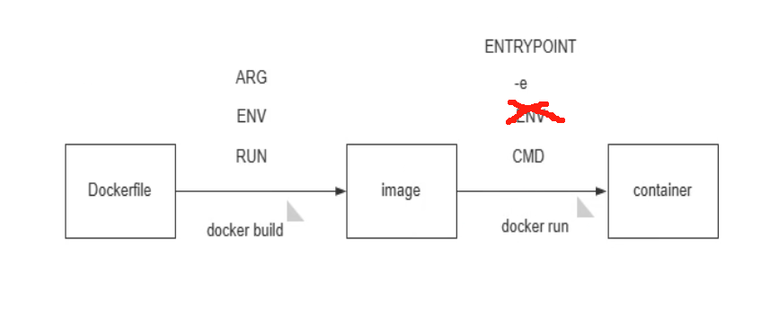

# 第1节 Dockerfile常见指令用法

# 接上节，浅复一下

FROM：所有镜像都有父镜像，scratch镜像

LABEL：版本信息，功能说明，作者
ENV：环境变量，build后run起来可用，后续run得时候-e可覆盖
RUN：build时候执行得shell命令，比如编译安装，ln -s，配置文件修改，脚本操作
COPY：宿主的文件复制到镜像里，文件得放在build动作的当前工作目录，且使用相对路径（一般就是Dockerfile所在目录，除非Dockerfile 是 -f 放到其他地方了，此时COPY的源文件还得必须是build这个动作的当前目录）。
ADD：比COPY多了一个自动解压缩，然后复制的时候，目标目录可能不像COPY那样需要加上/，来严谨对待，但是我们还是要规范的。
CMD：容器run来后执行的命令，一般用来挂前台保证容器run起来后不会停止的。CMD的要求就是执行程序得是前台的不能是后台的，比如nginx命令通常就是后台的，需要明确指定为后台nginx -g daemon off这种。  同时  alpine  、 ubuntu 、centos 这些系统都是/bin/sh的都是会run起来就Exited了，所以创建web服务、java服务、微服务，这些服务的时候就需要CMD是一个前台的程序。

CMD的缺陷：

