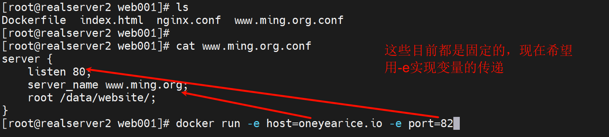
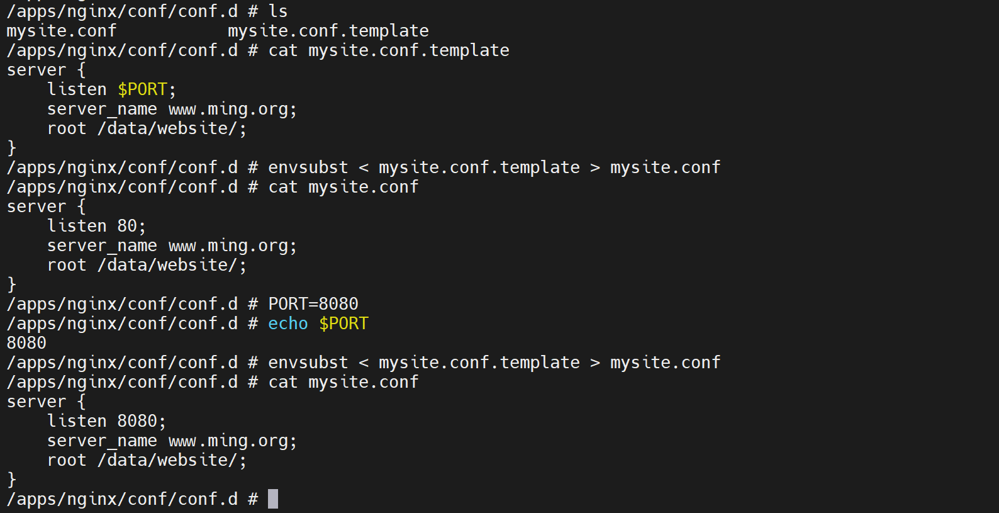
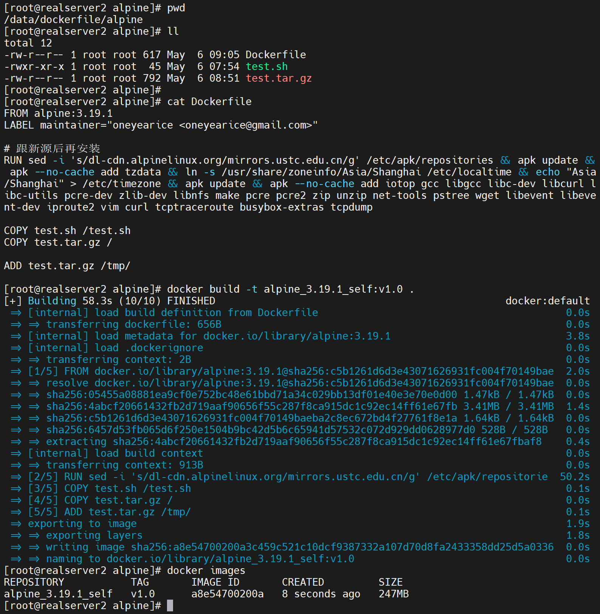
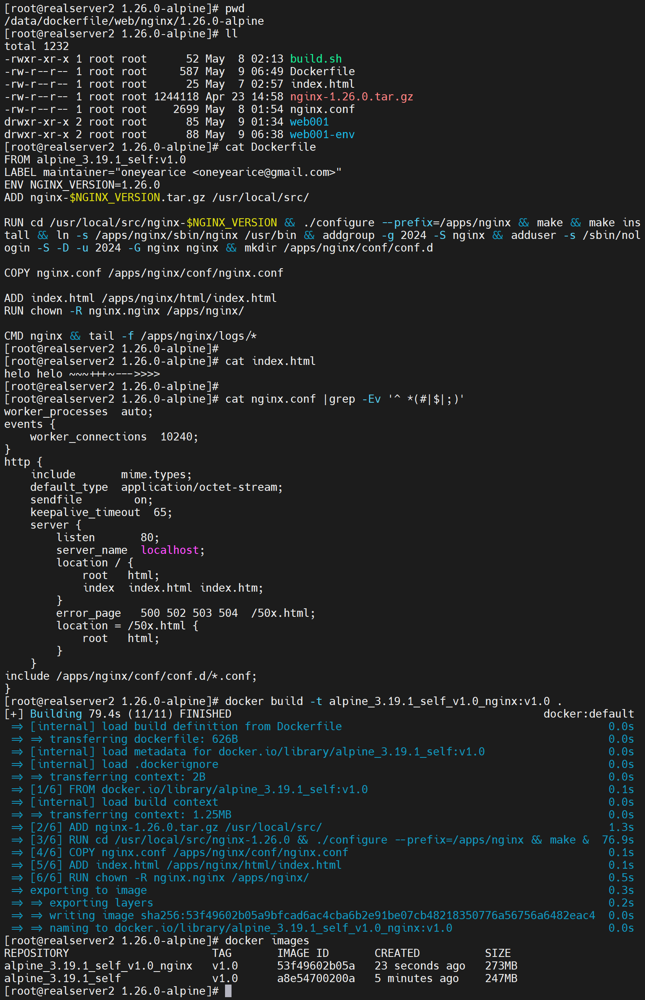
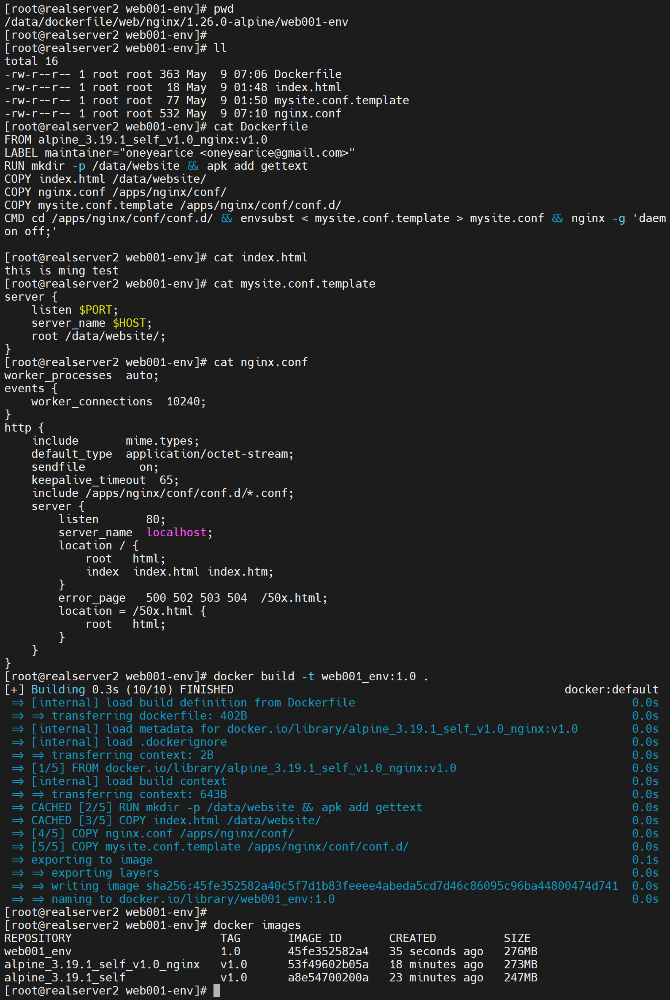
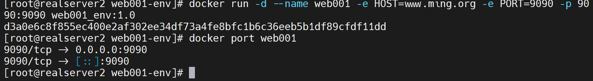
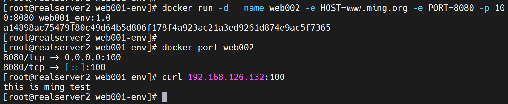
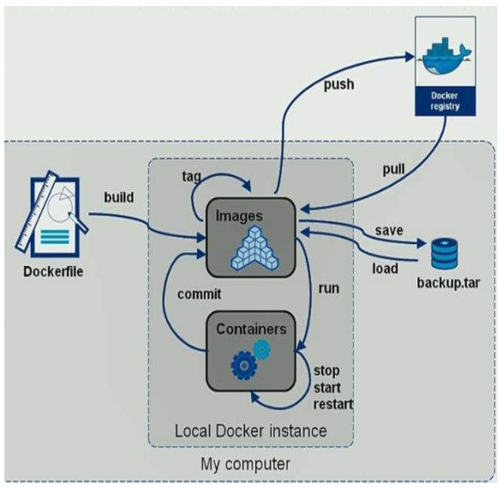

# 第2节 Dockerfile常见指令用法


# 动态化处理




但是安图配置后👆还是不行，换一个方法

①环境变量里预先定义

②使用envsubst来替换



然后再编写到Dockerfile里就行了


1、删除所有镜像和容器，重新构建

```shell
docker rm -f `docker ps -qa`
docker system prune -a
```


2、构建base os：构建alpine自定义镜像




3、构建app 镜像 




4、构建app 带传递环境变量的镜像




搞定



换个PORT端口传递进去



ok，nginx的端口和HOST自定义就搞定了👆。


注意事项：

1、使用-e传递参数进容器，不是在build阶段，而是在run阶段，所以想要用这个变量，Dockerfile里要是用CMD指令而不是RUN。

2、然后测试的时候不要 -it sh进去看效果，因为会替代CMD导致Dockerile的CMD不执行了。

3、因为父镜像里有CMD，你子镜像也要用CMD，用屁股想也是要最后一个CMD生效的，不可能多个CMD生效的，否则就不存在-it sh替代一说了，所以要写全，比如nginx -g 'daemon off;'

4、nginx 配置文件里可以写变量，但是nginx自身是不认环境变量的，即使主配文件的main块里写env也不会生效-实验结果就是不生效，虽然官方有这个指令说明。

5、使用第三方插件的gettext包里的envsubst命令来替换就行了。

6、上面的Dockerile里的apk 安装需要改成RUN apk add --no-cache gettext ，实现安装后删除安装包的效果。


进一步思考


上图理解：

1、nginx的转发优先级：ip+port优先，如果一样，就看server_name，server_name里再细分

2、curl的时候使用ip+port，就会从上往下查找配置文件

3、理解1和2参考👇


好了实现就行了，继续看视频吧。


# Dockerfile镜像制作和使用流程




