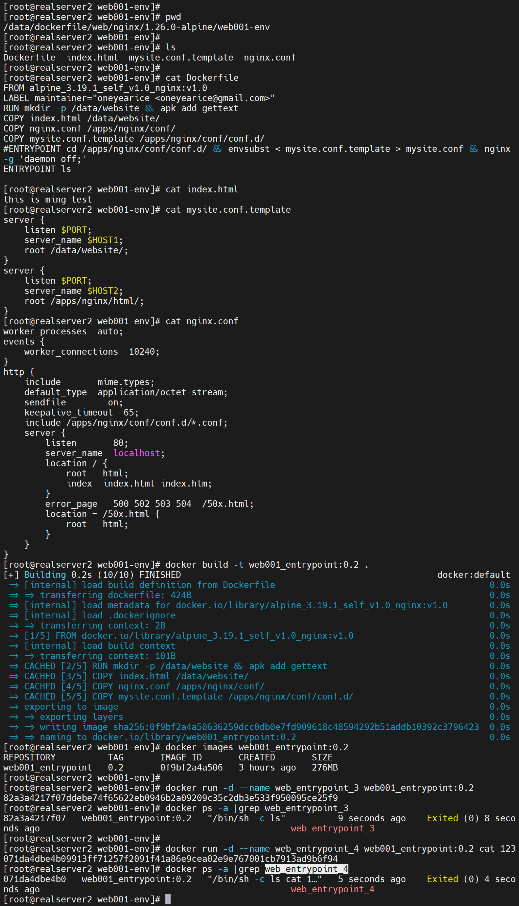
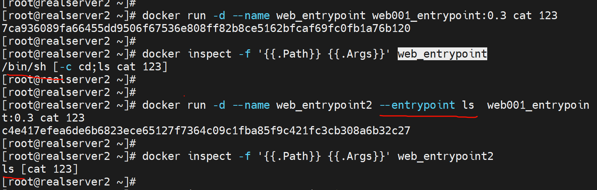
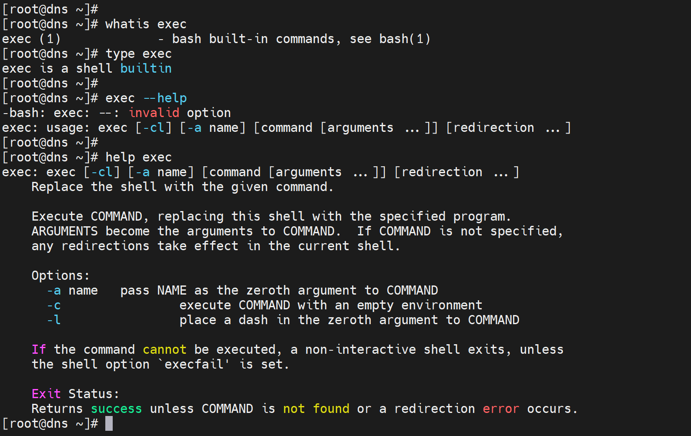
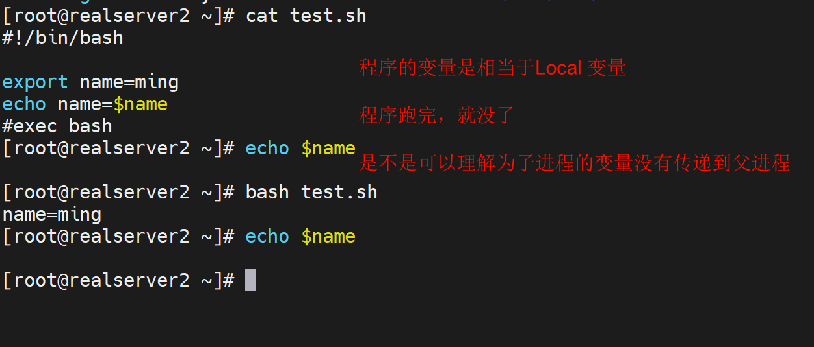

# 第3节 Dockerfile常见指令ENTRYPOINT用法

# 概述

我把cli就是手动敲的命令行叫做cli

我把CMD ENTRYPOINT就是说的Dockerfile里的配置

我把cli entrypoint就是手动命令行里的输入的东西

下文的沟通如上所示

## CLI里的追加和覆盖

### CMD是直接全部覆盖掉

CMD在Dockerfile里也是最有一个生效，前面都会被覆盖。

docker run 最后跟的参数也就是最后的那些个cli，会覆盖Dockerfile里的CMD

同样之前实验的CMD是一串CLI，也被直接覆盖了

但是ENTRYPOINT就不会了

### CLI追加到Dockerfilie里的ENTRYPOINT

docker run 最后的那些个cli就会作为Dockerfile里ENTRYPOINT的参数

没变化，再看其实是有变化的，只是docker ps 看不到太长了

上图可见docker run 的cli也就是cat 123 全部都当作ENTRYPOINT的参数了。

这一点inspect看还是不明朗的👇，只能自己知道有这回事，哦cmd的所有参数都是合并进去的。

## 查看合并后的CLI

emmm，工具真多啊

## CLI里替换entrypoint及追加cli

docker run最后的那些个参数就会追加到ENTRYPOINT里，但是此时的Dockerfile里的ENTRYPOINT已经被docker run --entrypoint替换了。

就是好像cli里的选项--entyrpoint 这种写法没有达到Dockerfile的/bin/sh -c 这种效果

这样就勉强使用--entrypoing选项实现了Dockerfiler里的"ENTRYPOINT cd;ls"一样的效果。

## Dockerfile里的CMD和ENTRYPOINT合并

这里就不再去docker run的时候写cmd和entrypoint了，

其实可以这么沟通：CMD ENTRYPOINT就代表了Dockerfile；而cmd和entyrpoint小写就代表了docker run的参数选项。

CMD推荐使用CMD ["","",""]的方式👇这样追加到ENTRYPOINT就不会有上图CMD方式里的默认/bin/sh -c

 

### 总结一下：

1、就是cli手动敲命令行的方式，基本都是所见即所得，就是不会给你自动补一个默认 /bin/sh -c

2、然后Dockerfile方式里的CMD如果是非列表格式的，就会自动补齐/bin/sh -c，所以这种方式追加到ENTYRPPINT也会把默认的/bin/sh -c补上去。

3、CMD其实就是作为ENTYRPPING运行的参数而存在的，或者说运行的选项。

## exec

内部cli用help cli获取帮助

妈的敲错激起了，敲到dns上去了，好险好险......

在shell里面敲sleep就是在当前SHELL1192下面输入的sleep，这是父子进程👇

而exec sleep 就会将当前的1192这个SHELL替换成sleep直接运行👇所以1192就从bash变成了sleep

体会下这个exec的作用

1、先了解变量在子进程中的一个local特性

一样的变量随程序跑完而消失

2、然后观察取消exec注释后的效果

进一步理解

上图也不是全对，主要就知道exec bash为什么将变量赋值保存了下来，原因很简单

1、继承了程序运行时(也即是子进程)里的环境，所以变量就有了，

2、然后程序运行本来时退出子进程的，但是exec bash就会用一个新的子进程来替代本来退出的程序的子进程，并且不会退出了。

3、将程序脚本的**子进程**得以变相的保留的下来，PID不变，但是换了个BASH。

### 环境变量如何在程序脚本执行完后得以保存

1、那么使用exec bash确实可以将程序脚本的环境(主要是变量)保存下来，那么进一步的使用场景是什么呢？

2、第二种实现程序脚本运行完变量不会消失的方法就是source或者.执行文件，这样就是在当前SHELL执行，所以不是和bash file那样是开启子SHELL执行，不存在程序脚本执行完退出的动作，执行前后都是在同一个SHELL中，变量自然一直都在。

3、简单讲就是脚本跑完环境变量得以留存的需求：一个是开启子进程就是bash file这种运行方式或者./file(文件内容顶行#!/bin/bash)一样也是开启子SHELL，这种开启子进程的就通过ecex bash替换子进程将子进程得以不退出，环境得以保留；一个就是source或.  file不开启子进程来运行，环境都没变，变量什么的自然都在。   # 总结：方法①开启子进程exec bash和方法②不开启子进程

上图注意逻辑

1、source和.  file都是在当前SHELL里执行file的

2、exec bash确实执行了，也生效了，就是用新的BASH 在PID不变的情况下，**替换了之前的BASH，所以exit就一层**直接推出了

3、sleep 30由于被切换了bash，所以不会被执行。

