# 第4节 Dockerfile常见指令用法


# ARG，变量

类似ENV，不过ENV是build阶段定义的变量，docker run阶段也同样可以使用

ARG只能在build阶段生效。


使用场景：

1、ENV就是build阶段定义的变量赋值，然后docker run阶段可以使用-e修改掉

2、ARG就是build阶段定义用的，docker run起来就没有这些变量了。

3、ARG可以写到FROM前面

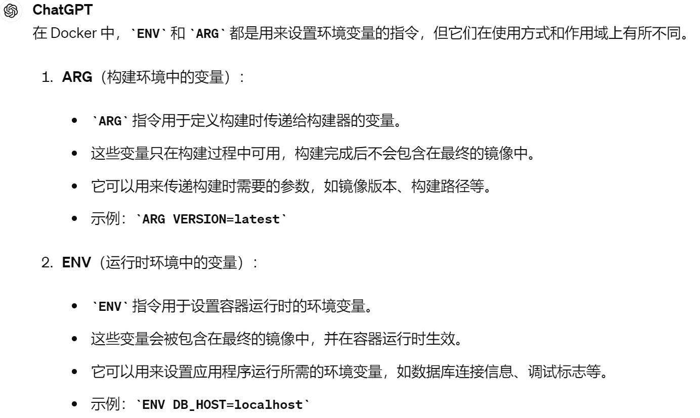


ARG常用来定义版本号👇

```shell
ARG VERSION=3.20.0
FROM alpine-base:$VERSION
LABEL maintainer="oneyearice <oneyearice@gmail.com>"

ARG NGINX_VERSION=1.26.0
ADD nginx-$NGINX_VERSION.tar.gz /usr/local/src/

RUN cd /usr/local/src/nginx-$NGINX_VERSION && ./configure --prefix=/apps/nginx && make && make install && ln -s /apps/nginx/sbin/nginx /usr/bin && addgroup -g 2024 -S nginx && adduser -s /sbin/nologin -S -D -u 2024 -G nginx nginx && mkdir /apps/nginx/conf/conf.d

COPY nginx.conf /apps/nginx/conf/nginx.conf

ADD index.html /apps/nginx/html/index.html
RUN chown -R nginx.nginx /apps/nginx/
#EXPOSE 80 443
#CMD nginx && tail -f /apps/nginx/logs/*
CMD ["nginx","-g","daemon off;"]
```


# VOLUME，持久化

volume的目录可以自动创建的，无需事先创建

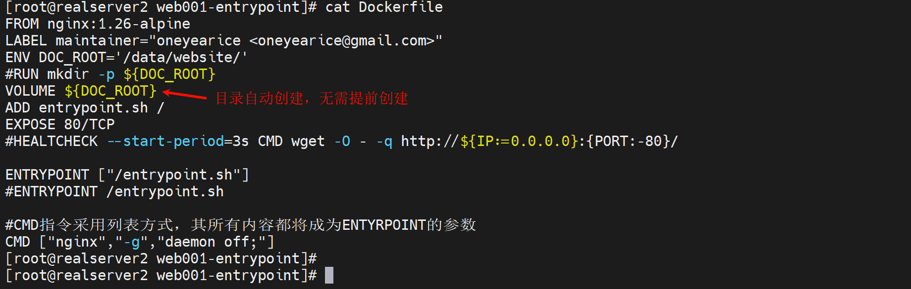

相当于同时：①实现数据持久化②也顺便创建了目录

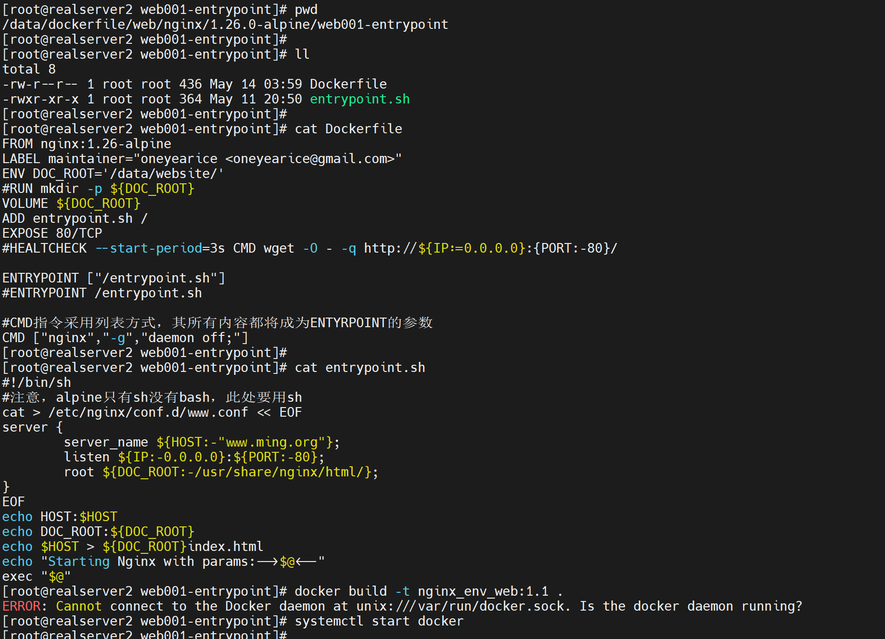


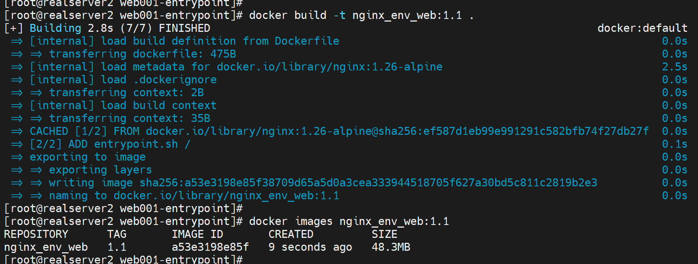

build成功就说明VOLUME创建了目录了，因为entrypoint.sh里有一句echo $HOST > ${DOC_ROOT}index.html没报错，说明目录OK的。

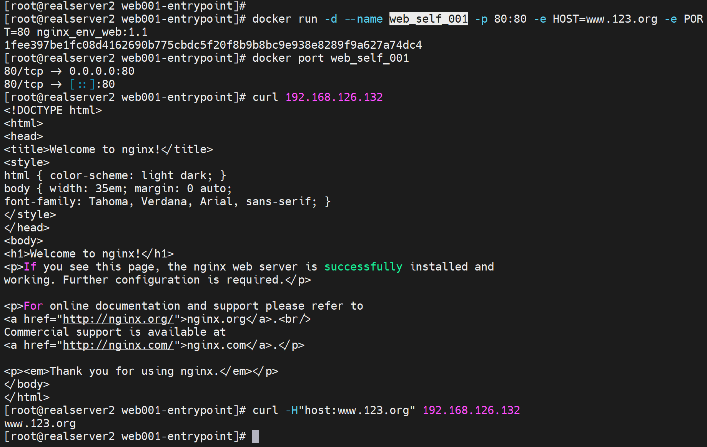


目录exec进去可见

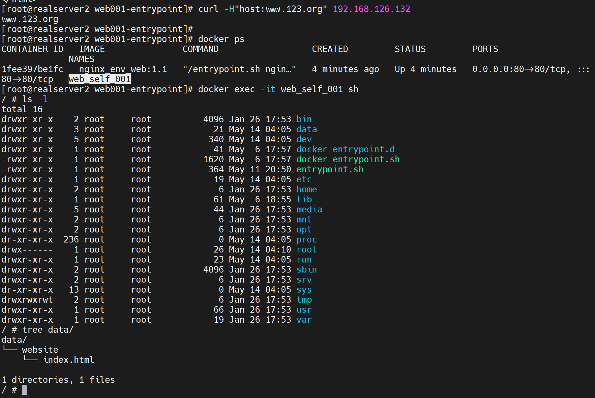


而且整个VOLUME创建的目录是持久化的，所以是独立于容器的目录的

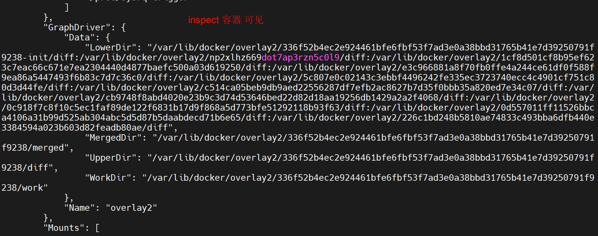

这些LowerDir、MergerDir、UppereDir、WorkDir目录，容器删了，这些目录就没了

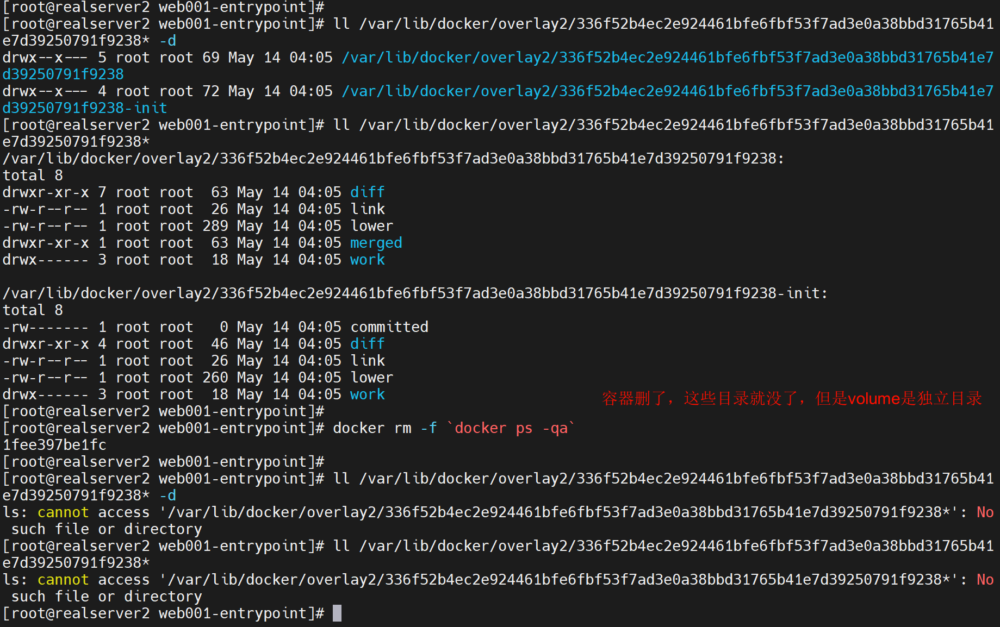

但是volume是独立的文件持久化的

测试

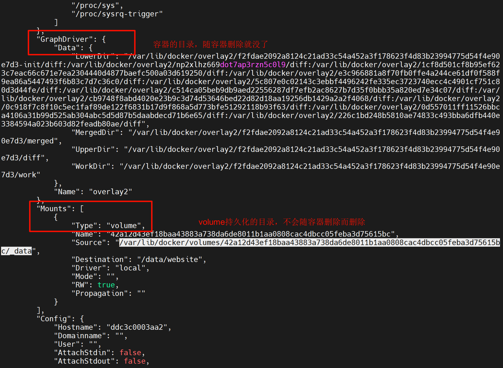


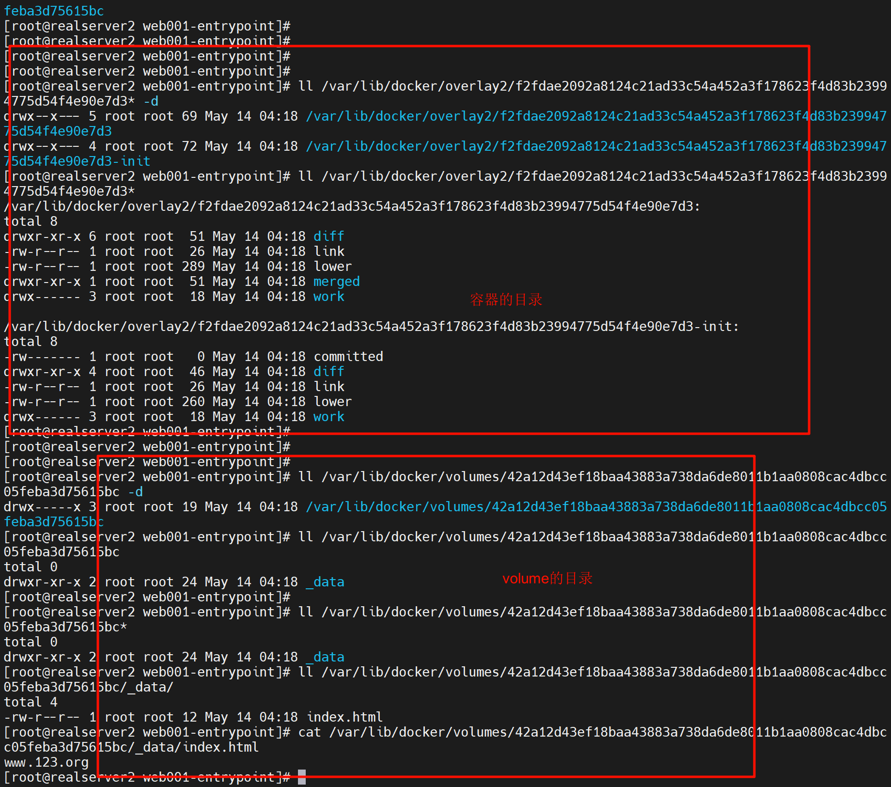


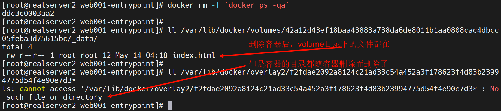


而且整个映射出来的宿主上的文件内容改了，容器里也同步的

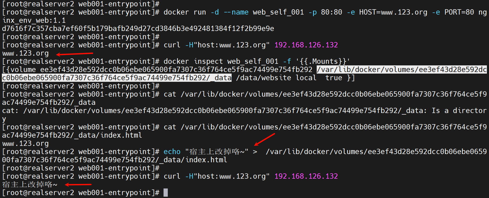


容器里的所有文件都是在宿主机上存放的其实~


mysql的数据就很需要volume持久化一下


### Dockerfile里的VOLUME遗憾

但是宿主机上的目录名称没有任何识别度，就是自动生成的这些volume在宿主上的目录是无法维护的，你都不知道谁是谁👇

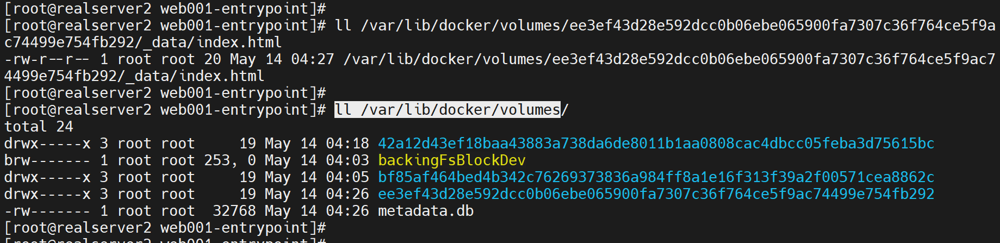

容器如果删了，还可以docker inspect 查看谁是谁的谁，容器删了可就没法查了，只能编列cat里面的内容去一个个找了。


还有一个命令可以看volume的

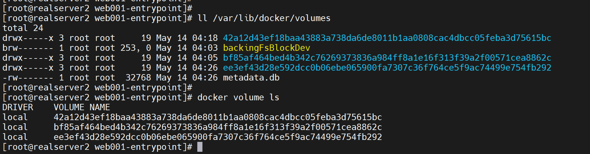


总之Dockerfile里的VOLUME就是没法指定宿主的映射目录的，只能这样，也算是一个缺点。怎么解决，docker run -v可以做宿主和容器里的目录映射，docker compose的yml也可以实现。

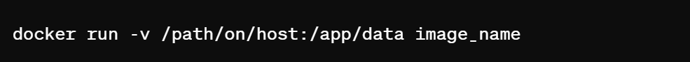 


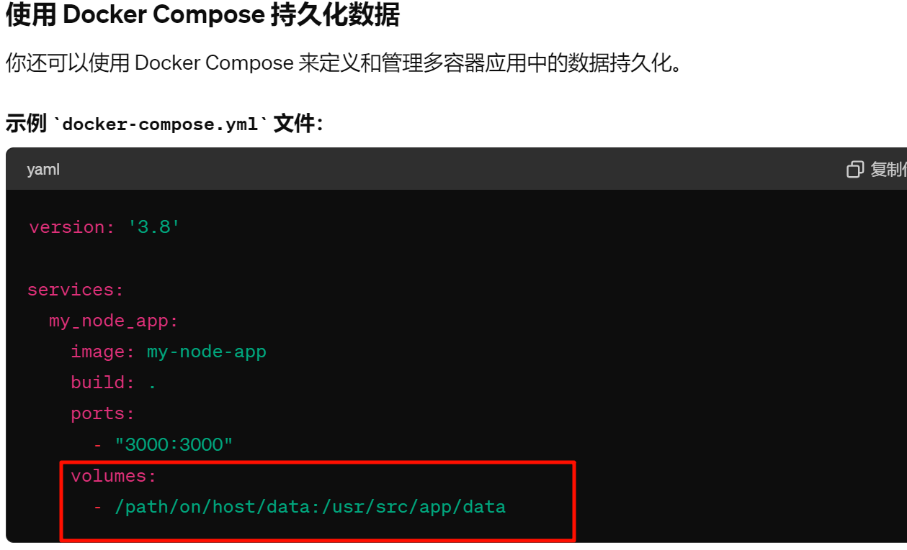 


**也可以使用VOLUME挂载多个容器里的目录出来**

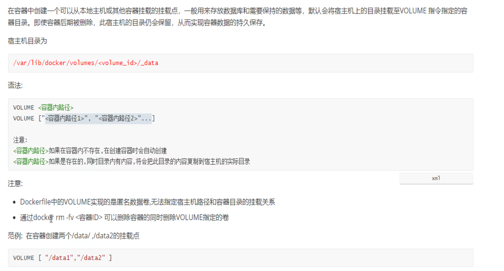


# EXPOSE仅仅是一个申明

申明的是-P要映射的端口是啥而已。至于是不是容器里监听的，也不一定，没有直接关系。


1、暴露端口的时候，可以用docker run -p 8080:80来 将容器里的80暴露到宿主的8080。

2、也可以用Dockerfile里的EXPOSE来说明容器里暴露的是80或443，但是宿主用哪个端口来对接就是在docker run -P来随机指定了，如果不像随机，那么还是用-p再次指定，此时Dockerfile里的EXPOSE就没意义了。

3、EXPOSE和VOLUME一个德行，都是仅仅申明容器里要暴露的端口和目录。至于暴露成宿主的哪个端口和路径，Dockerfile里没有解决，都是通过docker run -p和-v来解决，然而既然用了-p和-v，那么容器里的端口和目录都是直接写了，无需Dockerfile重复写了。    # 但是EXPOSE和VOLUME的区别是EXPOSE不管容器里是否监听某个端口，只是申明供-P暴露出来；而VOLME是容器里没有这个目录就给你自动创建出来(而且是mkdir -p 的方式来创建多层目录的)，然后暴露成宿主的目录。


4、然后EXPOSE就是配合docker -P，大P来使用的，告诉大P暴露容器里的什么端口为宿主的随机端口。

5、凡是EXPOSE写的端口不是容器里监听的端口的，都是坏人~，哪家好人干这种事啊，对不对，不写也是不对的，总不能让别人去猜你nginx或其他app监听的啥吧，不猜就去找脚本，或者你要是默认编译的基本就是80了。


以下截图就看EXPOSE就行了，其他前面的内容

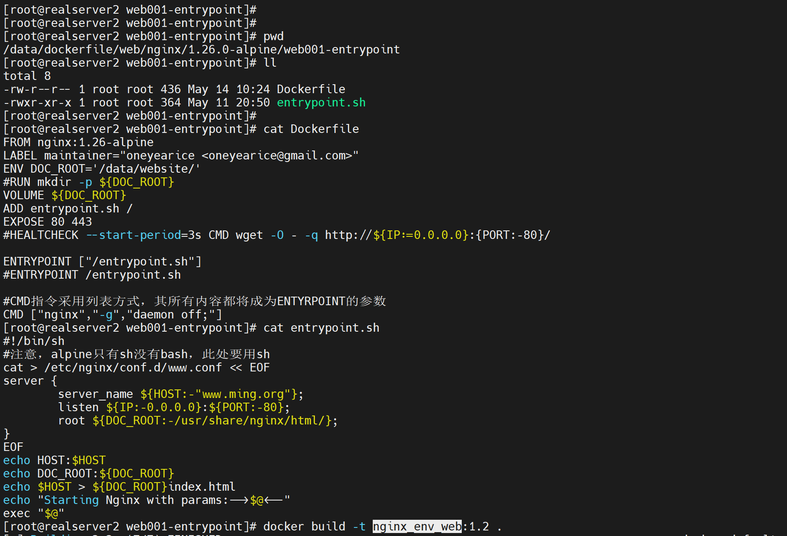


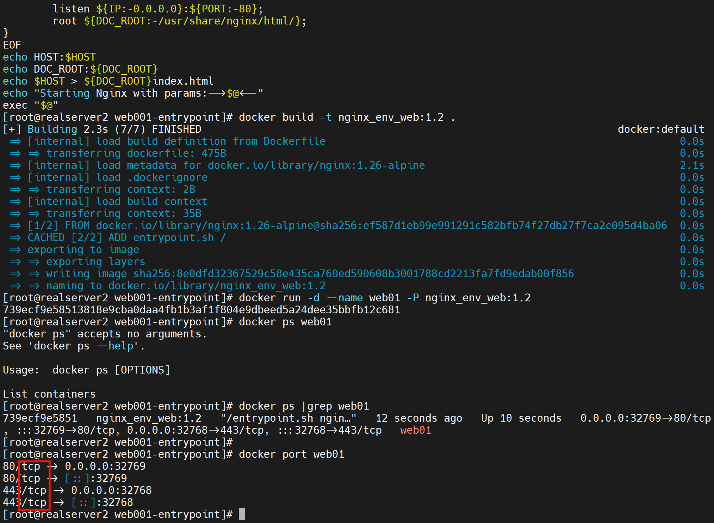


443只是暴露出来，并不代表容器里有监听443，而实际情况是容器里只监听了80，443没有开，暴露是80和443都暴露的，所以👇

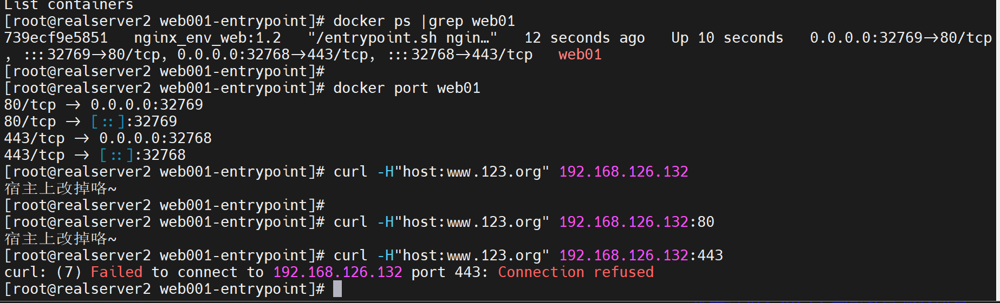


# 工作案例-抓软件的包

1、背景

公司打不开discord的客户端软件

软件还不是浏览器，无法通过F12直接看到那些URL打不开


2、需求

需要定位某个软件访问了那些域名，然后进一步写hosts，然后放行


3、classwire只能看到已经正常运行了的软件，对于打不开得，就是比如discord还在update，以及update好了还在starting的状态下是看不到 discord这个app的流量统计的。至少我的免费版看不到


4、落地方案，如下


参考两个链接

一个cmd里findstr如何写or 👇

https://blog.csdn.net/zhigang0529/article/details/86240577

一个是如何抓包抓软件👇

https://blog.csdn.net/weixin_51309915/article/details/122382555


### 方法1：有白名单限制的情况下进行

**1、打开wireshark软件开始抓包**


**2、打开软件discord，让其update转圈圈，后面update好了starting一样的处理思路**

这个已经没法复现了，我已经解决了，所以仅文字描述了


**3、打开任务管理器**

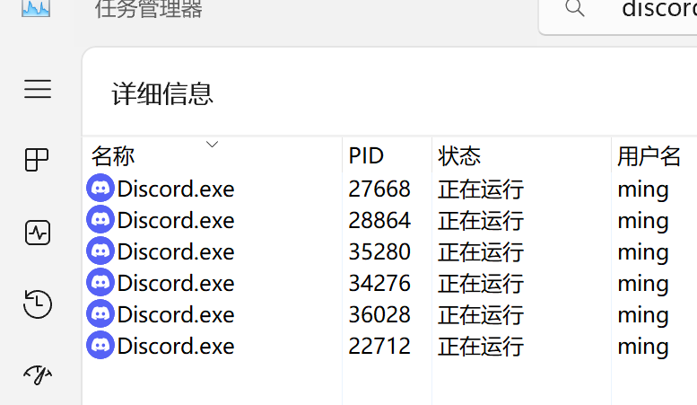

找到pid，


**4、打开cmd**

手动不断回车，配合discord update界面出现的时间，下图findstr 后面空格是或的关系，表示同时抓这些PID。

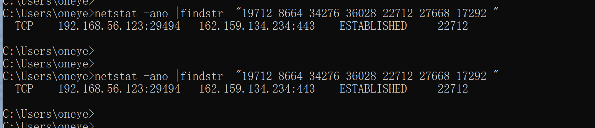

已经ESTABLISHED基本是OK的，不用管

找到SYN SENT

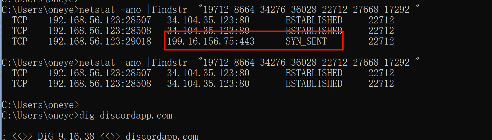


**5、wireshark过滤该ip**

提取第一个该ip出现的时间

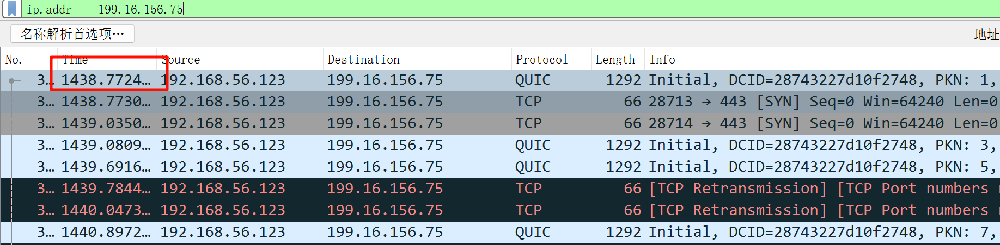

然后取消过滤，再全部信息里，找到时间点的这条抓包，往上看到DNS解析对应的域名👇

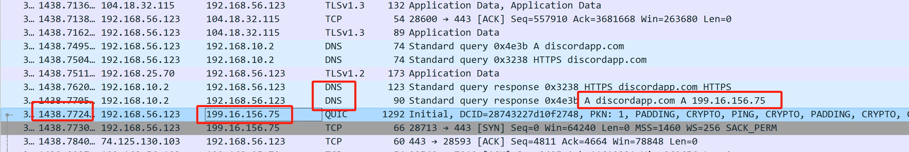

这就知道了该软件目前需要访问的域名了，重复多次，找到需要访问的所有域名

然后①域名解析本地dns固定成一个IP②路由指向vpn③vpn节点放行该ip。这就是海外白名单管理的思路。


以上就是app如何抓包的思路，要抓到域名嘛


除此之外，还有一个方法

### 方法2：取消白名单限制去做统计

★放开本地的海外白名单，针对自己的IP，然后打开classwire软件，此时由于海外全通，所以discord可以打开，包括update，start都行， 这样等软件正常运行了，classwire就可以正常显示该软件的域名访问了。

由于已经升级和能够打开了，所以还需要手动升级来让classwire看到流量

操作①需要退出软件②打开③手动升级


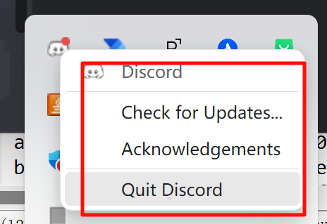


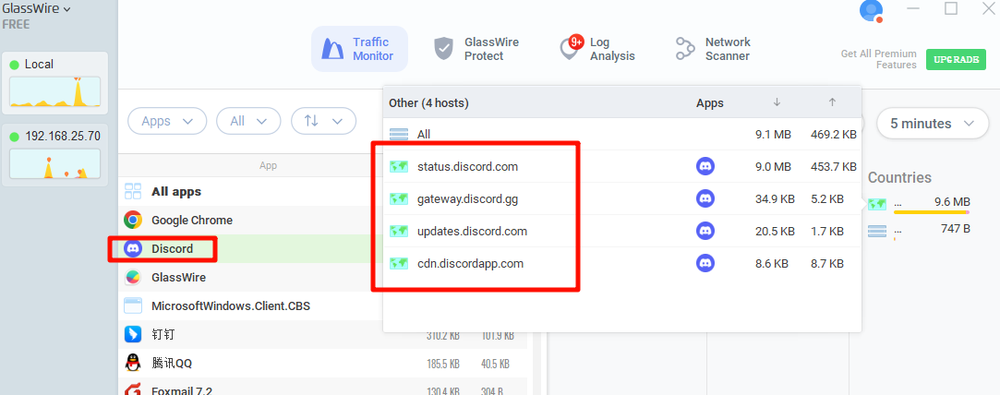


发现不全少了一个dl.discordapp.net，这个域名。可见上面的手动方法还是要掌握的。至少可以先用方法2，然后再用方法1查漏补缺。


### 说明

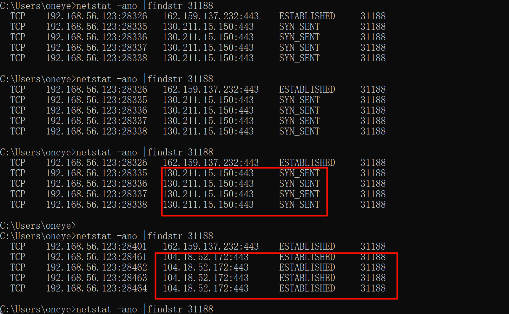

这种情况就是PID3118一开始不断和130.221.15.150去TCP CONN，但是dns解析写道104.18.52.172后，软件方面也延迟了一小会然后IP解析更正过来了以后，就可以了。


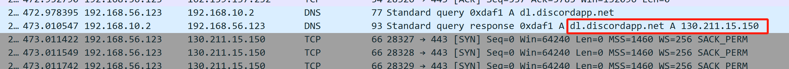

上图同样是通过wireshark过滤IP，找到时间，然后在全部信息里找到时间，看上面的A记录里的域名。


一开始是SYN还是和130.211.15.150建立，后面我解析固定后，discord这个APP的连接请求也就自动更正了

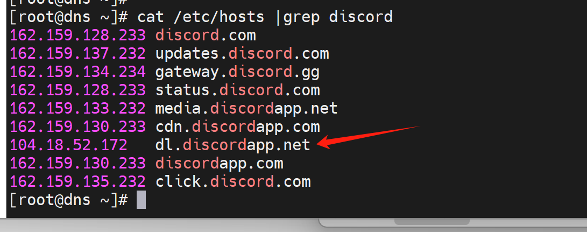


**然后通过上面的实验发现**

1、wireshark抓了很多很多很的包后，截图软件存在差距

2、微信截图依然顺序好用，但是PixPin截图异迟钝，慢的很咯，关闭wireshark后PinxPin截图反映速度恢复正常。


