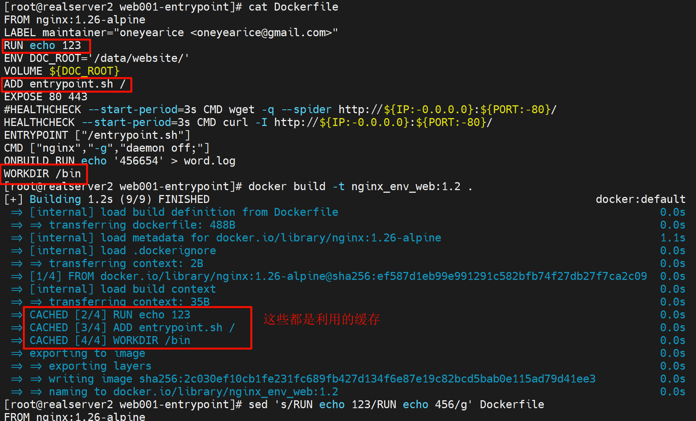
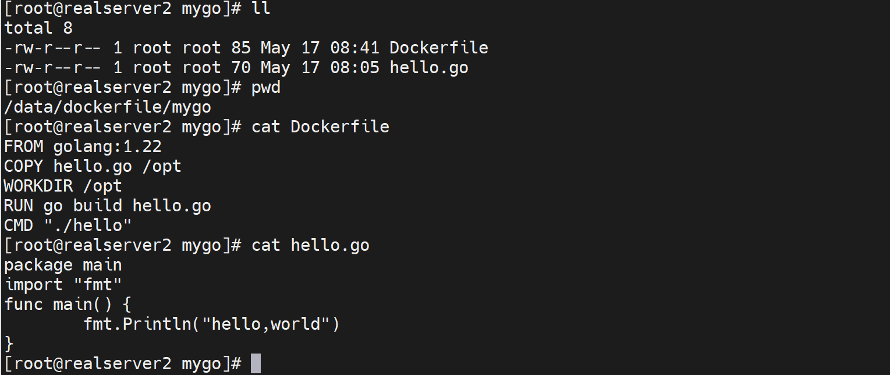
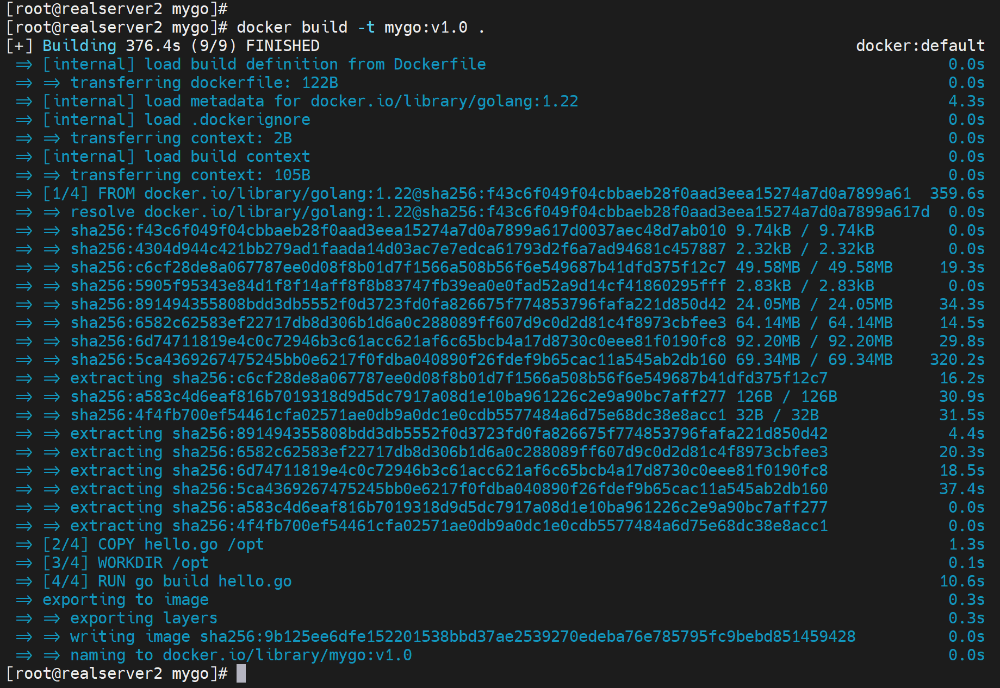

# 第5节 Docker镜像制作优化和多阶段构建


镜像精简，便于迁移，因为后面都是K8S上跑容器，这些容器是可能在不同的宿主机之间迁移的。


写Dockerfile的时候应该尽可能合并层，就是合并行。


但是很多命令都看不全，可以加个选项查看,但是效果依然不行


# 优化1：变化的写在后面

**Dockerfile里有变化的内容就是会频繁修改的，写到文件内容的后面**


**说明：**

1、如果在Dockerfile内容的前面新增一个指令，也就是之前没有build过的分层指令，那么下面所有的分层都会重新build，不会利用CACHE的

重复build，也不是说重复build



然后这些CACHED就利用不起来了，感觉下面所有的分层就统统重做了，也不会说之前有过就能利用的。


这里面很难讲，但是也是逻辑清晰的，就是分几种情况

1、在Dockerfile的前面，新增一条RUN echo 123，那么下面什么ADD WORKDIR COPY这些就要重新执行，利用不到之前的CACHED了。

2、在Dockerfile的前面，删除RUN echo 123，那么下面的ADD WORKDIR COPY可以利用CACHED

3、在Dockerfile的前面，重新写上RUN echo 123，那么下面的ADD WORKID COPY可以利用CACHED

4、在Dockerfile的前面，将RUN echo 123改成RUN echo 122，那么下面的ADD WORKDIR COPY重新执行，利用不了CACHED。


**所i有发生变化的内容，要写到Dockerfile的后面，否则就会导致build的时候很多之前的缓存无法利用。**


# 优化2：COPY太多和遗漏


**COPY * 和COPY .的区别**

1、隐藏文件不管是*还是.都会复制进去

2、COPY * 的时候，文件夹，外层会剥离掉，   # 无法理解的骚bug~

​		如果docker build目录里只有一个空dir1，那么就不会被COPY * / 复制进去；

​		如果是dir1/f1，那么COPY * /就只会复制f1进去；

​		如果dir1/f1,dir1/dir2/f2，那么就是COPY * /就会复制f1和dir2/f2到容器里的/里，说白了就是进去的*，而且是包含隐藏文件夹的。


### 针对COPY太多的问题

需要引入.dockerignore文件


# .dockerignore忽略文件


.dockerignore里写的就是忽略的文件名，a.conf就是忽略，而!b.conf就是排除掉 不忽略的意思，也就是脱裤子放屁，其实就是强调一下咯。所以a.conf和b.conf就会被复制进去。


# FROM补充


别名AS的作用，一般FROM写好就用一次就没了，就是build的时候，用别名无非是以后方便使用。


所以AS别名一定是有重复使用的场景，这个就是多阶段构建。


## 案例：多阶段构建

```shell
vim hello.go
package main
import "fmt"
func main() {
	fmt.Println("hello,world")
}

vim build.sh
#!/bin/sh
docker build -t go-hello:$1 .


---------
vim Dockerfile
FROM golang:1.xx-alpine
COPY hello.go /opt
WORKDIR /opt
RUN go build hello.go
CMD "./hello"

--------------
bash build.sh v1.0

docker run --name hello go-hello:v1.0
```


### 现在宿主机上编译一遍看看

1、准备go语言的代码，呵


2、编译的工具有：

​		go是golang

​		c是gcc

​		java是javac

我是RockyLinux，就yum -y install golang就行了


编译后运行


然后制作image

找一个golang基础镜像，去hub.docker.com找到：golang:1.22.3


### 写Dockerfile来创建go的项目

1、原材料准备



👆注意：上图CMD没有用列表形式来写，实际上就是有一个默认的/bin/sh -c 在里面，而./hello此时是go语言不是shell，所以应该是执行不了的。需要改写为CMD ["./hello"]这样就没有/bin/sh的干扰了。不过后面测试发现/bin/sh -c 也行的...


2、build




run


发现用的/bin/sh -c "./hello" 实际上是错误的cli，但是这种方式也可以，有点奇怪，为什么说它是错的，因为①理论上go就不能用/bin/sh去执行，②实际上下图所测就是不行


错误1


报错2


正确的


错误


错误


ok了


