# 第8节 Docker的默认网络和容器间通信


### 网络简述

容器启动都会获取docker0一个网段的IP，默认都是172.17.0.0/16

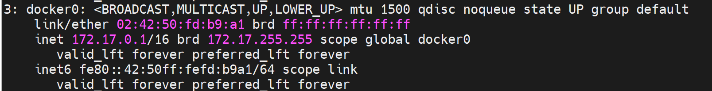


同主机下不同容器互访，因为IP是动态获取的，存在变动的可能

不同主机下容器之间互访，首当其冲的就是IP段默认一样，出都出不来。听不懂啊，什么叫出不来，就是路由啊，同网段不会找GW，不走GW怎么出本地局域网呢。


启动一个容器，就会生成一个虚拟网卡，该网卡在宿主机表现为vethxxxx，在容器里表现为eth0#ifxxx;  一体两面 就这么理解就行了，官方称之为veth pair。


docker0相当于一个交换机，eth0--veth   都桥接上去。这样容器之间沟通，走docker0，容器出宿主的流量也走docker0不过还得过一层SNAT出去。


### 确认某个veth虚拟网卡所属容器

**1、进入容器**

看编号对应关系就行了，宿主上看9对应到容器的8，就是编号对应的。

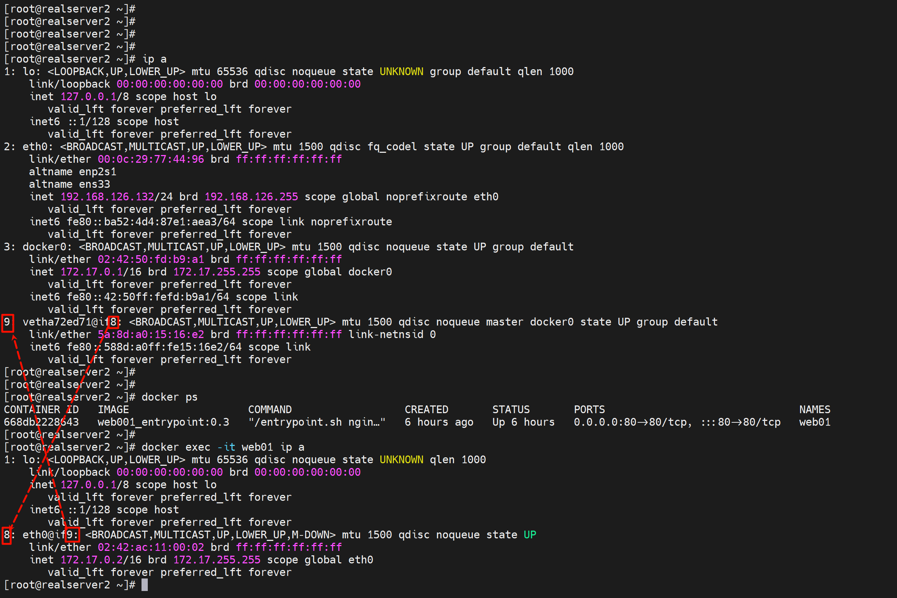

也要注意这个veth-pair，一体两面的 MAC 是不一样的；

然后docker0和veth是桥接关系。

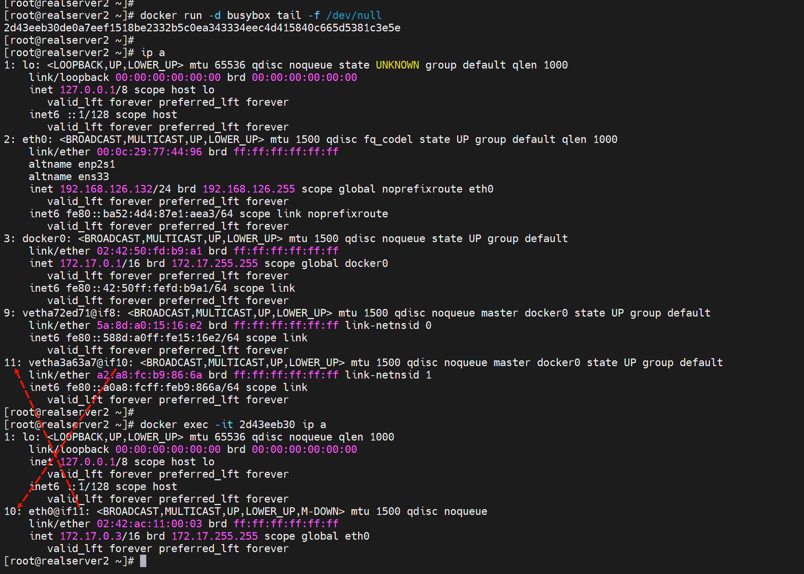


**2、不进容器**

但要注意：会导致 进入多层 bash，如果操作不当

```shell
docker inspect --format '{{.State.Pid}}' <container_id>
nsenter -t <PID> -n ip link
```

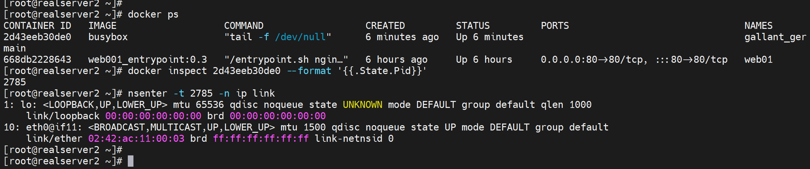

所以这个方法

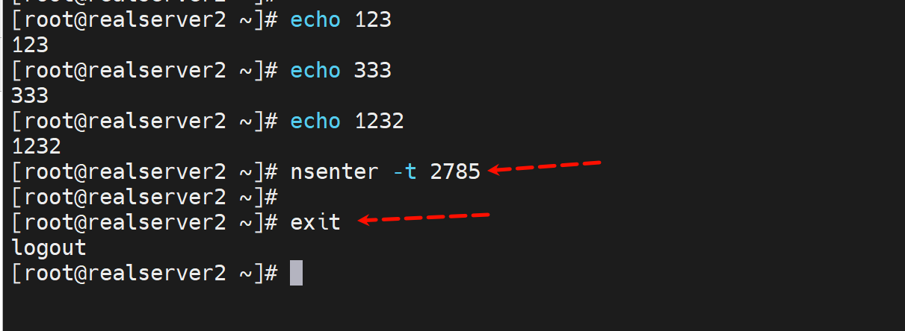

其实就是进入了命名空间了


**其他工具看看docker0挂了几个容器或者几个veth**


这个可以直观看到docker里挂的容器的NAME和容器里的IP和MAC，还不错👇


这个就是个排版看的舒服而已，ip a 看到的docker0自然是桥接到所有的vethxxx的。

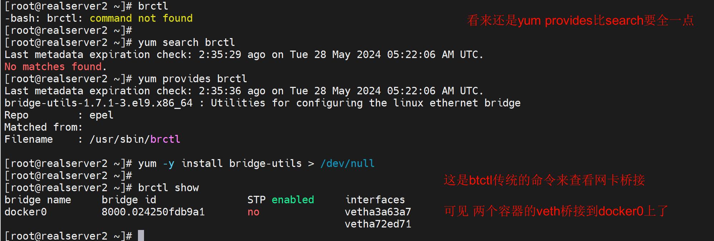


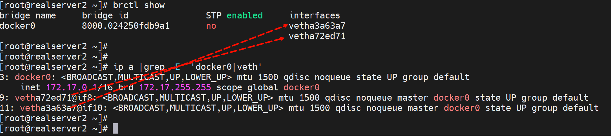


同宿主容器之间的ping就是默认通的👇

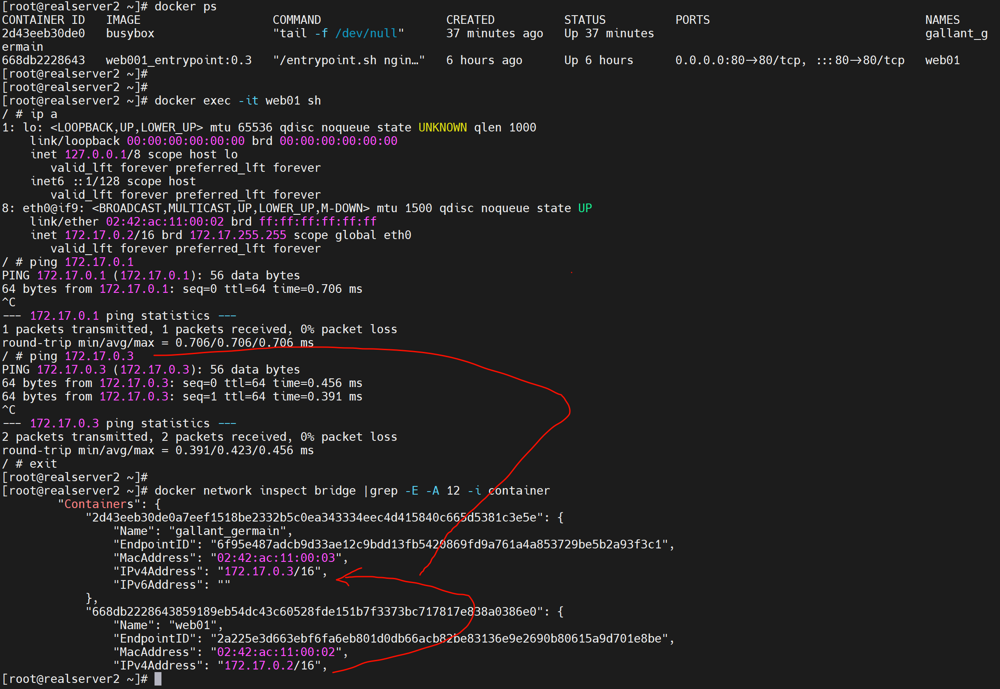


# 解决容器IP不固定的问题

背景：

1、容器run起来了，IP不确定，run起来了IP是不是也会受dhcp的释放周期影响的咯。

2、如果你公司内网有172.17段，那么容器如果要和这个段互通，就不行了。


需求：解决这个不固定的问题咯，然后就可以更好的自动化咯。以及更换容器的网段。


# 工作案例

linux常ping脚本


**方法1：**

```shell
ping 10.100.8.29 | awk '{ print $0 " " strftime("%F %H:%M:%S",systime()) }'  >> test.ping
```

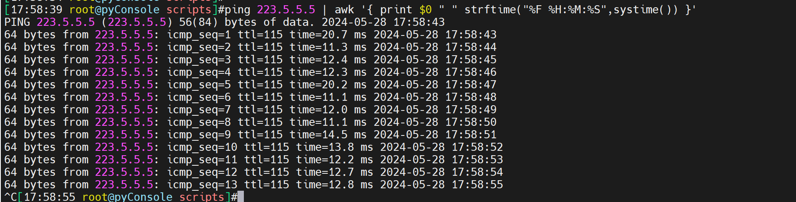

注意这种直接 >> 重定向到 文件，大概是60个ping包一起写入文件的。不是每个包写一个的，相当于默认的有一个I/O优化吧


**方法2：**

```shell
ping 223.5.5.5 |& while read -r line;do echo "$(date) $line";done >> ping.log

ping 223.5.5.5 |& while read -r line;do echo "$(date) $line" >> /tmp/123.ping;done
```

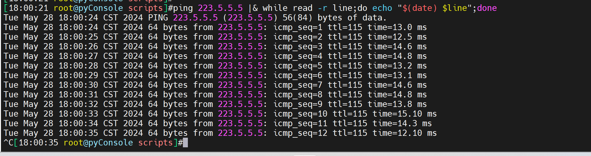

这种方式写入文件很及时，一个ping包就是一个。

时间格式优化下

```
ping 223.5.5.5 |& while read -r line;do echo "$(date +%F_%H:%M:%S) $line" >> /tmp/ping.test ;done
```

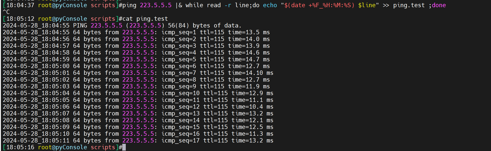


然后改成脚本，做成服务，可以实现异常停止后的服务自动起来，也包括重启机器自动起来。


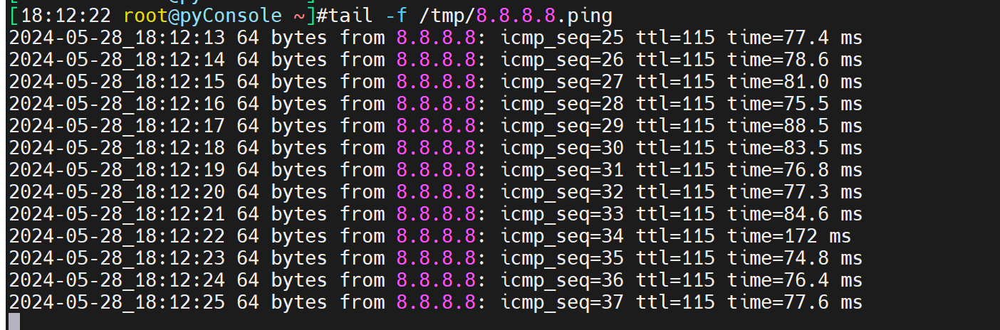


**做成服务**


```shell
vim /etc/systemd/system/pingtest.service
```


```shell
[Unit]
Description=Ping Test Service
After=network.target

[Service]
User=root
Type=simple
ExecStart=/path/to/pingtest.sh 8.8.8.8
Restart=always
RestartSec=10

[Install]
WantedBy=multi-user.target
```


```shell
systemctl daemon-reload
```


```shell
systemctl start pingtest.service
systemctl enable pingtest.service
```


```shell
systemctl status pingtest.service
```


**测试kill 后自动起来**

找到main pid


kill -9会自动起来

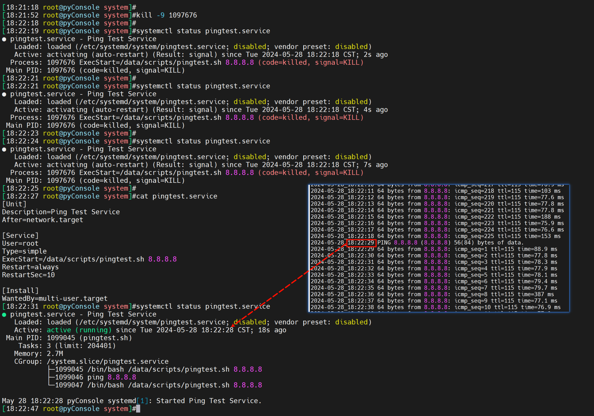


kill 也会起来

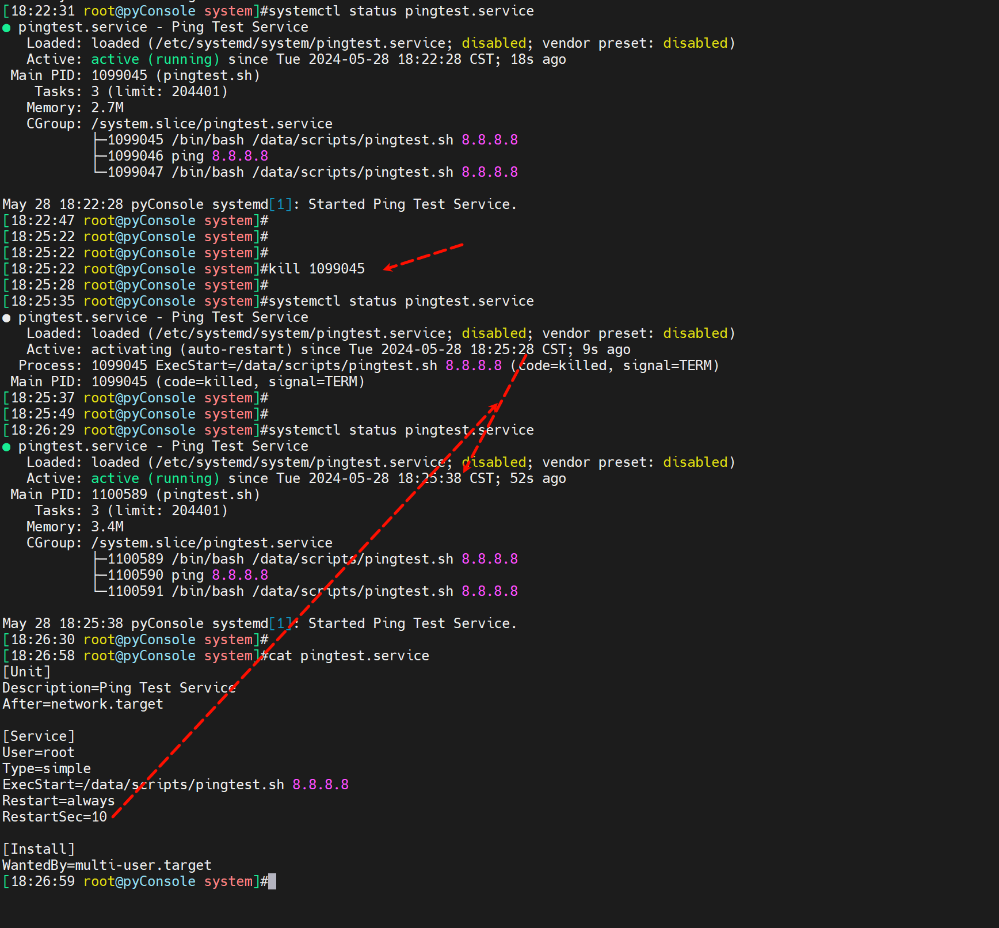


stop纯人工停止自然不会起来咯，否则你怎么挺服务~


注意status里可以看到一些服务器启动日志的含时间。


