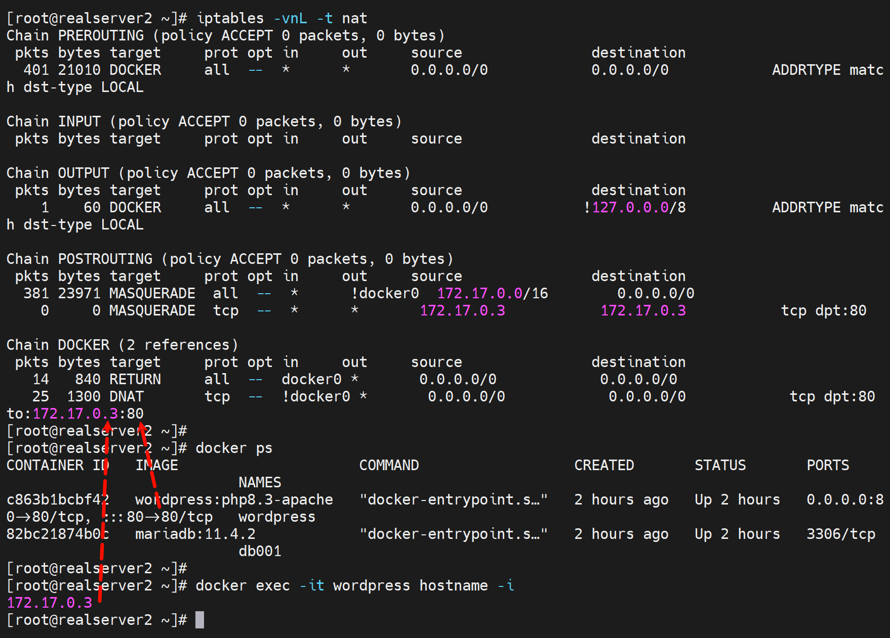
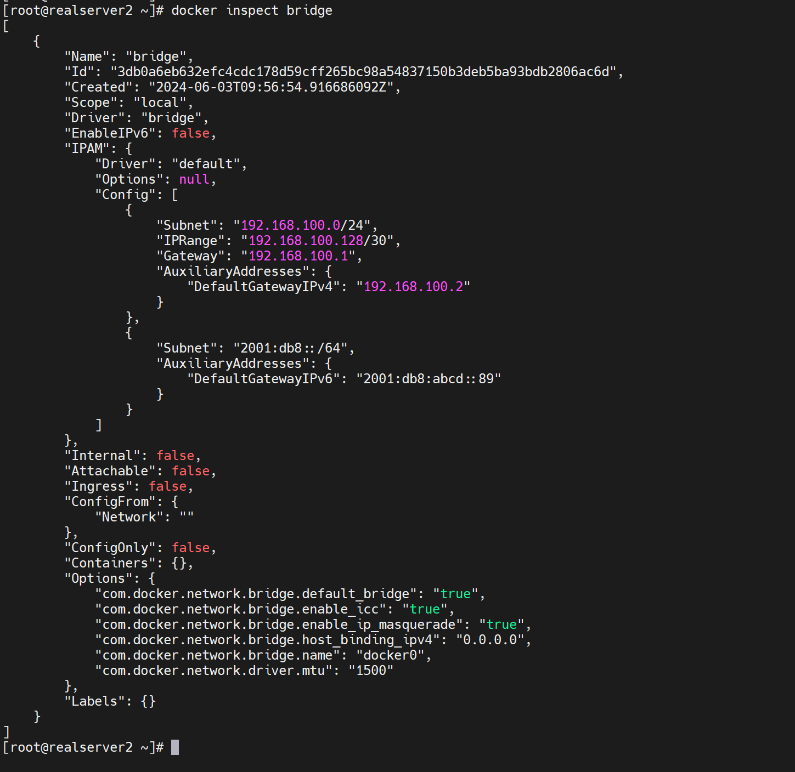
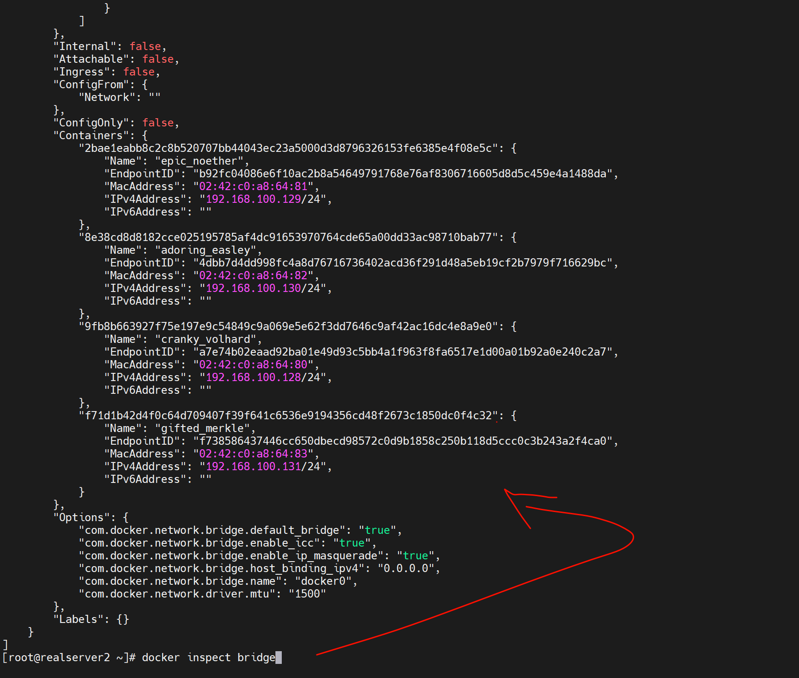
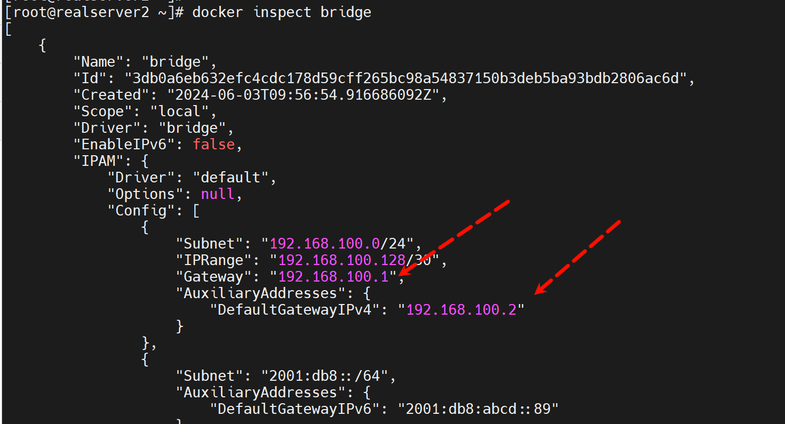
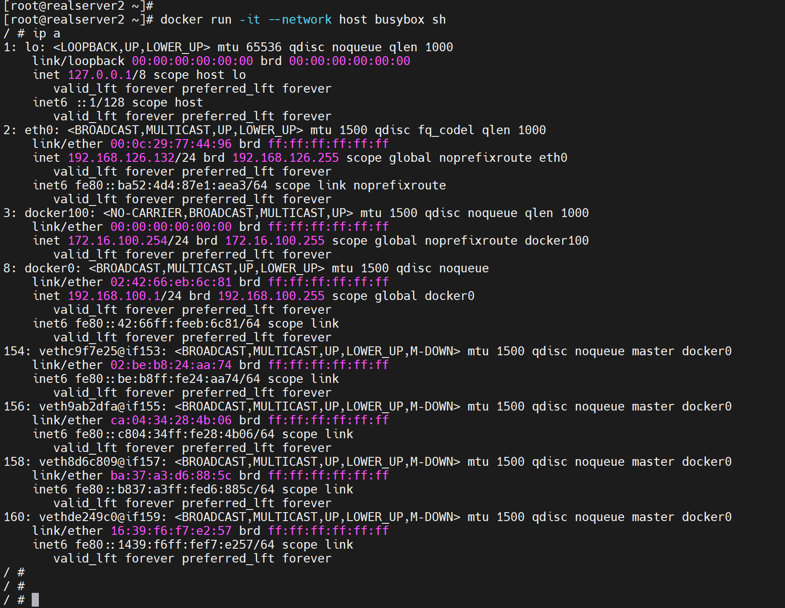

# 第1节 Docker四种网络模式


docker的5种网络模式

1、none：没有网络

2、bridge：桥接

3、container：容器

4、host：主机

5、network-name，这一种依赖于前种


# 1、Bridge桥接模式

也是默认模式，类似Vmware的NAT模式


docker安装了默认给你优化了ip-forward=1，如果是k8s的containerd也许早期是没有的，可能就需要手动调整这些内核参数。

```shell
docker network ls

docker inspect bridge  # 可以查看网关

iptables -vnL -t nat   # 配合docker port xxx 可见PREROUTING里的端口暴露
```




一些网段配置👇

```shell
vim /etc/docker/daemon.json
{
    "registry-mirrors":[
       "https://docker-hub.iwgame.com",
       "https://ustc-edu-cn.mirror.aliyuncs.com"
    ],
    "hosts":["tcp://0.0.0.0:2375","fd://"],  # /lib/systemd/system/docker.service里需要删掉和这里的重复配置
        "bip":"192.168.100.1/24",
        "fixed-cidr":"192.168.100.128/30",
        "fixed-cidr-v6":"2001:db8::/64",
        "mtu": 1500,
        "default-gateway":"192.168.100.2",
        "default-gateway-v6":"2001:db8:abcd::89",
        "dns":["1.1.1.1","8.8.8.8"]
}

```




开始创建容器，顶多4个咯，因为/30嘛


第五个果然报错了





理解下两个GW



下面一个是辅助网关，具体用法不清楚~


# Host模式

类似于Vmware的桥接模式


容器里的网卡就是宿主机的网卡了，多个容器之间需要区分端口了。

也不存在端口暴露一说，因为直接就是宿主IP的端口了。


看看这个，完全就是宿主上所有网卡都看的到了




