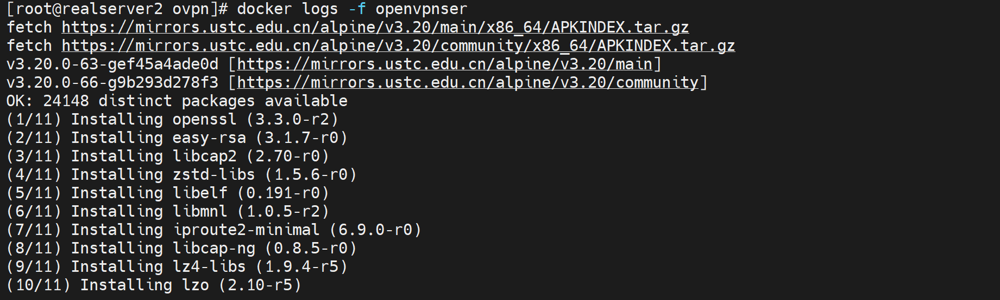

# 第2节 Docker的自定义网络和网络间通信


docker默认的网络环境，不管是什么模式都是自带的


哦，这个已经被我改掉了，还原一下


bridge就是对应docker0网卡所在的虚拟网桥

host就是对应eth0网卡所在的宿主机的真实网络

none就是不与外界通信的容器单机游戏了


这个docker network ls看到的三个网络(bridge、host、none)是默认自带一套的。如果不想用这套网络，可以自建。


# 自定义容器网络

不用原来的三个bridge、host、none，但是类型也就是DRIVER还是bridge、host、null


```shell
[root@realserver2 ~]# docker network --help

Usage:  docker network COMMAND

Manage networks

Commands:
  connect     Connect a container to a network
  create      Create a network
  disconnect  Disconnect a container from a network
  inspect     Display detailed information on one or more networks
  ls          List networks
  prune       Remove all unused networks
  rm          Remove one or more networks

Run 'docker network COMMAND --help' for more information on a command.


```

```shell
[root@realserver2 ~]# docker network create --help

Usage:  docker network create [OPTIONS] NETWORK

Create a network

Options:
      --attachable           Enable manual container attachment
      --aux-address map      Auxiliary IPv4 or IPv6 addresses used by Network driver (default map[])
      --config-from string   The network from which to copy the configuration
      --config-only          Create a configuration only network
  -d, --driver string        Driver to manage the Network (default "bridge")
      --gateway strings      IPv4 or IPv6 Gateway for the master subnet
      --ingress              Create swarm routing-mesh network
      --internal             Restrict external access to the network
      --ip-range strings     Allocate container ip from a sub-range
      --ipam-driver string   IP Address Management Driver (default "default")
      --ipam-opt map         Set IPAM driver specific options (default map[])
      --ipv6                 Enable IPv6 networking
      --label list           Set metadata on a network
  -o, --opt map              Set driver specific options (default map[])
      --scope string         Control the network's scope
      --subnet strings       Subnet in CIDR format that represents a network segment
[root@realserver2 ~]#

```


``` shell
docker network create -d <mode> --subnet <CIDR> --gateway <网关>

# 注意mode不支持host和none，默认是bridge模式
-d 写了也白写，主要是有个其他swan不怎么用的技术模式在厘面。整体来说-d可以忽略。

```


# 工作案例-openvpn容器化


## 1、准备材料

**checkpsw.sh**

```shell
#!/bin/sh

PASSFILE="/etc/ppp/chap-secrets"
LOG_FILE="/etc/openvpn/logs/openvpn-password.log"
TIME_STAMP=`date "+%Y-%m-%d %T"`

if [ ! -r "${PASSFILE}" ]; then
echo "${TIME_STAMP}: Could not open password file \"${PASSFILE}\" for reading." >> ${LOG_FILE}
exit 1
fi
CORRECT_PASSWORD=`awk '!/^;/&&!/^#/&&$1=="'${username}'"{print $3;exit}' ${PASSFILE}`
if [ "${CORRECT_PASSWORD}" = "" ]; then
echo "${TIME_STAMP}: User does not exist: username=\"${username}\", password=\"${password}\"." >> ${LOG_FILE}
exit 1
fi
if [ "${password}" = "${CORRECT_PASSWORD}" ]; then
echo "${TIME_STAMP}: Successful authentication: username=\"${username}\"." >> ${LOG_FILE}
exit 0
fi
echo "${TIME_STAMP}: Incorrect password: username=\"${username}\", password=\"${password}\"." >> ${LOG_FILE}
exit 1


```

chmod +x checkpsw.sh


**connect**

```
#!/bin/sh
day=`date +%F`
if [ -f /data/logs/openvpn/$day ]
then
        echo "`date '+%F %H:%M:%S'` User $common_name IP $trusted_ip is logged $1" >>/data/logs/openvpn/$day
else
    mkdir -p /data/logs/openvpn/
        touch /data/logs/openvpn/$day
        echo "`date '+%F %H:%M:%S'` User $common_name IP $trusted_ip is logged $1" >>/data/logs/openvpn/$day
fi
```

chmod +x connect


**entrypoint.sh**

```shell
#!/bin/sh


P_PATH=/etc/openvpn/easy-rsa
W_PATH=/etc/openvpn

sed -i 's/dl-cdn.alpinelinux.org/mirrors.ustc.edu.cn/g' /etc/apk/repositories && apk update && apk add openvpn easy-rsa

mkdir -p $P_PATH
cp -a /usr/share/easy-rsa/* $P_PATH
cd /etc/openvpn/easy-rsa/

echo yes |./easyrsa init-pki


cat > /etc/openvpn/easy-rsa/pki/vars << EOF
export KEY_COUNTRY="CN"
export KEY_PROVINCE="SH"
export KEY_CITY="SHANGHAI"
export KEY_ORG="xxx"
export KEY_EMAIL="xxx@xxx.com"
export KEY_CN=vpn.xx.com
export KEY_NAME=vpnserver
export KEY_OU=OPS
export EASYRSA_CA_EXPIRE=36500
export EASYRSA_CERT_EXPIRE=36500
EOF
. ./pki/vars

echo yes |./easyrsa build-ca nopass

echo yes |./easyrsa build-server-full server nopass

echo "" |./easyrsa gen-dh
openvpn --genkey secret ta.key
mkdir -p /etc/openvpn/server/certs
cd /etc/openvpn/server/certs
cp /etc/openvpn/easy-rsa/pki/dh.pem ./
cp /etc/openvpn/easy-rsa/pki/ca.crt ./
cp /etc/openvpn/easy-rsa/pki/issued/server.crt ./
cp /etc/openvpn/easy-rsa/pki/private/server.key ./
cp /etc/openvpn/easy-rsa/ta.key ./


mkdir -p /var/log/openvpn
chmod 777 /var/log/openvpn/
cd /etc/openvpn/
cat >> server.conf << EOF
port 1194
proto udp
dev tun
tun-mtu 1500
topology subnet
server 10.106.0.0 255.255.255.0
push "redirect-gateway def1 bypass-dhcp"
push "dhcp-option DNS 114.114.114.114"
keepalive 10 300
cipher AES-256-CBC
#comp-lzo
max-clients 1000
persist-key
persist-tun
verb 4
mute 20
reneg-sec 0
explicit-exit-notify 1
key-direction 0
tls-crypt /etc/openvpn/server/certs/ta.key 0
ifconfig-pool-persist /etc/openvpn/ipp.txt
username-as-common-name
auth-user-pass-verify /etc/openvpn/checkpsw.sh via-env
script-security 3
client-config-dir /etc/openvpn/user-static-ip
client-connect "/etc/openvpn/connect connected"
client-disconnect "/etc/openvpn/connect closed"
ca /etc/openvpn/server/certs/ca.crt
cert /etc/openvpn/server/certs/server.crt
key /etc/openvpn/server/certs/server.key
dh /etc/openvpn/server/certs/dh.pem
log /var/log/openvpn/server.log
log-append /var/log/openvpn/server.log
status /var/log/openvpn/status.log
EOF
mkdir user-static-ip
echo "ifconfig-push 10.106.0.2 255.255.255.0" > user-static-ip/user1@test.com

chmod +x connect

mkdir -p /etc/ppp
cat >> /etc/ppp/chap-secrets << EOF
user1@test.com * cisco 10.106.0.2
EOF

mkdir -p /etc/openvpn/logs
touch /etc/openvpn/logs/openvpn-password.log


chmod +x ${W_PATH}/checkpsw.sh

cd /etc/openvpn/easy-rsa
echo yes |./easyrsa build-client-full client nopass
cd ../
HOST_IP=$(wget -qO - ifconfig.me )
echo $HOST_IP
cat >> ${HOST_IP}.ovpn << EOF
client
dev tun
tun-mtu 1500
proto udp
sndbuf 0
rcvbuf 0
remote ${HOST_IP} 1194
resolv-retry infinite
nobind
persist-key
persist-tun
remote-cert-tls server
#comp-lzo
verb 3
cipher AES-256-CBC
auth-user-pass
auth-nocache
script-security 3
key-direction 1
reneg-sec 0
mute-replay-warnings
explicit-exit-notify 1
<ca>
</ca>
<cert>
</cert>
<key>
</key>
<tls-crypt>
</tls-crypt>
EOF

sed -ir "/<ca>/r ${P_PATH}/pki/ca.crt"  ${HOST_IP}.ovpn
sed -ir "/<cert>/r ${P_PATH}/pki/issued/client.crt" ${HOST_IP}.ovpn
sed -ir "/<key>/r ${P_PATH}/pki/private/client.key" ${HOST_IP}.ovpn
sed -ir "/<tls-crypt>/r ${P_PATH}/ta.key" ${HOST_IP}.ovpn


mkdir -p /dev/net
mknod /dev/net/tun c 10 200
chmod 666 /dev/net/tun

exec "$@"
```

chmod +x entrypoint.sh


**Dockerfile**

```shell
FROM alpine:3.20.0
LABEL maintainer="oneyearice <oneyearice@gmail.com>"
ADD connect checkpsw.sh /etc/openvpn/
ADD /entrypoint.sh /entrypoint.sh
ENTRYPOINT ["/entrypoint.sh"]
CMD ["/usr/sbin/openvpn","--config","/etc/openvpn/server.conf"]
```


## 2、制作镜像

```shell
docker build -t openvpn:240606 .
```


### 3、启动容器

**docker run的时候加上--cap-add NET_ADMIN**

```shell
docker run -d --name openvpnser --cap-add NET_ADMIN -p 1194:1194/udp openvpn:240606
```


然后可以通过logs查看日志



2048长度的时间较长

./easyrsa gen-dh  耗时较长，会卡在Generating DH parameters, 2048 bit long safe prime 提示处，因为底层是：openssl dhparam -out /etc/openvpn/easy-rsa/pki/b03e75eb/temp.1.1 2048


能拨上去了，但是网络不通


这里有一个简单点的案例参考

https://blog.51cto.com/fengwan/1896431


