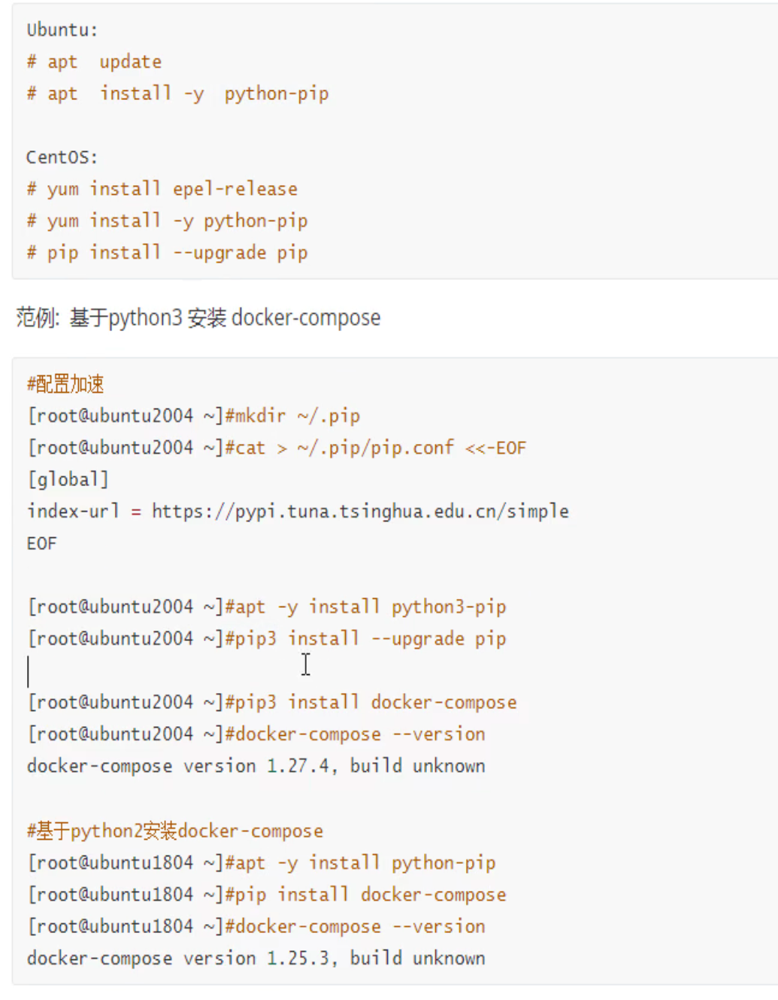
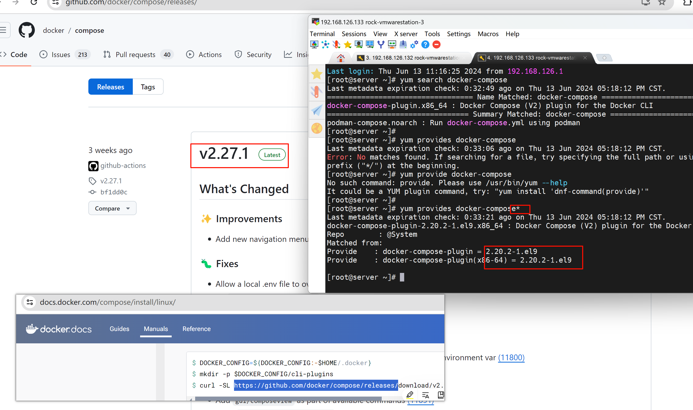
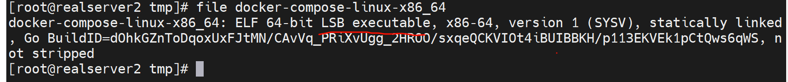
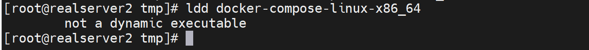
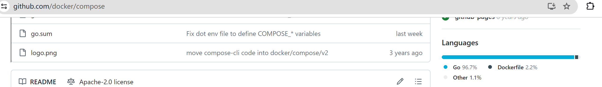
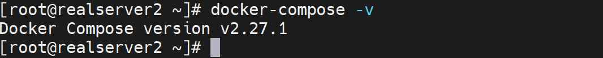
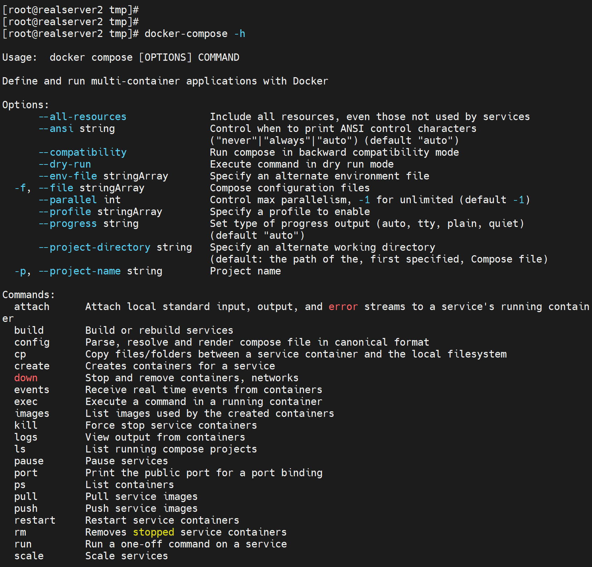
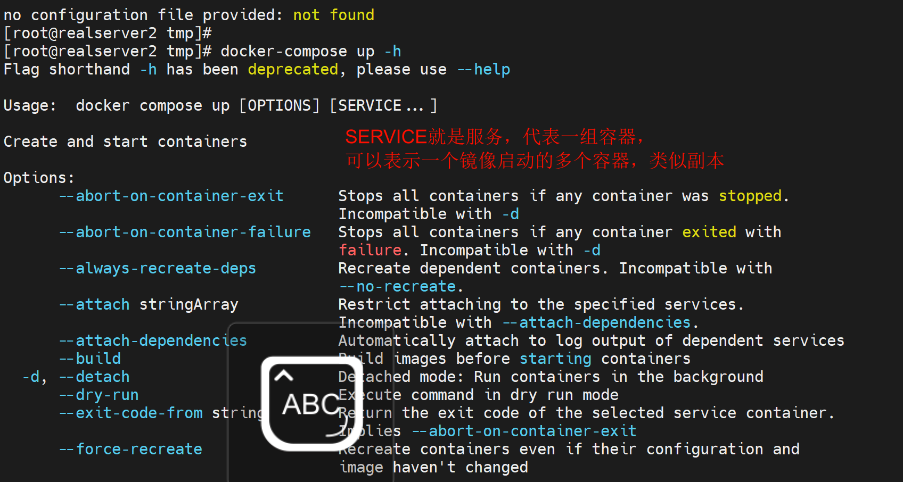
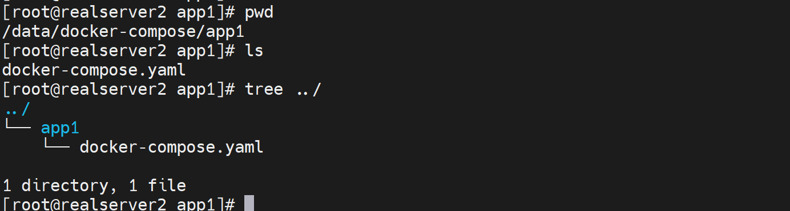

# 第4节 Docker-compose单机编排工具安装和实战案例


docker-compose也是docker官方制作的


关键字编排，就是根据业务来管理，就是docker ps 看到的就是所有容器的陈列，不清楚所属的项目，但是docker compose就是业务层次清晰。也可以之启动某个业务的容器。


# 安装docker-compose


方法1：




方法2：直接yum

ubuntu查看版本


yum安装的就是版本低




方法3：直接github下载

其实就是官网上走一波install步骤就行了啊

```shell
wget https://github.com/docker/compose/releases/download/v2.27.1/docker-compose-linux-x86_64

mv docker-compose-linux-x86_64 /usr/local/bin/docker-compose

chmod +x /usr/local/bin/docker-compose
```

👇可见确实是可执行文件



也没有任何依赖



因为完全就是go写的，静态编译的。







通过help可见docker-compose也和docker有些像的






但是这种👆副本的效果没啥意义，因为docker-compose是单机游戏，你再多的副本都是在一个机器上的，HA并不给力。

SERVERS也是要写在yml文件里的，这里是CLI格式咯，就好像ansbile的cli和ansible的playbook，就好像iptables的cli和iptalbes的配置文件。


写在yml里，然后docker-compose up就完了。


yml是按业务分文件夹存放的，根Dockerfile一个逻辑。



在这个yaml文件下去执行docker-compose up就会自动读取该yaml文件，就和Dockerfile的操作一样的。

也可叫docker-compose.yml，后缀yaml，yml都行。


# docker-compose语法

和版本还有关系，需要注意；如果发现up不起来，比如之前的，比如别人的yml，你up不起来，可能就是版本问题，格式变了。


其实有工具可以将docker run的cli自动转成docker-compose的yaml的。


# 工作案例

简单加载小脚本

```shell
#!/bin/sh

char=('\' '|' '/' '—')

while true;do
for i in "${char[@]}";do
    echo -ne "\r$i"
    sleep 0.2
done;done

# 根据需要将while改成loading的实际进度执行时间就行了，不过要记得最后清除掉符号。
```



<video id="my-video" class="video-js" controls preload="auto" width="100%" data-setup='{"aspectRatio":"16:9"}'>
  <source src="4-Docker-compose单机编排工具安装和实战案例.assets/shellForLoading.mp4" type='video/mp4' >
  <p class="vjs-no-js">
    To view this video please enable JavaScript, and consider upgrading to a web browser that
    <a href="http://videojs.com/html5-video-support/" target="_blank">supports HTML5 video</a>
  </p>
</video>




优化：

```shell
#!/bin/sh

char=('\' '|' '/' '—')
end=$((SECONDS+10))
echo "转$end秒"
while [ $SECONDS -lt $end ]
do
    for i in "${char[@]}"
    do
        echo -ne "\r$i"
        sleep 0.2
    done
done

echo -ne "\r"  # 清除最后的加载字符
```


