# 第5节 Docker私有仓库Harbor的部署和上传下载镜像


# 简述

官方的hub.docker.com的上传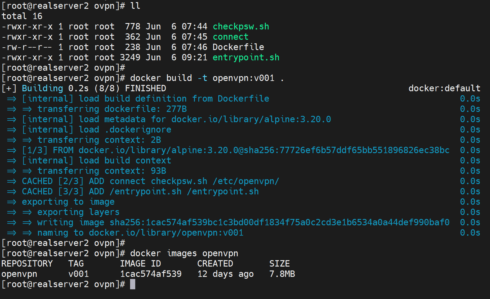

比如自己的一个image推上去

```shell
docker tag openvpn:v001 oneyearice/openvpn:v001  # 打标签就是hub.docker.com的账号/镜像+tag

```


1、注册账号


2、打标签，打的是仓库的ID和镜像信息，待会登入哪个仓库就用哪个仓库的ID。

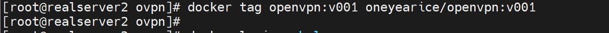


3、登入指定仓库，不指定就是官方hub.docker.com

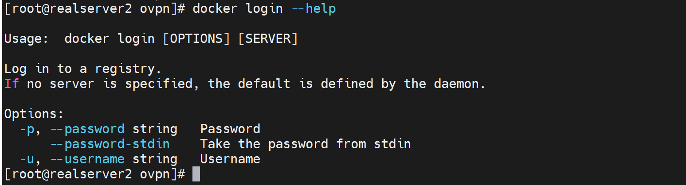


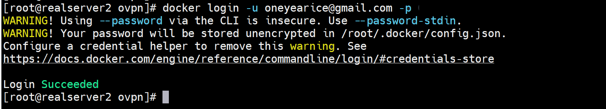

密码本地是存起来了

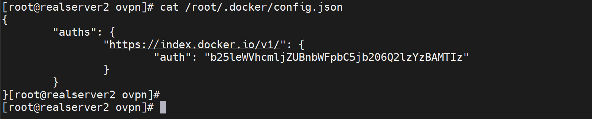


4、push

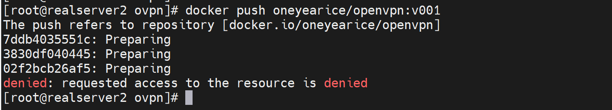

报错了，好像是两个账号冲突了，就是，oneyearice/这个路径，的用oneyearice这个账号来登入，结果上面用的是oneyearice@gmail.com登入的，这个账号的主目录是oneyeariceXXX是今天刚刚注册的，deactive这个账号就行了。

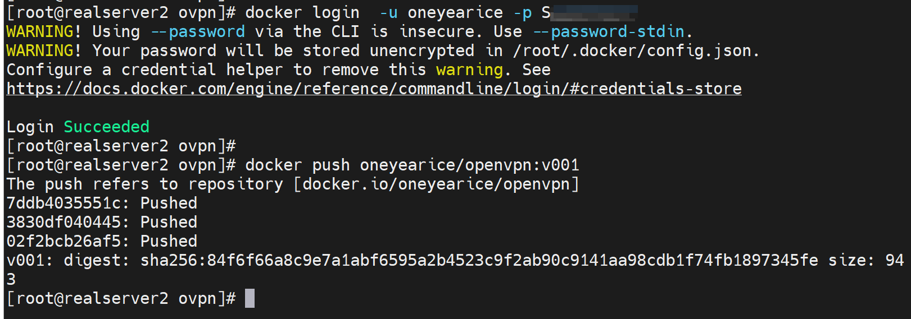


其实可以不必用hub.docker.com的账号密码，可以用专门的access token


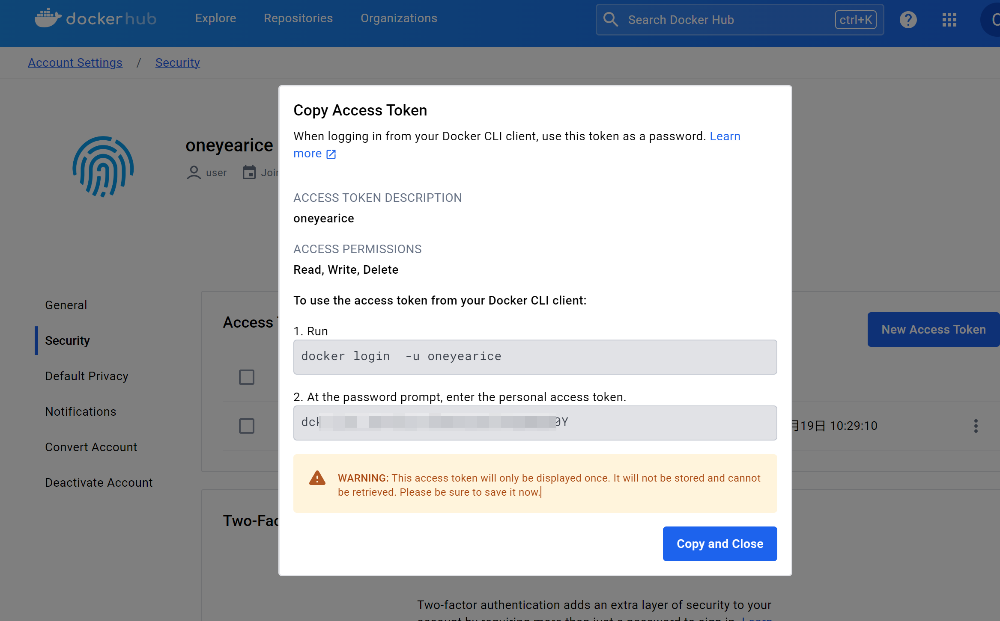


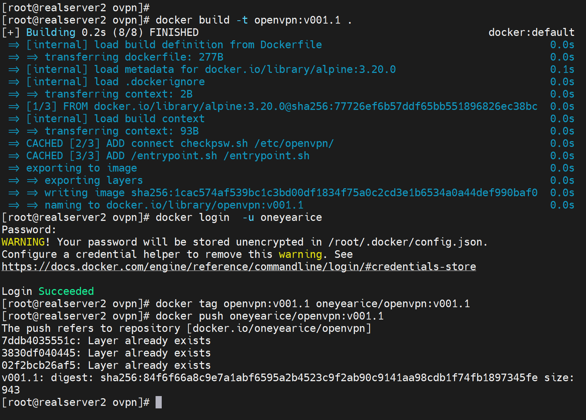


# Harbor

Vmware公司做的

https://goharbor.io/

https://goharbor.io/docs/2.11.0/

https://github.com/vmware/

https://github.com/vmware/harbor


组成：


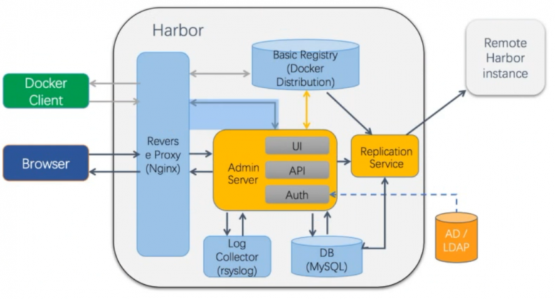


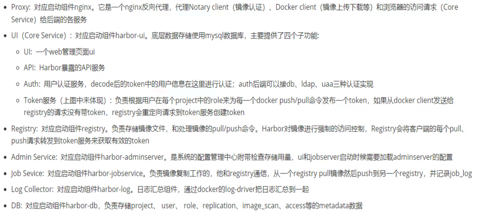


harbor是十几个容器组成的：

1、nginx：nginx做反代，这是一个容器；给后端各种服务提供反代

2、AdminServer：对应启动组件harbor-admin server，是系统的配置管理中心附带检查存储用量，ui和jobserver启动时需要加载adminserver配置。

3、UI：以UI为前端的core service：涉及UI、API、Auth，而Auth

4、API：

5、Auth：对接AD/LDAP

6、AD/LDAP

7、LogCollector

8、DB

9、ReplicationService

10、Basic Registry


官方提供了这些容器组件启动的配置文件，也就是docker-compolse的yml文件。

# 安装Harbor

1、安装docker

2、安装docker-comose

然后docker-compose又是依赖docker服务的，所以harbor的启动就需要docker+docker-compose

3、下载harbor离线包

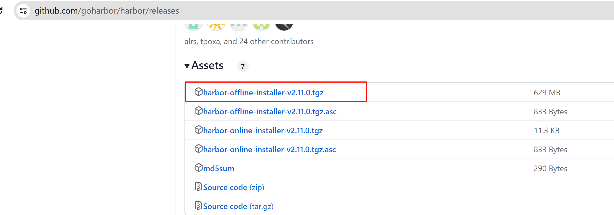


4、解压


harbor内部所有功能组件都是用容器提供的，而容器的镜像都在harbor.v2.11.0.tar.gz这个包里了，这就是所有images的打包文件。相当于docker save

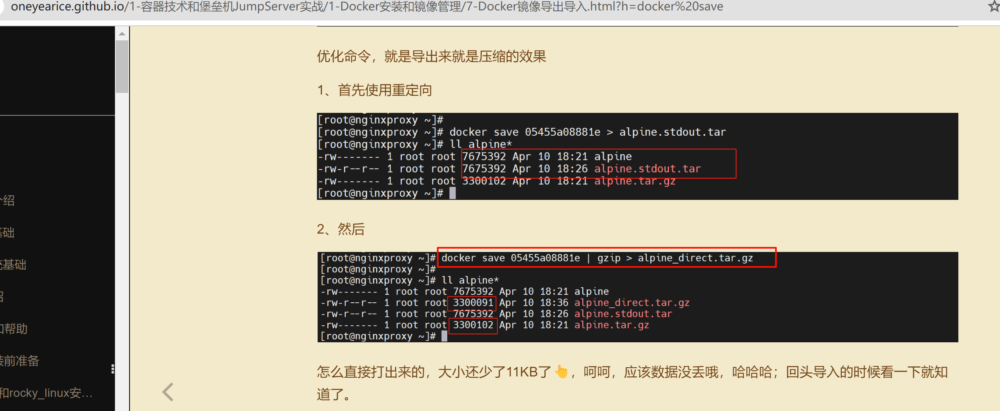

tar tvf预览一下，可见都是分层镜像文件👇

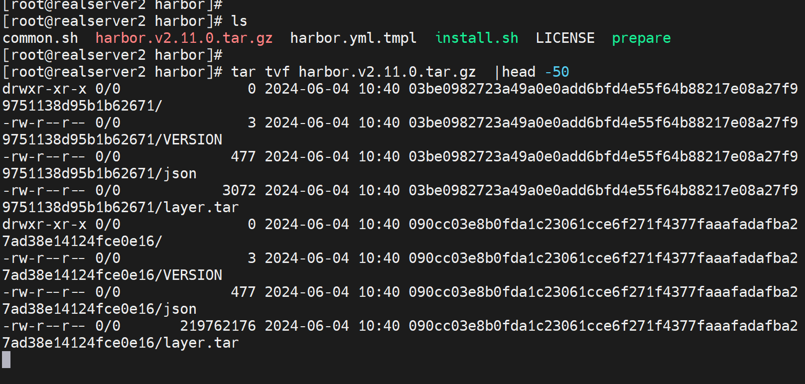

然后理论上就是docker load导出images，但是人家提供了脚本给你了👇，脚本里面就有docker load 命令

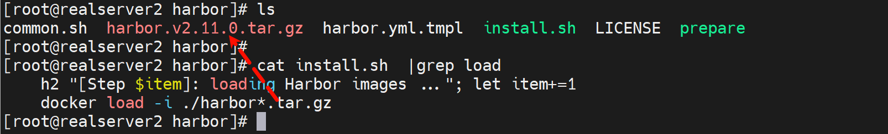

这个还不是docker-compose.yml文件哦，后缀名也要改成yml👇，这个文件是初始化文件，将来跑完install.sh后，会生成docker-comose.yml文件的。

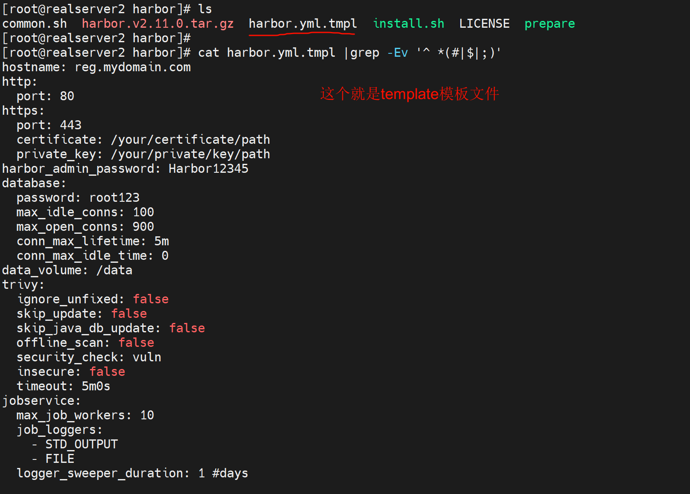


5、修改yml文件

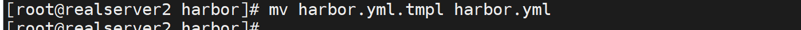

修改部分内容👇

①harbor的访问域名或者IP

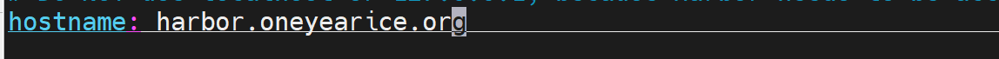

②ssl证书可以关掉，实验用无所谓

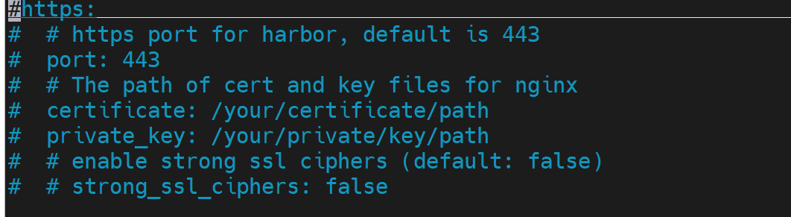

③默认的admin账号密码


其他不用修改

metric是Prometheus监控用👇

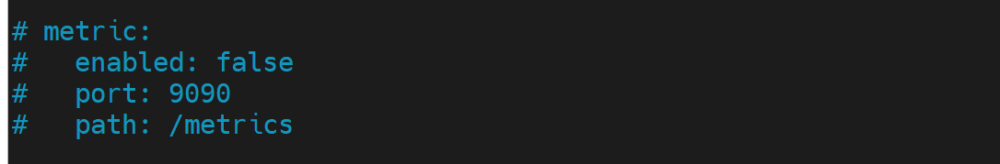


6、运行install.sh进行安装

早期需要安装python环境，现在python都是自带了，版本也不低。

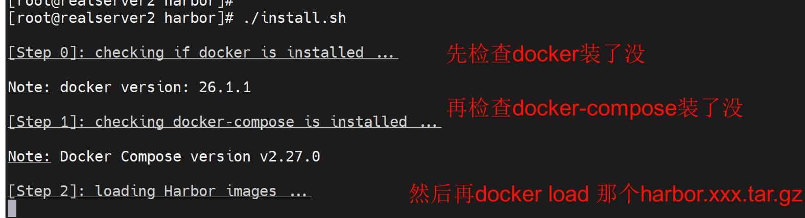

加载镜像👇


其后就会创建docker-compose.yml文件，然后就会使用docker-compose up -d啦👇

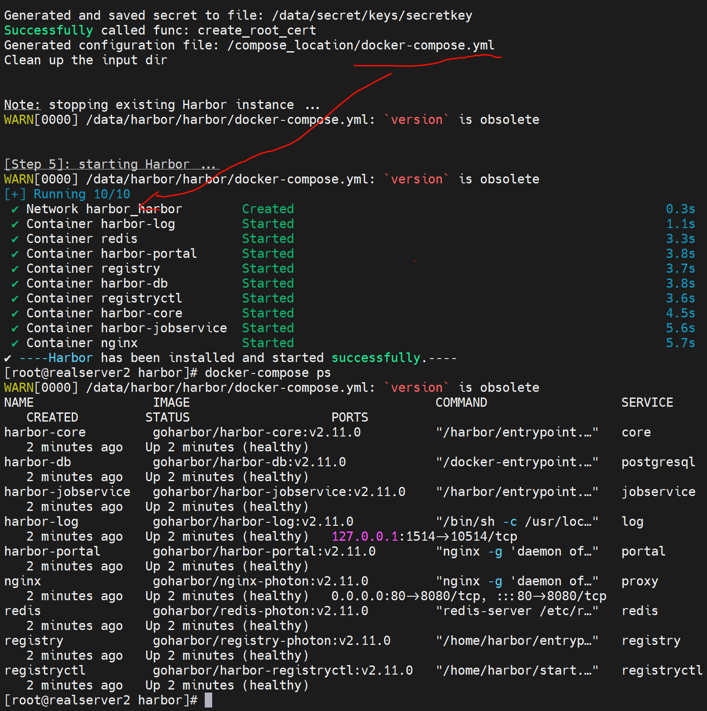

可见proxy就是nginx啦，然后访问一下就OK了

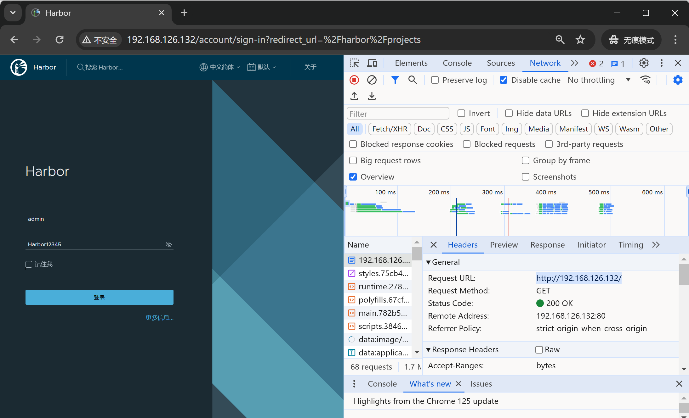


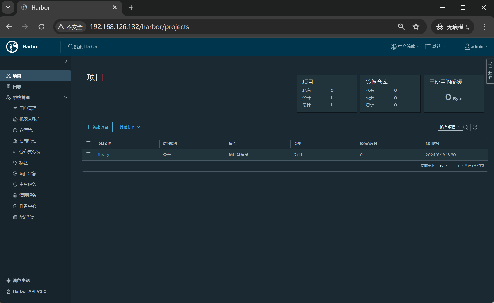


