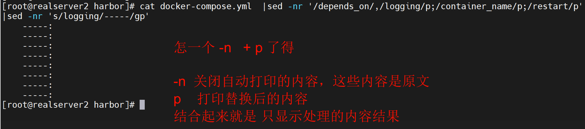
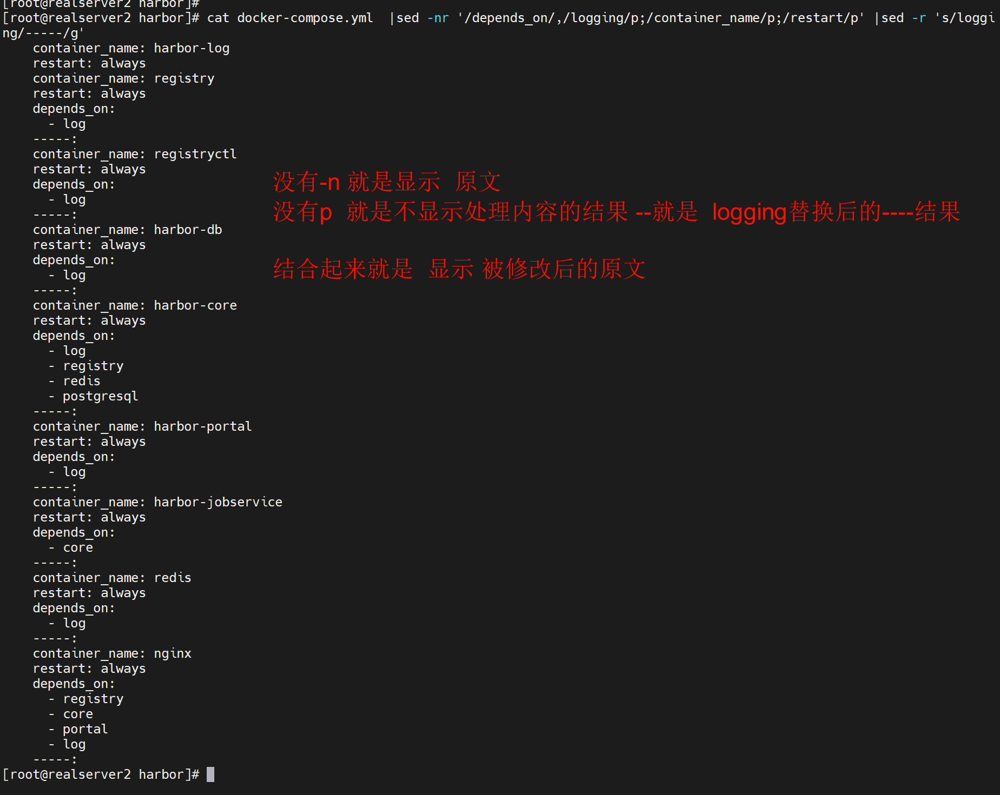
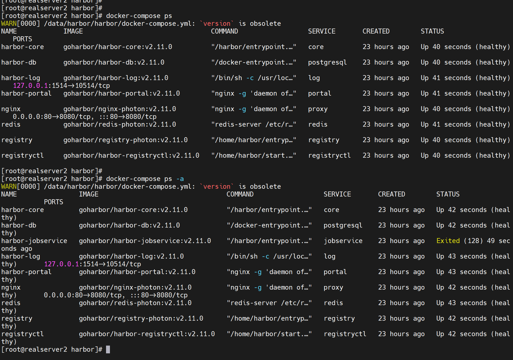
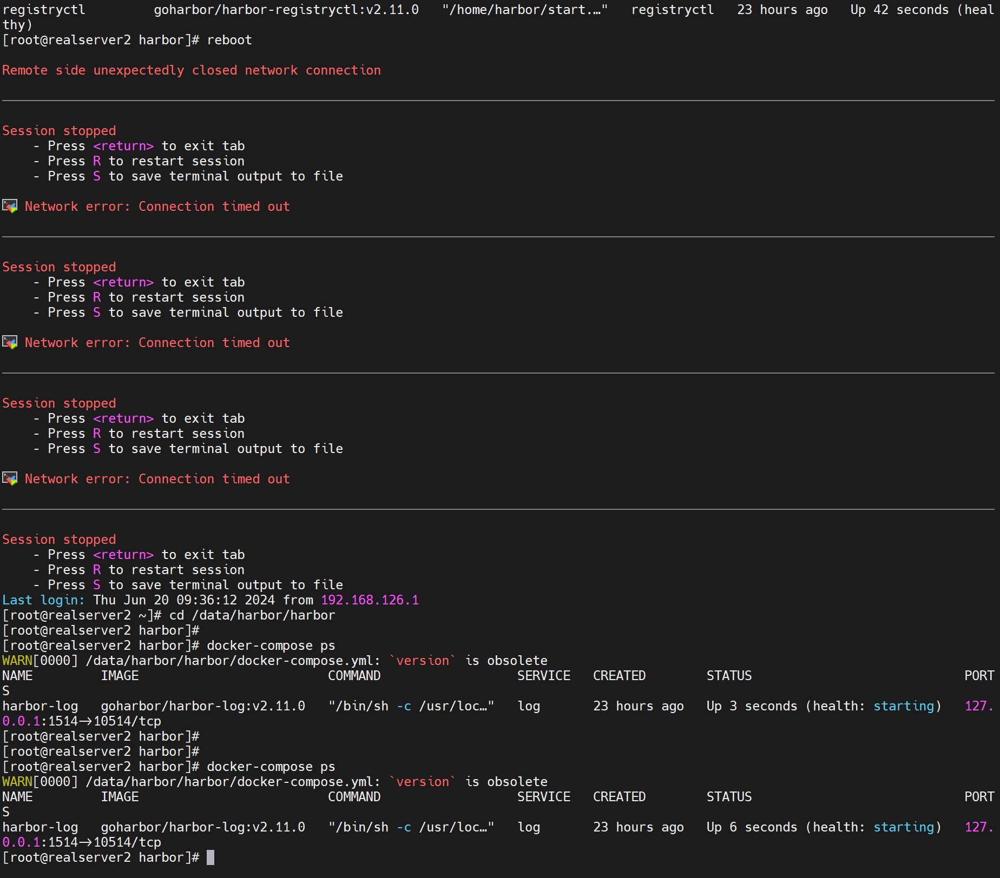
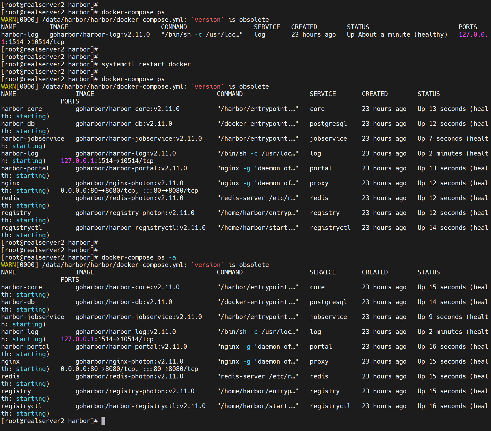
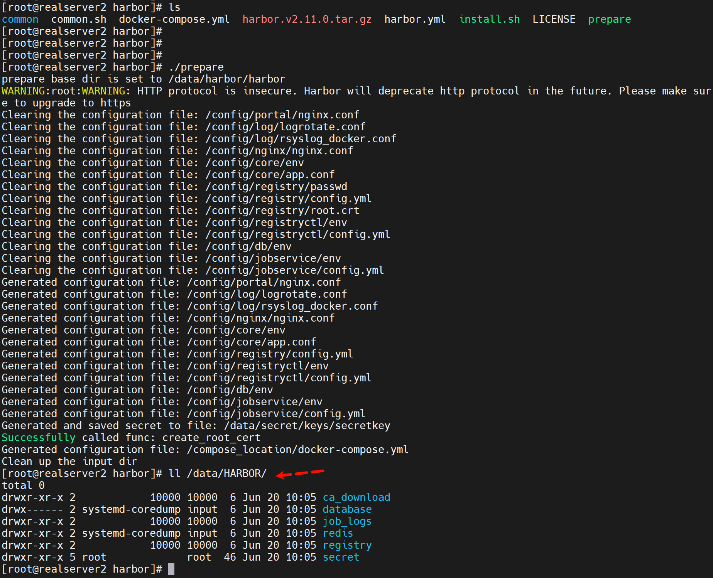
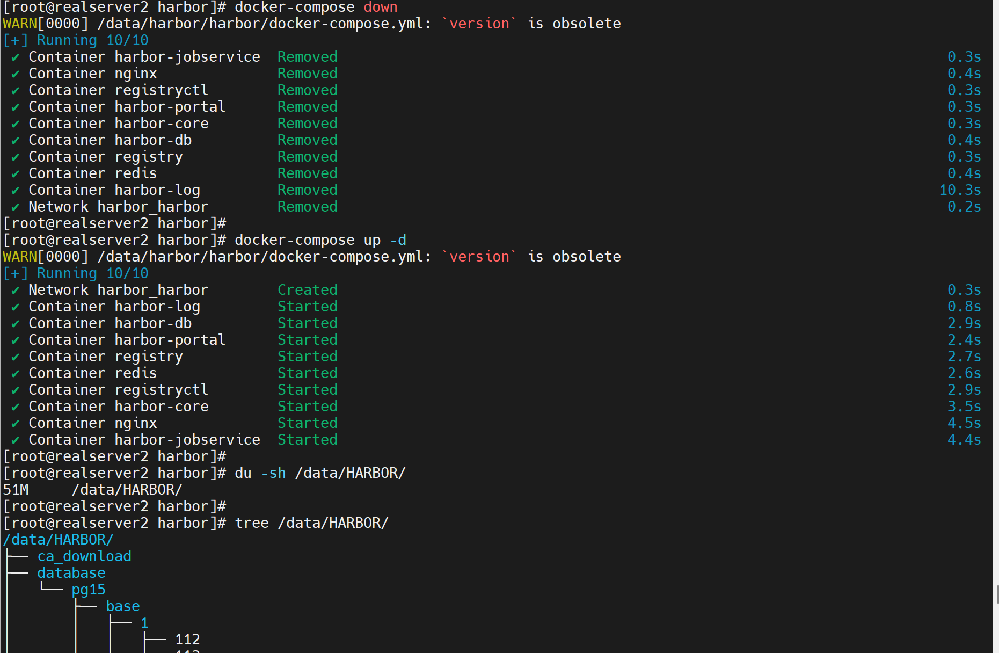
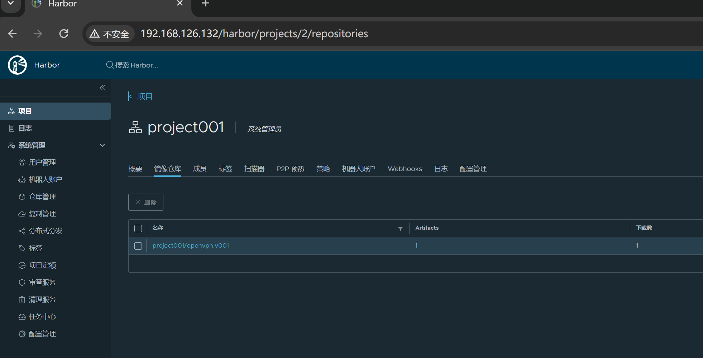
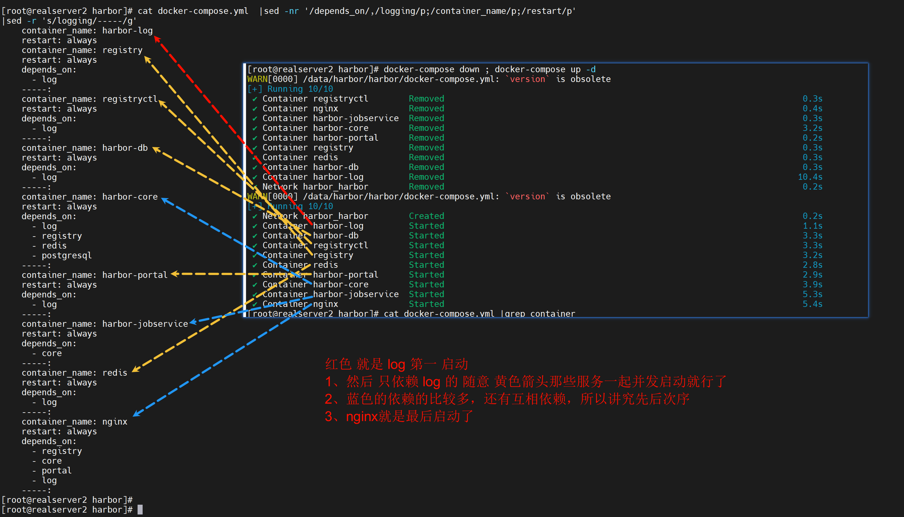

# 第6节 Docker私有仓库Harbor高可用和双向复制


# Harbor的自动启动

前一篇发现 reboot宿主后，Harbor的9个吧 容器没有全部起得来，当时处理方式就是

1、docker的daemon.json里要有live-restore:true的配置

2、reboot后由于Harbor的docker-compose.yml里的除了log容器以外，其他都是有depends_on的，所以启动次序没有







这就是我要的效果了👆

到这可以判断下

1、从上往下启动来着

2、harhor-log 首先启动

3、registry，其次启动，但是log启动如果速度慢了，registry也许就启动不了了，因为查看docker-comose.yml里没有延迟设置

4、reboot看看哪些起不来



这次就一个jobservice没起来

再reboot



这次就一个log起来了，你看不稳定的

就是log启动慢了，依赖它的其他服务启动的时候log没起来呢，就gg了。


然后restart docker一下就基本都好了，这是因为有daemon.json里的live-restore和compose里的restart always结合的效果吧。




# Harbor安装后启动问题

1、部分启动OK，不稳定

​          如上所述

2、数据存放默认定义在了/data下

​			


不过openvpn的image只找到找个名称的文件，但是image文件大小对不上，可能还在其他地方


可以自定义harbor的数据持久化目录


然后运行./prepare脚本



就自定了harbor的数据卷的地方，但是需要重新docker-compose down / up了

而且新的数据持久化目录里是空的，


注意down up才行，restart不行





然后就发现之前上传的镜像没了


原来的openvpn还在旧的路径里，当然图中的openpvn只是名称不是image


改回去上传的镜像就回来了


可以看出来，down是从yml文件里 ，从下往上down的，up就是从上往下up的。







## 言归正传开启自启动咋解决

### 方法1，写个service文件


```shell
[root@harbor ~]#vim /lib/systemd/system/harbor.service
[unit]
Description=Harbor
After=docker.service systemd-networkd.service systemd-resolved.service
Requires=docker.service
Documentation=http://github.com/vmware/harbor

[Service]
Type=simple
Restart=on-failure
RestartSec=5
ExecStart=/usr/bin/docker-compose -f /apps/harbor/docker-compose.yml up
ExecStop=/usr/bin/docker-compose -f /apps/harbor/docker-compose.yml down

[Install]
WantedBy=multi-user.target


[root@harbor ~]#systemctl daemon-reload
[root@harbor ~]#systemctl enable harbor

```


