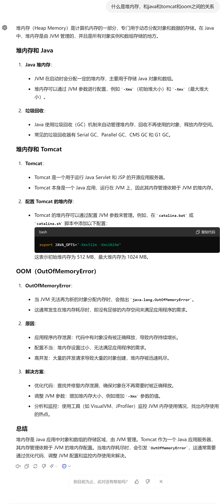
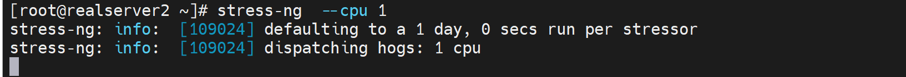

# 第1节 Docker基于Cgroup实现内存和CPU资源限制


# 传统限制手段PAM

PAM里的limit模块


可以控制某一个用户的资源使用

1、控制CPU运行时间  # cpu

2、控制使用的进程个数  # nproc

3、打开文件个数  # nofile

4、物理内存  # rss


# docker种的限制方式

java服务很可能会占用较大的资源

tomcat里梳理举例不做限制oom的情况

涉及堆内存




早期docker版本有一个swap开启的告警，现在没了

```shell
WARNING: No swap limit support  # 没有启用swap 限制功能会出现次提示报警，这是早期的docker才会
```


不过即使是老版本这个告警也没啥，不处理也没关系。仅仅是一个warning而已。


看一下oom_socre_adj的内容


虽然可以手动改，但是通过修改为-1000来实现进程保护--防止被杀掉，这种操作也是比较少见的。而且这个文件的存放路径是PID的，举例nginx的PID你每次启动的PID也是不同的，也就是说不是一个路径存放了的。实际操作也不是靠谱的。而且这只是防止这个PID被杀掉，并不是说限制资源的使用的角度出发的。

oom_adj就是oom_score_adj的老版本，并且自动兼容的一个文件，可以不用管


而oom_socre是系统给你算出来的值，不可调


# 压力测试Stress-ng

https://wiki.ubuntu.com/Kernel/Reference/stress-ng

安装也有docker版

https://hub.docker.com/r/polinux/stress-ng

可以用来判断docker是否限制住了某个容器应用的内存；或者看其是否会OOM。


yum 安装下 stress-ng -h查看


```shell
stress-ng --cpu 8 --iomix 4 --vm 2 --vm-bytes 128M --fork 4 --timeout 10s
# 开启进程，占8个cpu，占用4个io，开2个vm就是256*2=512MB内存，但是vm-bytes=128，所以还是256MB内存的占用，--fork就是开启子进程4个，timeout就是压力测试时间是10s。
```


测试下

### CPU

估计就是每个CPU做大量运算，比如加解密之类的计算



结果就是1颗CPU的占用


就是占用了4个CPU


#### 内存


内存就是看RSS物理内存就行，VIRT是进程跟OS申请的内存--虚拟内存，不是实际占用的RSS内存。


确实是256MB，但是CPU也是跟着占用了1颗了，差不多占用0.7的使用率


开3个vm就是256*3=768MB的内存占用，不过同样会消耗3个CPU


开3个vm就是256*3=768MB的内存占用，不过同样会消耗3个CPU


### 下面开始测试容器

测试是否能够做到docker限制资源的使用

思路：就是docker run 的时候 ①限制资源；②同时用stree-ng撑爆资源，③观察结果如果没有撑爆说明就限制住了。

```shell
docker pull polinux/stress-ng

# 一般关注的是CPU和内存的资源占用，以及磁盘IO

```


确实是512MB内存占用👆

也可以通过docker stats xxx来看，不过就是动态的


目前由于docker run 的时候没有限制内存的使用，所以上图👆LIMIT里显示的就是物理内存的最大值3.6GiB。


**Docker可以强制执行硬性内存限制，即只允许容器使用给定的内存大小。**

**Docker也可以执行非硬性内存限制，即容器可以使用尽可能多的内存，除非内核检测主机上的内存不够用了。**

https://docs.docker.com/config/containers/resource_constraints/


-m 和 --oom-kill-disable 一起使用的场景就是：这个容器很重要不能被oom杀掉，所以自身限制内存使用的同时，也不要让别人杀掉自己。但是不能单独使用--oom-kill-disable这样会造成自己无节制的使用内存，然后把系统宿主的进程杀掉从而导致业务同样出问题。


swap就别研究了，k8s好像也不推荐使用swap的，swap这种就别用了。


​	


# 工作案例

## 1、自有机房入伏前一个月

最好准备好空调故障应急措施

①是否在保

②在保内的维修、投诉电话、上门点在哪、维修师傅电话、厂家调货流程周期--以为配件调货AUX是师傅直接联系厂家，总台都看不到的

③第三方上门30块起步，KFR-120W这一个压缩机主控板就要1000多，一天给你修好但是费用要1600大洋。


④基于维护等待配件的漫长时间里，机房温度过高如何处理

​		小机房，先上5 6 个电风扇(这招其实真不错，对着机柜吹就能降10度)，但是电风扇直吹的区域，周围会被吹出来的热气导致气温上去，大概上去个3度。(￣▽￣)"

​		然后L3的空调可以关掉了，开也行，就是开30分钟就必须关掉否则就开始吹热风了，温度比室内环境还高！

​		买些冰块放机房里吧

​		打开机房门，用空调导风管，将大厅里的空调风导进机房里。


