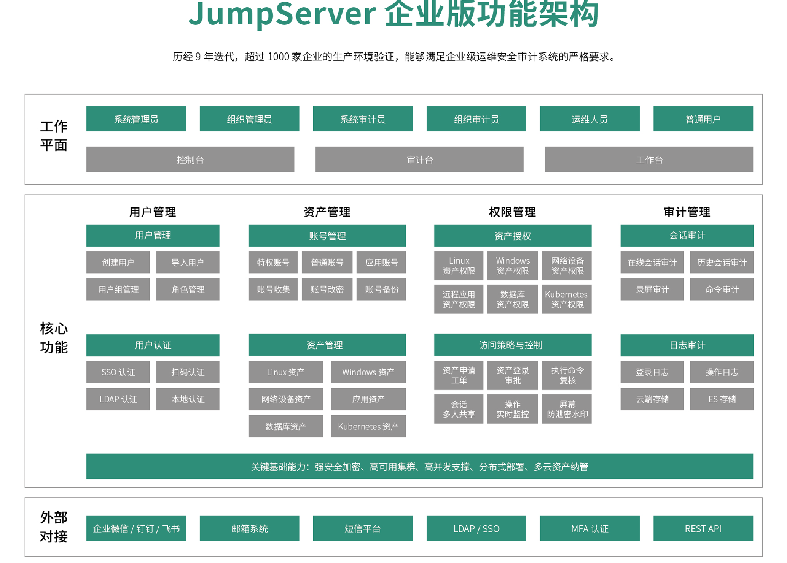
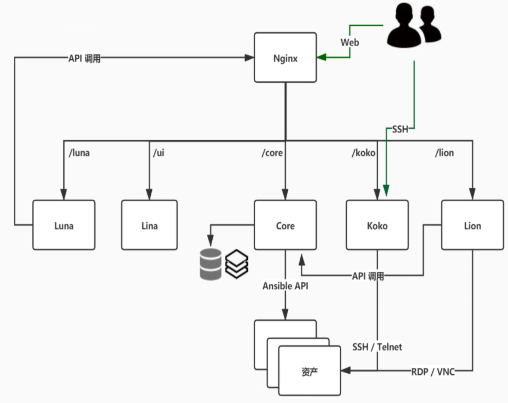
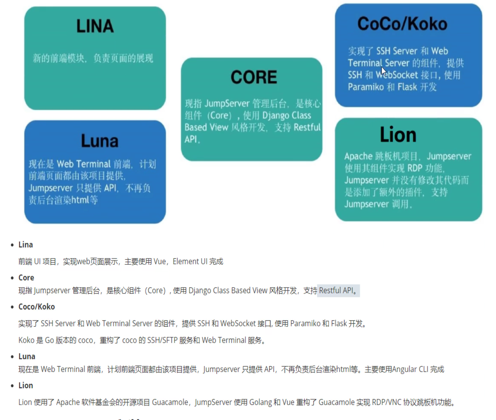
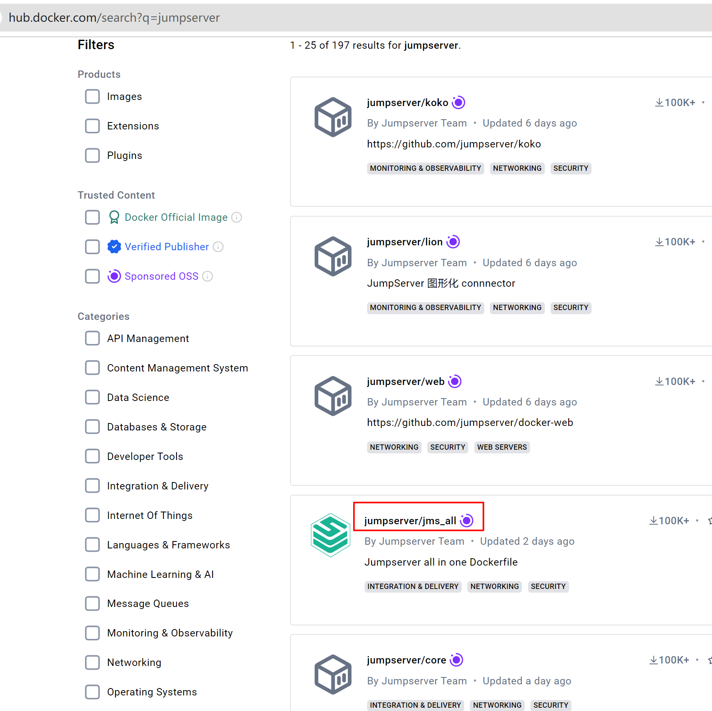
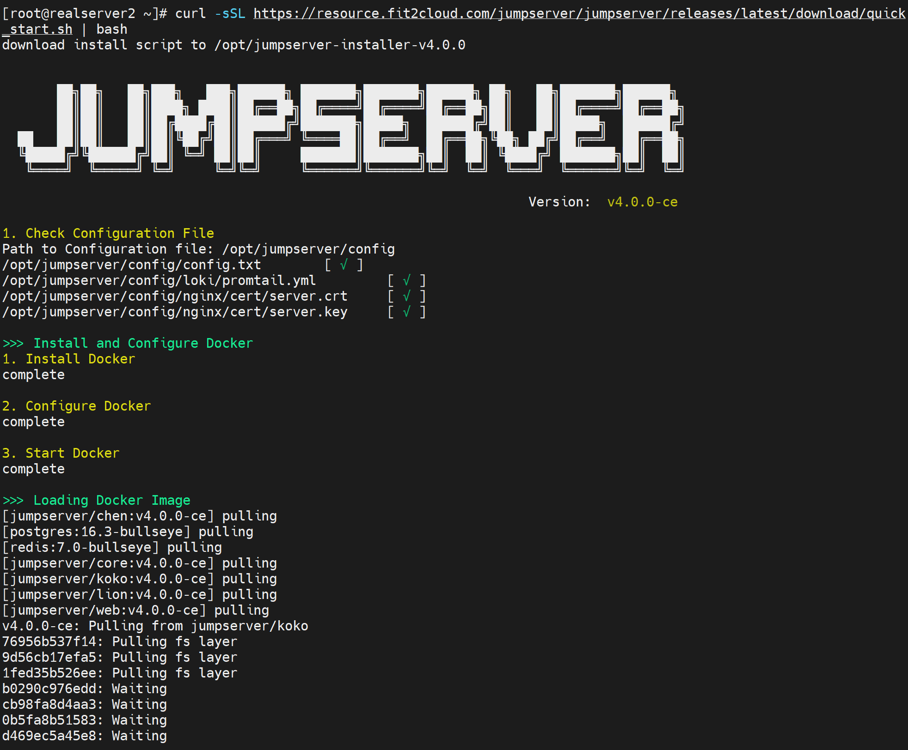
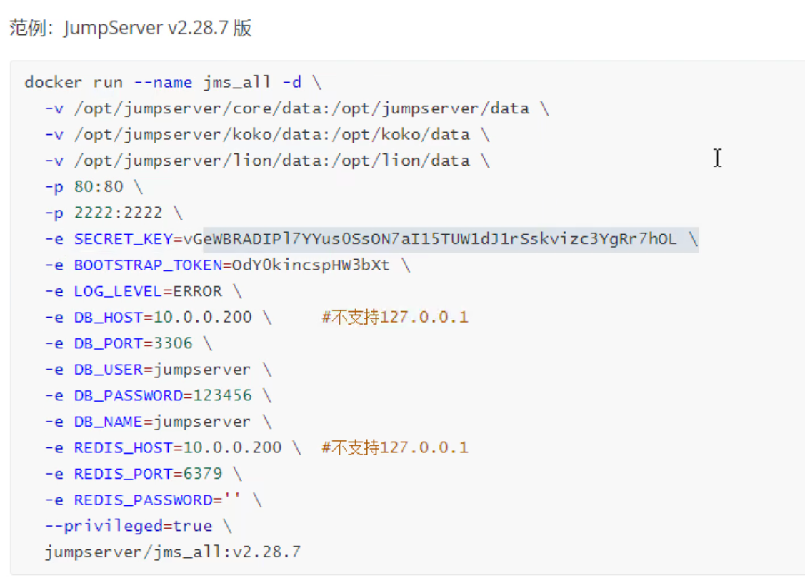

# 第2节 JumpServer介绍和部署


# 1、概述



看看企业版，然后就弄社区版吧~~O(∩_∩)O








# 2、实验-直接用docker部署




选择有很多，分开来各个组件也有独立的容器化，这里选择单机直接安装，就用jms-all这个容器


## 安装方法1：一键安装

https://docs.jumpserver.org/zh/v4/quick_start/


官方一键安装脚本也是容器安装的




## 安装方法2：手动分步安装

意义就是，学会分步安装，听不懂？即使jumpserver可以不用这种分步安装，其他的服务可能也会用的，其他服务即使用不到，分步安装过程中的问题解决也会出现在其他使用场景里，这是必然的。所以学东西 眼睛放亮一点，格局打开~

基于容器部署

1、docker环境安装

2、mysql

3、redis

4、jumpserver


### docker安装

参考前文，这里写ubuntu意思下

```shell
apt update && apt -y install docker.io

systemctl restart docker
```


### mysql的安装

1、版本现在可能不讲究了，之前是高版本的mysql，jumpserver不适配

​			jumpserver-v2.28.7之前版本不支持mysql8.0需要选择mysql5.7。

2、配置文件要改

​			默认字符集要改，但是镜像是官方做的，就需要自定义配置文件了。具体在容器里的配置文件里添加，characer-set-server=utf8   # 好歹用utf8mb4啊

```shell
# 所以要做持久化
mkdir -p /etc/mysql/mysql.conf.d/
mkdir -p /etc/mysql/conf.d/

# 生成服务器配置文件，指定字符集
tee /etc/mysql/mysql.conf.d/mysqld.conf <<EOF
[mysqld]
pid-file=/var/run/mysqld/mysqld.pid
socket=/var/run/mysqld/mysqld.sock
datadir=/var/lib/mysql
symbolic-links=0
character-set-server=utf8mb4
EOF

# 生成客户端配置文件，指定字符集
tee /etc/mysql/conf.d/mysql.cnf <<EOF
[mysql]
default-character-set=utf8mb4
EOF

# 查看配置文件列表


# 启动mysql的时候持久化
docker run -d -p 3306:3306 --name mysql --restart always \
-e MYSQL_ROOT_PASSWORD=123456 \
-e MYSQL_DATABASE=jumpserver \
-e MYSQL_USER=jumpserver \
-e MYSQL_PASSWORD=123456 \
-v /data/mysql:/var/lib/mysql \
-v /etc/mysql/mysql.conf.d/mysqld.cnf:/etc/mysql/mysql.conf.d/mysqld.cnf \
-v /etc/mysql/conf.d/mysql.cnf:/etc/mysql/conf.d/mysql.cnf mariadb:11.2.4


# 验证，验证啥哦，容器里只有mysqld服务的软件，没有mysql这个客户端命令
docker exec -it mysql sh
mysql -p123456 -e 'show variables like "character%"'
mysql -p123456 -e 'show variables like "collations%"'
cat /var/lib/mysql/jumpserver/db.opt
cat /etc/mysql/mysql.conf.d/mysqld.cnf
cat /etc/mysql/conf.d/mysql.cnf

mysql -p123456 -e 'select user,host from mysql.user'

ls /var/lib/mysql -l

# 或者验证容器里的，验证啥哦，容器里都没有mysql客户端软件，也就是没有mysql这个命令
docker exec mysql mysql -p123456 -e 'show variables like "character%"'
docker exec mysql mysql -p123456 -e 'show variables like "collation%"'
docker exec mysql mysql cat /var/lib/mysql/jumpserver/db.opt
docker exec mysql mysql cat /etc/mysql/conf.d/mysql.cnf
docker exec mysql mysql -p123456 -e 'select user,host from mysql.user'
docker exec mysql ls /var/lib/mysql -l

ls /data/mysql/


# 测试连接 这个可以的
yum -y install mysql
mysql -ujumpserver -p123456 -h192.168.126.133
show databases;
use jumpserver

```


### 安装redis

启动

```shell
docker run -d -p 6379:6379 --name redis --restart always redis:7.2.5

```

连接

```shell
yum -y install redis
redis-cli -h a.b.c.d
a.b.c.d>info
# server
redis_version:x.x.x
redis_git_sha1:000000
redis_git_dirty:0
```


### 部署jumpserver

需要先生成key和token

迁移和更新升级就要检测SECRET_KEY是否与之前设置一致，不能随机生成，否则数据库所有加密的字段均无法解密。BOOTSTRAP_TOKEN也一样

https://docs.jumpserver.org/zh/v3/installation/migration/?h=secret_key

```shell
# key.sh文件内容

#!/bin/bash
if [ ! "$SECRET_KEY" ];then
    SECRET_KEY=`cat /dev/urandom |tr -dc A-Za-z0-9 | head -c 50`
    echo "SECRET_KEY=$SECRET_KEY" >> ~/.bashrc;
    echo SECRET_KEY=$SECRET_KEY;
else
    echo SECRET_KEY=$SECRET_KEY;
fi

if [ ! "$BOOTSTRAP_TOKEN" ];then
    BOOTSTRAP_TOKEN=`cat /dev/urandom | tr -dc A-Za-z0-9 | head -c 16`;
    echo "BOOTSTRAP_TOKEN=$BOOTSTRAP_TOKEN" >> ~/.bashrc;
    echo BOOTSTRAP_TOKEN=$BOOTSTRAP_TOKEN;
else
    echo BOOTSTRAP_TOKEN=$BOOTSTRAP_TOKEN;
fi


bash key.sh

tail -n2 .bashrc  #获取两个变量的值
SECRET_KEY=0a3ogsWlLXurREp8QQma0H8vN0E7BQsYX6ibUtRkcI5fhvvHqo
BOOTSTRAP_TOKEN=EK1nBJ16PMJNw4SV
```


```shell
docker run --name jms_all -d \
  -v /opt/jumpserver/core/data:/opt/jumpserver/data \
  -v /opt/jumpserver/koko/data:/opt/koko/data \
  -v /opt/jumpserver/lion/data:/opt/lion/data \
  -p 80:80 \
  -p 2222:2222 \
  -e SECRET_KEY=0a3ogsWlLXurREp8QQma0H8vN0E7BQsYX6ibUtRkcI5fhvvHqo \
  -e BOOTSTRAP_TOKEN=EK1nBJ16PMJNw4SV \
  -e LOG_LEVEL=ERROR \
  -e DB_HOST=192.168.126.132 \  # 这里是jumpserver容器里连接db的ip，因为db容器端口暴露了，写宿主的IP就行
  -e DB_PORT=3306 \
  -e DB_USER=jumpserver \
  -e DB_PASSWORD=123456 \
  -e DB_NAME=jumpserver \
  -e REDIS_HOST=192.168.126.132 \  # 这里是jumpserver容器里连接redis的ip，因为暴露了，所以写宿主的IP就行
  -e REDIS_PORT=6379 \
  -e REDIS_PASSWORD='' \
  --privileged=true \
  jumpserver/jms_all:vxxx
```





### 


# 工作案例


1、关于comfui，往往需要高配显卡

但是现在随着时间的推进，很多云上也有此类机器，而且SD比如会成为服务直接对外提供，无需人工搭建，下面就是成本问题。

2、自己折腾的必要性，在于自己动手丰衣足食。

