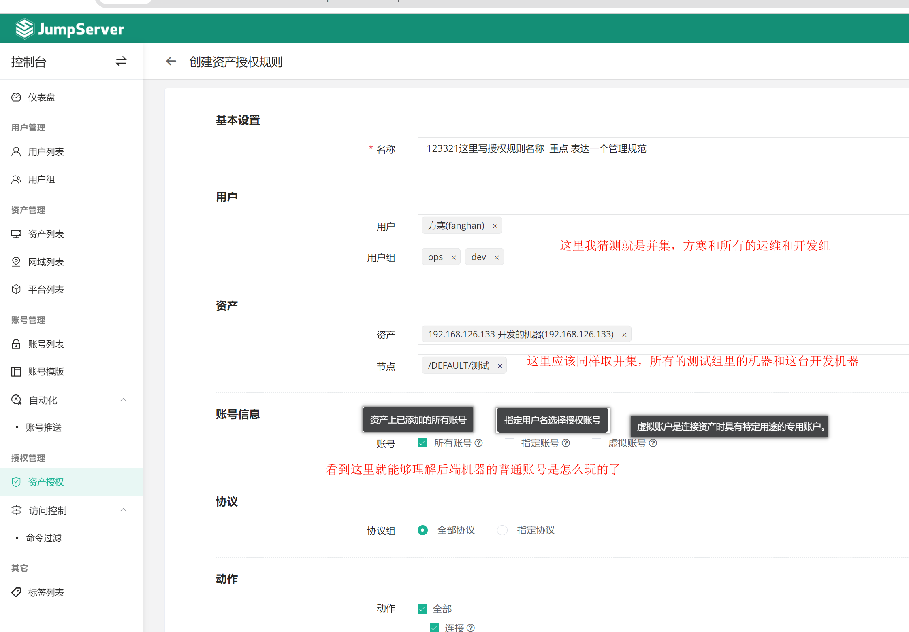
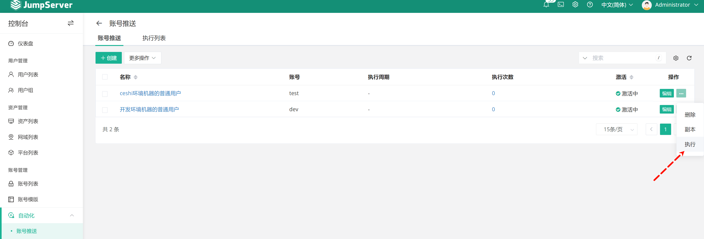
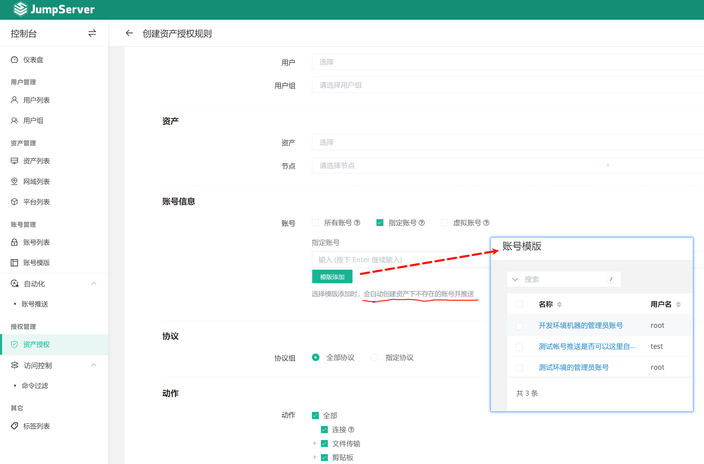

# 第4节 JumpServer实现管理服务器资产

书接上回，为什么其他章节不怎么出现 书接上回，因为，此片和前一篇实乃一篇也~~

强调初心

1、让xiaoming这个开发，通过xiaoming账号登入 jumpserver

2、然后再通过dev这个账号，去登入后端机器进行操作

当前133 和 134 后端机器上只有root，没有普通账号呢还

是需要jumpsever讲这两个账号分别下发到不同的机器上的

账号下发下去后，就涉及 “资产授权”了。就是好比网络ACL一样。

重点看这张图，我认为jumpserver的管理层次理解的线索就是这张图了👇

**账号信息**： 后端机器的账号

**1、所有账号**：事先在这些后端机器上创建好，比如windows的就只能如此，所以上图针对windows就要选择"所有账号"；

**2、指定账号**：后端机器上没有事先创建，这是事先在jumpserver里创建的普通账号模板，然后推下去的。而其是和网络访问权限一起配置的，这就很搓的一个开发思路，作者肯定是纯开发，没有深入干过网络工程师，没有这种网络上的清晰逻辑。我来开发，肯定拆开来弄。

而且  "账号管理"-"自动化"-"账号推送"，现在回过头来看，应该就是一个独立的模块，用来单独下发普通账号的。

其实如果我开发，只做一个功能，只有一个用户账号入口，就是

①配置后端节点root账号：这是人家后端机器自带的，写进jumpserver里来；

②新建普通用：不管后端节点里有没有，这是你jumpserver层面来看的，都是新建；然后不要开放任何自动创建的按钮给用户，就是建好以后就会自动下发的，如果后端有这个用户，忽略报错，如果没有就真的新建。但是密码就不要说了，所以如果后端节点有，你要提示冲突，让人工介入（①要么改后端密码②要么jumpserver这里换用户名）

③SSO：只选择用 各人登入jumpserver的用户，来登入后端机器。

**3、虚拟账号**：唉，别管了，就是跳板机而已，花里胡哨的。

所以他这个产品，推送后端机器账号出现在

①独立的推送功能

②账号模板里的自带推送

点击上图的同步更新账号信息后👇，其实我也不知道他在同步个啥，root密码给人家改掉？可以的。

③开通跳板机上用户权限的时候的推送

④ 推你马勒戈壁的推送

所以你是一个球，任何球面都能进入到球心对吧，你就是个球。

# 继续操作

选择开发权限里的推送吧，所以需要在用户模板里去创建普通用户，不过那里好像关联资产，哦，如果关联资产了倒是可以在用户模板里直接自动推送了。

表达不准确，账号模板只是用来创建账号，

①账号模板里的"同步更新账号信息"，就是会讲所有用该模板创建的账号，所关联的后端节点的密码更新推送了。见上图第二张图也就是②账号模板里的自带推送段落里的图。

②账号里的"立即推送 "到了后端机器。

③账号模板里不点击"同步更新账号信息"，也可以让开通权限的时候选择账号模板，那里也可以自动推送，见上图咯就是上面的最近的一张图。

下图👇是上面的②账号里的 立即推送。

这样应该就是说，👆账号界面自带的推送了。

