# 第6节 Haproxy介绍和多种安装方法


# 概述


lvs  四层代理，转发性能强

nginx 4层和7层，主要还是7层，且转发性能一般；nginx应该说是专业的web服务器。

HAproxy都行，都是高性能，还有WEB界面。


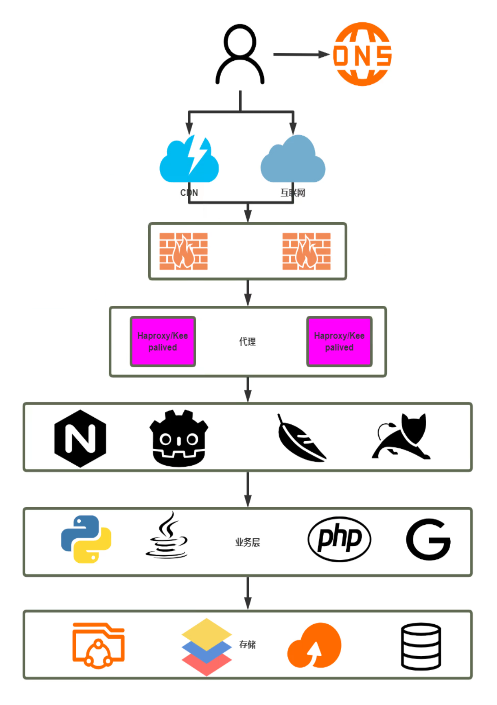


HAproxy的HA还得靠keepalive那么HAproxy的HA是啥呢，是后端调度的冗余--是后端节点的HA调度。

HAProxy本身的HA还是用keepalive来做的。LVS的HA同样也是keepalive，nginx的ha也还是keepalive。


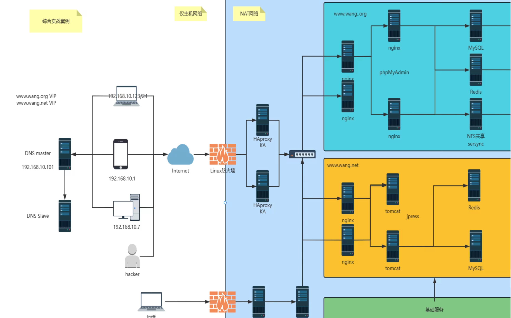


图中HAProxy可以用LVS代替，就是用来做4层转发；图中KA就是keepalive缩写。

右边的nginx 套nginx/tomcat，前面的nginx就是做7层转发，后面的nginx就是web了。

这图就是参考一下


# HAProxy简介


LVS： 4层转发效率最高，因为c---lvs----ser,    lvs在中间是不产生两个段tcp的。

HAProxy：4层转发效率虽然比nginx高，但是比lvs低，因为c---HAproxy----ser，HAProxy在中间是拆包后重新与server建立tcp了，前后是两段连接。


也就是说HAPorxy转发的流量，不管是4层还是7层，都是改变了数据包的源IP地址的。所以和nginx一样还要做真实IP的透传。


四层

LVS: Linux Virtual Server

Nginx: 1.9版本之后 通过 stream模块实现

HAProxy：High Availability Proxy  mode tcp   不支持udp?


七层

HAProxy 通过  mode http 指令

Nginx 直接写在 http模块


应用场景

四层：Redis mysql rabbitmq memcached等

七层：nginx tomcat apache php 图片、动静分离、api等


其实就是一个GUI带来的好处。


官网

1、免费社区版

https://www.haproxy.org/


用TLS，stable别用，号称稳定也别用。

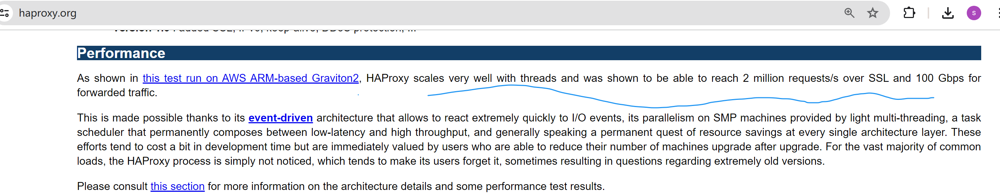


2、收费企业版

https://www.haproxy.com


# 安装HAProxy

红帽系列 yum直接就可以安装，但是版本较低

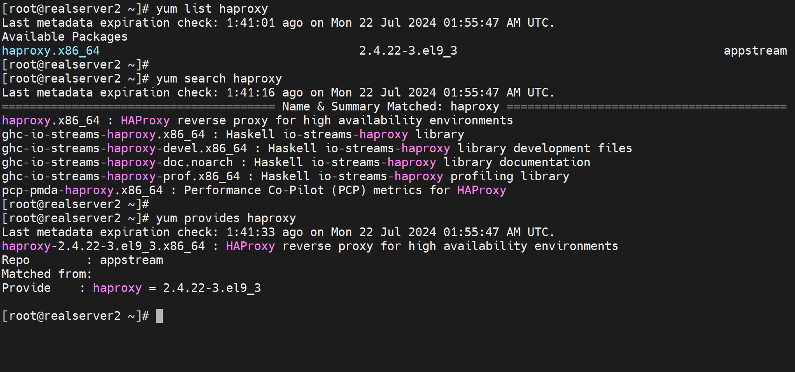


容器也可以安装，但是这是做边缘网络转发的，不推荐使用容器，容器本身就是有性能损耗的。


新版本的安装

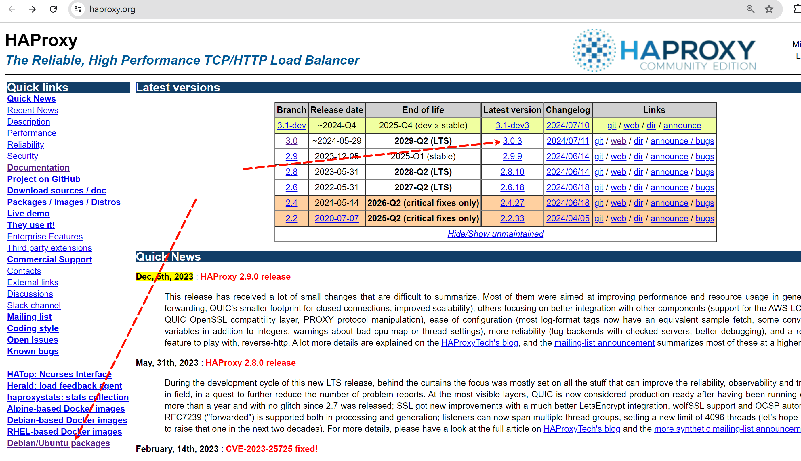

debian/ubuntu有直接的安装包，其他的要么是容器，要么就是自己编译了


## 编译安装

### 1、前置软件Lua

https://www.lua.org/start.html


```shell
lua -v

yum install -y gcc readline-devel


curl -L -R -O https://www.lua.org/ftp/lua-5.4.7.tar.gz
tar zxf lua-5.4.7.tar.gz -C /usr/local/src 
cd lua-5.4.7
make all test
make install  # 官网上竟然没有这一条...


# -R就是时间设置为remote-time就是往上文件的时间，而不是当前本地的时间
[root@realserver2 ~]# curl --help all |grep -E '^ .*-R'
 -R, --remote-time   Set the remote file's time on the local output

```


下面就是有R没有R的区别

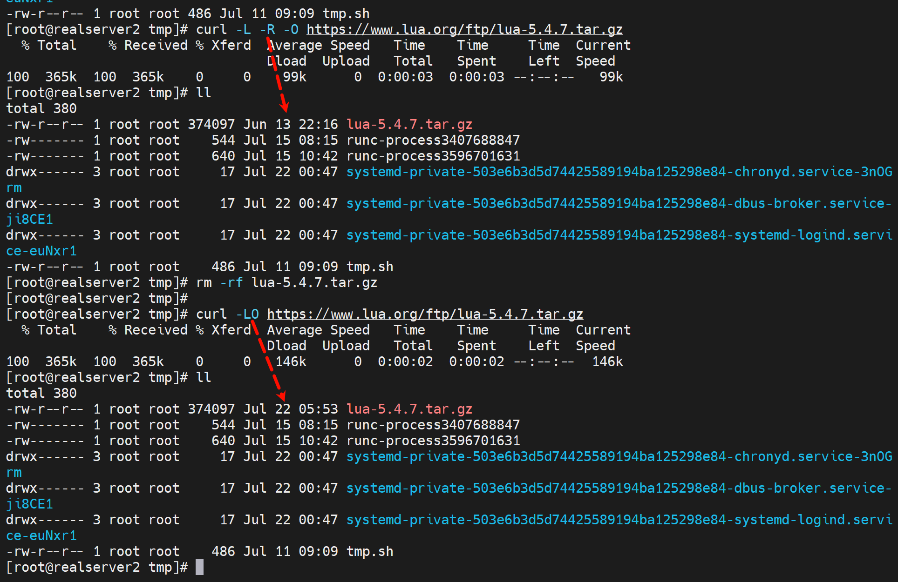


这就安装好了


### 2、编译安装HAProxy


**红帽系列:**

```shell
# HAProxy 1.8及1.9版本编译参数：
make ARCH=x86_64 TARGET=linux2628 USE_PCRE=1 USE_OPENSSL=1 USE_ZLIB=1 USE_SYSTEMD=1 USE_CPU_AFFINITY=1 PREFIX=/usr/local/haproxy


# HAProxy 2.0以上版本编译参数：
yum -y install gcc openssl-devel pcre-devel systemd-devel zlib-devel
curl -LRO http://git.haproxy.org/?p=haproxy-3.0.git
tar xvf haproxy-3.x.x.tar.gz -C /usr/local/src
cd /usr/local/src/haproxy-3.x.x/

# 查看安装方法
ll Makefile
cat READEME
CAT INSTALL

# 参考INSTALL文件进行编译安装
make clean

# 注意如果将来需要被Prometheus监控的话就要加上USE_PROMEX=1
make -j 4 ARCH=X86_64 TARGET=linux-glibc USE_PCRE=1 USE_OPENSSL=1 USE_ZLIB=1 USE_SYSTEMD=1 USE_PROMEX=1 USE_LUA=1 LUA_INC=/usr/local/src/lua-5.4.7/src/ LUA_LIB=/usr/local/src/lua-5.4.7/src/

make install PREFIX=/apps/haproxy

ln -s /apps/haproxy/sbin/haproxy /usr/sbin/

tree /apps/haproxy/


# 源码包安装，还需要弄一个services文件，以及起送services的cfg配置文件
vim /usr/lib/systemd/system/haproxy.service
[Unit]
Description=HAProxy Load Balancer
After=syslog.target network.target

# ExecStarPre是与启动，就是启动前的检查，如果不行就不会启动了
# USR2是自定义的信号，haproxy拿来reload了应该
[Service]
ExecStartPre=/usr/sbin/haproxy -f /etc/haproxy/haproxy.cfg -c -q
ExecStart=/usr/sbin/haproxy -Ws -f /etc/haproxy/haproxy.cfg -p /var/lib/haproxy/haproxy.pid
ExecReload=/bin/kill -USR2 $MAINPID
LimitNOFILE=100000

[Install]
WantedBy=multi-user.target


-------------------------

# 编写haproxy的配置文件
mkdir /etc/haproxy

vim /etc/haproxy/haproxy.cfg
global
	maxconn 100000
	chroot /apps/haproxy
	stats socket /var/lib/haproxy/haproxy.sock mode 600 level admin
	#uid 99
	#gid 99
	user haproxy
	group haproxy
	daemon
	#nbproc 4
	#cpu-map 1 0
	#cpu-map 2 1
	#cpu-map 3 2
	#cpu-map 4 3
	pidfile /var/lib/haproxy/haproxy.pid
	log 127.0.0.1 local2 info

defaults
	option http-keep-alive
	option forwardfor
	maxconn 100000
	mode http
	timeout connect 300000ms
	timeout client 	300000ms
	timeout server	300000ms

listen stats
	mode http
	bind 0.0.0.0:9999
	stats enable
	log global
	stats uri 	/haproxy-status
	stats auth	haadmin:123456
	
listen web_port
	bind 0.0.0.0:80
	mode http
	log global
	server web1 127.0.0.1:8080 check inter 3000 fall 2 rise 5

------------------------------------------------
# 准备socket文件目录
# mkdir /var/lib/haproxy  # 下面useradd的时候带上-m就行了，而且用户和用户组还精确到了haproxy，这里就不要敲了

# 创建用户和用户组
useradd -r -s /sbin/nologin haproxy -d /var/haproxy -m  # -d /var/haproxy本来是多此一举，但是-m加上去就很完美了，啊，你说不用-r ，也不用-m，那不行，那样就会自动创建邮箱了。这也算一个固定用法了吧。

# 检查配置文件语法
haproxy -c -f /etc/haproxy/haproxy.cfg

# 加载service文件
systemctl daemon-reload

# 启动
systemctl enable --now haproxy

```


过程记录

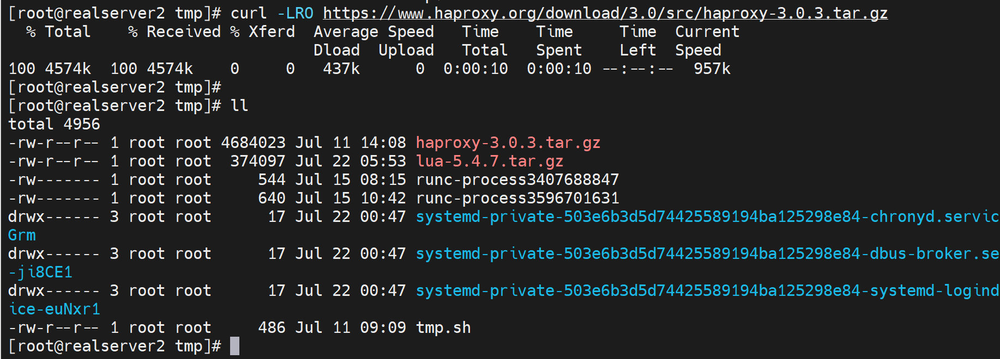


报错处理，make的报错，一般就是要安装xxx-dev

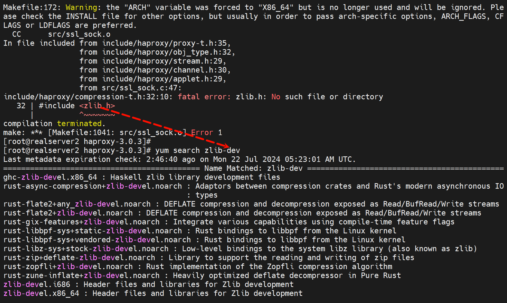

发现并不是dev而是zlib-devel

最后安装oK，👇但是没有配置文件的。

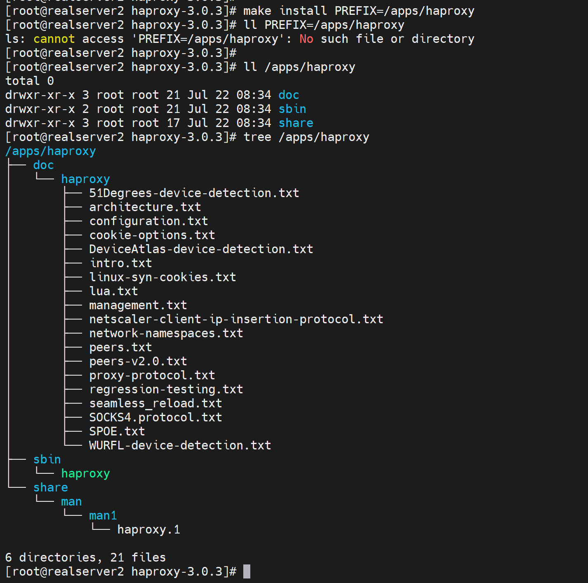


就一个二进制文件，所以写个软连接就行。如果文件夹下很多个二进制，则将这个文件夹的目录加入PATH变量。


PATH变量

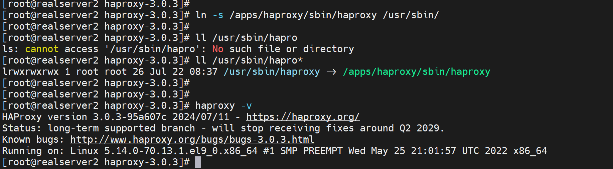


然后配置文件在源码包里的example目录下有案例的

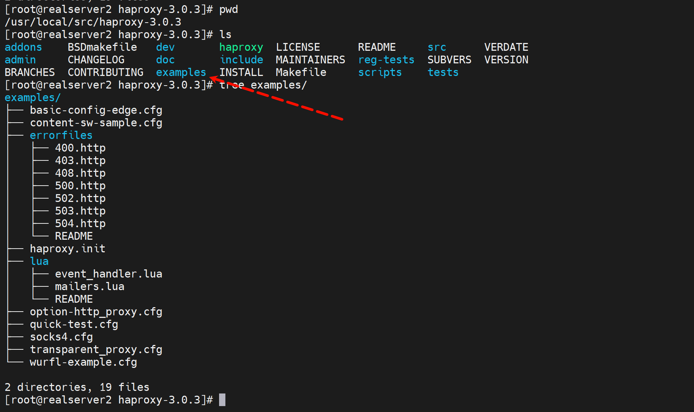


纠错 -r -d就是多此一举？是的，不管是家目录还是mail都不会创建，所以没必要-d👇

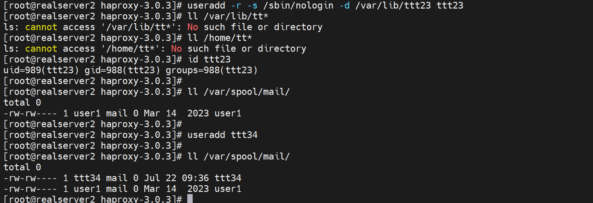


kill USR2是啥

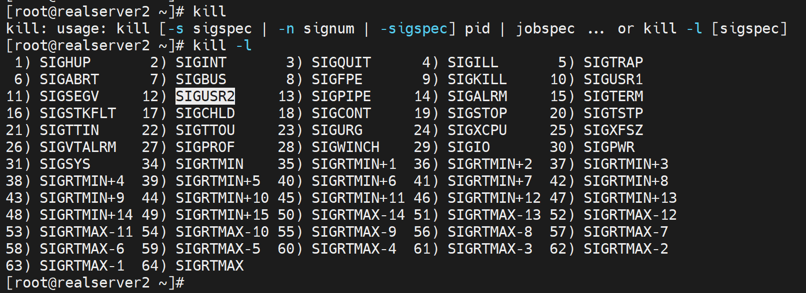


有点小问题好像

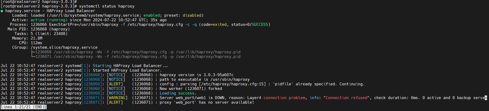


**ubuntu:**

```shell
# 安装基础命令及编译依赖环境
apt update && apt -y install gcc make libssl-dev libpcre3 libpcre3-dev zlib1g-dev libreadline-dev libsystemd-dev

# 安装Lua方法1：包安装Lua
apt update && apt -y install liblua5.x-dev

# 安装Lua方法2：编译安装Lua
cd /usr/local/src
wget https://www.lua.org/ftp/lua-5.4.7.tar.gz
tar zxf lua-5.4.7.tar.gz -C /usr/local/src 
cd lua-5.4.7
make all test
make install  # 官网上竟然没有这一条...


# 或安装系统自带的Lua
#👇 https://haproxy.debian.net/#distribution=Ubuntu&release=jammy&version=3.0
apt update
# apt-get install --no-install-recommends software-properties-common
# add-apt-repository ppa:vbernat/haproxy-3.0
# apt-get install haproxy=3.0.\*


# HAProxy 1.8及1.9版本编译参数：
make ARCH=x86_64 TARGET=linux2628 USE_PCRE=1 USE_OPENSSL=1 USE_ZLIB=1 USE_SYSTEMD=1 USE_CPU_AFFINITY=1 PREFIX=/usr/local/haproxy


# HAProxy 2.0以上版本编译参数：
yum -y intall gcc openssl-devel pcre-devel systemd-devel
tar xvf haproxy-3.x.x.tar.gz -C /usr/local/src
cd /usr/local/src/haproxy-3.x.x/

# 查看安装方法
ll Makefile
cat READEME
CAT INSTALL

# 参考INSTALL文件进行编译安装
make clean

make -j 4 ARCH=X86_64 TARGET=linux-glibc USE_PCRE=1 USE_OPENSSL=1 USE_ZLIB=1 USE_SYSTEMD=1 USE_PROMEX=1 USE_LUA=1 LUA_INC=/usr/local/src/lua-5.4.7/src/ LUA_LIB=/usr/local/src/lua-5.4.7/src/

make install PREFIX=/apps/haproxy

ln -s /apps/haproxy/sbin/haproxy /usr/sbin/

tree /apps/haproxy/
```


 


