# 第1节. 软件管理基础

ABI 应用程序二进制接口，API是开发接口

这里补一个ABI API的理解

WINE，让linux上跑windows的软件

Cygwin，windows上跑linux的软件

预处理：去掉注释、打上行号、引用的文件(include代码)等放进来，等

编译：语法分析，错误，转成汇编代码

汇编：汇编代码还是文本，汇编之后就是机器码了，还要把库连接起来。这些库有静态和动态之分

静态：把库和二进制结合在一起，合成一个文件；

动态：程序运行的时候再寻找依赖库；不合并。

## .so是shareobject

共享对象，好多程序会共用这个库

ldd可以看用的哪些库，不仅仅cat依赖这个库，ls也依赖。共同依赖的库

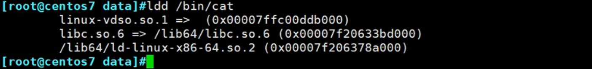

共用的库

.c**源代码**C语言写的---用gcc**预处理**成.i后缀---compilation**编译**成汇编语言assembly----**汇编成**二进制.o对象文件----link**链接**.a静态库----生成最终的一个文件。

 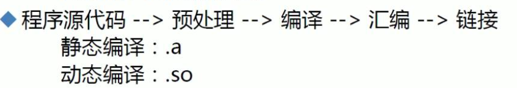

### 动静优缺点

 应用案例：注意通常我们都是动态链接的库，所以把一个二进制程序复制过去别的电脑上需要考虑把依赖的库文件也一并找出来复制过去。

 

 

 JAVA号称一次编译，到处运行的底层思路：

1、存在本质上的两次编译

2、第1次编译，是编译成标准字节码文件

3、然后再各个系统上面预装了JVM java虚拟机，当字节码在这些JVM上运行的时候 就会再次编译一次。

需求产生了，降低使用开源软件的难度，直接给C，编译困难，就出来了debian版本

三大主流linux分支debian、redhat、slackware。

debian就率先考虑的需求，就帮你编译好，打好包，让你使用的时候自动的解包，dpkg

debian package管理器，Ubuntu就是debian咯。

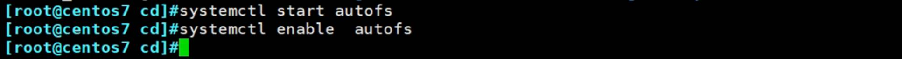

 

 

 

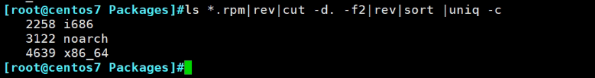

 

用sed来弄

 

 

==============================================================================================

 

 

 

 

 

 

 

这就是拆包分类

 

\---------------------------

 

 

思考是不是cat命令就是用的/bin/cat文件，还是后面调用了C语言的库呢？

再者so就是share object

很多二进制文件都是依赖一些共同的so库

可惜mv也是依赖这个库

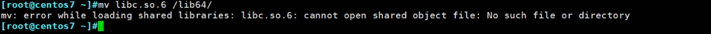

然后图形界面也死掉了

修复要么快照，或者借助光盘

上面的关闭客户机这些本质上还是调系统的命令，下面的重置才是按电源重启。

重启也起不来了

重试救援光盘来解决

1、插入光盘，连着的

2、进度条出来后果断esc

3、选择3 CD-ROM启动

4、选择troubleshooting

5、救援系统

就是类似windows的pe，交换机路由器的RMON，类似这种最小操作系统。

 

6、进入后界面

因为是从光盘启动，所根不再是/了，而是/mnt/sysimage/

你的系统被挂载到了/mnt/sysimage。你看到的文件系统是/mnt/sysimage这套

上图system写错了改成sysimage。

而我们要找的文件就在：

思考此时mv能用吗？

因为用的是光盘里的mv，不是硬盘里的mv。所以是可以用的。

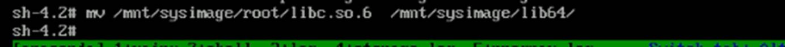

然后exit退出，自动重启就修复好了。

 

 

 

 

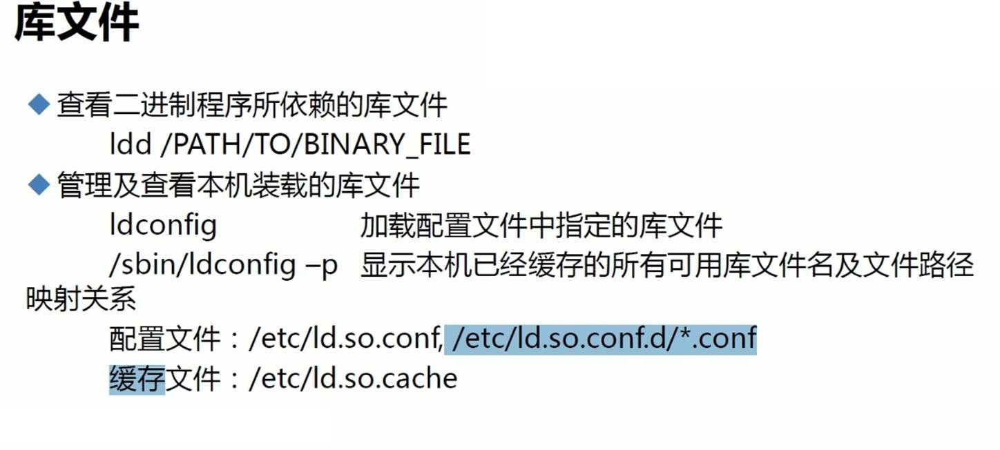

 

 

 

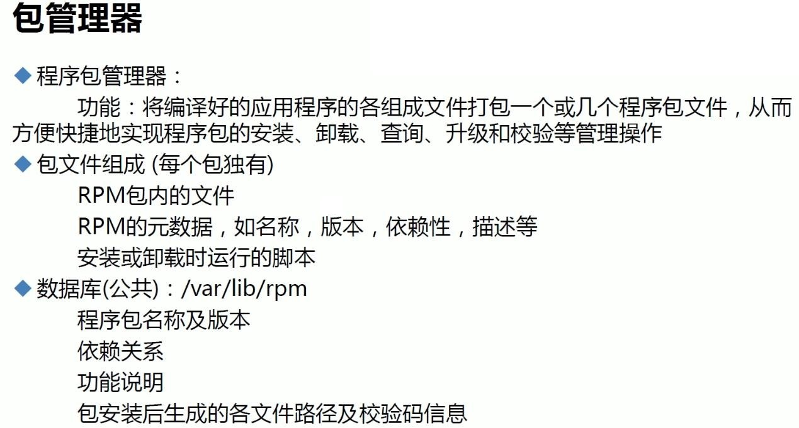

一个RPM包里可能包含的东西比较多：

脚本的意义在于，你安装程序前先给你创建好用户，这样你才有所有者，所有组啊。诸如此类的信息。

前两行都有：

第三行的脚本不一定每个RPM包里都有。

 

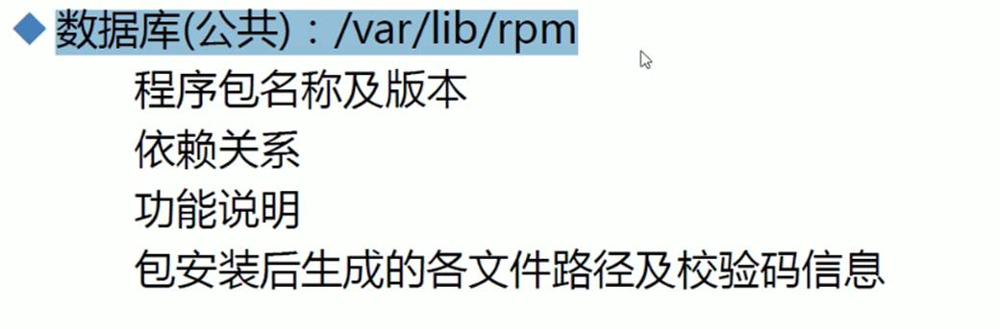

RPM包不是安装好了就行了，还需要处理文件的属性信息存放便于后续查找。

数据库简单说就是文件夹，里面存放了安装rpm包的很多信息。如果没有/var/lib/rpm，你都不知道你安装了那些程序。也不知道哪些文件来自哪个包。

比如安装软件，如果已经安装过了，就不会安装了，这就是到这里查找的。

 

 

有些官网提供了编译好的，有些就是提供源码给你自己编译。

操作路径

ppc是powerpc的，不用管

 

\-----

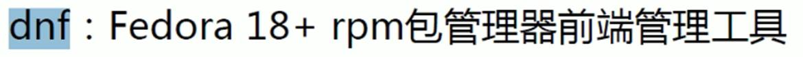

Fedora是红帽的上游测试版，dnf在Fedora 18版就有了。

然后现在centos-stream要取代centos8变成rehat的上游了。

 

 

 

\-------

 

 

配置 > /dev/null就可以实现静默安装。

 

其实没问题，是光盘里的，但是这里的告警是说验证来源是没有验证的。

一般warning也是可以了解下的。

signature是来源，其实就是公钥的验证。就是windows里的受信任的证书。

 

 

 

\---

 

选项放前面，这里习惯不好。

 

 

之前装过了，这里查询的话只要写名称就行了

没装是这个样子的

我们-e卸载后再试试

 

 

======

 

 

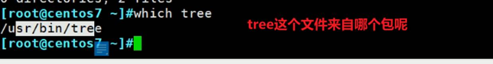

或者查询某个包里包含哪些文件

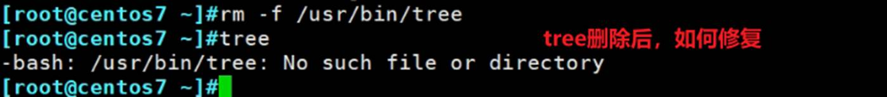

是不是重新安装一些tree就行了

因为那个var/lib/rpm里有安装过的信息了，所以不会给你安装了，你说rpm -e卸载呢，不推荐，因为说不定之前都做过一些配置优化了。

办法就不是，这是会全部覆盖的。

replacepkgs和replacesfiles，就是只覆盖有的，没有的就安装。

 

replacefiles是只覆盖有冲突的文件。一般用在两个包一样但是版本不同，第二个包安装覆盖掉冲突的就是相同的文件就能正常安装第二个包了，同时第一个包的不同版本的软件可以自然可以使用同名的文件。

 

\----

查看软件包的信息

上图中的官方站点可以去获取最新的版本

tgz就是tar.gz

 

如何只修复其中一个文件呢

利用cpio来解开rpm

利用cpio -tv查看文件列表

不过这样cpio解开的rpm再mv过去，有个问题，文件属性可能还需要注意一下。

 

 

 

默认就不具备完整性校验

 

先看下包里有没有脚本

-q --scripts 插已安装的包

-qp --scripts插未安装的包

 

 

将来如果是源码安装，就需要参考这些rpm安装的脚本来自己创建这些用户和组。

 

 

 
