# 第2节. rpm管理软件

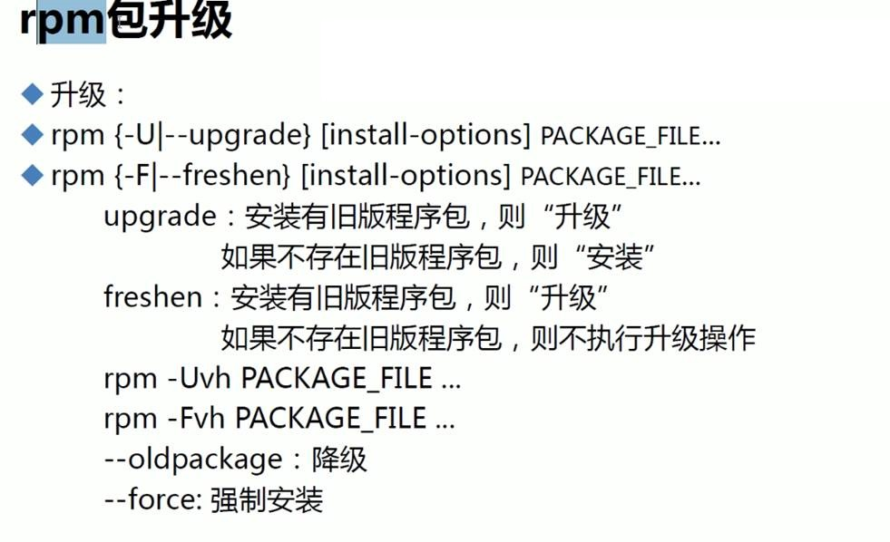

 

思考能不能安装两个版本的软件

windows的比如foxmail可以安装在不同的文件夹里，同时使用，无需关注注册表。

rpm包的话，除非名称都改一改，不然是不能共存的，很多都不能共存。

内核倒是可以的

可见kernel安装的文件绝大多数是带版本号的，所以可以并存的。

个别文件是冲突的，替代掉：

 

 

\------------------

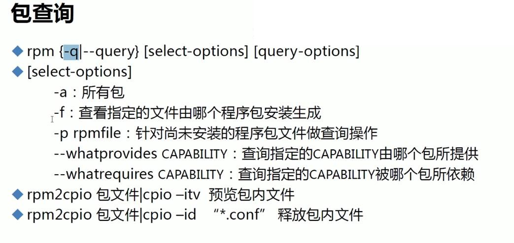

 

 

 

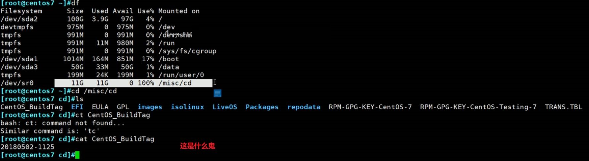

两个不同版本的内核就有了

下面开始安装

强制安装

机器上存在两套内核，计算机启动后可选择其中一套

 

如果要卸载就要注意

卸载哪个都可以，即使是当前使用的内核也可以的，因为linux加载到内存里了已经，而内核作为文件存在是可以删的。

重启后就剩一个内核了

查询文件来自哪个包

删除文件依然可以查，因为/var/lib/rpm下面有安装tree的文件信息的

如果卸载了就自然这些信息就没了

 

 

记一次VmwareWorkstation的光盘挂载问题和重启解决的经过

重新挂载光盘依然还是8.8G，还是不行。重启VM主机后，变为11G此时光盘挂载正常。后续rpm和cp正常。

 

 

 

查询包里面的文件。

 

\-----------------------

包里依赖文件叫做能力

上图查询的前提是已经安装完毕

上图是某个能力是由某个包提供的，而下图是哪些包需要这个能力

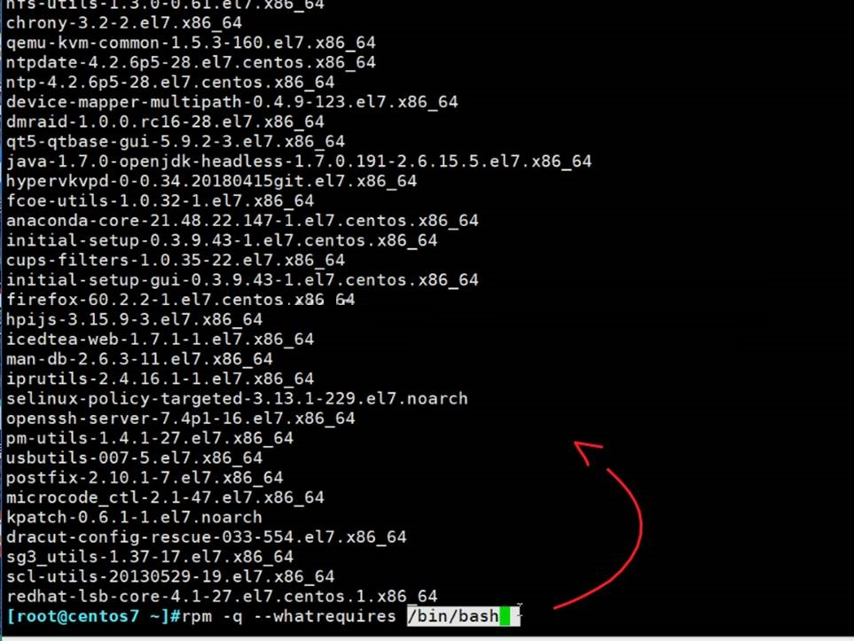

 

不安装包仅查询依赖的办法就是不用yum而用rpm，  

 

**不对，还有更直接全面的办法。**

 

 

 

和能力相关的四个选项

 

 

 

ql就是全列出来

qc是列出配置文件

 

qd是看文档

 

bash提供了哪些能力，也就是哪些文件。

 

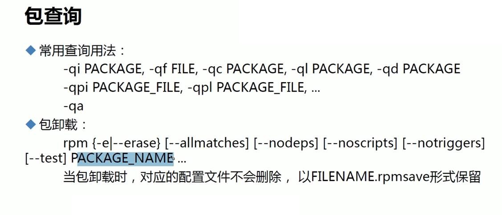

 

 

 

查找rpm命令来自哪个包

 

 

所以进入救援模式

这样安装路径是不对的，如下

安装都是在/根下的

所以要以/mnt/sysimage为根安装

 

 

 

\-----------------------------------------------

tree刚才被echo了一个换行，所以找到最后一行

删掉就可以恢复rpm -V tree检查

时间没办法，肯定改了，数据内容大小MD5都恢复了

 

查询所有包有无变化

 

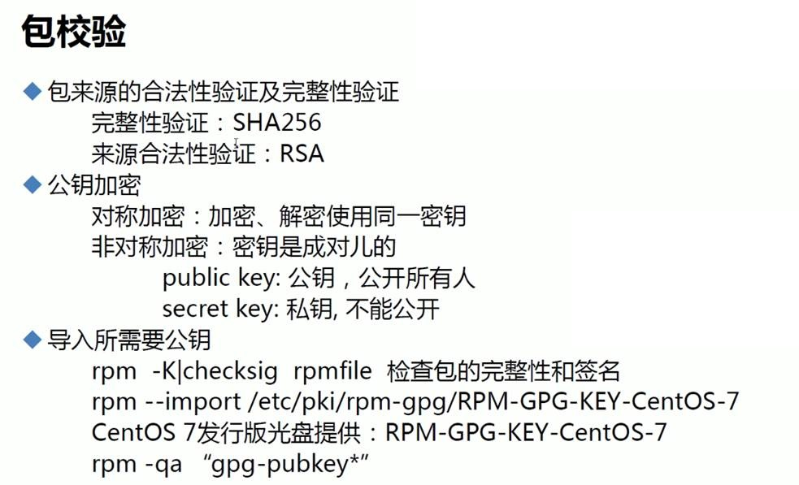

导入这个验证工具

导入这个验钞机实际上是放在了这个地方

 

 

检查某个rpm包的合法性

缺少验钞机（公钥），只要安装完系统后，本地光盘上就有

修改一下验证

 

进rpm包里删除最后一行的回车

如果不转回去，则文件大小会差很多，且都不再是rpm包了

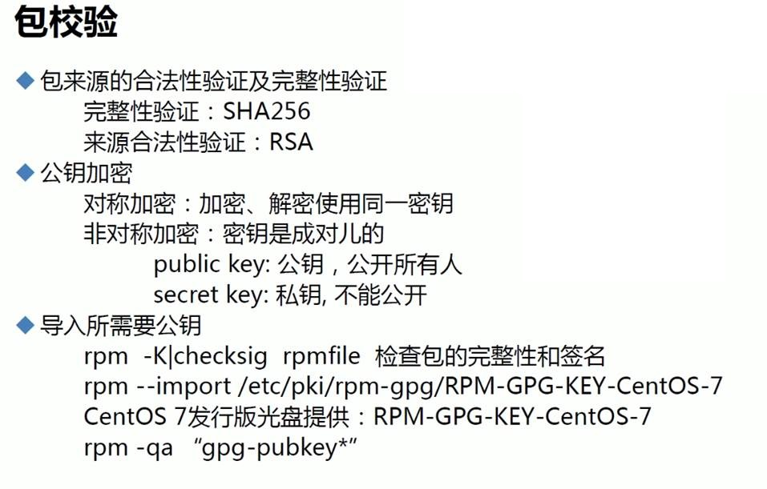

 

\---------------------------------

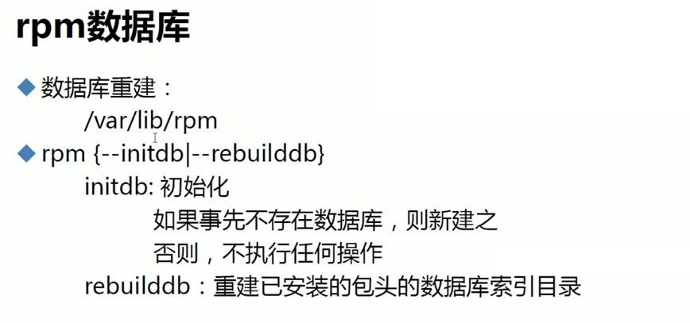

上图初始化没有啥意义，因为你删掉/var/lib/rpm后系统也会自动给你初始化，但是安装的信息都没了。

 

 

 

 

 

 

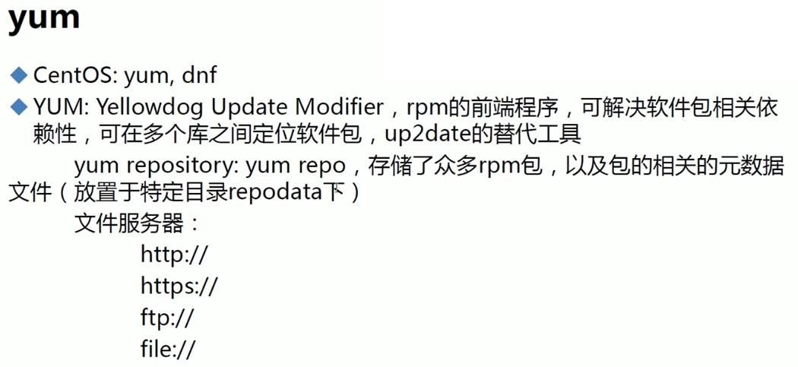

 

 

rpm是单机命令，yum是c/s架构

 

yum在client和server都要配置好。c和s通过网络互通，单机就是c、s在一台机器上。

 

光盘就是一个仓库

EPEL也是一个仓库

 

仓库的元数据metadata：rpm文件列表和依赖关系就是放到元数据里。还会分组-分门别类。repodata文件夹就是专门放元数据的。

仓库可能会叫做package文件夹，也可以是别的名称

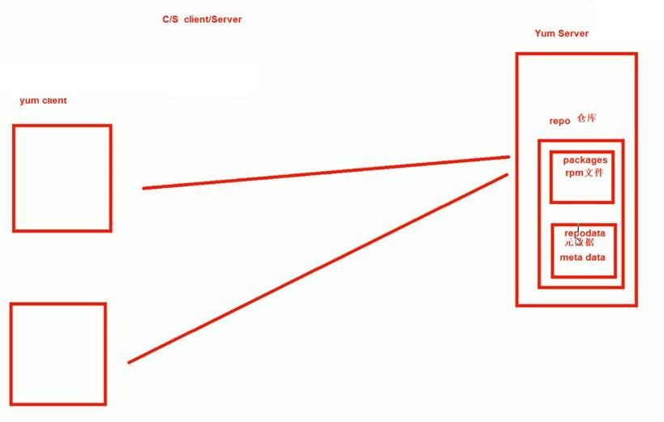

 

 

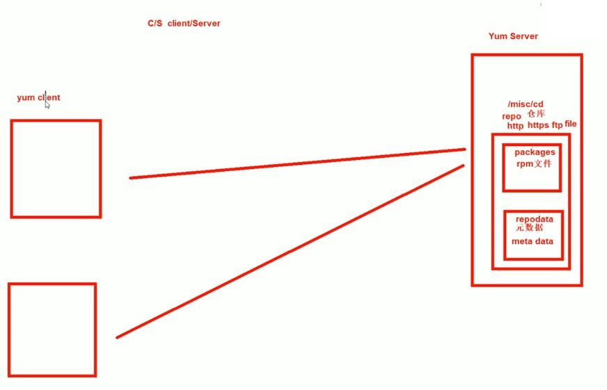

 

客户端要配置config文件

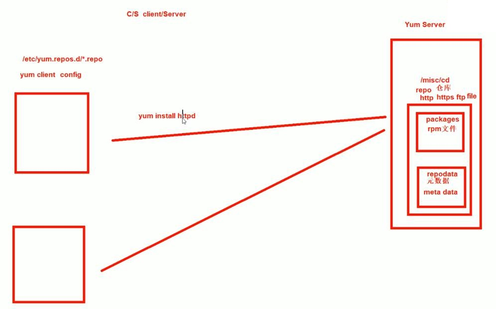

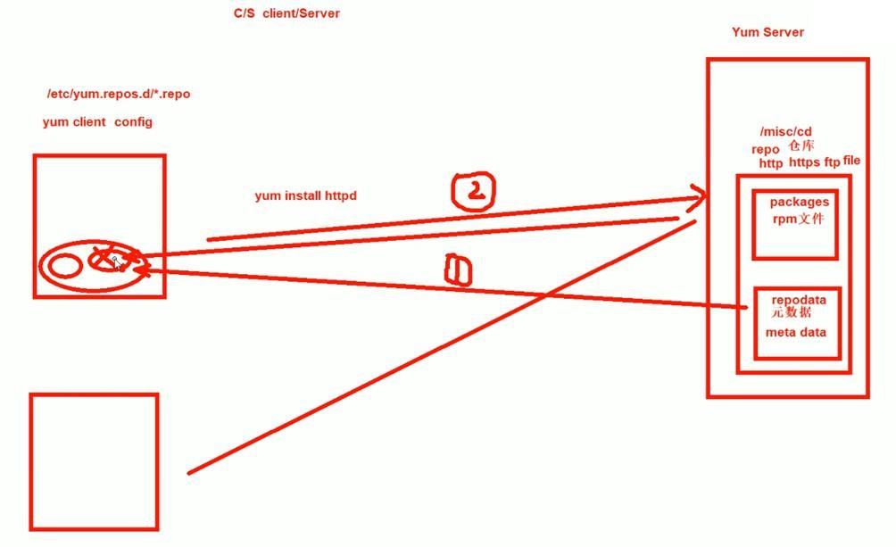

yum install httpd就是：

1、查询本地repo文件，看你配置的仓库

2、按照仓库配置的服务器以及对应的路径就是文件夹， 下载元数据到本地，将这些元数据下载到本地的缓冲区中（所谓缓冲区就是磁盘上的某个文件夹）。 去看元数据。是有httpd包的。而且依赖的包也找到。

3、针对httpd和依赖的包，去服务器上下载rpm包。也要放到一个缓冲区里。

4、安装。。。

5、下载完了的rpm包默认自动删除，而元数据不删。下载的东西有两个：元数据和rpm包。元数据下次就不用再下载了。

 

 

 

 

 

 

 

 

 
