# 第2节. MBR和GPT分区管理


三步：分区、格式化、挂载

## 为啥要分区


分区 隔离数据，系统分区，数据分区，系统坏了，数据不受🦅影响，

分区的格式也可以不同。对于修复来说提高了修复的速度，没必要针对总体硬盘修复了。

### 一个小小重点

日志和DATA要分开来，性能得以优化。不然写日志可能导致东一个扇区西一个扇区，造成了文件的碎片化，将来读取不是太顺畅，性能就不好。这个如果是真的，影响很大的话，确实是个关键点★。

## MBR

所以说，分区对读取速度有帮助的，简单来讲就是分门别类提供效率。


△结合上一章，搞清楚几个问题哦，①8G、2T、16B、32位、CHS这些东西分别说的啥，谁的上限，怎么得来的②同样的MBR里有两台表达方式CHS和LBA，这两个自然存在不同的上限的。上面的32位是LBA表达法用了4个B，所以是32个位也就是2^32来表示扇区的，所以MBR的分区上限是这么来的，当然CHS要小咯。然后CHS是3个字节也就是24位来表达扇区的，自然分区就更小了。

**主要上次提到2^48*512B是在磁盘空间表示上见到的。而这次是分区空间上限表示的计算方法。计算公式一样，但要注意说的不是同一个东西。本质上是一回事，都是多少位来表示多少个扇区，一个说的是分区，一个说的是硬盘。** 你看哦这就是完全错误的理解了，错啦，往下看吧，MBR-如果用LBA它支持的硬盘最大就是2T，如果是CHS，最大硬盘支持的就是8G。不是说的一个分区最大值哦。

```
[root@vpn ~]#echo 2^28*512/1024/1024/1024 |bc
128					👈128G
[root@vpn ~]#
[root@vpn ~]#echo 2^32*512/1024/1024/1024 |bc
2048			👈2T
[root@vpn ~]#
```

进一步总结，那么为什么还有大把的人讲MBR单个分区最大支持2T呢，因为如果你将3T的硬盘划分区MBR的哦，划了2T作为第一个主分区，那么剩下的1T空间就用不了了，就灰掉了，说单个分区最大2T的也对，但是不准确，因为单个分区用掉了整个MBR格式的硬盘的2T上限，所以剩下的空间无法划分了。举例

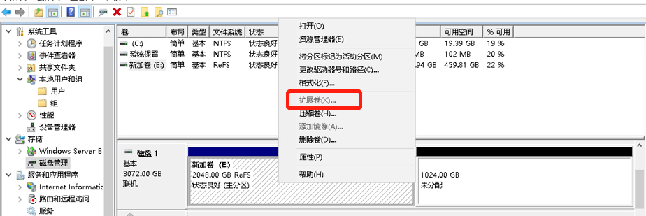


MBR目前依旧是主流的

、

55AA就是标记位。

 

##  MBR分区结构

\--------------------------


这0磁道0扇区的512B，不属于任何分区，既然不属于任何分区就没有任何文件系统，没有文件系统自然就没有文件的概念。

最后标记为就是55aa


-----------------------------


 


四个分区，每个16个字节。

活动和非活动，所谓活动分区，就是计算器启动的时候找80标记的分区，从该分区上找操作系统（引导操作系统的相关文件）。如果有两个80，就找不到了。就启动不了了。


这个磁头、柱面(也就是磁道数track)、扇区都有了也就是CHS定位了起始位置就有了，就是该分区从哪里开始。磁头从1开始，扇区也是从1开始的，因为扇区0就是上图拉，MBR和分区起止位啦。所以8bit的磁头不是256而是255，6bit的扇区不是64个而是63个。

在上图👆中指出8bit的磁头head、10bit的track磁道也就是柱面、以及6bit的扇区的具体位置。


第五个字节为0表示空间未使用。都不是0上图，就是分区都使用了，都分区了。


CHS如图才3个字节，也就是3\*8=24个bit，也就是2^24\*512/1024/1024/1024=8G的空间上限。问这是分区最大值还是所有分区-整块硬盘最大值。就算你不知道直接的答案，使用现有的肯定的知识也能得出来，来，3个字节来表示CHS是吧，假设是表示的单个分区最值，那么3个字节全部设置为1，也就是FF FF FF，好00 00 00-ff ff ff 表示8G一个分区，那么第二分区同样也是00 00 00 - ff ff ff ，第三个 第四个都这样，你觉可能吗，CHS是什么是那张硬盘结构图cylinder磁道也就是柱面，磁头也就是盘面，sector扇区，比如C-H-S值为1111111111-11111111-111111，这个东西是啥就是磁盘上的唯一的个扇形拉扇区对吧，我柱面定了-磁头定了-扇区也定了，东西就一个东西，还能在4个分区里出现4次？！扯淡吧，所以\_____ \_______ \______ 三个字节是4个分区整体计算分配的空间，比如分区1 CHS是1-10,分区2 CHS就是11--20，3就是21-30 ，4就是31- 40这样的。就像你写word里的序号是续的，不是重新编号的，当然我用10 20 30 便于理解，其实是下面这些值👇，同理LBA也是一样，所以LBA的2T上限就是整个磁盘的。


 8个字节是换LBA玩法了。


所以2T也就是MBR的上限了，*“也就是MBR可以表达的一个分区的最大容量”*，这句话也是错的，我上面已经解释过了。

 

 


EBR表达起始位置和下一个EBR的位置，自然就能知道自己的起止位置了。

EBR不固定，是因为扩展分区不固定，第一个EBR不固定，自然后面的EBR都不固定。


但是MBR是固定的，整个硬盘的第0个扇区就是MBR所在，自然是固定的。


 


 


 上图👆最左边一列是偏移地址，也不知道是怎么意思？⚪不管他参考基准是什么，反正对不上号和下图：是什么，是你大爷，看东西不会思考，第三次过的我来告诉一年前的你，

```
以前两行为例：
00000000
00000010
等价于
0000-0010
等价于
0000-001F
也就是2^5=32，也就是32个B字节，你数数前两行是不是32个字节，中间段是不是8*4=32个。
所以下图的红框就是位置，就是上图的位置，只不过下图统一用10 20 30 F0来表示，人家就是行开头了，
比如00000000-00000010，就是0000-0010，就是0000、0001、0002、0003、... 000F、0010就是2^4=16就是一行16给字节咯。
这个在MBR分区结构里也有小字表示的见下下图
```


上图的Error就是出错信息数据区。

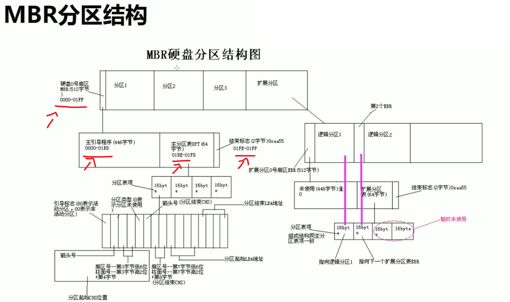


================

## 备份分区表

需求来了，分区表的备份。emm，如果分区没了，上面的数据也没办法读取了。所以分区也有必要备份一下。

如果全公司的硬盘都是一个分区方法，基本也无需备份了。有一个导出分区表就行了。


也可以把这个512字节都拷贝出来

现在只备份这个64B的分区表，因为不是文件 所以cp拷不了，所以用dd把二进制读出来。


 


###  看二进制的方法来了：od、xxd、hexdump


##  举例，删除分区表-不是删除分区


 


就是把最后的标识位清了，但是skip用的有问题，skip是跳的if的设备，跳of=/dev/sda设备，要使用seek。


### fdisk和lsblk的区别来了-一个看的硬盘上的，一个看的是内存中的


一旦重启，内存中的分区表就没了，硬盘里的分区早就没了，重启就起不来了。

当前真正生效的还是内存中的数据（分区表）

 

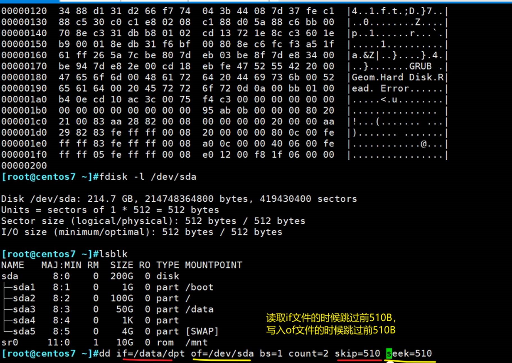

ps：不管你skip510还是seek510，skipxxxx要得到的是/data/dpt里的55aa，显然dpt只有66B，skip写错了，下面改过来了。


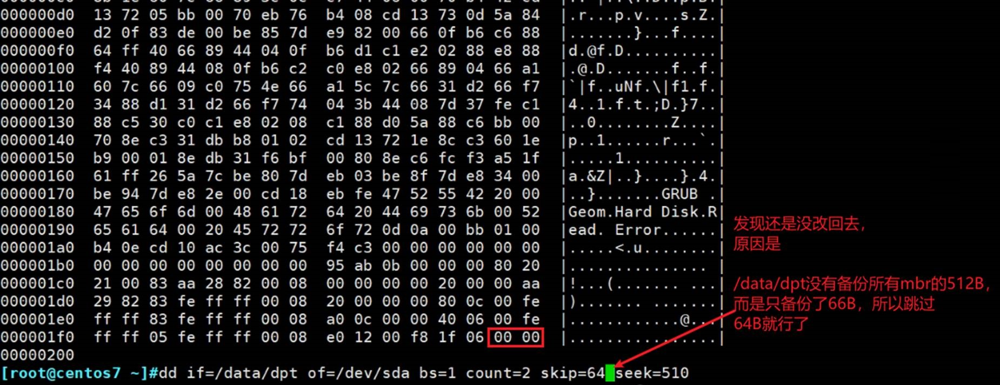


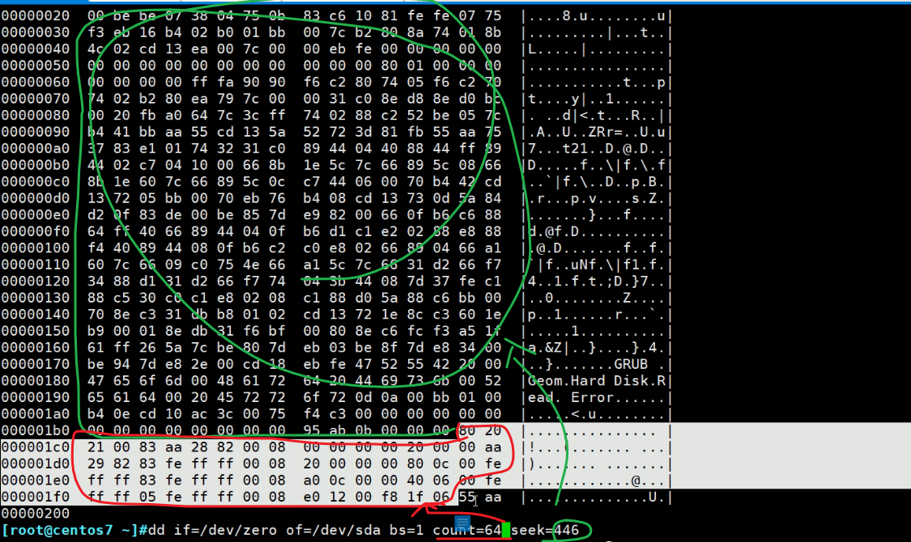  

这样就恢复了55aa标记位

## 举例-破坏分区表-保留了标志位

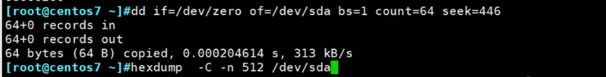 


有些是0，就给你用*省略了，不显示了，详细看的就加参数


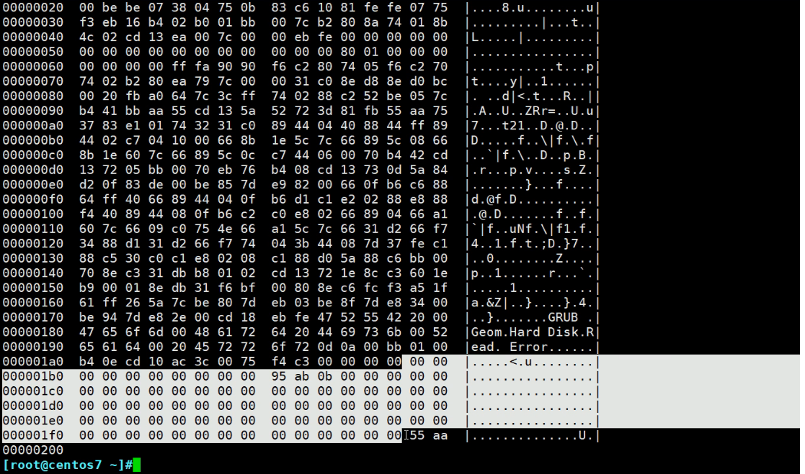 

因为标志位55aa还在，所以还有个分区标题


虽然fdisk有这些磁盘标题Device Boot Start End Bloks Id System，但是没有东西，因为分区表清零了

系统判定有55aa标识位，觉得有分区，但是又不知道分区的起始结束位置。

**此时重启，就起不来了**，不重启是可以的，因为当前分区表是用的内存中的，也是说分区表还有的。救援模式来恢复可以吗？刚才的备份数据在/data里，但是分区没了/data个毛啊。

所以要备份一定要scp到远程主机上。当然如果你有可以用两块硬盘，分区破坏了一块，可以从另一块硬盘上手动挂载后获取分区备份（加入你的备份在那块上）。


重启模拟故障处理，重启之前先把分区表备份到远端机器上。

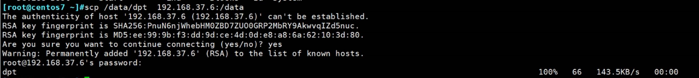 

 

 


提示没有找到分区了


进入救援模式，硬盘起不来，光盘起。


 


如果硬盘分区还在，就会看到挂载到mnt/sys里面的，由于我们之前将硬盘的分区删了，所以这里自然也看不到了。

但是好像救援模式没有网络，你的分区备份还在远端主机上呢，


可以拿U盘，其实还可以临时配个IP地址的


这就就完成了救援模式下的scp


同时你要知道，此时是光盘加载的，数据拷贝过来都是放在**内存里**的，**重启就没了**。


上图👆注意 ：sdb、sdc、sdd都不管，是刚才加的。

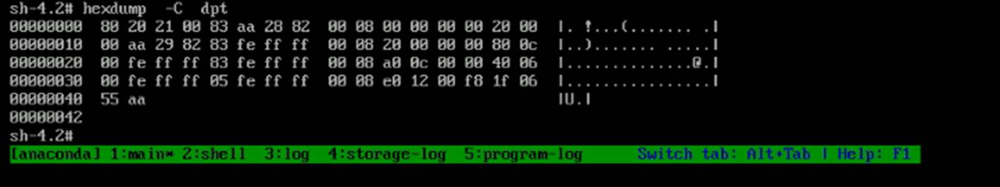

再看下a硬盘


上图是看了全部了，下面只看前512一个扇区的内容


55aa前面的64确实是空的（注意中间*省略了，其实是64B的0）。


写硬盘的话：工作原理，是把内存的数据先放到缓冲区里，**过一会**再放到硬盘里。

dd 命令你看到提示ok了，但其实还在缓冲区里呢。你立马重启缓冲区内容就清了，此时就造成了数据写失败。所以不能捉急。

手动sync同步一下：多次sync就是担心sync没有立马执行。还是要等等。


 


此时硬盘已经还原，系统已经能识别了--系统就是装在硬盘里的，能识别自然就说明硬盘分区恢复了。

 


 

 

 


dpt  disk partition table

========================================================

 


实际上整个硬盘都不能超过2T，不是说分区不能超过2T。超过MBR就没办法了。为啥，分区表里的的bit位算出来的不是针对单个分区的，为啥说是整个硬盘呢。你再看下原来的图


他那个4字节“分区起始LBA”里填写的是起始和结束位，结束位本身就是2^32*512B=2T的上限，2^32个bit位用来多次表达分区起始位置，所以怎么算整体的表达能力就是2T空间。这个好理解，我们拿两个bit位类比来表示空间，00-01,01-10,10-11,11-00，没了，是不是一共也就会2^4个分段。它是续接的，不是每次都重新编号的。

 

 


 

每块硬盘可以有独立的分区格式，下面一块就是MBR


 


▲面试题有了：问：windows硬盘分区底色是绿色是啥情况？哈哈哈，气死人不偿命~

变色，就是自动将第4个分到一个扩展分区里面了，然后自动创建了一个逻辑分区。


删除里面的逻辑卷

、

 


这就是扩展分区划分逻辑分区

 

 

再说会GPT分区

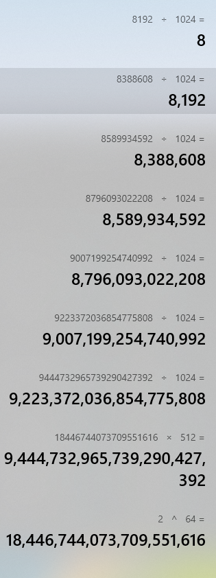


UUID是国际标准，微软发布的GUID属于UUID的具体实现。


UUID后面写的是16进制。128bit，就是32个16进制。

IPv6也是128位，这个UUID也是128位。

```
题外话：
[14:54:45 root@pyConsole ~]#cat /etc/fstab  | grep UUID |cut -d "=" -f 2 | cut -d " " -f1 |cut -d "$" -f1 |cat -A
07507cea-e91c-42ff-9cc9-ca3eb61212f0$
[14:54:48 root@pyConsole ~]#cat /etc/fstab  | grep UUID |cut -d "=" -f 2 | cut -d " " -f1 |wc -c
37

wc这个算字符是把最后的$也算上去了哦，我输过了是36个~对输过了，要赢回来的
```

UUID生成工具uuidgen,▲各种生成工具可以整一波~


 

 


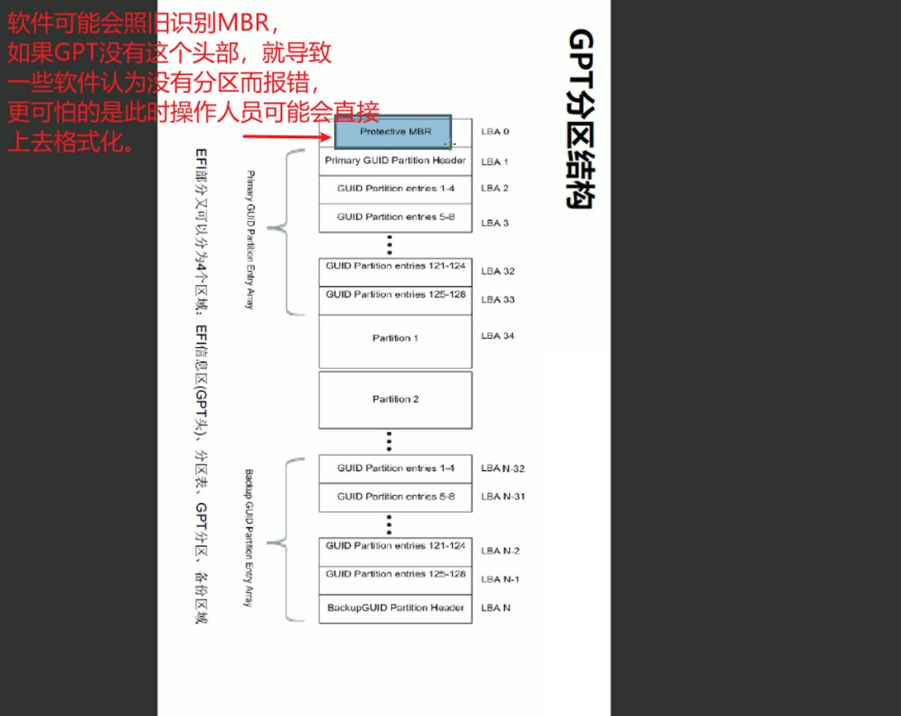

Protective MBR完全是保护后续的GPT分区信息的。


 👆一组4个分区的定界信息。


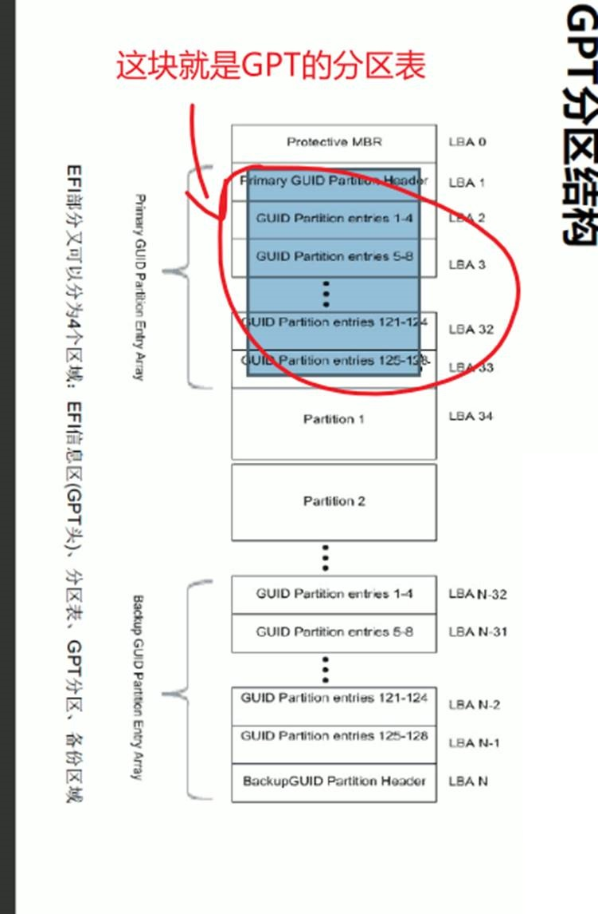     

Partitioin Header头部和分区表 都 有备份

 

 

 

早期的BIOS启动的蓝色界面操作，现在不是这个颜色了，到后面的支持鼠标操作的启动界面


固件接口，

否则BIOS不支持GPT分区作为引导操作系统的

UEFI启动就得配合GPT分区。


## BIOS+MBR与UEFI+GPT

这样的，BIOS启动，UEFI启动，这两个启动，启动的时候要引导操作系统的，①而引导如果安装在GPT，就只能用UEFI启动；②BIOS启动的只能MBR分区方式里的引导。③BIOS可以使用GPT分区，只是用来存放数据而不是OS，这个其实是搞笑的说法，因为BIOS通过MBR分区里的引导操作系统启动后，然后就是通过windows/linux操作系统来识别GPT，从而达到在GPT分区中存放数据的效果。

启动的时候只能靠BIOS和UEFI本身去引导操作系统的。


虽然UEFI也支持MBR，但是没有意义了，UEFI虽然支持MBR启动，但必须要有UEFI引导文件存放在FAT分区下；UEFI是无法使用传统MBR引导来启动系统的。

你要把操作系统装在GPT上，就有要硬件的UEFI支持（就是新的硬件已经不用BIOS咯）才能启动。

 常用的BIOS+MBR分区里安装系统+另一块硬盘GPT来支持超过2T的空间。这个可以有，不过直接UEFI+GPT不更香么。这是家庭电脑才需一块磁盘超过2T吧，工作中一般来讲服务器-装软件用不了多大空间，而大数据的话用mysql-mysql本身达到T级别早就分库了--拆成好几份，每个机器上放点。也不需要单硬盘超过2T的场景吧。

 

## 开始搞命令：lsbk这些cli


 


lsblk（list block） 在centos 6 和 7上都可以用。


 👆就是5的util-linux这个工具集咯应该，里面不带lsblk软件，6\7 带的。


###  man fdisk👇


 👆man 可见fdisk就是不支持gpt分区的，所以生产中肯定不行的。

### man下gdisk👇


###  man parted👇


parted工具 分区时即时生效的 操作时要小心，很容易因误操作把你的分区表破坏了就。

partprobe同步的问题，后面再说。

 

## parted使用要小心

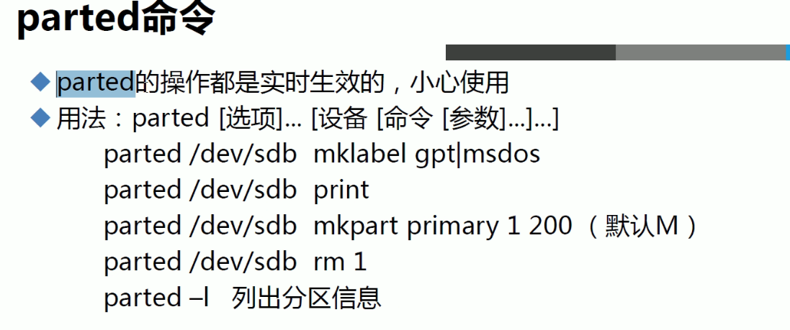


### fdisk查看分区，了解什么字眼代表什么分区


 


 


当前硬盘里啥都没有，所以也不存在什么446B的bootloder


这条命令就是创建个GPT，就是说这个盘是GPT格式的了。下面可以继续用GPT的命令进行分区了。

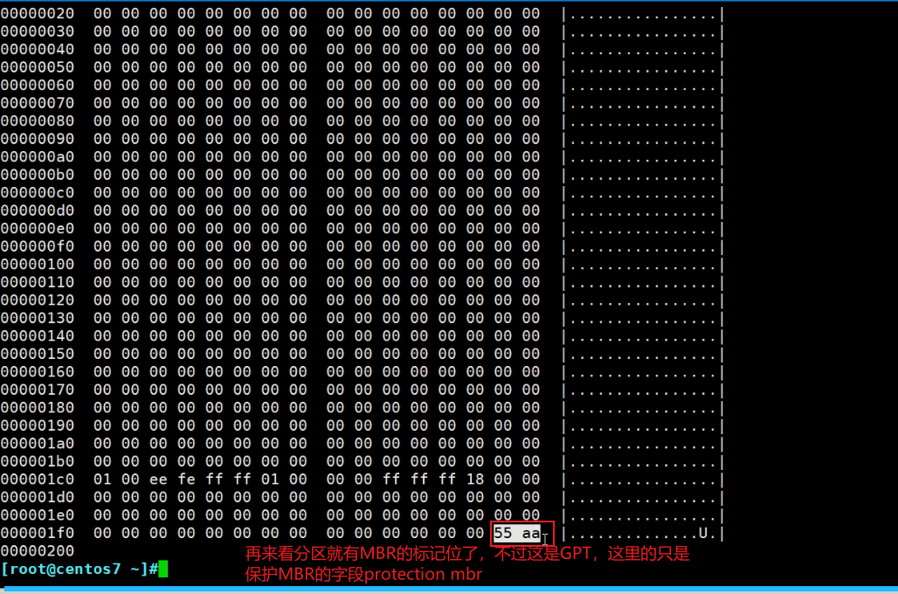

这是个假的MBR，呵呵

 


 


打印分区表


 


上图单位M是MB


 


 


 


 


 


### 所以可见分区必须是连续空间。

 


虽然删干净了，但是还是认为有分区表，因为protection mbr的分区标识位55aa还在


 


你这个512B看的是protectionMBR字段内容，是不包括GPT分区表信息的


 


上图也看到了UEFI PART。


 

下面重点看fdisk和gdisk

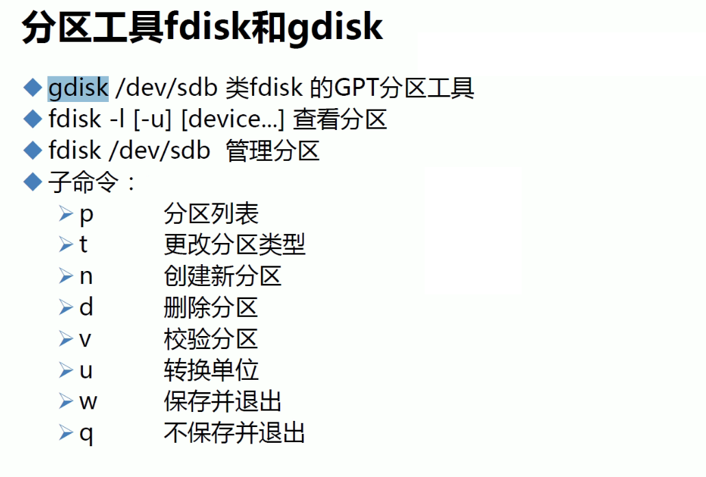

 

 
