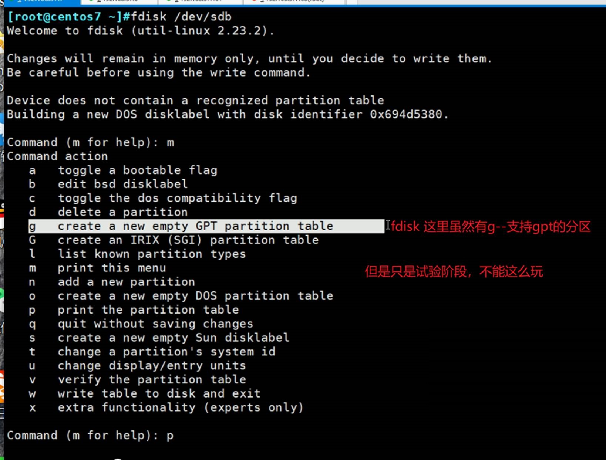
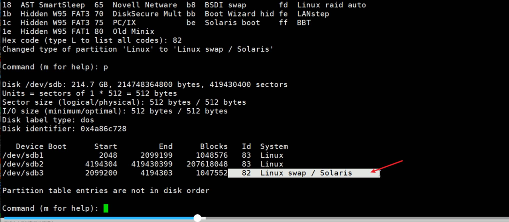
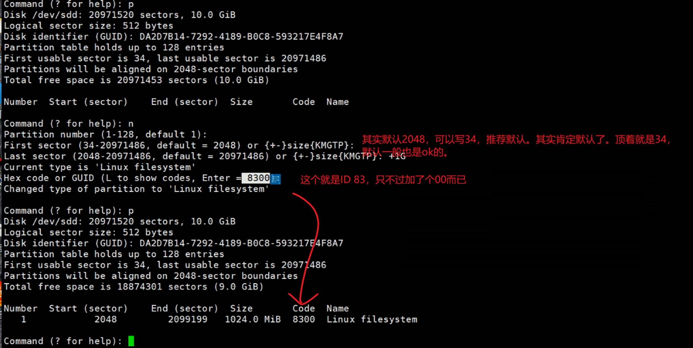
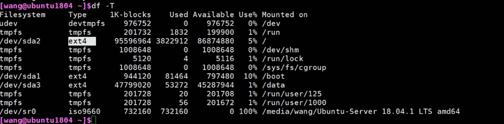

# 第3节. MBR和GPT分区管理工具详解

fdisk和gdisk基本一样，

上图说明虽然分区删了，但是分区的类型还在（protection MBR里的55aa还在，可以通过dd将整个b硬盘的512B清空，这里B盘就啥信息也没有了）。

 

此时就是没有任何信息的硬盘了，初始接进来的硬盘就是这样显示的了。

这个时候就可以用一些工具对其重新管理（比如分区）。

保存退出，没有做任何设置

 

扩展分区是5，swap82，主分区是83

默认都是83，将来可能根据实际情况修改ID

只是一个标签，并不是功能性的强制标识。

 

 

就是说当前0个主分区，0个扩展分区，4个都是空闲的。

如上图，可以直接划分e扩展分区，从2开始，也不一定非要从1开始。

划分之后一个p就能看到当前划分的结果

上图是以扇区起始位置标记的，再一个就是ID是5，就是扩展分区的标识。

而且上图观察p和l，以前是p和e，其实就是说扩展分区就一个嘛，然后都是在其上划分逻辑分区了。

注意上体逻辑分区是从扩展分区的4096个扇区开始而不是2048个扇区开始的，所以你要知道每个逻辑分区的头部还有一个EBR字段里面都是本段分区的元数据来着。

逻辑分区也是ID85，

### 上图就说明一个问题，逻辑分区的设备名是不稳定的。

你将来设备名你写到磁盘配置文件里面，你后来分区调了一下，很可能分区名就变了。

所以逻辑分区不适合写到配置文件里。

这就需要找一个不变的东西来应对。后面会讲到。

 

同时上图带来的问题就是，如下图：

 

这才2G的最大空间，所以超出了，注意2G是扇区相减后乘以512B可得出。

 

 

下面修改一下分区ID

L是你记不住了就看下ID有哪些可以选择的。

关注上图的82 83 8e 

fd是软raid

还有一些淘汰的技术

 

上图是修改分区id之前的sdb3的id为83

下图是修改为82

 

 

此时还未存盘退出(w)，此时是否真的分区成功了没？👇

###  3种看分区的方法

上面4个方法都是没看到b硬盘上有分区的。

然后w存盘退出后，再观察

硬盘里的分区表和内存里的分区表并不是时时同步的，也就是说fdisk 分区的时候，w保存退出后并不是时时同步的。很多时候硬盘上的分区表分好了，但是内存中的没有。

 

 

==========================

centos6，以柱面为分区单位的，一个柱面8M

观察上面WARING，告诉你reboot后就同步了、partprobe或kpartx也行。

此时centos6的磁盘确实分区了，但是内存中同步不了。

 

不跟选项，但是要跟同步的设备哦

**上图就是centos6的bug命令，不好使。记住了！！！partporbe在centos5和7上都可以，就是在centos6上不行。**

可以kpartx，或者只直接partx

其实centos8是有-h的

 

报警error不用管，就看结果对不对-sda6出没出来就行了

### 上面partx -a是添加分区同步，删除分区同步用-d

但是内存里还在

 

====================================

centos7也同样出现了waring

 

\------------------------------------------------

但实际效果应该是没有的，即使partprobe同步了。

虽然对分区再分区，且同步了，但是最终还是看不到的。

 

 

\----------------------------------------------------

需求：将B硬盘分区分的和A一样

思路：复制A的分区表就行了。

操作：不就是A的那个64字节么，扣出来复制到B那边就行了。

所以克隆只能克隆主分区和扩展分区。但是没有办法克隆逻辑分区，因为512B里的64B是MBR，而逻辑分区是EBR是再扩展分区里的。

1、克隆的目标硬盘空间要大于等于原硬盘；

2、无法克隆逻辑分区，只能克隆主分区和扩展分区。

不过怎么看图上EBR也是可以克隆的啊。估计就是EBR比较多分散，MBR固定好操作。EBR还要计算。

 

 

再来，B硬盘和A硬盘一样大，此时克隆MBR就很OK了。

EBR的位置不在MBR那边，你克的是512的MBR里的64B，EBR在后面的扩展分区里面的EBR头

这个就是永久保存了，不存在再write，w写的动作了。

 

========================================

## gdisk 主要用来分GPT格式的区

都是和fdisk一样的

 

82\8e这些都在

 

分区太多了，清一下，fdisk肯定可以清，就是太慢了

这么记笔记太慢了，体会不到学习的乐趣和快感！，，，i need fly，时隔1年，no u need 跬步

上图hexdump -C -n 512 /dev/sdb -v加个v就能看全部的0，上图默认是省略连续的0了。

不过为啥中间有28 c7 86 4a这几个值，而且我的centos 8 的情况也不符合这里所讲的，但是肯定centos8是使用正常的，那是因为我sb了，因为下图看错了，应该是sda而不是sda1。

 

如果把数据放在硬盘的磁道的外圈，速度读取和写入就快，如果是内圈就慢。所以再看看内外圈。

如果是centos-6的话就很清楚，本身有柱面，数字越小就越在外圈。越往里数字越大。

所以分区划分编号越小数字越快。6和7就是偏内圆了。

如果你希望数据读取快点，就将数据放到前面的分区。能提高个百分之几就不错了。

 

 

sda6里面全是0，你把数据放进去也只能0101往外读，因为还它没有文件概念。

创建完文件系统才有文件的概念，目录、属性、分门别类这些东西才会有。

 

注意力，持续

不同的文件系统除了必备的功能-文件管理功能，有的可能还有一些额外的功能。比如，NTFS除了文件管理，还有加密、

这就是windows的NTFS加密，只要看到 "安全"选项 就是NTFS系统

右键-属性-高级-加密就行了。

这是对别人是打不开的，而本人是无需的还是正常操作，没有影响（打开时自动解密，保存的时候自动解密）。

ext\xf系统的没有这个额外的加密功能。

但是基本的管理文件功能必然都是有的。

对于linux 来说 xfx 、 ext 文件系统：

linux支持的文件系统👇

当然也可以

这是目前linux里支持的文件系统类型。

 

 

### 在centos6上都是ext的

### ubuntu用的也是ext

centos 7用了个xfs，而ubuntu用的是ext4

 

ext1没有存在感，ext2存在重大bug，容易奔溃无法恢复，所以后来有了ext3

ext3的日志出现的优点：当系统写数据之前是先写日志的，日志一定是先于数据写，写好日志信息以后再把日志信息同步到磁盘里去，好处就是：

①万一日志写完了，还没来得及存盘，系统突然奔溃没关系有日志可以还原。②如果写日志的时候突然奔溃了，没关系，日志大不了不用了，数据又没破坏。

 

读取文件，内存中修改，写到日志里，再写到磁盘里。

如果③和④中间断电，系统起来后，磁盘同步日志就好了。

如果③没完成，大不了日志丢了，数据还是完整的。大不了没更新嘛。

但是要注意，如果②没写完，写了30%假如断电了，那么日志里是有30%更新的，而系统后面起来后，磁盘同步日志，那么还是有70%数据没写进去的。

ext3的问题，性能问题在大磁盘中得到凸显，大磁盘T级别的比如，健康检查耗时达数小时之久。

为了解决这个 问题就推出了ext4，相对于ext3性能得到了巨大提升。以前小时级别的，现在分钟级别了就。

但是ext4支持的文件大小有局限性。家庭都是T级别了，生成中高达P级别。

于是xfs文件系统更大了，性能更高，但是linux上单一文件不会超出ext4的局限是，所以unbuntu上还是继续使用的ext4。

 

插入，在生成中拷贝大量数据时要限速，否则后果兜不住！找个空闲的时候，加上限速复制就差不多了。

上图的btrfs

xfs：SGI是老牌的UNIX的厂家。早期的大片泰坦尼克号就是用SGI工作站做的。

btrfs是oracle的号称很优秀的文件系统。centos7上有不过是测试阶段，centos8就不在支持了，该文件系统就没有流行起来。

jfs在AIX小机上用的文件系统。

swap 和 iso9660光盘

FAT12是软盘，

这些是windows的文件系统。

exFAT是U盘的文件系统

U盘右键格式化的时候可以看到

refs是新的了看来

 

除了上面的单机的文件系统，还有网络文件系统

还有

还有就是分了区但是没有创建文件系统的情况，就是RAW。空文件系统、裸的文件系统。oracle，为了高性能，把数据库的data直接放到RAW上，就是0101010没有文件系统直接存盘，利用oracle自家软件直接利用010101去访问磁盘，由于中间没有文件系统这层，所以读取速度更快，缺点就是没有文件系统，如果oracle软件出问题，运维管理是个麻烦。

