# 第5节. 文件系统挂载


## 挂载的理解


```
一些相关信息梳理 
sda是硬盘123是分区号。

1、硬盘格式化也就是创建了文件系统xfs\ext4之类的之后，就需要挂载了，这里的挂载应该是带着各自独立的文件系统和VFS打交道了吧，反正硬盘空间还需要挂载到文件系统上，

2、/dev/sda1挂载到了/根上后，根下的所有当前存在的文件会在/dev/sda1里看到么？我们知道安装系统的时候根是挂载到剩余分区

https://www.linuxidc.com/Linux/2019-04/158216.htm

10.4.2.95的前2个盘位各装2块固态硬盘做RAID1，最小化安装CentOS7.9，分区biosboot 2M , /boot 500M,剩余分区/  。


```

一旦把data文件夹挂载到sda2后，在data里创建的文件都会出现在sda2中。


1、一开始是data挂载到sda2里，并创建了一个/dir/f2.txt文件

2、然后再将dir挂载到sda3里，这个时候进到dir文件夹实际上就是看到的是sda3分区，

之前的f2.txt文件还在sda2分区里，所以现在挂载到sda3下了，所以就看不到f2.txt文件了。


如果再将sda2挂载到/home目录下后，就又可以通过/home看到f2.txt文件了，而且还看到dir文件夹，一旦进入该文件夹，就等于进入了sda3分区。所以从/home也是可以一路顺下来到dir里的。同样"/根下面的放的都是一级目录" 说的就是这个道理，因为很多一级目录都是自己另立门户的。


一种理论上的循环挂载


sda2挂载到/home文件夹，sda3挂载到home下的wang文件夹，sda3挂载到wang下的dir

这样，进入到/home就看到sda2里的wang，进入wang，就看到sda3上的dir，然后dir再挂载到sda1，于是进入dir就看到了sda1上的/home，如此就完成了理论上的循环，linux不允许，windows时可以实现这个效果的。

就是D盘挂D:\test文件夹，然后循环点击效果看看


右键更改挂载点


继续点，层级还会增加


数一下多个层

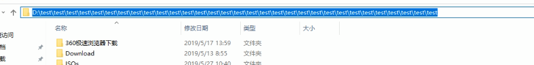

复制到linux里然后grep一下


31个层级就是循环挂载后的 套娃上限。


## 挂载操作


umount 直接跟设备就行了


这种挂载重启后就丢了


### 挂载选项-只读挂载


此时就👇


重新挂载成rw读写，没必要unmount 在mount，可以用命令mount -o remount,rw ，它不是真的取消挂载。效果上是重新挂载，但并不是取消挂载的。


来了，一般分区可以取消挂载unmount再mount挂载，而/根不能unmount。

### 根/ 不支持unmount，但是可以remount。


因为/根要是取消了，/proc这些内存中的东西不也都是在/根下面嘛，如果根取消，那么内存的东西也就没有FS支持，也就看不到了，也许当前操作界面都没了。

此时重点来了，如果/根要修改挂载属性，就得用remount命令，所以remount可不是真正意义上的先unmount在mount。


### 和挂载密切相关的文件mtab


该文件就是显示的当前挂载情况


这个文件貌似/etc/下面的，而/etc/下面一般是配置文件，一般莱昂配置文件固定不动得，但是该文件确实实时和当前的挂载信息保持一致的，通过ll /etc/mount可见其实是proc内存文件里的软连接👇--这话不对，centos7上是软连接，而centos6上就是普通文件


mtab是实时挂载信息文件，而fstab是实现自动挂载autofs的配置文件？没错吧

### 挂载推荐使用UUID设备名来挂载

起个卷标


此时可以通过卷标来挂载


上图注意-L /mnt/sdb1是起的个卷标名 故意和文件夹/mnt/sdb1同名的。

使用UUID挂载


写到配置文件需要使用UUID，即时性的cli还是不会写UUID，而是写名字就行了。

### 伪文件系统


上图其实是共享内存等内存信息。

这些不用管，都是自动挂载。


### 一个设备能否挂载到不同的文件夹(挂载点)

**可以**，将已经挂载的sda7，再次同时挂载到dir1和dir2文件夹下，此时dir1下创建的文件，dir2同样可见。


但是一个挂载点也就是文件夹，只能同时挂载一个设备


存在分区被顶掉和被顶掉的回来的这个一个逻辑。


注意上面几张图是连起来的，中间没有任何其他操作，所以此时/dev/sda7不仅仅挂到了/mnt/dir1上，还同时挂载/mnt/dir2上呢。


### 被隐藏的文件

①本来/mnt/dir1/sda7/sda7.txt是存放在/dev/sda7分区的，②现在将/mnt/dir1/sda7文件夹挂载设备/dev/sda1。此时/mnt/dir1/sda7文件夹下面显示的就是/dev/sda1分区的内容，所以原来的sda7.txt不可见。理解思路，相当于只要你进到/mnt/dir1/sda7想看sda7.txt文件时不可能的，因为一进来就到了另一个分区了。

该文件就永远无法访问，除非取消挂载一次，恢复到前一次的挂载。所以当前该文件就变成了无法访问，但是又占着磁盘空间，于是就成了垃圾文件了。呵呵不一定，也行人家的私密文件呢，哈哈


**方法论：挂载点也就是文件夹，一定要是个干净的空文件夹**▲

这里有个问题，你不图形化，后面不能一下子记住，还是会忘记。

要找一个生活中的场景：有了，房子有多扇门，多个门能进入同一个房子，但是一扇门不能进入2间房子。房子就是设备\分区-用来存放东西，门就是挂载点文件夹-只是个入口。


## 其他挂载选项


一般不用写挂载的文件系统类型，mount会自动判断分区设备的文件系统类型，会自动补上-t vsftype选项的


这个时候写不如不写，就和上一节的fsck修复文件系统会自动发现是什么格式的。▲

上一节竟然将重要索引字段写在了图片里，不利于搜索，以后图片上面尽量别写字。


默认就是可读可写的，所以一般也不用加这些选项。


加上-n选项就不会自动更新了


实际上确实挂上了，但是mnt里没有，所以df 也看不到


### 这个可以理解成隐藏挂载

mount、df都看不到

有个地方全都看得到，就是内存里，但是centos7下没有这个-n功能，因为7里面的/etc/mnt就是/proc/mounts内容，所以你-n在centos7下没有意义。哈哈


**-a 和fstab有关，后面再说**


### 一般是设备往文件夹上挂载，还支持 文件夹 往文件夹上挂，

mount -B /boot /mnt/boot

要求文件夹得是个块设备

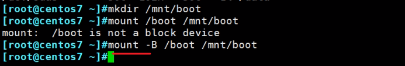


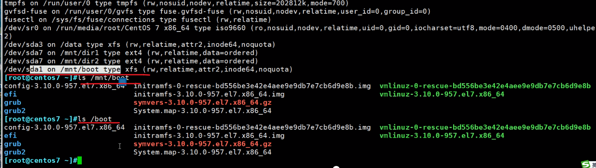

解决了硬连接不支持文件夹的问题。莫名其妙的，用软连接不行吗。


### 也支持 文件 往文件夹上挂

要求文件必须符合一定的文件系统要求

前面都是针对分区做格式化 也就是做成ext4\xfs之类的，现在找一个大文件来弄

1、生成一个文件/data/disk

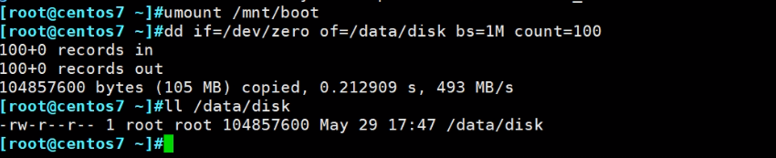

2、针对该文件创建文件系统

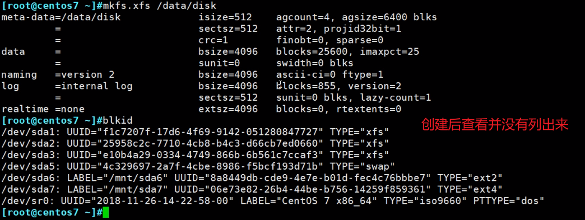

直接查看确实有的

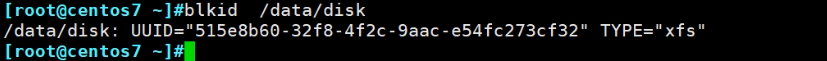

这个disk文件上面就有了文件系统，既然有文件系统，就可以和分区一样挂载到文件夹里

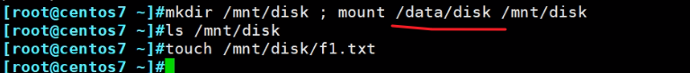

挂上后的显示效果不太符合预期

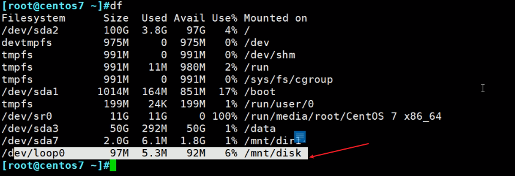

PS：在系统中，本身挂载时不允许 一个非设备(分区自然算设备的)往文件夹上挂的。现在时文件往文件夹上挂，就分配了一个loop0环回设备，用loop0设备和文件关联，然后再用loop0设备往文件夹上挂载，这样就间接实现了文件往文件夹上挂载的结果。这一点在centos6上需要手动加选项来实现loop设备的分配

然后再看下centos6上面的情况

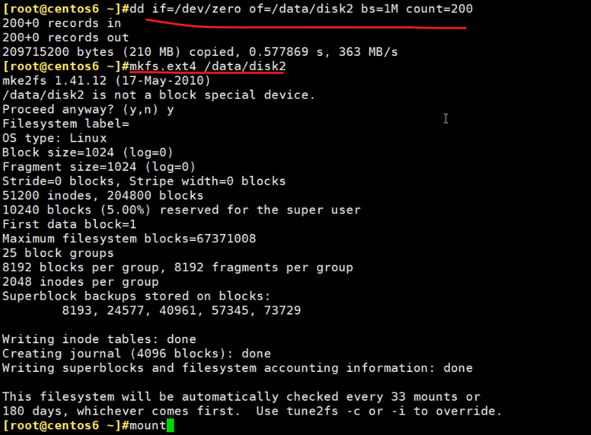

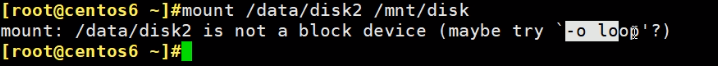

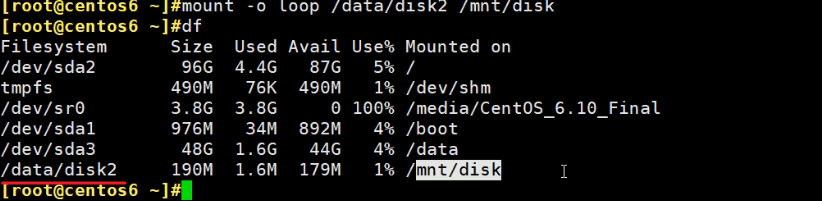

centos6直接显示的就是/data/disk2文件，而不是loop设备。7是不需要手动指定，显示的是loop设备。

可以通过losetup -a查看分配的到底是loop几？

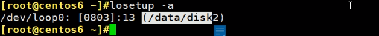

loop的个数，centos6最多支持8个文件挂载，7没有这个限制

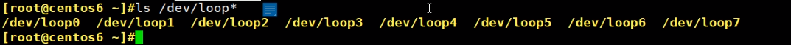

centos7是自动生成的。/dev/loop0就是自动生成的

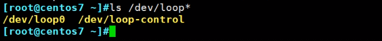

如果centos6的loop设备消耗光了，也有办法，mknod自己创建就行

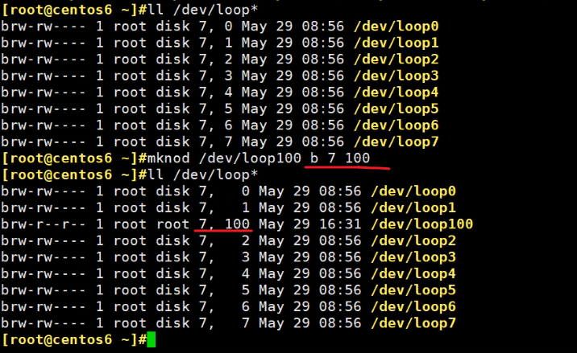

7 100是设备编号类型

b是块设备

上面是命令手动添加，可以修改内核实现开机即得

 

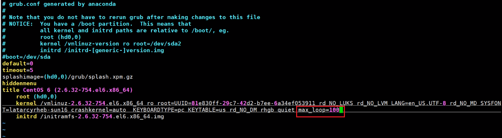

重启就会得到100loop设备，centos7用不着这样

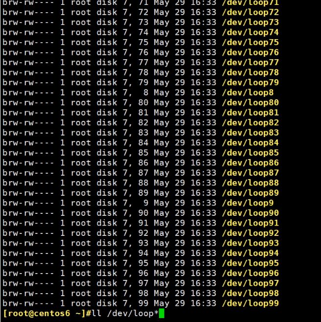


进一步 实现人工指定loop几，而不是自动分配，  题外话，我不知道为啥老师要将这么久loop，有毛用啊？

上面重启过了，所以之前mount的应该丢了，就不需要unmount了

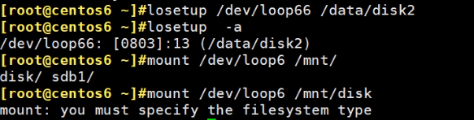

上图报错，排查下,loop写错了是66不是6

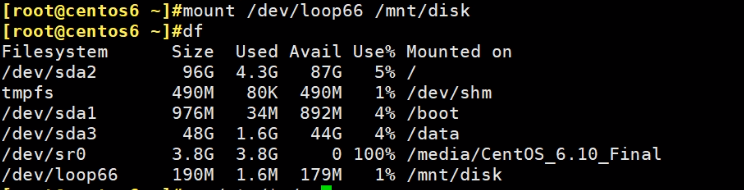

拷点文件过来


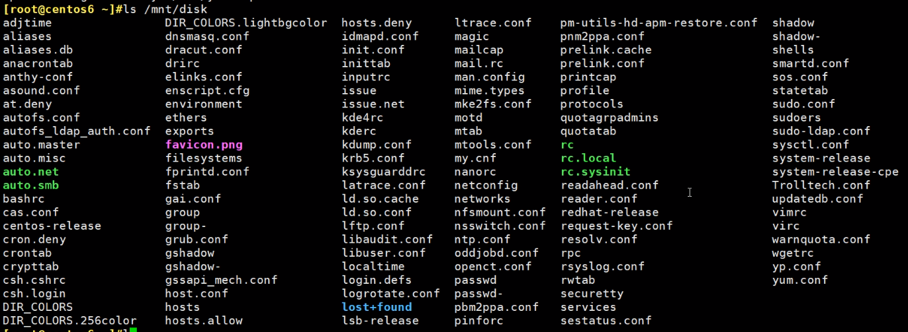

然后unmount后复制到其他机器，去挂载查看文件

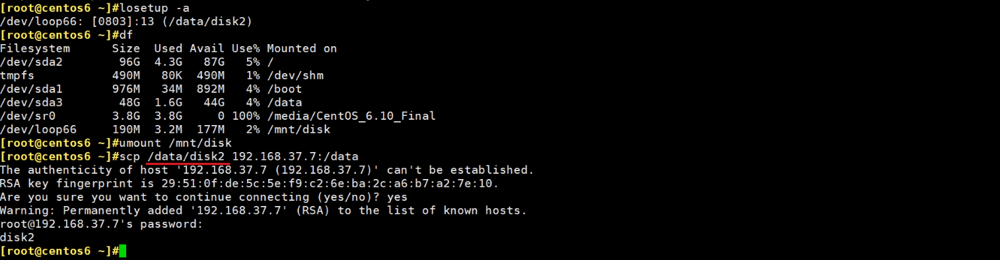

然后到192.168.37.7上去

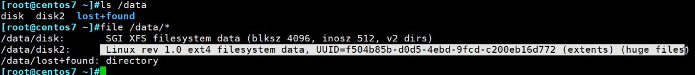

告诉你了，上面有ext4的文件系统


相当于U盘了，不过要这么麻烦么，直接复制不香吗？哦，具有一定的隐藏效果，别人打不开这个/data/disk2，也不知道怎么看，你一挂载就可以看了。

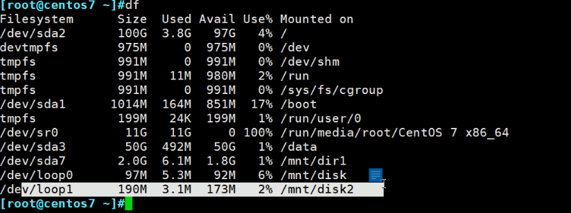


mount 选项复习

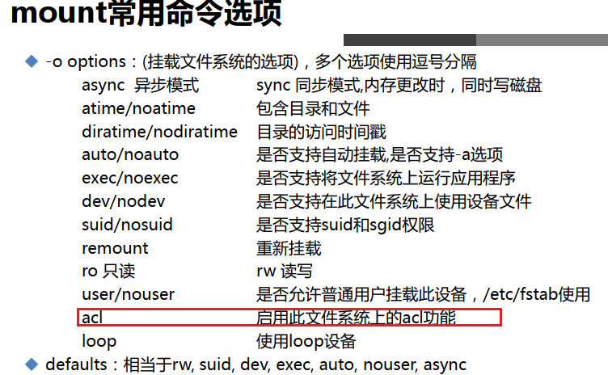


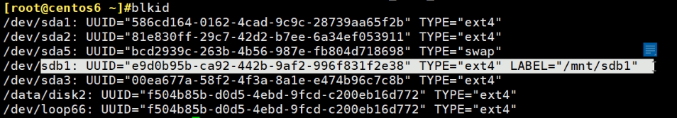

通过tun2efs -l /dev/sdb1看下当前分区有没有支持默认acl的挂载功能


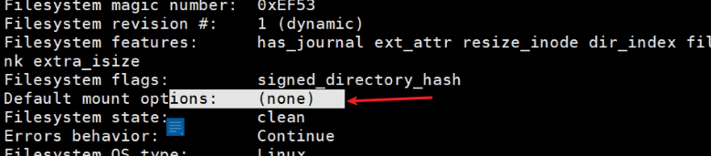

挂载后，复制文件过去

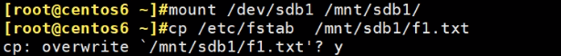

可见centos6默认是不支持facl的

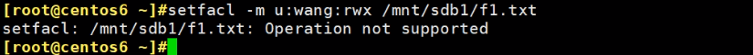

两种方法上一节也讲过，①就是修改文件系统的挂载属性，②就是这里的mount -o带上acl

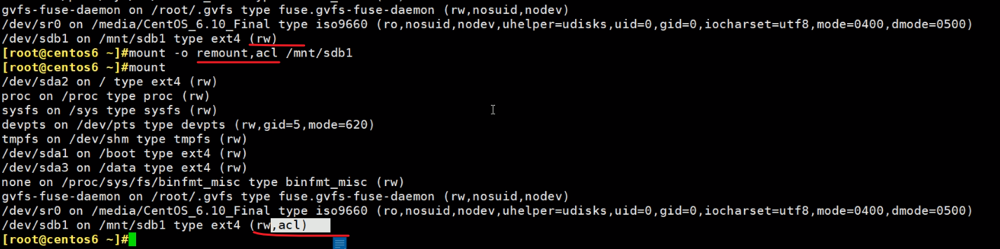

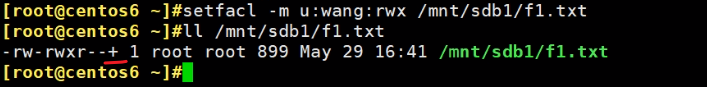

取消acl的也是用mount -o remount,noacl /mnt/sdb1

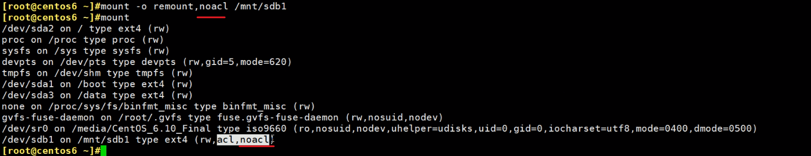

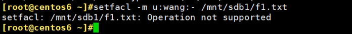


这个和fstab有关，稍后再说


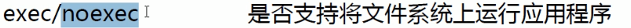 

这是，设备(分区)里面的执行文件能否执行。


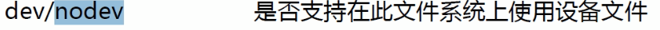 


 

这个厉害的，挂U盘的时候，▲如果U盘里放一个带有suid的vim二进制执行文件，然后拷进去，这样就很危险了，相当于继承了管理员权限了。 此时考虑安全，所以挂载U盘都是就要mount -o nosuid

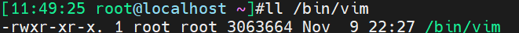 


其他：

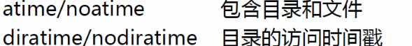 


同步，就是立即写磁盘，内存改了磁盘也改了。异步就是放到缓冲区里等会再写到磁盘里。

异步 速度快，因为对于程序来讲 放到缓冲区里就算存储就结束了。这时候如果掉电就GG了

同步 更可靠些，速度慢点。


mount 后面的选项啥也不跟就等于：


以上都是临时性挂载，稍后介绍持久性挂载。


fdisk

gdisk

parted

partx

partprobe

e2fsck

e2label

blkid

dumpe2fs

mkfs.xxx

mkfs

mke2fs

mknod

tune2fs

xfs_info

xfs_repair

losetup

findmnt

uuidgen
