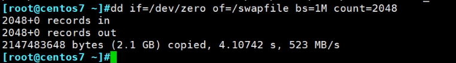

# 第6节. 持久挂载实战故障排错和swap空间管理


如果是别的终端，或者是别的app使用了该分区，就同样无法unmount

wall 广播通知功能，也只能通知到登入用户，那些不登入的应用是无法收到wall通知的。


wall没啥用


### 通过fuser -km /mnt/sda7杀掉所有占用该文件夹的进程

1、通过fuser -v 判断文件夹是否被占用，这虽然是说unmount的前提，但实际上判断文件夹是否被使用 本身就是一个独立的动作，不要和unmount强相关。


2、通过lsof判断文件夹是否被占用


### 如何判断一个文件夹是一个普通文件夹还是一个挂载了设备的文件夹呢

df 可以看，但是centos6上看的不全--因为挂载的时候可以隐藏的。

通过findmnt /mnt/sda7来查看给文件夹是否为挂载点

 

而findmnt 的$?的结果也是0表示true--挂载，1表示false--未挂载，

 

这是脚本方面使用的特点


### 永久挂载

永久挂载不是自动挂载，autofs才是自动挂载的工具--才是神奇的文件夹/misc

下图可见/etc/fstab是安装操作系统的时候生成的，因为anaconda就是安装系统项目的程序名-应该是应答文件吧。


查看fstab来自于哪个包，再看下该包里有一些其他什么文件

 

可见setup包都是必装的基础文件


man 5 章可见具体帮助信息


UUID=字段是设备名，还可以用LABEL="XXX"或/dev/xxx来替换，不过一般还是UUID，因为字段稳定不变。


第二列是挂载点，也就是文件夹


第三列是文件系统


要注意必须和设备分区自身的文件系统匹配


第四列 defaults是挂载选项，前面讲过

mount -o ro,acl,nodev,等等，不写也是有很多默认值的，上一章有讲。


最后两列 0 0，在centos7上意义不大，在centos6上有用


倒是第二列是备份频率，需要专门的备份工具配合的

备份工具是专门备份整个分区的，类似于dump，然后这里会记录下来


这种备份工具用的少，更多的还是tar打包文件夹 没必要对整个分区进行备份。

1就是dump了一次，0就是没有备份分区，因为没啥用，所以centos7上都是0了


最后一列 是文件系统的检测顺序，开机的时候会用fsck.工具来检查，因为centos7上都是xfs，所以也不用了。


举例centos6上

先blkid看下设备分区，将/dev/sdb1挂载到/mnt/sdb1文件夹


然后编辑/etc/fstab文件


写/dev/sdb1设备名不推荐这里实验无所谓了

acl,noexec写出来的就是人工设置的，没写的就是按defaults里面默认的一些选项，有冲突的还是按前面写出来的设定。这里算是mount -o和tun2fs -o 一共3个挂载选项修改点了▲


要是fstab文件生效，就需要mount -a重读此文件


然后验证下noexec挂载选项的效果


删掉noexec就vim /etc/fstab里面删掉noexec就行了


上图去掉noexec后，mount -a 想去掉noexec选项，是不好使的👇


mount -a什么时候好使，不得好死~哈哈，人求得好死是吧，mount -a是原来没挂过，然后mount -a就会是选项acl,noexec生效，但是原来挂过，再修改选项就不会生效。

unmount 再mount -a就好了，更好一点得就是使用remount ，也会自动读取/etc/fstab里得配置的


此时就可以执行了


### 演示以下fstab 设备名不存在的情况


上图👆注意上图的 最后一行0 3，是要做文件系统检查的


上图可见，fsck 做文件系统检查了就出问题了因为没有这个UUID。

ctrol + d还是重启，没用

输入root口令进去 发现只挂载了个根/

 

vim 进去 搞定开机OK


但是存盘发现写不进去


发现目前就是只读状态，不仅仅是/etc/fstab写不进去，整个根/都写不进去

mount看下


👆确实写的是rw可读可写--但是有warring告警，但是实际结果就是只读的。

重新挂载一下根/


此时，再去vim /etc/fstab修改最后一列为0，wr就可以保存了


此时就可以正常启动了，不用reboot，直接切换到5模式(图形界面)就行了。


进入系统后，修改正确的UUDI就行。这里顺便测试一下LABEL卷标的效果，


然后mount -a就行了


所以/etc/fstab最后两列还是写成0 0 吧，别做检查了就，能不能挂上去再说，先把系统启动起来。▲


对于centos7不存在这类问题


拿sda6做实验，重新格式化为xfs，为啥要重新格式花，ext2不行吗？不懂

此时就得到了一个xfs格式的sda6


然后取出UUID字段，保持格式上同就行了

修改后保存


确保挂载点存在


如果不存在会提示不能创建的，就想这样

```
[11:20:23 root@localhost ~]#mkdir /root
mkdir: cannot create directory ‘/root’: File exists

```


可见挂载成功，

故意写错fstab里sda6的UUID，重启看能否重启成功？


上图说要等1min 30s，还是起不来的，又到了和centos6一样的界面


同样通过root口令进去


因为：👇 mount看下就是rw可读可写的，也没有告警提示。所以就可以rw的。


然后直接启动就行了


### SWAP

df里看不到swap，但是lsblk里可以看到


一般linux服务器上用也不会休眠


### 如何新建SWAP分区，

SWAP是分区，分区时无法扩容的，所以只能新增一个SWAP分区，两个加起来用

SWAP模拟内存，硬盘应该放在磁盘的外圈，所以下图的磁盘，SWAP分区应该放在哪？


新的SWAP是创建到sda8还是创建到sdb上？答：创建到新硬盘sdb上好，因为新硬盘还没有分区，新分区时从外圈开始划的。

通过fdisk -l 看下swap的编号时82


开始分区


w后没有告警，所以连同步都不用做了。


可见👆多了个新的硬盘分区

分区以前都是mkfs.xxx但是tab补出来可以看到不支持swap类型的


得用mkswap来创建swap分区

创建之前通过blkid /dev/sdb1看下现在是：没有文件系统的--虽然显示了个dos。


mkswap /dev/sdb1，可见👇一些告警：说没有删除一些引导扇区标记，就是保留了硬盘之前的信息，不用管。


此时就可以看到文件系统为swap了


之前分区的时候使用的时默认从sdb硬盘的2048字节开始分的，


这就是swap之前的信息，前面几行到55aa是MBR分区表，后买面是加的SWAP分区的信息。然后SWAP是空的，所以很多都是00。

这块遗忘了就搜一下大概情况如下


然后就是挂载--且是持续挂载：


两个swap，挂载点是swap，文件系统也是swap

mount -a 对于swap是不起作用的


此时内存文件中看swap只有sda5没有sdb1呢


使用swapon -a 读取/etc/fstab里的记录是swap生效


等价命令swap -s 和 cat /proc/swap


然后两个设备sda5和sdb1都能放swap的数据，但是sdb1是外圈磁盘，所以速度更快些，所以希望调整一下优先级。

测试一下看下当前哪块分区优先

### 消耗内存的方法▲


dd往null里写数据，一个bs就是2G，而此时内存空闲只有1G不到，所以肯定会用到swap，此时看谁优先。

此时就很慢，理论上这个命令dd if=/dev/zero of=/dev/null 都是在内存里处理的，都是内存往内存里扔数据，应该很快的，但是现在很慢，是因为内存空间不够，用到了swap也就是硬盘，所以就慢了。


👆而且可见优先级是-2优于-3的，大的优先咯。上下图片都可见用了448M了。


之前修改fstab 然后mount -a是不会对修改某个选项生效的--要么是一行都没有的新挂载的情况才会mount -a生效，此时swapon -a同样不会生效


swap的生效方法如下：

swapoff xxx禁用


然后再启用就行


再来测试swap的优先级


可见swap里的sdb1优先得到使用。


一些不规范的操作，举例-优于开始分区没有规划swap，没地方放swap了，只能拿文件来补一个。

看下当前根/的空间利用率比较低，所以将来做swap的文件就放在/下





格式化


blkid看不到没关系，加上文件名/swapfile就查看下，再blkid就看到了


同样写UUID到/etc/fstab实现持续挂载，这里要注意了针对文件作为swap的不能用UUID，这里先用UUID演示看下问题出在哪里。


swapon -a 读fstab进行 挂载，此时swap就多了一个/swapfile   文件实现的swap了。


644就谁都能看这个数据，内存数据建议600


重启后发现：


文件作为swap的丢了，要写设备名也就是文件


重启后再看


swap除了建议放到机械盘的外圈，更加推荐使用固态盘。

有人说现在用不到swap，蓝鲸的平台base和扩展，你看看内存要多大，swap好歹能图个安心对吧，举例别不服--针对56台agent查询1个月的CPU使用率，


检索量太大了导致的，正常情况下，没有这个需求，所以如果swap上来，也能解决这种非常规性业务。

下图是蓝鲸base里的pass平台点，有点奇怪没有swap


不管了，暂时不管它了。


### 之前的 "文件夹挂载到文件夹" 如何写到fstab里


注意，文件夹没有文件系统一说，都是硬盘分区是什么文件格式，所以这里写none就是没有文件系统，然后defaults那里就写bind。

然后 mount -a

再，mount查看


可见已经挂上了


### fstab如果持久挂光盘

光盘可以直接写设备名也没问题，写UUID也行。


/etc/fstab里写这一行：光盘的文件格式就是iso9660


### fstab挂文件，类似用文件做swap

将下图稍作变动就可以实现文件往文件夹上挂载了


**/dirName/fileName                          /mnt/dirName   ext4     defeaults     0  0** 

这样就可以了


### fstab还可以挂载网络资源：nfs，samb。后面讲


### 图形界面会自动挂载光盘


如果是开机进入的是字符命令行界面，就不会自动挂载。


### 普通用户没有权限挂载


神奇文件夹不管你是普通用户还是root，只要一访问呢/misc文件夹，就能实现自动挂载。


这个神奇文件夹，过一段时间不访问，就会给你取消挂载，一访问再次挂载，其实这个是autofs软件实现的，在《linux就该这么学》中有详细讲，其实很简单，哈哈。


删除swap其实上面已经有了，这里再写一下方面看

1、fstab里删掉

2、swapoff /dev/sdb1 如果是文件swapoff /swapfile 名字无所谓，就是意思一下；swapon -s看下确认下

3、删分区，fdisk--->p ----> d  ----> 1  意思意思不要照抄；删文件rm -rf /swapfile

4、partprobe同步下
