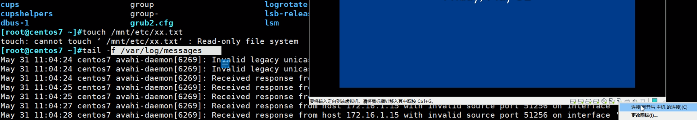

# 第7节. 外围设备使用

## 案例：home本来是在/下的，现在home越来越大，要迁移到一个新的分区

### 首先找一个新的硬盘分区

👆这种有提示的，要同步分区表

否则分区sdb2出不来

centos7的同步就一个方法，

### 然后创建文件系统，并确认

现在就是要将home文件夹挂载/dev/sdb2，要考虑/home下的当前文件，直接挂过去home当前的文件就看不到了--因为现在是挂的/目录关联的设备。这点第5章讲过了。

要把当前的数据迁移过来

### 数据迁移

要把/home下的文件复制到新的分区，需要中转一下

先用一个临时文件挂一下

确认下文件是否都复制过来了

题外话，复习下：

原/home下的文件可以删除了，否则等你挂载后，这些文件没有入口进去找不着就删不掉了，还得取消挂载从/进入home去删。

### 使用持久挂载

刚才其实还有一个临时挂载，把/dev/sdb2挂到了/mnt/home下，上图是后挂的覆盖了，mnt可见👇

这里有个问题，原来/home文件夹里的东西被隐藏了，要删掉的，否则一直占着空间。如果前面没有舍得删，这里需要unmount回去删掉的

有个问题，在cp -a /home的时候，文件夹可能有人在用，别人可能在往里写数据。

一般需要把系统处于维护状态--init 1 --单用户模式

进去看下可见是从5 切到 1的

可能有点问题，就是终端那边命令输入有问题，

重启直接进入单用户模式

按任意键

上图输入a，

然后进入下图输入1，进入单用户

单用户模式，就是不联网的，网络都是down的👇

这是建议的维护状态下进行操作；只要别人不能访问就行，比如防火墙deny也可以。

## 移动设备的使用-光盘-U盘

eject后，光盘就弹出了

弹光驱这件事，有意思在 早期服务器主机都是带光驱，机房里面找机器，可以弹出光驱就能一下子找到了。呵呵~~~现在呢，谈个屁，谈恋爱吧。

eject -t 是弹进去，台式机可以，笔记本不行，VMware Workstation VM虚机更不行了。

### 把光盘制作成iso文件

这个可以用来挂载iso文件，没光驱，就可以这么玩，挂载iso，一样做yum源。

联系前面的章节：

windows里制作ISO是用工具比如这玩意

linxu就一条命令的事：

上图时间较长，你想windows一样好读进度条的，不过你可以ctrl c结束也能看到下面内容，不过数据就不全了。

还一种方法，是把文件夹打包成iso文件

打包成iso 并不会压缩，原来也是这么大差不多

挂载看下

注意这种挂载是read-only，光盘嘛iso就是只读的，不过windows的UltraISO好像可以往里写东西，没用过。

centos6上的一个问题

光盘是3243个包，yum上看到是6713个包，剩下的还有3000+的包在第二张光盘上呢，centos6是两张盘来着。

可以考虑把centos6的两张盘和成一张盘

弄一个大文件夹，然后把两张光盘解压进去攒成一个大文件夹就行，不过这样可能没有引导文件，还需要工具，不过只是做yum源应该没关系吧，安装可能不行。

有个官方脚本"mkdvdiso.sh"可以把两个centos6的ISO合成一个iso同时具有启动功能

### 看下U盘

U盘的系统查到linux上，如果是FAT32可以识别，如果是NTFS就不行了。

wmware workstation 插上U盘后会提示

如果选择主机，那么linux这些虚机识别不聊了，所以选择虚机连接

我们选择主机先看下👇，待会再连到虚机上

把U盘从"主机连接" 转到 "虚机连接"

👇注意tail -f /var/log/messages监控着：

点击后同时观察后面的messages日志

开始弹出信息：usb xxx

设备名也出来了[sde]。

下面就是和硬盘一样的用法，创建文件夹，挂载

因为是2个分区，所以创建2个文件夹 将来挂载

发现sde1是ntfs的，挂不上去，sde2是vfat的可以

因为linux默认不支持ntfs，所以挂不上去

通过locate xxx查找内核文件可以证明确实不支持，👇没有ntfs文件系统的驱动

👆这是看有无驱动的文件，至于是否加载到内存中了没，还要通过lsmod查看

虽然有vfat.ko文件表示系统支持fat格式，但是并没有加载到内存中👇

因为已经mount在用了，所以系统就给你加载内存里面

fat文件系统虽然在linux里支持挂载，但是有问题的，umask貌似没有起作用

完全改不了

该所有者、所属组也不允许

说明fat文件系统的功能太少，连基本的权限rwx和所有者、所属组都不支持。

还有一个fat文件系统不区分大小写👇

这里就可以说这么一句话:linux区分大小写这种说法不准确，显然上图的linux系统存在不区分大小写的情况，所以讲 区分大小写 它是文件系统的事情，linux一般xfs或者ext这两个区分大小写，如果非要用linux也支持的fat文件系统(fat本身不支持权限umask和所有者\组)--此时就表现出不区分大小写了。

👇下图人家df定义了别名，所以\df来使用原来的命令，注意原来的df就是以block块为单位的，1个block就是1KB字节。

-h 是human人类可读性好的选项

-h是以2^xx  也就是1024算的

-H 是10^ 也就是1000算的

-T 显示文件系统

-i inode节点使用情况

-P 是格式化好看些的意思

centos7是优化过了，看看centos6就知道了

这个错位，cut就不能取了啊，要注意。加个-P 就解决了

厉害厉害，上图细节啊，哈哈，

所以说7就不需要-P了，因为7上的df的rpm包版本更高，6的版本低还需要-P

查看文件夹大小

du 不带选项，就是/boot目录下，每个子目录的占用空间，单位是KB；最后一行/boot是汇总信息。

### 这个du看到的和df看到的不太一致

du 算的空间是目录数据本身站的空间，而元数据是不算在内的，还有日志、实时运行区？一些额外的东西。

dd count=0就是数据为0咯，但是会产生元数据的，所以多少会有点空间占用的👇

不过多了点元数据

上图最后一行的命令解释：seek是跳过10个bs，也就是10G开始写数据，结果写0个bs。所以前面0-10G的数据为空。也就是有头有尾，中间没东西。

跳过的也占空间的👆

毛的元数据，说好的一点点呢，啥也不占啊，

应该还是有一点点，文件元数据确实有的啊。但是没看到也是奇了怪了，不管了，反正文件ll都看到肯定元数据占用跑不了的。superblock也在分区上的啊。

回到这种10G大小确一点空间不占的问题上来，图①，下面要引用对比

这种文件称之为  稀疏文件--有头有尾，中间时空的。与之相反的是稠密文件。

这个文件将来学虚拟化有用的，提前接触下这个东西。

显示上都是0，要要注意前面空的虽然也用0表示，但实际上没有数据，然后 后面的1G确实写了数据的0。元数据里加了标记，从哪到哪加了标记没用 是空的 硬盘上没有数据的；后买1G真正的写了0的是有数据的。

▲所以恶心的事情来了，上图是有1G数据的，和图①是不同的，图①里的是一个数据都没有的。貌似没法区分咯，，，⚪？

### du 可以指定深度

除了/boot本身，再深入2级👇

 

 文件大小空间ll看的不对了就，du可以看的准确点。

