# 第8节. raid工作原理


## RAID0的空间大小计算：

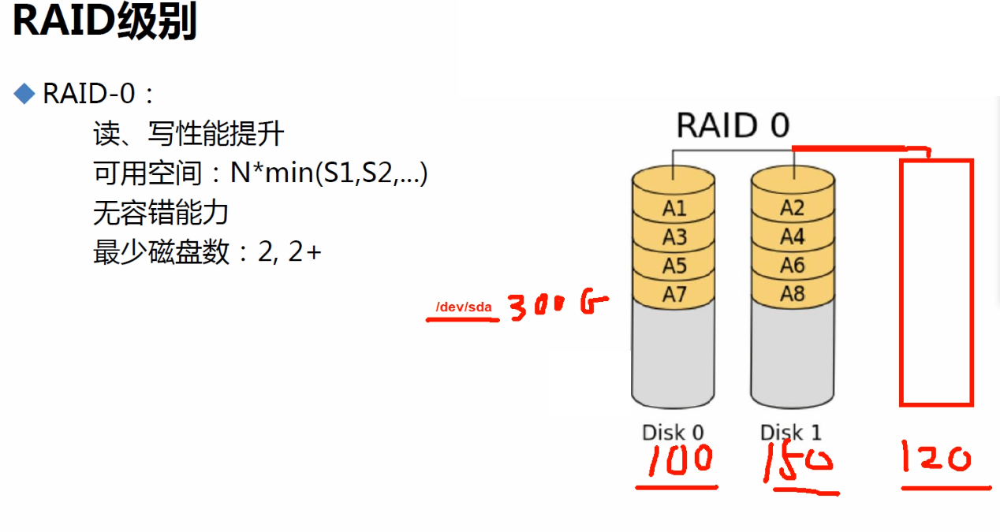

取成员最小值*磁盘块数；

raid是物理上实现的，所以对于OS来讲，分区还是像以前一样，挂在300G上的连续空间的单块硬盘上。

①以上就说明了总容量大了

②下面是数据切片后成条带方式存储在成员磁盘上的。而切片的单元叫做chrunk。它这个3块磁盘同时读写就提高了IO速度。

③RAID0，单单一个RAID0一般工作中不用，家里可能用的。

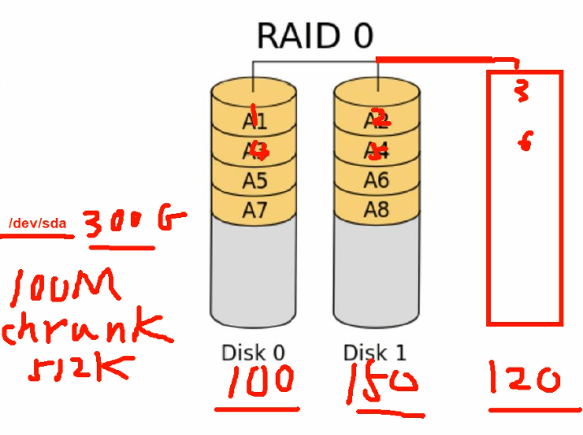 

图中100M的数据切成多个512K，这是举例假设，不一定是512K。


## RAID1

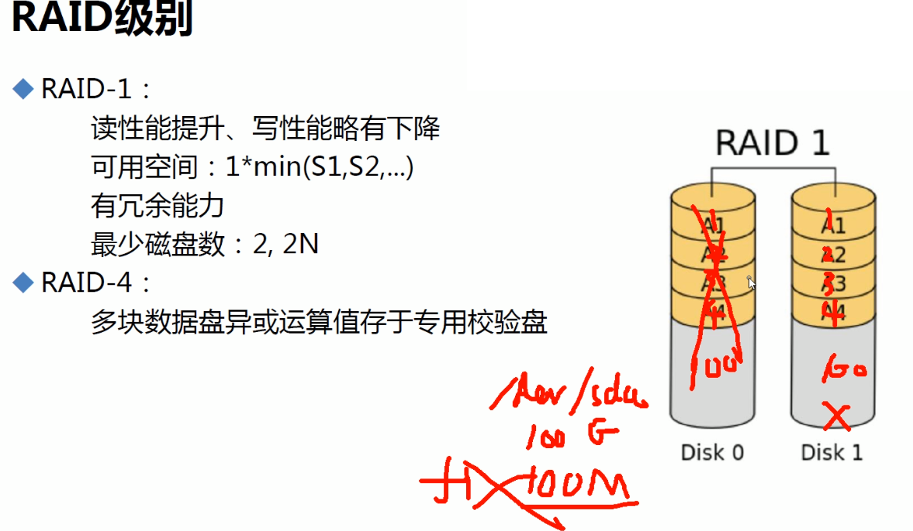

1、RAID的硬盘冗余，是针对硬盘损坏的冗余备份，如果上图RAID1你删掉文件，就删掉了，disk1作为备盘，你操作disk0上的数据，删掉其上的f1文件，disk1上作为备份也会删掉的。而raid1，如果坏了一块盘，会导致磁盘IO飙高的吧？还是你拔出坏的，插入新的才会IO堵塞⚪。不查比较合理吧，否则会同步数据IO就高了，它又不像raid5坏一块就开始算故障盘的数据。同样raid5坏一块读写效率下降，新盘顶上来IO肯定要东西向恢复数据，所以IO也是会高的，留给业务的IO就少了。

2、RAID1叫镜像，RAID0叫条带。


## RAID4

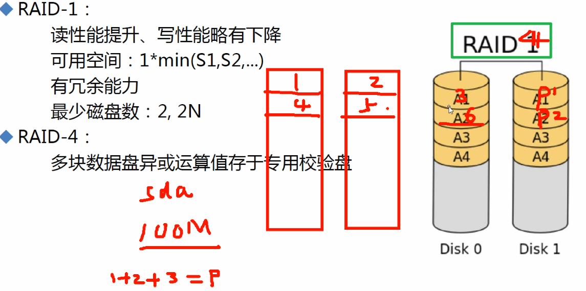

raid2 3 4 都是消失的技术，不过4具有典型代表，所以了解一下

①上图是在说raid4，100M数据存放的规律，条带+校验位(异或校验得到的)

②如果条带中某个数据块的磁盘损坏了，是可以算回来的👇

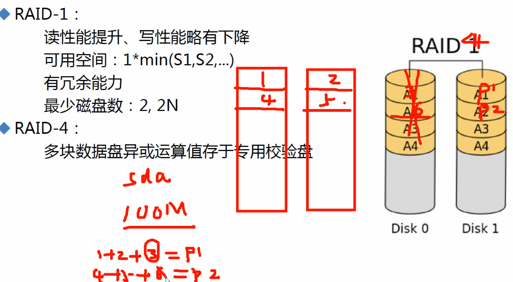

③raid4的至少3块硬盘(n≥3)；空间利用率是(n-1)/n。牺牲一块硬盘的空间来实现一定的容错性，容错也只能坏1块。

④raid4淘汰的原因，是校验盘的压力比较大，损坏几率较高。谁当校验盘谁老坏，这个位置不养盘啊，哈哈就想有的工作不养人一样，教师这个行当是养人的，有利于身心健康的保持。

为了解决raid4的缺陷产生了raid5

## raid5

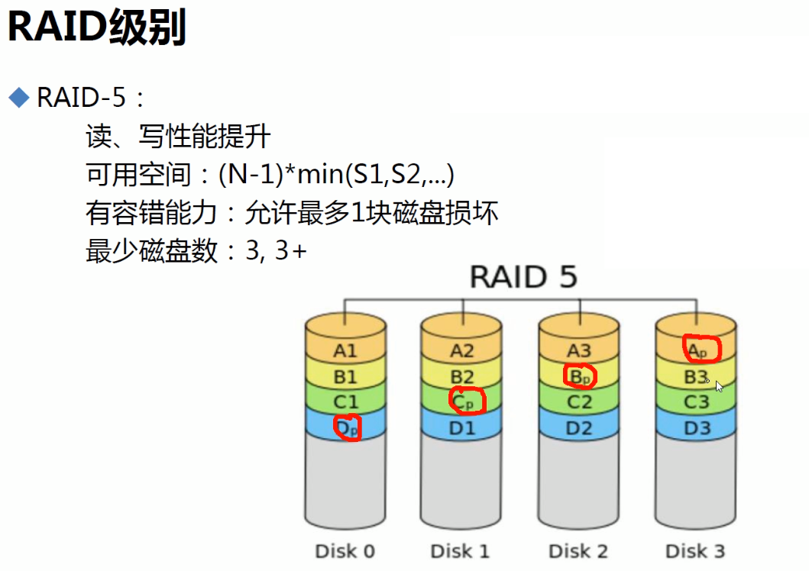

①和raid4类似，但是校验位是分散在每块盘上的，还是条带+校验  一行。分散带来的好处是--原来raid4的时候数据较多就会频繁访问校验盘，校验盘压力大。

②如果坏了一块硬盘，再插上新的，就会发现此时由于要算新磁盘上的数据，性能下降的非常明显。此时属于降级设备不是正常的raid5了，如果业务反满磁盘IO本来就高的情况下，坏了一块 导致降级，此时就惨了因为👇会计算故障盘数据的，会导致本来脆弱的磁盘即使是好的还能再坏1块~哈哈。

```
为什么RAID5系统的磁盘组降级情况下，读写效率会下降：因为磁盘每时每刻都在进行数据的写入，当有一块硬盘发生故障RAID会一直在根据剩余每块成员盘的校验码和数据来计算出故障盘内的数据，这样才能使整体数据不会丢失，也导致硬盘在读写的情况下多了一项计算，所以整体上硬盘的读写效率就会下降。
https://forum.huawei.com/enterprise/zh/thread-351133-1-1.html
https://cloud.tencent.com/developer/article/1828247
```

③spare disk应该说的是热备盘吧

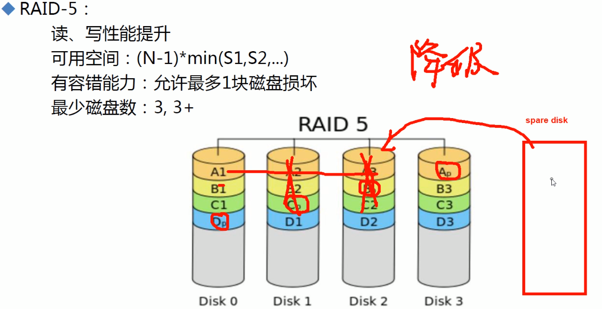 


## raid6


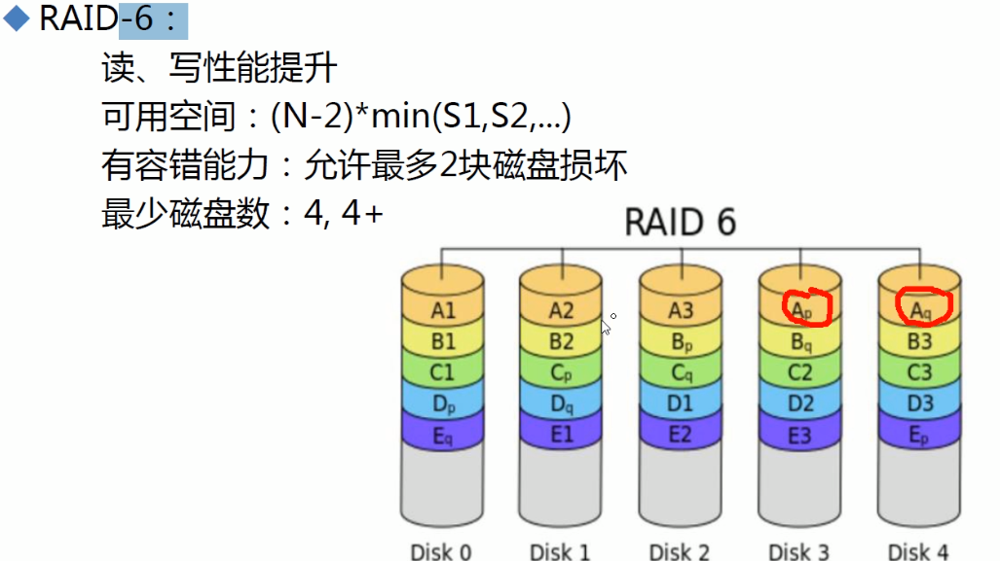 

①比raid5多了1个校验

②利用率(n-2)/n;n≥4

③以前压缩文件bz zip，是用cpu的损耗--加入你是crontab这种持续性的压缩打包任务，来换磁盘的空间节约。现在就是用磁盘空间来换数据的安全。反正都是要换，要么你用身体换钱，要么要钱换身体，唉，唉~我竟然不知觉的情况下开车了。我说的是工作久坐等一些不好的情况。


### raid-10

not十而是壹零

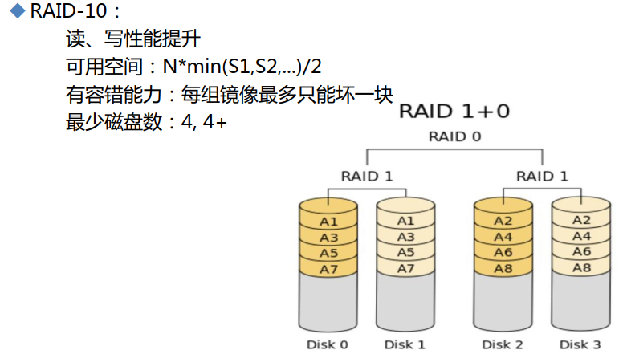  

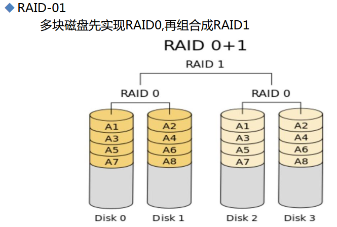 

解释为什么raid01不好，首先jd上的产品就告诉你raid01不好了👇都不支持，没市场：

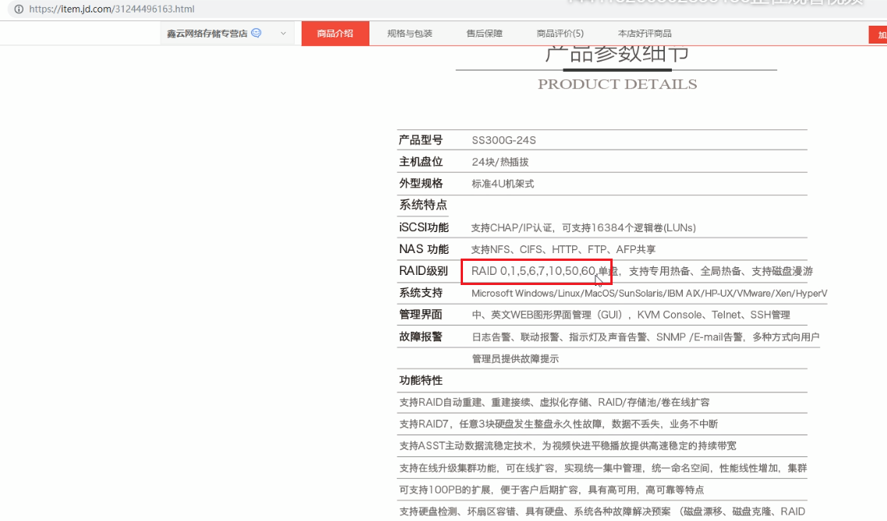

原因：

raid-10，坏1块盘 后，再坏一个块盘导致整体不可用的几率小于raid-01，下图说明👇

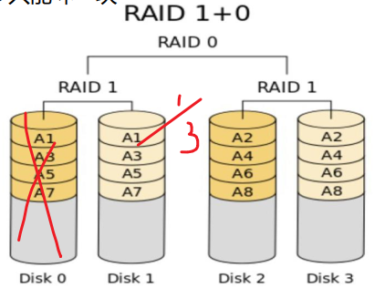 

disk0坏了，剩下的3块中disk1坏了就整体不可用了，其他disk2坏或者disk3坏都不会影响整体，整体不可用几率是1/3。

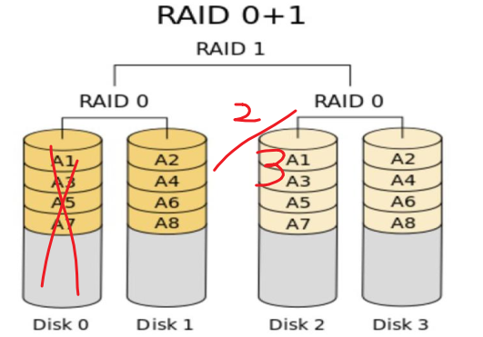 

disk0坏了，剩下的3块中disk2或disk3坏了就整体不可用了，整体不可用几率是2/3。

▲所以raid-01的容错性较raid-10的差。

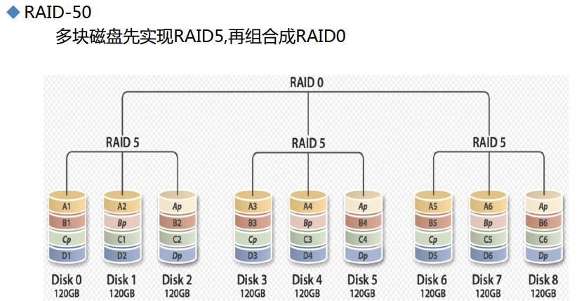

0这种东西就是提高IO速度的，与冗余无关，5、6就是冗余+速度、1纯冗余 速度一点点。


### jbod就是写完一块，写第二块就是整合一下多个块当1块用。比raid0节约些。

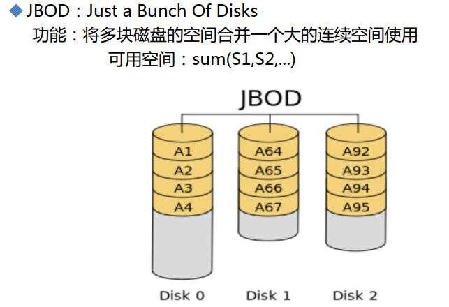 


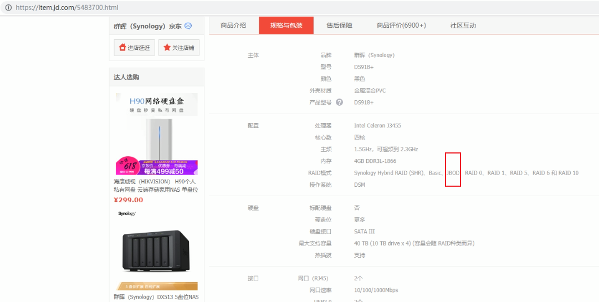


## raid7

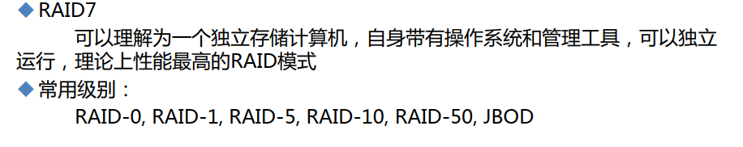


## 了解下软RAID

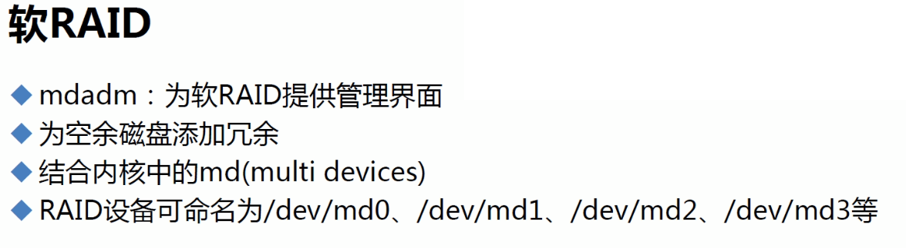

想用百度吧，没啥意义应该。
