# 第9节. LVM管理详解

## 1、创建管理

分区一旦划分好，就没法扩了。而LVM就能扩和缩

LVM的底层可能就是raid为主，当然也可以是多块硬盘和分区。

10块注册raid10，OS看到的就是sda一块盘，以前就直接sda上分区，一旦分区就固定了，分区不够用也不能扩，所以就再sda上做LVM来管理，如何管，假设一组raid10得到sda，还有一组sdb、再来一个sdc1分区，这些raid也好、硬盘也好、分区也好，都是linux Block Devices。这些块设备大小不限，无所谓。

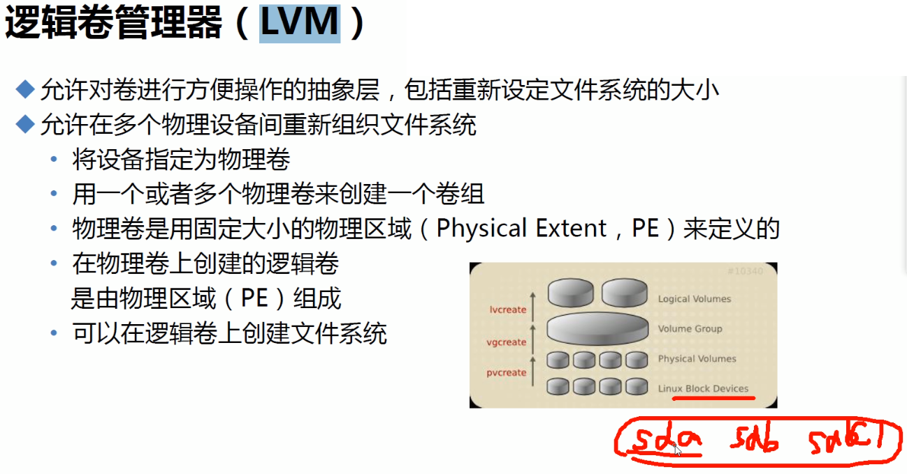

把这些块设备第一步通过pvcreate变成Physical Volumes物理卷，所以物理卷就是打上标签--意思就是这些块设备不作为独立硬盘用，将来要做逻辑卷的。

有几个块设备(硬盘或分区)就生成几个物理卷，就是打标签吗，原来设备叫啥名，生成后还叫啥名。


然后通过vgcreate将物理卷们 组成一个大的集合 也就是卷组。此时卷组就是一个大的硬盘咯。


然后通过lvcreate将卷组 分成一个个 逻辑卷出来。


逻辑卷不关心上面的数据存放在哪块物理设备上，

逻辑卷的地位就是分区了，该创建文件系统就创建文件系统，该挂载就挂载。


如果LVM1 500G ，LVM2 200G，下面的卷组是1T，将来LVM1满了不够用了，还可以**在线**扩展到800G。所谓在线就是用户无感--使用不受影响，无需取消挂载，直接在线挂载的状态下，一条命令就挂上去了。

如果lvm1 800G也满了，怎么办，可以再底层块设备上再加入新的硬盘。这一套还是在线扩展吗？⚪


所以linux默认安装的时候默认就是逻辑卷。


逻辑卷的概念了解后，还有一个PE，叫物理盘区**physical Extent**。在创建卷组的时候要指定PE，假设PE是16M，卷组就会显示有多少个PE，创建LVM逻辑卷的时候可以从这么多个PE中取出多少个PE来作为逻辑卷。扩展的时候也可以增加多少个PE。PE就是分配的最小单元了。


到现在已经是LVM2代了，LVM2。


在IBM AIX系统unix小型机，就只用LVM，不用分区。


LVM要建立在raid之上，硬盘坏了有冗余。①担心LVM多了一层逻辑层，硬盘坏了导致整个卷组出问题②多一层逻辑层，不是直接面对硬盘，性能是否不好。据说2点担心都是多余的。反正很多企业在用，也有企业不用。


学完再来这里补充发表自己的观点，和网上搜一下。


下面开操作

### 第一步 准备好块设备

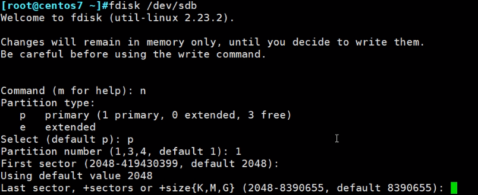

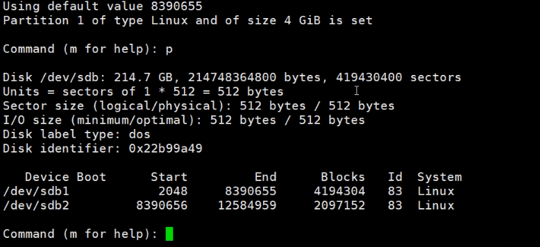

### 要注意修改分区的ID为8e

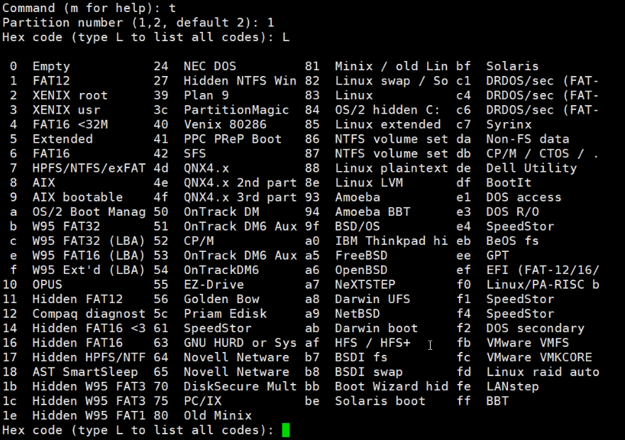

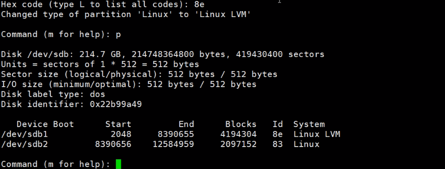

存盘退出

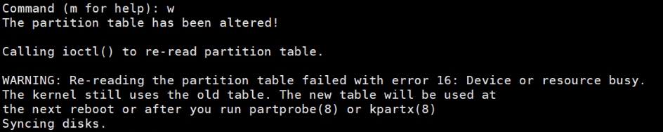

同步下

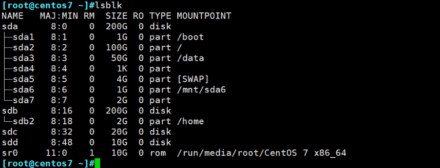

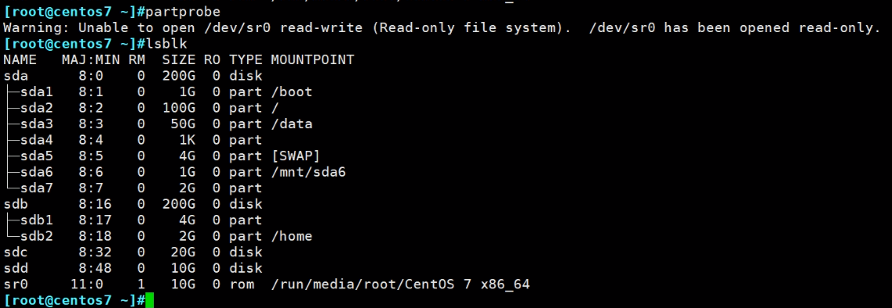

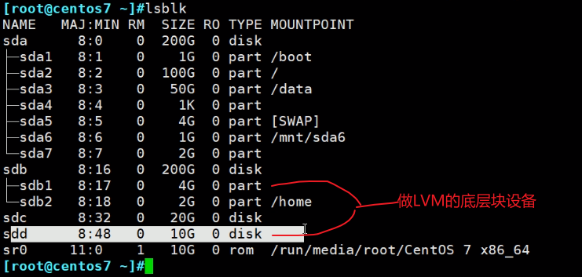


### 第一步，物理卷的生成-pvcreate x y z\pvs\pvdisplay

pvs查看下，当前pv是空的

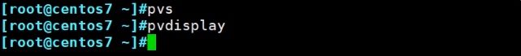

把上面的一个分区、一个硬盘变成物理卷

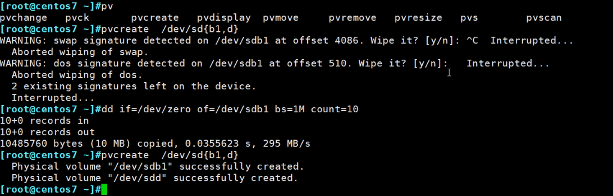

👆因为sdb1之前做个swap，所以有标记位，所以先dd清空前10M就能覆盖到了。也可以直接敲y就wipe一样也擦掉了。

然后再pvcreate /dev/sdb1 /dev/sdd也可以合起来些。

这样pvs和pvdisplay就能看到了

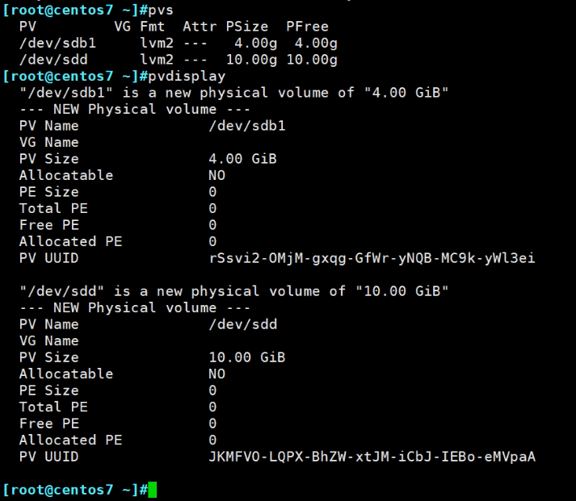

pvs就是summary概况，其中lvm2就是逻辑卷2代；VG列是空 表示卷组没组建呢还。

pvdisplay同样可见VG是空；PE Size也是0 这个只有创建VG的时候指定才会出现。


### 第二步 vgcreate创建卷组

vg开头的也是一大堆命令


同样有vgs和vgdisplay，然后pvdisplay肯定也能看VG和PE也就是vgcreate后的信息。

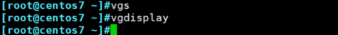 

使用帮助看下

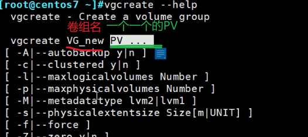 

-s 指定PE的大小 pe--physical extent size

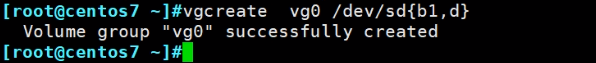 

上图忘记加单位了，不过有默认值的pvdisplay可见。

vg整合好后

①pvs看

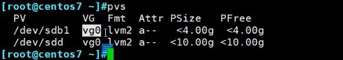 

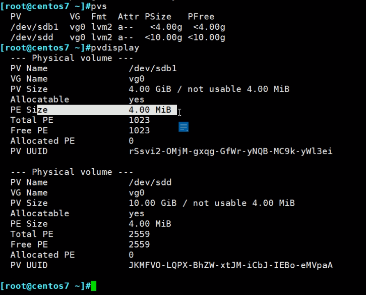PE的默认值也看到了是4MB，上图PE size是4MB，total PE 1023就是1023个的意思。总容量也就是4G咯。同样/dev/sdd也就是4MB*2559=10G

②然后通过vgs 和vgdisplay看看

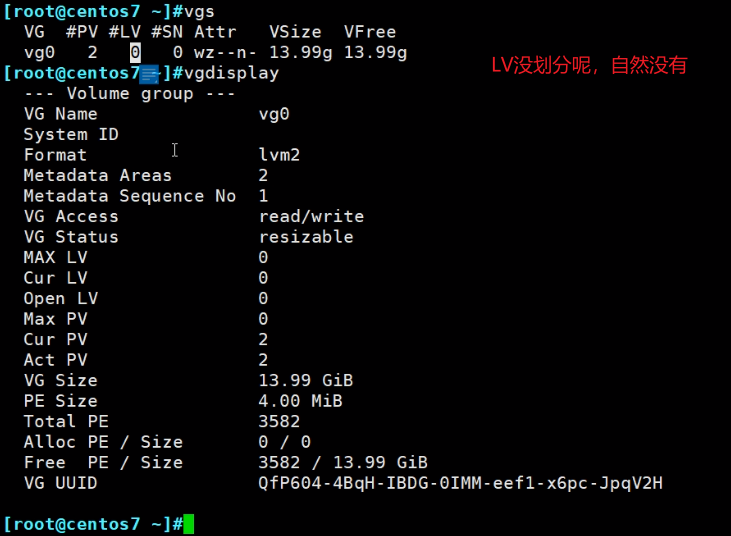

👆vgs可见，vg0这个卷组里有2个PV--物理卷，LV还未划分，大小是两个PV的总和14g的样子。

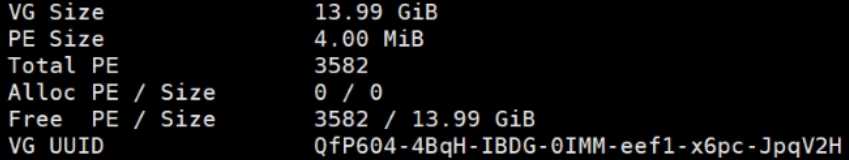

全部PE个数3582个，Alloc PE / Size 0 / 0就是没有分配出去呢--因为逻辑卷lvm还没有分配呢。

由于逻辑卷lvm还没有创建，所以还看不到vg0这个设备

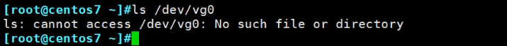


### 第三步 lvcreate创建lvm

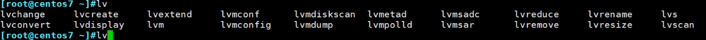

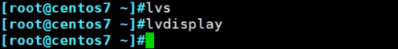 


lvcreate --help可见用法：从哪个VG--卷组里 通过-L取 多大size  ；通过-l 取多少个PE，这事个数

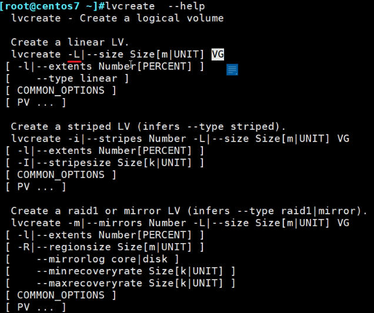 

上图有striped和raid1|mirror，这就是raid了，完全可以用lvm再做一层raid，实际上底层物理设备做raid后，上层lvm不会再做raid了。

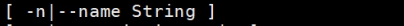 


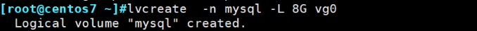

👆起个名字mysql，-L 直接写大小，-l数个数还要算--不用，从vg0里面划分lvm。

lvs 和 lvdisplay

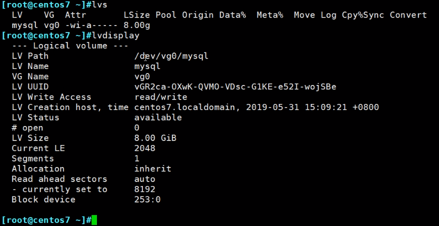

上图说明：

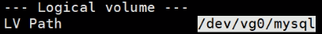 这个就是完整的设备名，这其实是软连接👇

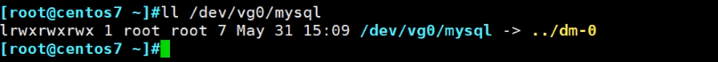

实际上叫dm-0，还有一个和它一样指向的软连接

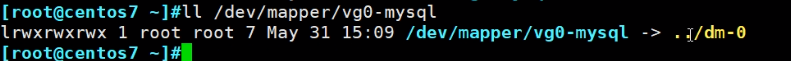

所以待会可能看到的是上图这个名字/dev/mapper/vg0-mysql

看下现在的dm设备有几个：如果再创建一个lvm，这里就会多一个dm-1了

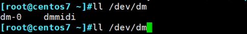 

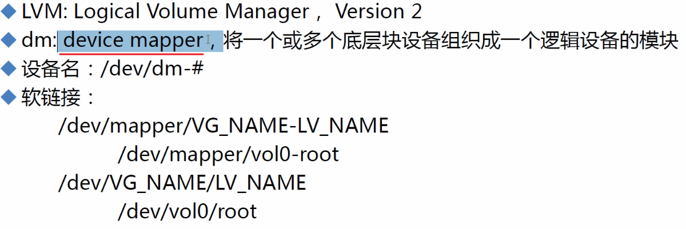


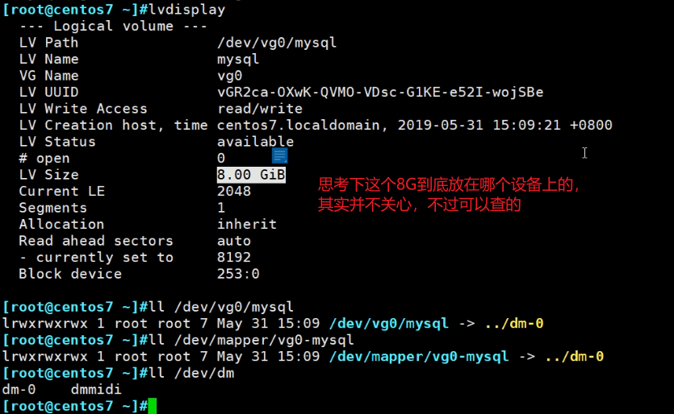

上图的8G到底用的哪个物理卷，通过pvdisplay可以看到的

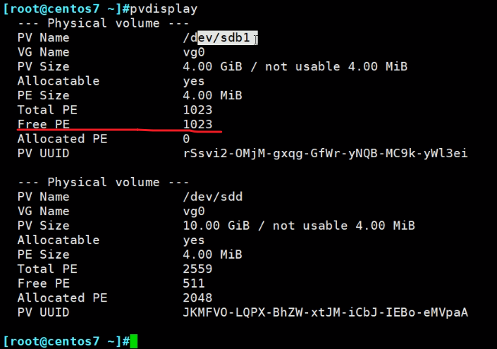

可见/dev/sdb1全部空闲就是没有用，所以这个8G都用的/dev/sdd的空间4MB*2048也就是8G。做raid也是不关心具体到底存在那块盘上的，都是当作整体在用的。

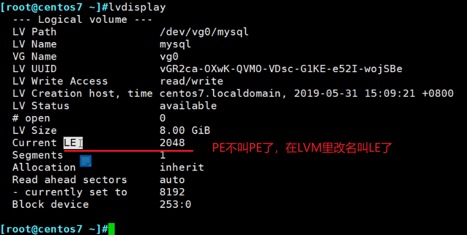 

2048个PE，在LVM叫LE，就是PE在LVM逻辑卷里的名称。

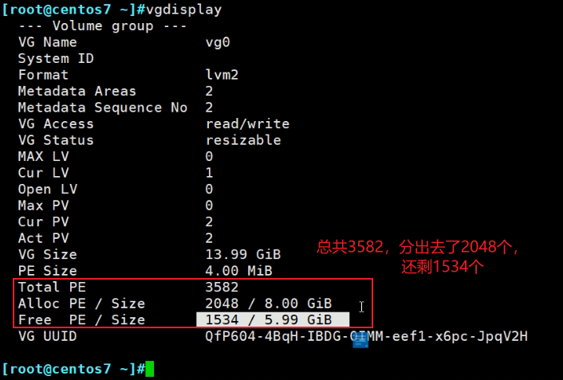

一旦LVM划分了，blkid就能看到了

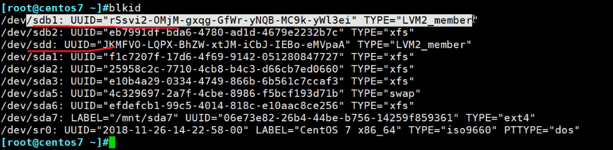

现在由于还没有在LVM上创建文件系统呢，sdb1和sdd的UUID肯定是各归各的。所以还看不到一个sdb1和sdd合成一个的情况，其实合成一个情况是blkid是看不到清楚的，只能再下面的格式化看到多出来一个mysql的逻辑卷。而sdb1和sdd是逻辑卷的成员而已，具体是哪个lvm的成员还需要具体去看的。

### 第四步 mkfs.xfs格式化

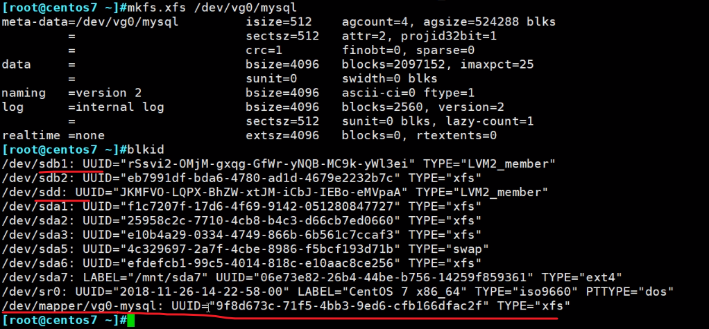

这个时候就看到，增加了一个新的记录，mysql这个逻辑卷就有文件系统了。

### 第五步 挂载

挂载的时候，要写设备名，可以写这里的/dev/mapper/vg0-mysql可以写当初创建的lvm起的名称/dev/vg0/mysql，这两个都是可以的，因为都是软连接。

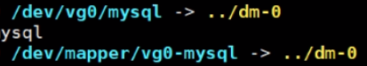 

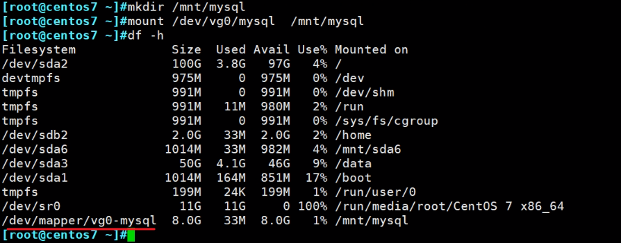

上面是临时挂载，永久挂要写fstab

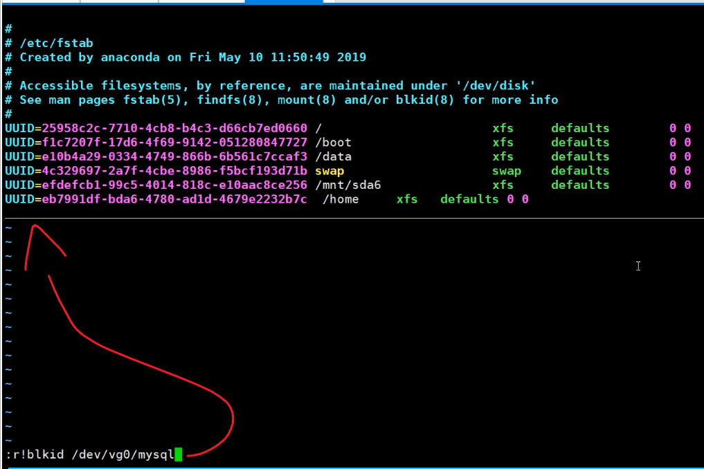

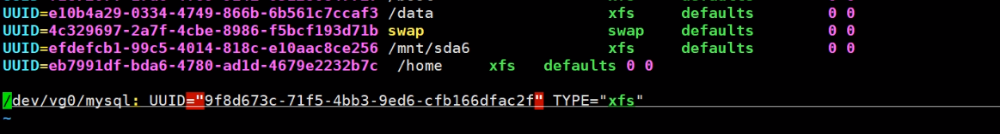

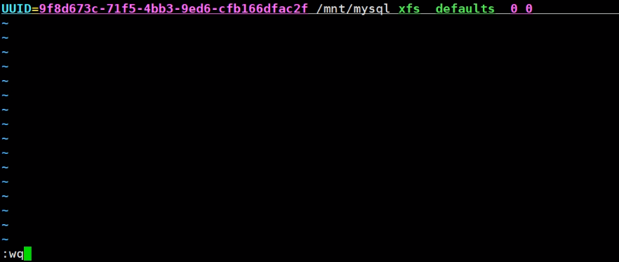

刚才挂过了，所以就行了，reboot也不怕了，正常就是mount -a就行了。


### 看看性能

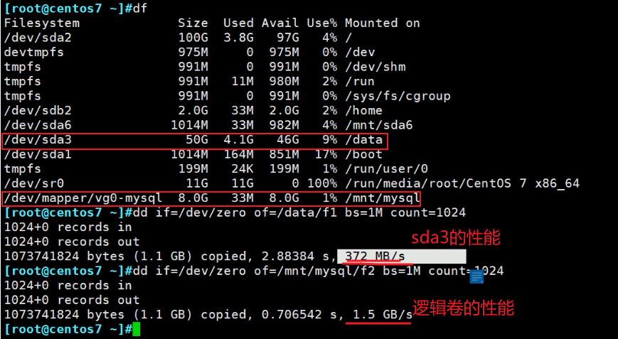

上图是不是有点夸张了，逻辑卷能提速这么快的？逻辑卷反正不会比物理分区慢就行了。

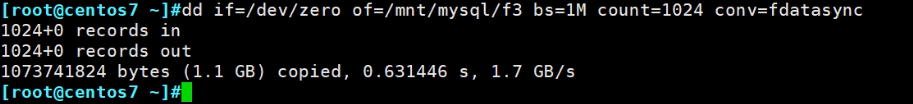

上图就是conv=fdatasync就是结果显示的是已经同步到硬盘里的了。上上图的是写到内存里了就显示结果了。


所以lvm + raid，是很好用的。慢也不慢，底层用raid冗余物理设备。


## 2、管理详解

下面看下逻辑卷的空间扩展

假设这个8G用满了，下面对其进行扩展

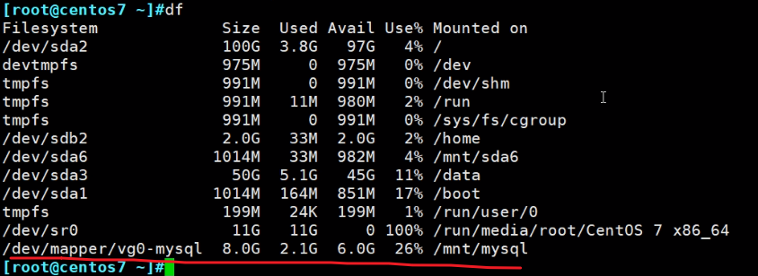

这里少了一步看mysql这个lvm到底来自于哪个卷组，其实这里就可以发现人家用vg0-mysql作为自动生成的软连接 来作为设备名 本身就是要告诉你mysql来自于vg0。

逻辑卷扩展 要先看 卷组里有没有空闲空间

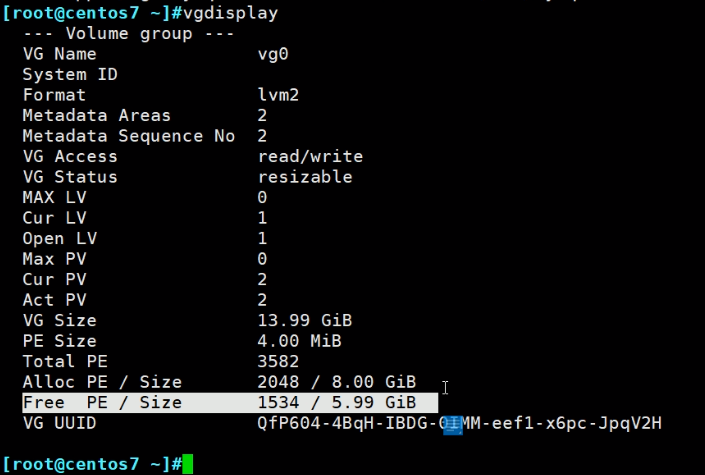

可见卷组里还有6G空闲

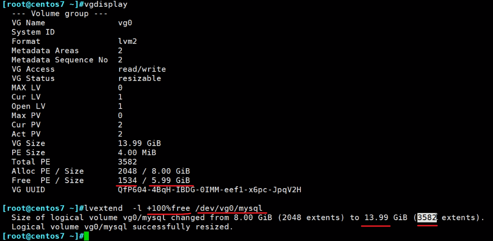

lvextend -l 小写的l在扩展全部剩下空间就特别好用，可以写-l 1534就是剩下全部的Free PE个数，也可以用上图的+100%free来直接搞定剩下空间的100%。

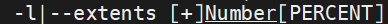

不需要指定vg卷组，因为mysql这个lvm系统知道从哪个卷组来的，所以无需指定，直接命令就写/dev/vg0/mysql就行。

回车后可见已经扩展到13.99GB共3582个PE。

此时再看vgdisplay可见已经没有剩余了

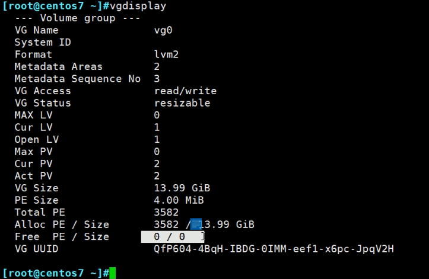

vg用光了，vg整合的pv自然也就用光了

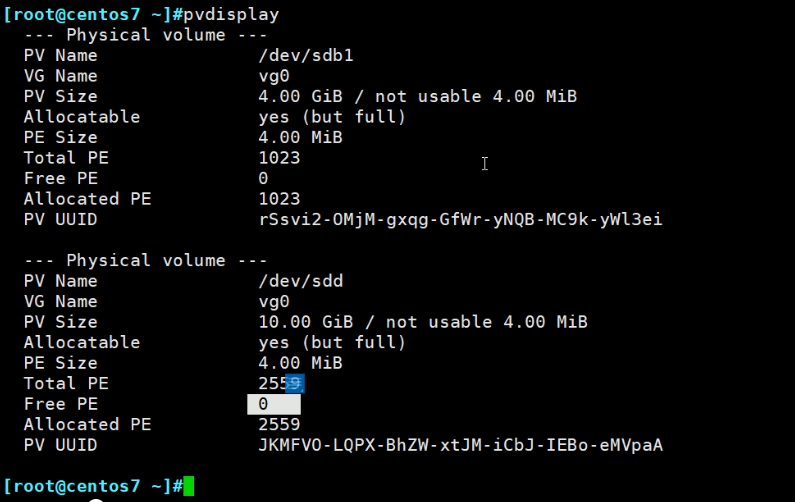


但是此时确发现df -h 里看到的逻辑卷的空间还没有刷新


注意，这不是没有刷新哦，这是因为 你虽然把lvm扩展了6G，但是这个6G的空间还没有文件系统(还未进行格式化)，不是简单的格式化，而是格式化后并进去，其实确实是一个命令就同步了，也算是笼统的刷新了。


df看到的是文件系统的大小。

现在就是要将扩展的6g空间的文件系统同步到既有的8g空间里去，不是简单的mkfs.xfs哦。


👆可见data blocks 变大了。此时df -T再看文件系统的大小就扩上去了👇


## 总结下扩展其实就两条命令（在vg卷组有空闲空间的时候）

 

而用户是无感的，扩展的的时候也没有取消挂载，一直都是挂着的。

 

再来看看我的centos8的默认就是使用的逻辑卷的

 


## vg没有空闲空间的扩容步骤


此时要扩vg0-mysql，但是vg0已经没空间了怎么办。就再加一块新硬盘。

### ①pvcreate


只有分区才要加标签8e，硬盘无需改

pvcreate后再blkid就看到了，就和mkfs.xfs 格式化后就看到了一样，blkid是看带文件系统的块信息的


此时pvs就能看到多了个20g的pv

 

### ②vgextend扩展卷组


上图可见现在vg0有两个成员Cur PV 2，再加一个。

vgextend vg0 /dev/sdc


 

此时卷组就又有空闲空间了，扩展就一样了。还是两条命令的事，可见扩展lvm确实无需取消挂载。


## 同一个卷组里创建新的逻辑卷


再后面学习中可以把mysql的日志放到专门的逻辑卷或分区中，这里就专门创建一个binlog的lvm

### ①lvs,lvcreate -n binlog -L 10G vg0


lvdisplay就可以看到有两个lv了


### ②mkfs.ext4 /dev/vg0/binlog

格式化逻辑卷为ext4


### ③挂载


此处省略了持续挂载fstab的编写，上文有的。


针对binglog逻辑卷扩容，-l +1000个pe 一个pe4MB


此时逻辑卷确实扩展了


由于增加的部分没有格式化，也没有加入进当前的binlog文一个整体，所以


刚才xfs文件系统用的是xfs_growfs /mnt/mysql，现在ext4得用resize2fs /dev/vg0/binlog，前者跟的是挂载点(文件夹)；后者跟的是设备名。注意下

此时就成功了


由于文件系统的不同，最后同步的命令不同，后面跟的部分也不同，所以自动化脚本就有点麻烦，所以有更好的扩展方法来了


## 不管是xfs还是ext4都一条命令扩

lvextend -r -l +500 /dev/vg0/binlog


翻看前文可知刚才mysql这个lvm是14G，现在扩了500个PE，一个PE是4MB，也就是扩了2G，达到了16G。

上mysql是xfs，下main继续binlog是ext4的也用这一条搞定


一样成功了


此时就发现上面的同步命令白学了？不是


xfs_growfs 挂载点    --- 这个是扩展用的

resize2fs  设备   --- 这个扩展和缩减 都行

lvextend -r -l +500 /dev/vg0/binlog 这个就是扩展lvm的时候自动同步了。

所以resize2fs后面缩减还要用得到。算不上白学~

其实通过man lvextend可见 其实-r 就是resizefs，哈哈~


缩减有风险的，如果一不小心写错了--写成缩减到50G，而此时数据就是100G，那么就会造成数据丢失50G~。


以防工作中用，还是要学一下


## 缩减


缩减上图ext4的这个lvm空间

### 扩展是在线扩展，缩减必须离线缩减，意味着取消挂载，用户访问受影响了。

### ①unmount /mnt/binlog


回想扩展的时候不管是2条命令还是1条命令，底层逻辑都是先扩展lvm，再同步扩展文件系统


现在缩减的时候就是先缩减文件系统，再缩减逻辑卷大小。

缩减前的lvm大小如下15.86G：


resize2fs /dev/vg0/binlog 10G  # 缩减到10G

注意这个命令①同步的命令(同步的命令其实就是将lvm扩展后的空间，再扩展到文件系统里去，这个场景其实就是不写多少个G就是全部扩展进去，其实你的需求就是lvm扩展后，再同步到文件系统里，自然是全部了)②缩减的命令，在后面跟上空间即可表达缩减到XXG。

缩减的时候会提示你先检查一遍系统完整性，再让你缩减。

### ②e2fsck检查下完整性之类的、③resize缩减文件系统


此时由于是resizefs 缩减的是文件系统，所以lvm还没有缩，通过lvs可见大小没变；然后开始缩减lvm:lvreduce -L 10G /dev/vg0/binlog

### ④缩减lvm


-L 10G，不带+加号的就是直接缩减到10G。man lvextend可见👇


### ⑤mount，缩完后重新挂载


### 注意缩减只能缩减ext的，不能缩减xfs的。


上图命令补齐也可见一斑，只有grow，没有reduce resize这些补齐命令出现。

所以▲xfs哪里比ext好了。


## 逻辑卷的迁移


### 迁移操作举例


拿这个b硬盘做实验，看下sdb1有没有用，就是有无挂载咯


当时做实验的，sdb1报错，肯定是fstab里写东西了，


删掉

dd 干掉分区清一下


发现上图dd掉512B后，分区sdb1还在，那是因为没有同步

partx -d --nr 1 /dev/sdb  # 不能用-a，-a是增加，-d是删除


注意提示sdb忙

再次df 发现之前fstab里已经删掉了持续挂载哪一行，现在还是有类似的报错--废话你删掉的是mout的配置文件，有没有取消挂载，现在的df报错就是之前mount过--通过mount可见--然后挂载点估计是删掉了被，现在df报错了。通过mount看发现了问题所在，


视频中老师的排错思路看下


看到说明没有取消挂载


哈哈，还是在，我才是不是dd 512导致的，还没有取消挂载就dd导致的？


通过fuser -v /mnt/sdb1也没有人用啊，这会umount没报错，lsblk也看到没有挂载了。

取消挂在后，再同步一下，此时分区sdb1就没了


那上面过程总结，①挂载没有unmount②unmout需要时间③好像是/mnt/sdb1先挂，/mnt后挂，这一类也有问题。


下面开始针对sdb创建lvm，然后演示lvm的迁移

先创建一个和将来已已过去 名字 存在冲突的vg0和mysql逻辑卷

下图👇创建物理卷、创建卷组并指定PE、创建逻辑卷指名和指大小和所属卷组。


挂载


复制点文件过去

 

好了 LVM就有了


下面进行迁移

### 先取消挂载


考虑到迁过去的卷组也叫vg0，lvm也叫mysql，只要vg0改了就行了，因为整体名称vg1-mysql过去就和vg0-mysql 不 冲突了

### 改名


### 禁用卷组


卷组禁用后，所有的逻辑卷也就禁用了：


### 导出vg1

 

 


### 拆硬盘、插硬盘、识别硬盘

正常服务器就直接拔，这里实验用的是Vmware工作站，先关机

是sdb硬盘要迁移


这就是硬盘啦，把这个文件复制到centos7的虚拟机上去


移动硬盘嘛，就是剪切过去


再centos7上加硬盘之前看下 当前硬盘排号已经到d了


完成


不会自动识别，echo - - - 一下


出来是出来了，但是这边的系统还不能识别其上的LVM

lsblk看不到没关系，使用vgdisplay可以看到


上图👆可见此时vg1卷组是出于exported导出状态

### 导入卷组

使用vgimport vg1导入


此时状态OK


通过lvdisplay可见2个卷组


注意上图的not available

### 启用逻辑卷vg1


启用后再看


就正常了，lvm有了，就可以挂载了

### 挂载


此时数据就都过来了


以上讲解了lvm的创建、扩展、缩减、迁移


## 下面来个例子


假设sdd这块硬盘 指示灯开始黄灯 表示快坏了，还没红，但是要坏了。

此时需要把这个块硬盘剔除下来，问题是其上有逻辑卷，不能直接拔。

问，怎么拆走这个块要坏的硬盘


表示sdd这个物理卷已经被别的逻辑卷给占用了已经。

要想拆走这个sdd，必须先把其上的2559个PE的数据搬到同一个卷组vg0下的其他逻辑卷上，必须是同一个卷组。

但是 vg0 发现只有2059个PE空闲


1、只能加个PV了，为啥一定要同一个卷组呢？因为所谓搬家使用的是pvmove命令，估计这个命令需要同一个卷组。

2、当然你也可以缩一下，然后再搬家。


这里还没有加PV，vg0的所剩空间并不够，只是演示一下：


这是把sdd上被占用的PE搬家到同一个vg0下的其他空闲PE上去，前提是空闲PE数大于占用PE数。


有个问题啊，搬家是搬到其他空闲PE是吧，其他空闲PE是否分散在不同的几个LVM上呢，这样文件又该怎么索引找到呢，难道原来一目录下的分散到好几个目录下了？显然不可能这么玩啊。


实际上数据没多少，但是搬家搬的是空间，硬盘拆走，硬盘其上得lvm当初承诺出去的空间是16G的9.8G，现在sdd一拆，承诺出去的2559个PE差不多10G的承诺空间就没了。

当然你也可以缩一下，然后再搬家。


缩的问题也来了


不知道这2559个PE到底是哪个LVM占用的。

通过lsblk查看


可知是vg0-mysql逻辑卷占用了sdd的全部PE，而且vg-mysql还占用了sdc的PE

只要把vg0-mysql的容量变小，就可以搬家了

此时vg0-mysql lvm才用了很少：


再进一步发现，最终还是缩不了


只能加硬盘了


把sde剩下的18G空间加到vg0里面


不需要太多，👇只需要500个PE，也就是2G的大小。


然后...👇


发现整个sde都在vg1里了，没办法给都vg0了。


重新弄个分区来做吧

 

以上分析就是关键思路


注意此时blkid还没有呢，需要pvcreate后才有


pvcreate后blkid就看到了


加PV就是贴标签


加到vg0卷组里


至此vg0的容量就扩上去，剩下3338个PE，sdd的2559个PE就可以搬家了


此时sdd的PE们就搬家到同一个卷组vg0下的其他PV上去了，至于是哪些PV不关心，反正有地方，有文件夹入口访问就行了。

注意搬的是空间，不是数据，空间过去了数据自然也过去。

 


刚才的sdb3的5个G空间用完了，当然还有其他的PV也会分担一部分sdd的空间


sdd上的空间就搬走了


此时sdd上既然没有数据了，就可以考虑移除了

当前vg0里4个PV，计划删除sdd这个已近搬完空间的PV


 


变成3个了


此时/sdd就不属于任何卷组了。

然后再删除sdd的PV--物理卷  标签


 

sdd就没有了


此时sdd就是一个完全和逻辑卷没有关系的硬盘了

就可以拔了~


上面的分析较多，查看较多，真正的命令就3条--当然前提是空间够

 

注意，从头到位都是在线操作，没有取消挂载。


扩展、缩减、迁移、拆除 都讲了


## LVM的删除


某个vg的所有lvm都不要了


### ①取消挂载


如果是fstab里有写，也要删除


### ②删lvm

删之前要确定上面的数据不要了


此时vg1里的空间就没人(lvm)用了


vg1没人用了也可删了

### ③删vg

 

此时sde这个pv就不属于任何vg了，也可以删这个PV了

 

删PV之前blkid可见标签👇


### ④删PV


此时sde再PVS中不可见，就成了一个纯粹硬盘了


也可以拔走了。


## 3、快照管理

逻辑卷还有个功能是分区做不到的--快照

VMware里的快照也是一样的道理


卷组里创建多个lvm，/dev/vg0/mysql是vg0里的一个逻辑卷。500G的数据备份时间很长了，但是快照就秒做。你需求不是备份数据，只是能够回到某个时间节点的数据，所以只需要针对变动的数据做备份就行了。


假设待会有100G的数据要产生修改，要是直接备份着500G很花时间，所以在同一个卷组VG0下再创建一个逻辑卷--快照逻辑卷--mysql_snapshot，本身也是个逻辑卷，只不过是个特殊的逻辑卷。因为假设是将来要改100G的数据，所以创建快照逻辑卷的时候就指定创建的空间为100G。所以快照逻辑卷的大小不用和源逻辑卷的大小一样，这个腾讯云上好像也有建议值，一半吧好像。


快照的原理，区别于普通 的备份，是针对变动的文件做的备份，文件要修改前先备份到快照逻辑卷里，所以性能会有所下降，但是还原快，空间占用小。

1、快照的创建的瞬间，其实只是分配了XXXG的空间，并没有备份任何数据，

2、只有后面数据发生变化的时候才会备份，**所以性能是有所下降的**。


同样改F2为F2'，也会将F2复制过去

3、只要没改过的数据都是在原来的逻辑卷里，只要改过的都会在快照里存在一份，假设F3改了好多次，问第一次的改动的版本在哪，中间的N多版本在哪，最后一次的版本在哪；要回答这个问题，只要抓住快照的本质，就是拍照片的那个时间点，所以第一次改动的版本在快照里，中间都没了，最后一次版本还是在原来的lvm里咯。**从这个角度来讲，F2一旦改动过一次，后面的就不会再推送到快照逻辑卷了，也就是说性能就又回升了**，**所以说只要所有可能发送变动的数据都变过一次后，快照的性能就回升了。**

**从使用实际角度来讲，不可能所有文件都变过一次，总有第一次变动的时候，所以快照使用完就干净删除，防止性能损失**

4、快照的前提是 ，快照卷和需要镜像的卷 必须在同一个卷组中。

5、快照的空间一般是原lvm的 多少呢，反正大于原来卷是没有意义的。


### 如何实现快照


举个例子


mysql这个lvm目前是16GB不到，

创建快照逻辑卷 要考虑卷组里有没有剩余空间


弄三个小文件做实验


f1删掉 快照里找回；f2修改 快照里找回；f3不动 快照里没有。


```
-n mysql_snapshot 起个名字

-s 指定为快照snaphost而不是普通逻辑卷

-L 1G 做实验不讲究了就给了1G，因为原lvm的大小虽然是16GB，但是测试的文件才3个小文件，够了。

-p r 就是属性是readonly只读的，这里不写也行，就是后面快照逻辑卷挂载的时候加只读属性mount -o ro 也行。这样逻辑卷就不能被别人篡改了，正常的快照备份业务显然OK的。

/dev/vg0/mysql就是给谁做快照。
```


此时👆就看到了 多了一个LV snapshot status属性：mysql_snapshot时active destiantion for mysql是mysql这个lvm的快照。

而且看到LV Write Access是 只读的。

同样的去看原lvm就是做了快照的那个lvm也多了1个属性


然后删除f1，修改f2；创建f4

 


然后去挂载一下快照看下


快照逻辑卷发现不能挂载，blkid可见👇


快照卷和原逻辑卷的UUID一样，XFS文件系统的一个特点就是同样的UUID的设备不能同时挂载的。

 

提示不能挂载只读的快照，刚才创建快照逻辑卷的时候-p r了。

即使这里写个rw也没用


因为快照是只读的


没有办法挂载的时候改成rw

只能重新创建一个rw的快照，去挂载了，也许有办法修改


把原来的删了吧


原来的也没挂载，所以直接lvremove删了


这次的快照2创建后，同样需要修改数据，数据没变，所以此时快照里没有数据。


👆同样的问题，UUID一样，又是xfs系统，挂载需要忽略UUID冲突。

 

👆此时lvdisplay就看到这个快照就是rw可读可写的。

发现数据没改过，快照文件夹里就已经有了，好奇怪

 

属性也一样👇

 

1、文件没有改，快照里就是没有的，

2、虽然我们从快照挂载的文件夹里看到原来的数据，但这些数据实际上还不在快照里。也就是类似于链接之类的机制。

3、这样做的就是让用户有一个心理安慰，让你看到数据在的，其实不在。


下面对文件做一些变动

f2删了、f3改了、f4没动、f5新建


此时看看快照文件夹里的东西，就是当时创建快照时候的数据。

 


### 如何恢复快照的文件

接着上图，可以把快照挂载的文件夹里的数据复制回去，其实有专门的命令。

先取消挂载，所以挂载快照卷其实是没必要的操作，只是为了实验看看，所以创建快照卷的时候确实可以-p r设置为只读的。

1、取消挂载快照卷---这是因为实验环节的操作，正常生成中不需要。

2、取消挂载原逻辑卷的的挂载，这是确确实实需要的操作。

因为要合并快照和原lvm，所以需要取消挂载


等会就好了

 

然后再挂回去，数据就恢复了


还原后，逻辑卷的快照卷就没了，使命完成，就是说lvconvert --merge xxx后这个xxx快照卷就没了。快照是一次性的？vmware至少不是。云上好像也不是的吧。


以上就是针对xfs系统的快照制作和还原


上图遗漏一个点，lvcreate 去掉-p r后，挂载就需要加上ro，保证快照的安全性。


### 针对ext做快照


针对binglog这个逻辑卷来做快照

创建3个文件作为镜像还原的对比


创建快照卷，因为不是xfs，所以额可以-p r设置为只读快照。


UUID依然是一样的，不过这回是ext4的


👆ext4不需要-o nouuid--也就是说UUID一样也能挂，然后也不需要lvm是rw的read-only的也能挂

快照里的数据会有的，虽然这是假象--或者叫优化用户体验的效果--类似链接。


原来lvm的数据👇：


删除f1，修改f2，创建f4

 

还原 之前先取消挂载


还原-合并就是用snopshort覆盖原lvm


此时lvdisplay就看不到这个快照了

挂回去


此时就回来了


完整的过程如下


上图有点小问题，①快照不用删，恢复后自动就没了，除非你还没恢复呢直接删②-p r是xfs的时候去掉，再结合mount -ro -o nouuid③ext4 可以用-p r。具体上文都有说过了。


练习


注意/boot分区不能挂到逻辑卷里。/boot是启动的时候就要挂载使用的，这样系统才能启得起来。而启动的时候系统还不知道啥叫lvm呢。

lvm也是要内核驱动模块支持的，刚启动的系统还没有加载lvm的驱动呢。


排版格式化 df - P选项、关键字：太长、对齐、一排。

通过lvdisplay可以看到LogVol00是给根，还有个给到了swap


同样centos8的lvm看看


### 删除所有的lvm

1、unmount


2、先删快照，再删逻辑卷

一条命令好像可以两个都删了


lv就没了

3、删卷组

 

 

 

 

到此就删干净了。

 


分区用不着删、硬盘不用了拆。


