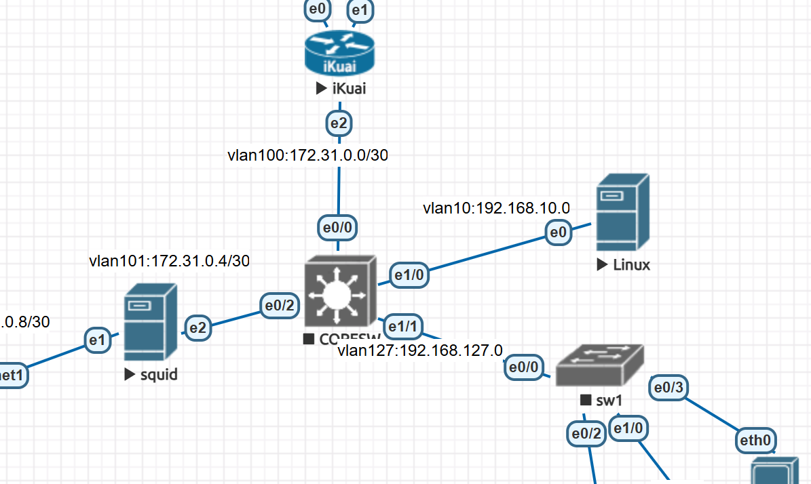

# 第1节. 网络基础





core-sw：

```
en
conf t
no ip domain-lookup

vlan 100
vlan 101
vlan 10
vlan 127

int e0/0
sw mo ac
sw ac vlan 100

int e0/1
sw mo ac
sw ac vlan 10

int e0/2
sw tr en do
sw mo tru
sw tr all vlan remove 1

int e0/3
sw mo ac
sw ac vlan 101


int vlan 10
no shu
ip add 192.168.10.1 255.255.255.0

int vlan 100
no shu
ip add 172.31.0.1 255.255.255.252

int vlan 101
no shu
ip add 172.31.0.5 255.255.255.252

int vlan 127
no shu
ip add 192.168.127.100 255.255.255.0

ip route 0.0.0.0 0.0.0.0 172.31.0.2


```


sw1:

```
en
conf t
no ip domain-lookup

vlan 127

int e0/0
sw tr en do
sw mo tru
sw tr all vlan remove 1

int e0/2
sw mo ac
sw ac vlan 127

int vlan 127
no shu
ip add 192.168.127.101 255.255.255.0
```


dnsmasq.conf

```bash
strict-order
no-resolv
dns-forward-max=2048

server=/poe.com/8.8.8.8
server=/google.com/8.8.8.8


server=223.5.5.5
server=114.114.114.114

address=/autodesk.com/127.0.1.123
address=/js-agent.newrelic.com/127.0.1.123
address=/teamviewer.com/127.0.1.123

####################################
listen-address=0.0.0.0,192.168.10.2,127.0.0.1
#cache-size=150000
#log-queries
#log-facility=/tmp/dnsmasq.log
#log-async=50
conf-dir=/etc/dnsmasq.d


mkdir /run/systemd/resolve/
touch /run/systemd/resolve/stub-resolv.conf
echo nameserver 127.0.0.53 >>  /run/systemd/resolve/stub-resolv.conf

systemctl status display-manager
systemctl stop lightdm


```


dhcp

```bash
vim /etc/dhcp/dhcpd.conf

apt install isc-dhcp-server

authoritative;
ddns-update-style none;
ignore client-updates;
default-lease-time 129600;
max-lease-time 259200;
option time-offset  -18000;
log-facility local4;


subnet 192.168.10.0 netmask 255.255.255.0 {
        }


subnet 192.168.20.0 netmask 255.255.255.0 {
        option routers   192.168.20.1;
        option subnet-mask  255.255.255.0;
        option domain-name-servers 192.168.10.2,192.168.10.3;
        range 192.168.30.2 192.168.30.200;
        }
        
host xiaoming {
        hardware ethernet e4:b9:7a:ea:6f:e9;
        fixed-address 192.168.30.71;
        }


vim /etc/default/isc-dhcp-server
INTERFACES="eth0"

mkdir /run/dhcp-server
chown dhcpd.dhcpd /run/dhcp-server

exec dhcpd -user dhcpd -group dhcpd -f -4 -pf /run/dhcp-server/dhcpd.pid -cf /etc/dhcp/dhcpd.conf

systemctl restart isc-dhcp-server


去交换机上配置中继
int vlan 20
ip helper-add 192.168.10.2
ip add 192.168.20.1 255.255.255.0


```


https://blog.51cto.com/mmx123/6413008

制作linux9.4镜像👆

