# 第2节. 网络架构

网工，略

# 工作案例-如何监管开发内网的url访问

传统防火墙里的url功能，开源如何实现呢

关键词squid，架构搭建opnsence

**系统学习**https://www.cnblogs.com/weq0805/p/15242170.html#_lab2_0_0

学习记录

squid作为opnsense的一个插件，所以要全面连接这个插件，还是要进行**系统学习**

1、squid作为正代使用的，反代就是nginx、haproxy、f5、lvs直流；而正代做代理的用户clients

2、squid虽说是正向代理，但是也有反代，它的反代就是指的本地加速缓存，访问过的网页站点就有缓存，下次用户直接读取，无需去互联网索取。这就是squid反代的体现。

3、肯定是透明模式落地拉，不用用传统的client也就是pc上设置代理的方式的，不过手机端也许可以灵活测试把这个传统模式用起来。恩灵活还是传统模式，不然手机还得网关上配置PBR。或者防火墙配置PBR之类的。

按照上面的网站走

1、systemctl服务自己弄

2、透明代理的dns自己处理

dns同样配置squid的内网IP，192.168.127.144

但是请求失败，查找原因，找到了👇

这里将dns请求转发的哦VM的虚拟网关

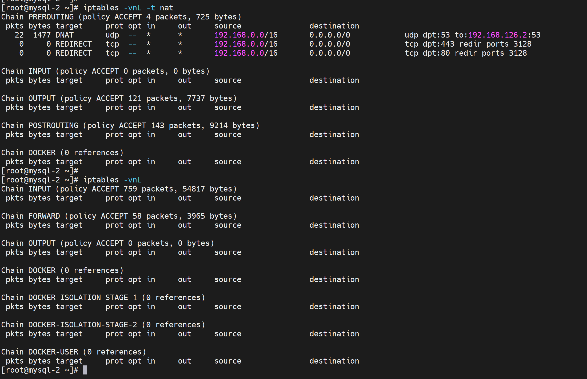

通过抓包可见，dns请求出去的ip是内网IP127段的，126.2回包进不了来的，VM的host网络。

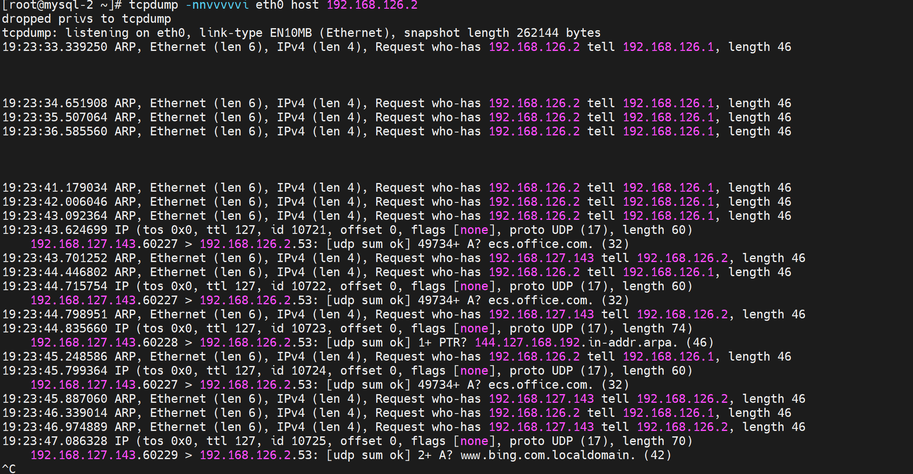

只需要iptables 做SNAT就行了

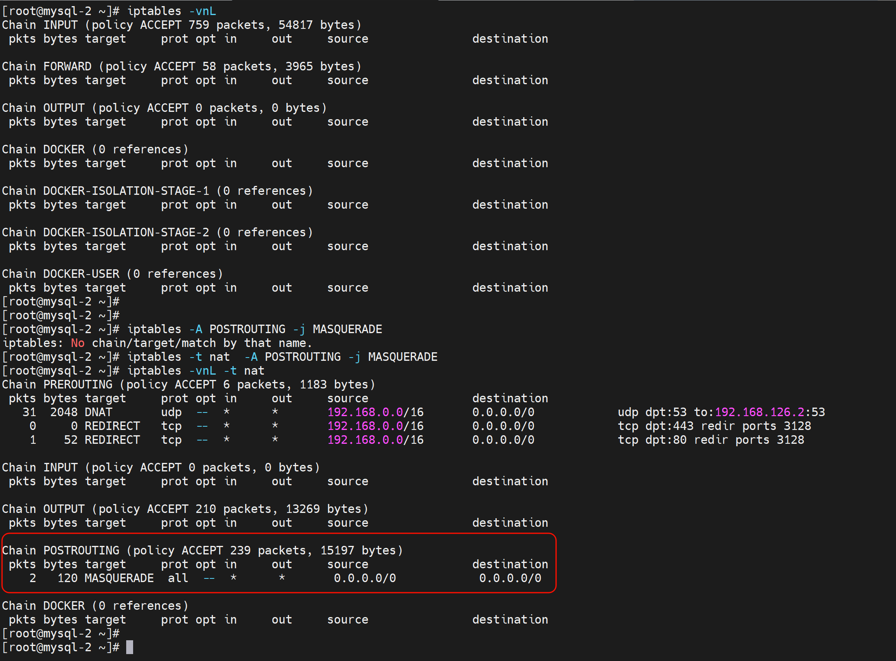

这不就OK了嘛，所以不要加班搞，不要加班搞，贪狼入命的人，不管干什么都要注意节制：打游戏、看小说、玩、研究技术、学习，唉学习不会，看来学习养人啊，哈哈哈。学习也会的，昨天要是继续不下班研究状态就不好，又伤身。所以贪狼入命一定要小心。

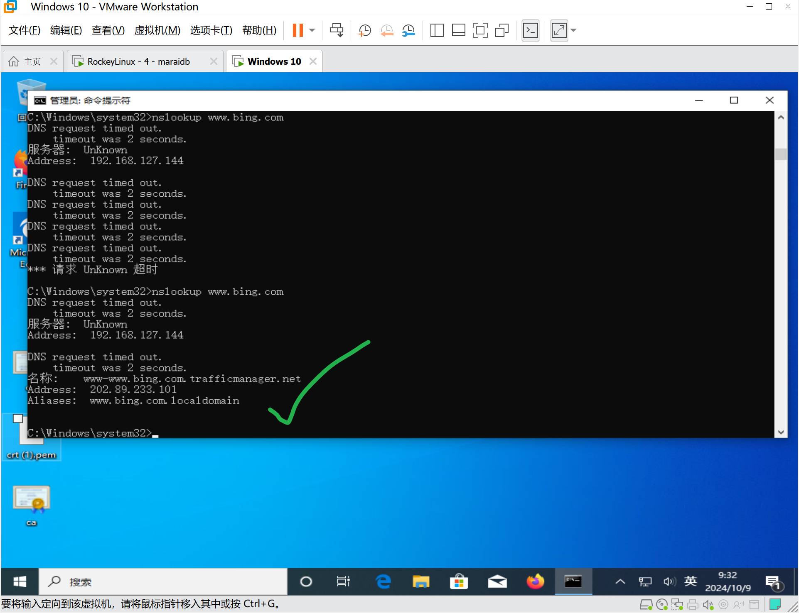

再把dns得iptables改成本地3128端口去，尝试模拟传统模式也就是client windows配置代理--sock5肯定是了，因为传统模式也是把dns代理出去得---10.2那边抓包看到了。

关于传统模式和透明模式的dns处理

1、传统模式，代理里的写法其实就是sock5，包含udp的，所以dns也是走的3128squid，suqid机器再给你去10.2本地dns请求的

2、透明模式，iptables 转的，所以出去将udp 53转到本地10.2的dns，同时出向也要做SNAT，否则外界没有内网host网络的IP路由的。这里的外界是VMWork Station的虚拟网关

3、网络结构：windows-192.168.127.143-----host网络-----192.168.127.144-squid代理-192.168.126.134-----NAT网络-----192.168.126.2虚拟网关也是虚拟dns-------192.168.10.2DNS

4、哈哈网络结构上的比较晚，没事，基本都是常规结构。

继续报错

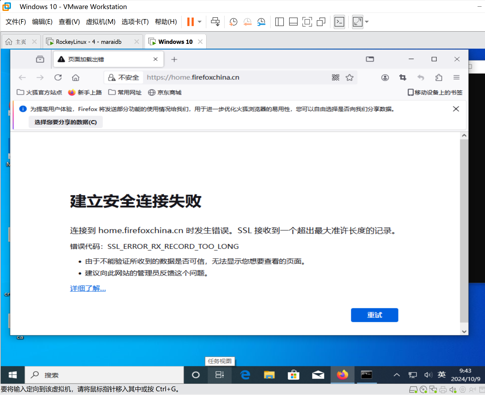

可能是MSS没设置，不是

可能是squid的 http_port 192.168.229.60:3128 transparent  配置有配置

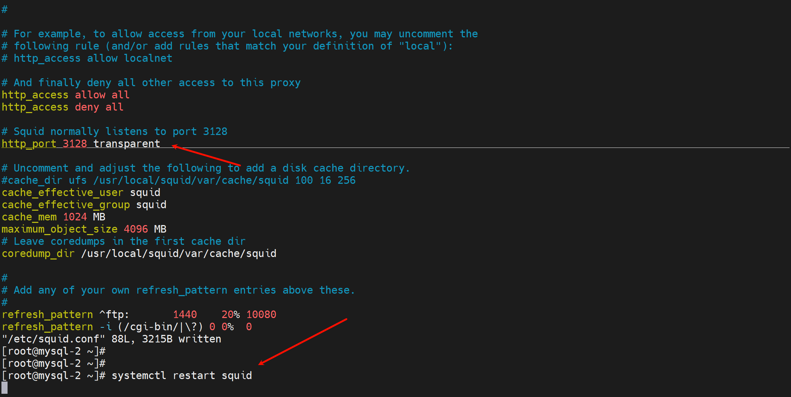

搞不定，透明模式还是有问题，回去开启opnsence看人家的squid是怎么玩的的，那里我是折腾好了的

然后看到AV防病毒

https://docs.opnsense.org/manual/how-tos/proxyicapantivirus.html

AV也需要透明代理，这里是老的opnsence集成web proxy时候的说明，正好可以拿来对照squid web proxy插件时代的配置项👇

https://docs.opnsense.org/manual/how-tos/cachingproxy.html

这一篇也要看

https://cloud-atlas.readthedocs.io/zh-cn/latest/web/proxy/squid/introduce_squid.html

# dns的坑，也许不算坑

但是会干扰你的排查故障，这也是致命的，你会人为是dns相应慢，其实不慢。

### 1、现象

windows cmd  nslookup 2s延迟

windows cmd dig 无延迟

linux nslookup或dig 都无延迟

上截图

windows nslookup 每次都慢

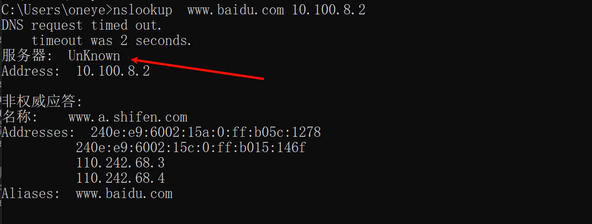

windows dig 每次都快

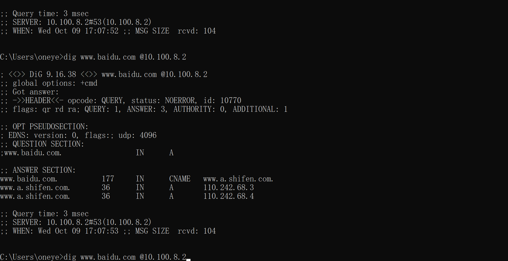

linux 不管是nslookup还是dig都ok

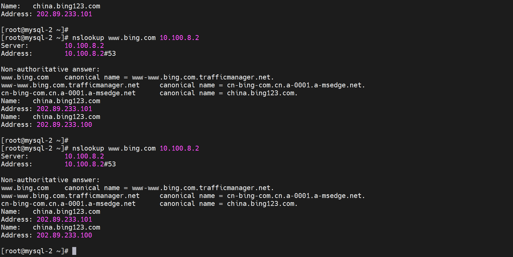

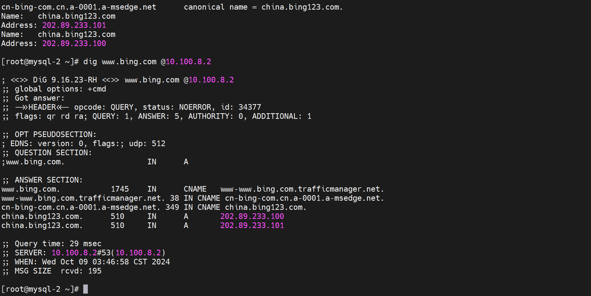

### 排查，去dns server抓包可见

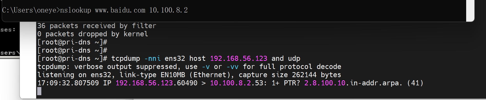

windows的nslookup 每次会多出一步PTR反解

而windows的dig，linux的nslookup、dig都没有这个PTR

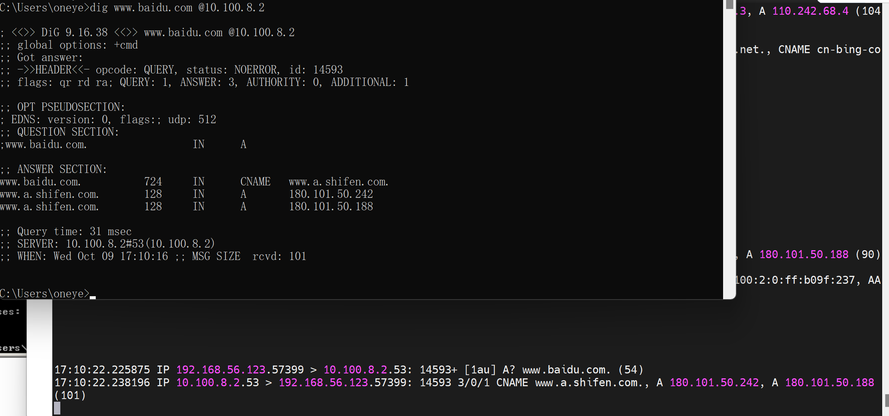

为什么同一台PC nslooklup  10.100.8.2 有PTR，nslookup  192.168.10.2没有PTR，

**因为下图的Unkown就是原因。去给10.100.8.2配置hostname就行了**   PS: dig不管什么OS都不会，然后linux的nslookup也不会

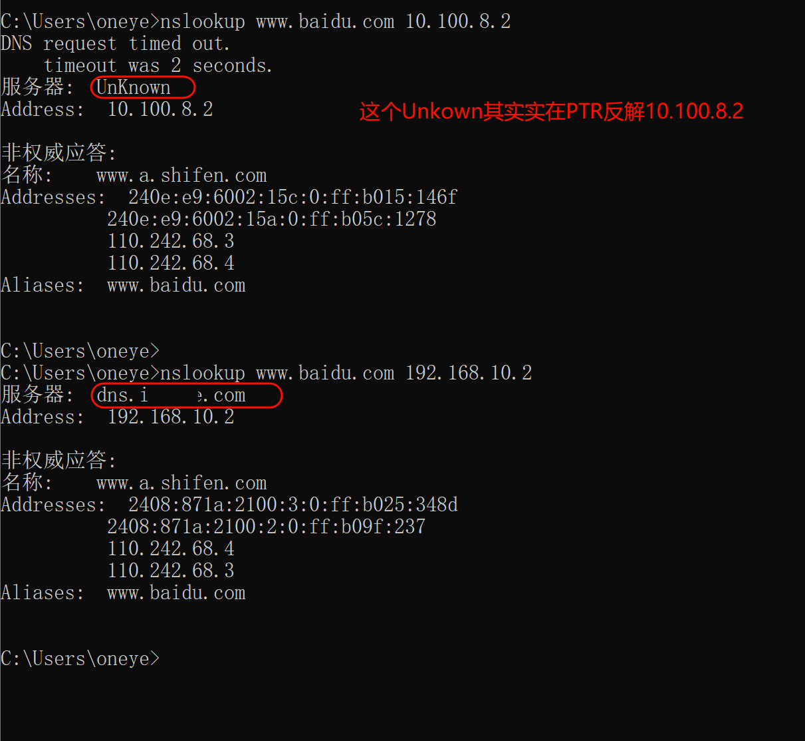

补上dnsmasq的/etc/hosts的A记录同时也是PTR记录就行了

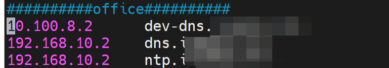

搞定，不卡了

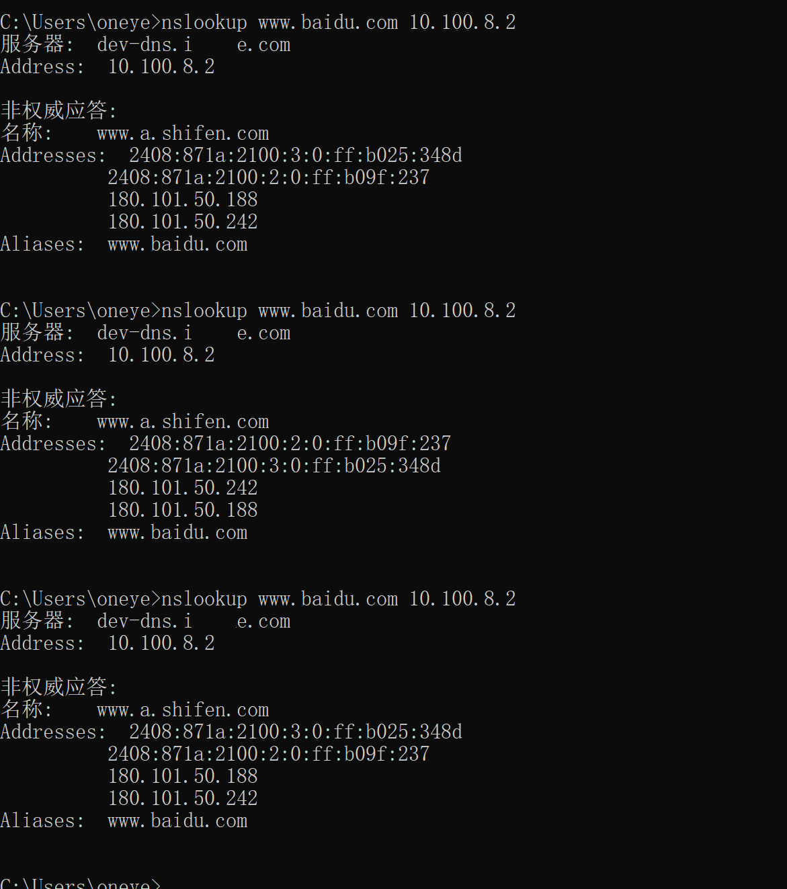

继续读文

https://cloud-atlas.readthedocs.io/zh-cn/latest/web/proxy/squid/squid_socks_peer.html#sockssquid

这里调一下，写错了👇

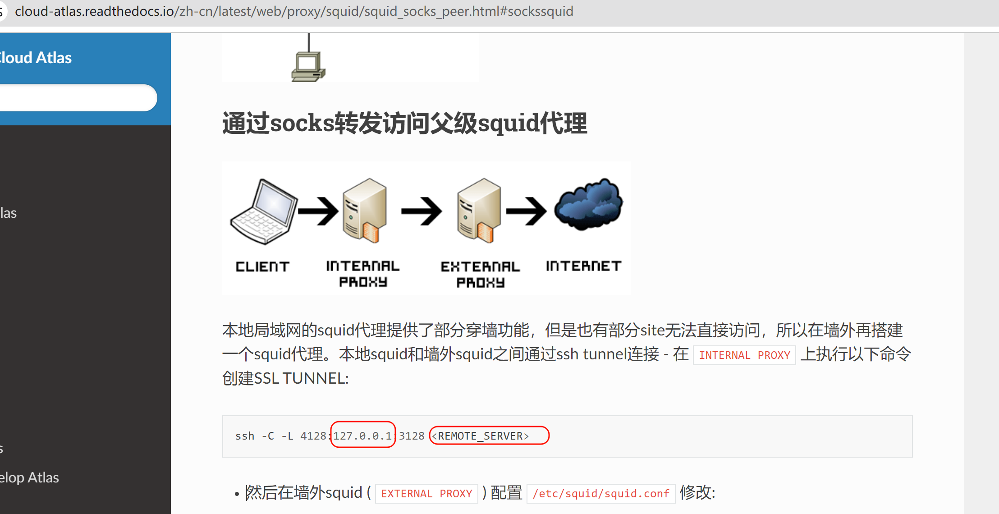

然后读文

https://cloud-atlas.readthedocs.io/zh-cn/latest/web/proxy/squid/squid_gfwlist.html

里面提到的gfwlist是国外IP地址，而且txt里也是处理过的，看不到具体ip地址

还不如用国内IP LIST，对吧除此之外的就走节点出去

https://gitee.com/haiyangyu/CN_ISP_RIB/tree/master

