# 第3节. TCP&IP

网工，略

略不了，这里面东西有点深，不过一般用不到，先放几个图，后面再说

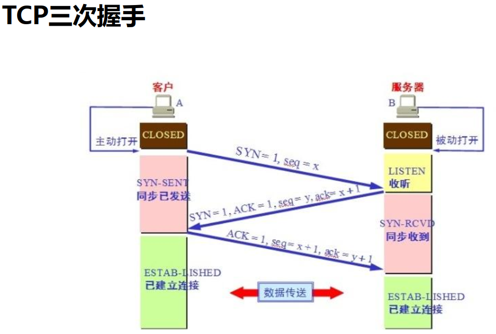

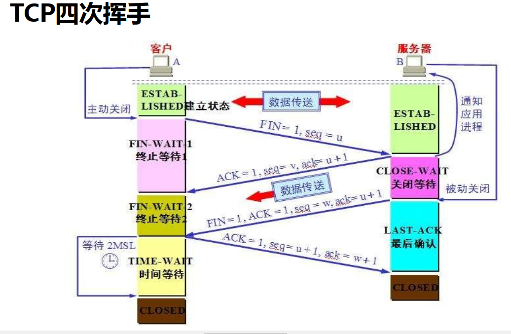

还有滑动窗口、慢启动、重传机制等

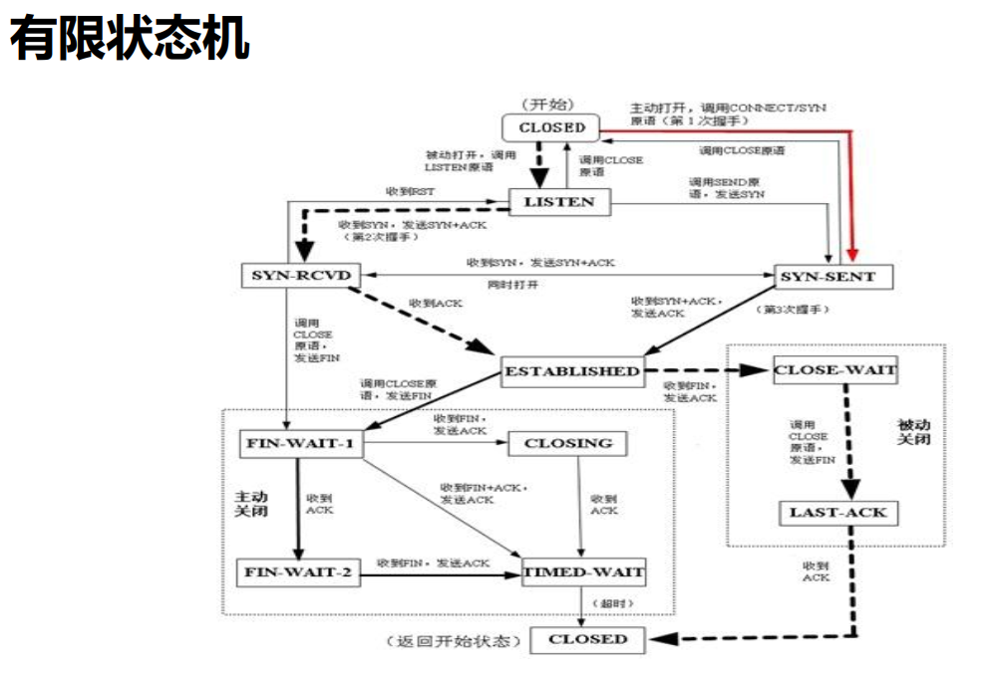

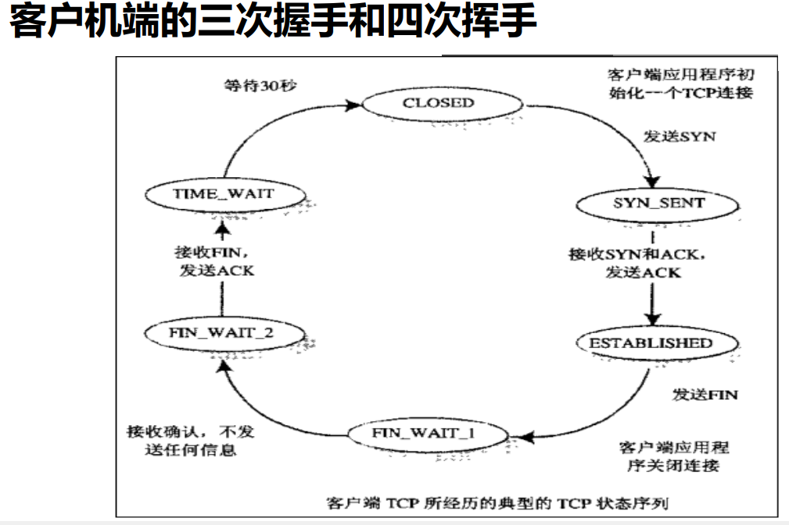

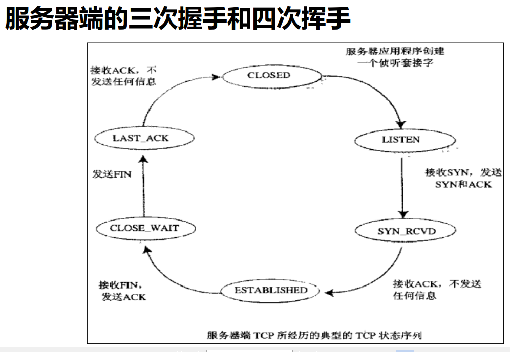

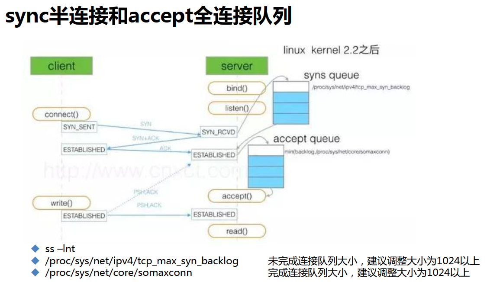

accept()是app及时提取全连接队列的函数吧，如果处理不及时，也会造成全连接队列拥塞。

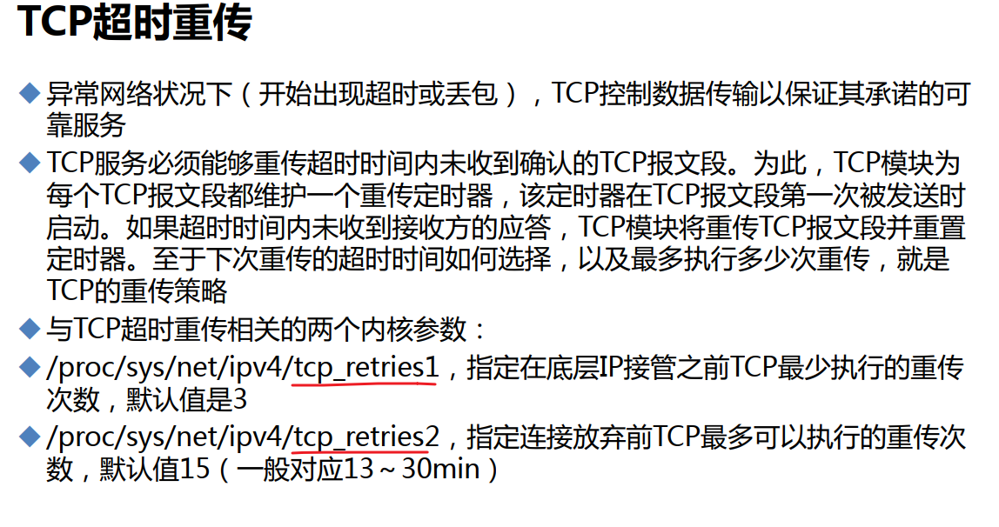

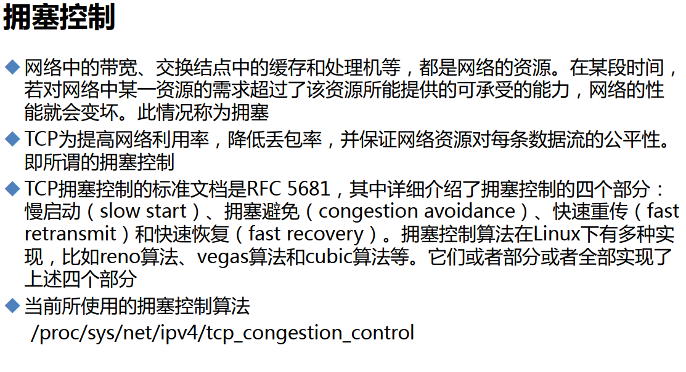

这块应该叫linux的网络内核参数文件以及调优，需要整理的，可参考小林codding这位的。

还有之前的一个tw内核参数，针对NAT后买的时间序列问题的，也会导致丢包的情况。

还有nginx的限制并发等。

服务器禁ping除了云上的安全组、服务器本身的iptables、还有内核参数

 

0表示不忽略，就是可以ping通，echo_ignore就是忽略icmp的echo

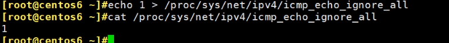

此时ping就卡住不动了，就是不通了嘛

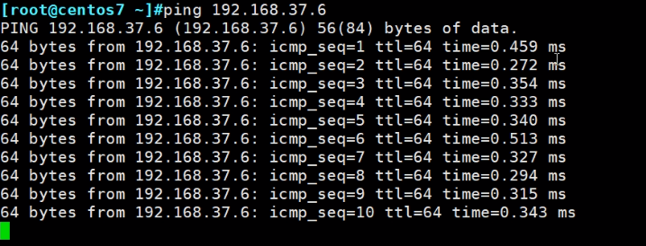

再改回0就通了，可见中间丢了几十个包

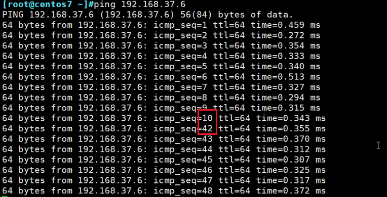

ttl判断系统

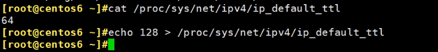 

之前是64，现在是128了。

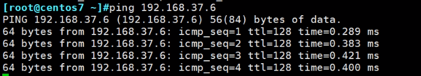

