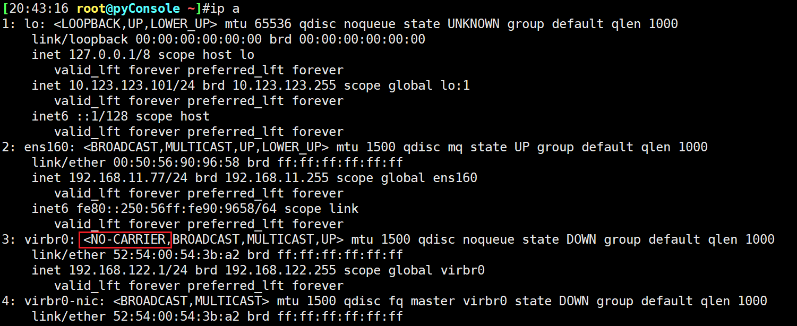
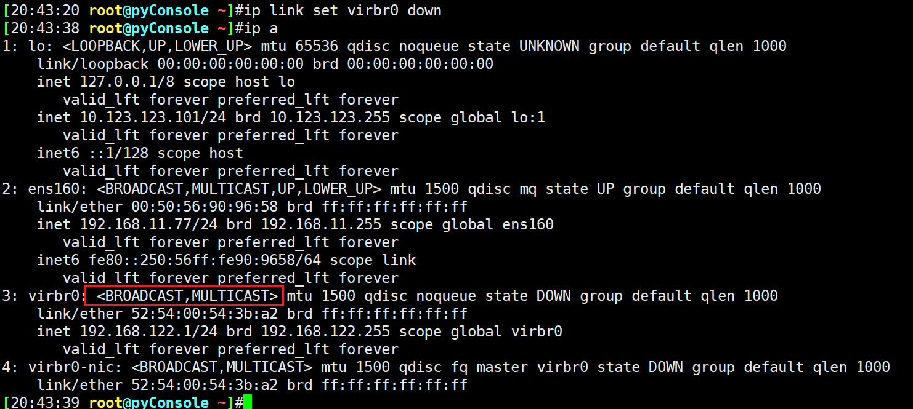
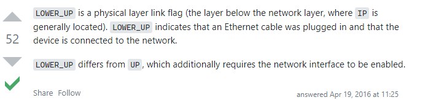

# 第5节. linux的网络和路由配置管理


## 修改网卡名-方法1-网卡驱动模块

研究下为什么是eth1，怎么改，这是centos6的：


 


可见eth0已经被某个mac占用，所以现在看到的就是eth1了。

删除并修改


修改后，重启网络服务是不行的


要修改eth1这个名称，需要卸载网卡驱动，并重新加载驱动。

mii-tool 查看

 

查看网卡驱动

 


 

👇找到了驱动模块

 


lsmod 是找到加载的所有驱动模块

 

卸载模块用rmmod或者modprobe -r

 

网卡模块卸了也就是网卡驱动卸了。

此时网卡就自然看不见了

 


然后再重新加载模块(驱动)：

 

此时就改为eth0了

 


## 方法2-ip子命令

ip 子命令，在centos6上tab不出来，centos7可以

 

centos6要额外安装软件包才能支持tab键补全


## 网卡配置

1、setup 进去选-选-选 等价于system-config-network-tui  # 这两种方法就是算了，而且在centos7里setup里也没有网络配置选项了。

2、重点看命令和配置文件


 

ifconfig过时了，擦

主要是因为net-tools这个工具包过时了，所以包里的很多比如ifconfig、netstat都过时了。

 

 


 


推荐你用iproute这个包


ifconfig直接回车看的是激活状态的网卡

禁用和激活

 

ifconfig eth1 down 禁用eth1网卡

ifconfig 就看不到eht1，ifconfig -a 可以看到eth1但是IP没了，ip a就看的更清除了


ifconfig eth1 up启用


禁用网卡还可以ifdown eth1

 

不过这种down和刚才的ifconfig eth1 down又不同了


这个ifdown 后，ifconfig确实可以看到的，但是没有地址。

这个ifdown属于网络层的down，IP没了但是数据链路层是通着的。

对比ifconfig属于数据链路层的down。

所以ip a看就会发现是UP的，所以ip a看的就是L2链路层咯。


```shell
1、ifdown\ifup是L3层的up\down， 这个ifdown后ip a看还是UP的

2、ifconfig down\ifconfig up是L2层的up\down，这个ifconfig down后ip a看就是DOWN的

3、ip a看的是L2的up\down

4、还一种是物理层的down，就是拔网线了

5、ip link set eth0 down 也是可以的，一样是控制L2的up和down，见下图👇

6、几个关键词：LOWER-UP和UP的区别、NO-CARRIER DOWN和DOWN的区别
```





https://stackoverflow.com/questions/36715664/using-ip-what-does-lower-up-mean




ifup 要起来还需要依赖一些网络配置文件，所以ip a还是看不到地址


没关系，在centos6上用service NetworkManager restart就可以了。


把网线的演示

 

这就类似拔网线了

1、ifconfig看就没有地址了

 


2、ip a看就是down

 

此时上图👆就能判断是网线拔了，而不是其他的，因为有关键词NO-CARRIER。

对比ifconfig eth1 down的描述信息

 


## 配地址-临时

 


## 清地址-临时


## 增加地址-临时

就是huawei里的sub地址咯，或者是思科的second ip。还一种是子接口，子接口在linux里是一种别名

```
ifconfig eth1:123 1.1.1.1/24
ifconfig eth1:321 2.2.2.2/24
```

ifconfig可见

 

这里不涉及子接口的vlan id封装解封装，直接就能和外界同样的IP进行通信，所以我感觉更像是second ip而不是子接口。


### 删除linux的子接口

ifconfig eth1:123 down


这个down掉就是删除子接口了，这里就称之为linux的子接口咯，虽然它没有vlan的概念。

 


## 混杂模式

抓包的时候就用的混杂模式

混杂--不管这个数据是否给我的，我都收。

https://cloud.tencent.com/developer/article/1439013

VMwareWorkstation的话有时候需要手动修改centos的接口为混杂，原视频中我没有找到当时老师的操作，不过理解后也能自己设计一个场景，所以这里就仅仅提示下。

https://blog.51cto.com/nizhuan/724081貌似桥接模式就是混杂模式了。


## mii-tool 工具


上图说明

capabilities 是支持的能力比如FD就是full duplex；HD就是hafl duplex

第一行就是协商后的当前工作模式是千兆全双工


## ethtool 工具


网线8根线，如果断了一根运气好，还能用就是100M，👆这里就可以检查到。但是要注意如果是vmxnet3的网卡，ethtool看到的就是10G速率，虽然实际上是1G的。所以这里的速率显示显然不是实际值。


ehtool可以修改网卡工作模式，一般不改


CMD的grep

 

例子，查看多少人连到我的VNC上


第三列就是client IP地址


### 常见服务端口

cat /etc/services


一般客户端电脑不会使用1W6+(65535-49152)个端口，但是如果你这台linux或啥系统的电脑是作为代理上网，比如SNAT，那么1W6+也不是没有可能，因为1台内网的PC大概10连接，1000台PC对吧，再加上手机，还是有可能让你的这台NAT服务器的端口超出1w6+这个默认值的。


如果要当代理，这个端口就要调大👆

实际情况是60999-32768=28231个随机端口。


## TCP的序列号问题整理

数据包的序列号，并非0，0是相对编号，应该是初始ISN，好久不碰了有点忘了都，而是下面的97fa6e02

再CISCO的安全方向里ASA的里面有一个SN、ISN的利用。然后linux的tw内核参数


还有一个问题，一般出现在网吧、公司这种NAT环境

https://blog.csdn.net/enweitech/article/details/79261439

文章讲的太细，简单的故障处理就是

```
“之前的偶尔打不开是因为开启了一个tcp相关的内核参数, 办公网都是nat出去的, 数据包时间戳的抖动会导致服务器把请求给丢弃, 迁移之后的 oa单点登录, 虚宝网等我都把该参数关闭了, oa.sm.xxx 这个不在迁移的机器中, 刚刚修改过了, 后续在观察一下”   -- 这个是案例，呵呵。
```

https://ppabc.cn/1363.html

 

这个篇针对性强，说的是时间戳。


## tcpdump的举例-整理稍后

  


上图👆是drop后的一个抓包结果，可以看到很多的[S]，这就是SYN包，是重传机制导致的。

其实更多的时候，我一般就是抓个端口然后|grep 哈哈，是不是没想到，哈哈


 

|前导码+开始符|DA|SA|TYPLE/LENGTH|DATA|FCS|   一共72B的最小值。

ping 默认就是64也即是没有算开头的8B。

附上之前的一个分片解析图


## TCP超时重传


## TCP的拥塞控制

四个机制

慢启动、拥塞避免、快速重传、快速恢复

 


https://allen-kevin.github.io/2017/12/21/TCP%E6%8B%A5%E5%A1%9E%E6%8E%A7%E5%88%B6%E4%B9%8BCUBIC/


## 并发ping-首推方法


```
seq 1 255 |xargs -i -P 0 bash -c 'ping -w 2 192.168.25.{} &> /dev/null && echo 192.168.25.{} icmp allowed'
```

还有awk的并发ping，想不起来了，没影响了。


这个也快

```
ls --hide=proc | xargs -i -P 0 find /{} -name "sshd"
```


## awk的举例


```
tcpdump -i eth0 -tnn dst port 443 -c 100 |awk -F "." '{print $1"."$2"."$3"."$4}'|sort|uniq -c|sort -rn|head -n20
```


我之前说过awk和xargs一样快，ping的处理上我怎么不记得有做过呢，肯定是有过的，现在想来是写个for循环awk调用系统命令，但有这么复杂吗，当然其实不复杂，我是说之前的awk实现批量ping 是怎么弄的？


还有好多工具类的使用iperf 、curl、F12等等，这些就算了，不放到这里了。


## 广播的情况


👆ping 255广播只有一个37.2响应，因为linux默认是不响应广播ping的，需要开启

 

1就是忽略，就是不回应，改为0


centos7上一样，centos8也一样


从默认的TTL上可以判断37.2的ttl是128，是台windows机器；37.7和37.6是linux机器。

注意上面这个实验，要在同一个网段做哦，原因很简单，就是跨网段，的192.168.1.100去 ping -b 192.168.10.255，这个广播是不会有任何回应的，因为3层转发广播不转发的，这就是CCNA里的基本概念--广播域--二层广播帧所能到达的范围就是广播域，显然二层广播帧的广播地址全FFFF-FFFF-FFFF显然要比192.168.10.255这种L3广播地址映射到二层的广播MAC地址还要厉害，连这种真广播都跨不了三层，你凭什么能ping通呢，至于为什么垮不了，因为数据要从二层拆包，到三层，再重新封包，这个过程就算3层路由器设备处理广播----其实真可以处理的，CISCO SECURITY 里有个攻击就是用广播做的好像，需要路由器转发广播的。

## loopback

略，注意下图


人为将linux的lo环回口改成6.6.6.6/24 ，这样这个段都处于loop，并不是说必须是127。


这里也可以写IP地址，不一定写lo


## 网卡配置文件

 


name将来就表现为GUI图形界面里的eth0

 

 

改的玩下，

 

BOOTPROTO=none也行都是静态手动配置，BOOTPROTO=dhcp就是动态

1、注意一旦写了dhcp，后买手动配置的IP地址，DNS就会被覆盖了；

2、文件其实就是脚本用的，前面其实就是变量，变量是区分大小写的，然后=左右不能带空格；

这块书上讲的更全，所谓全其实也就是下发明细和下发默认的一些优先级问题。

还能精简成如下3行，再补一个GW和DNS1

 

改完配置文件后，一般不会立即生效，有时候会立即生效，那是因为NetworkManager服务，不过这个服务不是时刻都能立即发现你修改了文件然后使之生效的。而且这个服务一般也不用都是关掉的。最小化安装好像也是没有的。说反了，一般是我们只用network，但是rocky-linux和centos7最小化安装后好像rocky-linux是没有network服务只有NetworkManager，然后centos7的network是fail的NetworkManager是active的。好奇怪~没事，停用禁用NetworkManager后就可以启用network服务了。


看来rocky-linux不喜欢这个。centos8一样，


## linux开启路由功能

注意临时修改是用的echo，vim是不能编辑内存里的文件的

 

vim是改磁盘文件的，不能改内存的数据。


## mtr的使用

mtr可以选择icmp tcp udp的，这点要知道，然后我的处理，是通过crontab去弄，大概如下

 


基本上如果curl的效果不行，就自动触发mtr得到报告，不过with os.popen这种阻塞的方式，在网络质量不好的清苦下，会造成cpu负载高的，因为太多的阻塞等着运行了。网络好就不存在了，30s不到就mtr完了，或者都不会触发mtr。


## frr可以弄一下

 

frr替代quagga了好像


vyos、led、openwrt、strongswan、openswan、routeros、

vyos的ipsec vpn--police的，存在支持上限的问题，未尝试解决、未升级测试是否得以改善，其他功能OK，由于没有大并发，性能未得到测试。


openwrt里的strongswan在旁路模式下，也不知道是我的TP-LINK物理网卡问题还是旁路的问题，反正隧道存在丢包，游戏时存在断线重连的情况，效果不好，未尝试继续改进。


softher vpn这个不多说，emm，真心不错，一键搞定IPSEC、openvpn、pptp、l2tp。其实远程办公，还是要考虑授权、限速的问题，如此衍生出的IP静态分配，等就不是简单使用softehter来实现，从这个角度还不如自己使用开源来弄，顶多写一个脚本来做统一的多协议账号开通。其中openvpn就是要使用radius和mysql或者ldap之类去做，这个不用这么麻烦，直接配置文件里指向一个脚本验证 一个存放用户名密码的文件就行，具体见我的印象笔记的相关模块。


其他还有什么clash、向日葵、vⅡray是吧，哈哈。emm有时间都要整理出来。这些东西可不是仅仅那个作用，可以用来做远程办公，而且客户端软件效果好，openvpn嘛还不必clash的节点测试效果，切换方便，如果公司4个出口，统一到clash就很不错，需要考虑的时clash他后面要自己搞成静态IP，然后用户授权啦--最好是账号密码而不是profile配置文件这种不太好管理的。东西用来做远程办公确实可以研究下的。让技术更好的服务正规需求是我们要考虑的。


不过这里建议大家先从提高收入左手，而不是大量研究这块，恩业务需求的满足，完成就好，完美不好。70个完成远远大于40个完美。


