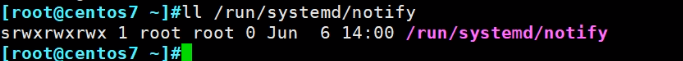
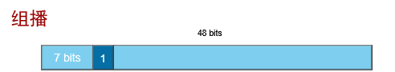

# 第6节. 网络配置和故障拍错

## netstat

那啥ss可能会更好些，netstat也学一下吧，好像mac里用的也是netstat这个命令

 

套接字socke分2种

1、ip+port，tcp或者udp都是这种；

2、unix domain socket，这种就表现为socket文件。

 

s开头就是socket文件

这类的socket文件也能实现和tcp/ip 这种Ip+port的类似的通讯效果，可以实现多个进程之间的网络通讯，问题来了：是本地还是远端呢？

1、两个程序如果处于不同的主机也即是远端通讯，可以使用tcp/udp的socket--ip地址加端口号；这种通讯存在一个封装解封装问题。

2、如果处于本地--同一台机器，就没必要封装解封装的过程了；可以考虑采用这种unix的socket，两个程序想通讯，就把数据扔给socket文件，通过它中转就行了。

### netstat说明

-n 不解析地址为域名，端口为服务，这个是常用的

-t和-u就是tcp和udp咯

-l是看监听的，不是看ESTABLISH的。👈

这就是看打开了(监听了)哪些tcp/udp的端口。

1、注意上图，TCP是有状态的，所以显示LISTEN；而UDP是无状态的 所以没有显示什么LISTEN字样。

2、如果发现有些端口不是我们需要的，可以找到该端口对应的应用程序，然后卸载掉。怎么找呢，就是加个-p或者👇

### 如果知道端口对应的APP

lsof

可见6000这个端口是x11这个图形界面软件在用。

netstat -p或者ss -p，当然要辅以其他选项

 

切到init3就是纯字符界面，就没有x11了，

### netstat -e 是extend，会显示节点编号inode

### netstat -ntua ，a就是监听和连接的都会显示

### 常用组合

这个还挺不错，我是说netstat -nr，它可以看到MSS和window，MSS肯定就是4层传输单元了MTU\MSS一类的嘛，window就有点不能理解，TCP的滑动窗口也不至于写到路由表里吧，而且窗口还是动态的。网上搜一把没找到，转头进入man netstat 然后" + -r"看到👇

然后进入route的man帮助

你看他这个route只有一个8.gz的man，所以不需要man 8 route，哈哈我是不是太无聊了

瞬间找到了，还真是窗口，不过是AX.25的，所以那啥，MSS再看看搞不好也不是动态测试的，而是设置的

默认就不显示咯，MTU1500嘛MSS就是|DA|SA|TYPE/LENGHT|DATA|FSC

DATA： |IP|TCP|DATA|  MSS=1500-20-20=1460，一般就这么算吧，不过遇到ASA拨号的时候，L2的DATA就是|da|sa|type|pppoeHead|pppHead|ipHead|tcpHead|mss，此时的MTU=1500-6-2=1492这个是对IP层的整个报文限制了，所以MTU是L2对L3的一个限制，你在ASA上要敲的MTU就是1492，然后MSS就是1492-20-20=1452。注意哦MTU是二层对IP层(L3)的一个限制，限制的是整个IP报文长度，限制产生的效果就是IP层会自己去分片，怎么分的上一篇已经讲过了ping -l 1502的分片计算有讲。而MSS的源头也是MTU，但是MSS是TCP里的DATA的上限，这一点不可类比于IP的整体长度限制。恩其他还有PMTU discovery地理发现贫道~恩没有广告~所以在有电视那会还是基本爱调在这个台，哎~俱往矣，属温馨伐木累还看还看还看还看555...哈哈哈我能把人气成这样也是我占着理拿着需，唉得饶人处且饶人啊，别人也是关心你。

我就直接引用别人的博客了https://zhuanlan.zhihu.com/p/139537936

https://blog.csdn.net/lepton126/article/details/70810316

https://blog.csdn.net/lepton126/article/details/70810316

### netsta -i 查看接口统计信息，访问量大不大

动态观察的方法

wathc -n1 就是1s刷新一次 netstat -i这个命令的结果

 

ping嘛就是1sping一个，但是-s 65507后同样也是1s ping一个，但是这一个要切片成N个咯，所以实际上1s发出的包就是N倍，所以此时再去看对端的watch -n1 netstat -i就会发现RX-OK增长的很快。

还可以更快，就flood的ping

这回RX-OK的增长就更快快快了

大包分片+ -f，够了哦~

这是WIFI，ping -s 打到了32Mbps

去看看有线

哈哈，瞬间打到250Mbps，1G的带宽也就是950Mbps吧，人家要叫了，哈哈。

这种ping -f打出来没有iperf的大，iperf同样的源目1G可打满950M的。

一些个性的命令写法

敲入：watch -n1 netstat -Ieth0

## ip命令

ip命令很强，用来替代ifconfig的

ip 后面加 选项，再加 操作对象；操作对象有 link | addr | 等等👆

在centos6上不能tab补齐，可以通过安装插件来实现，centos7没这个问题。

yum完后exit重新登入一下，此时就可以tab两下补齐了

 

ip命令主要控制的是link数据链路层、addr网络层、route路由

### ip link

查看MAC地址、网卡是否启用

MAC地址在网卡的rom芯片里的，真正要改需要借助设备烧入。

所谓修改就是修改配置文件了

  

发现没变~

为啥呢？

注意上上图的提示消息

由于IP地址用着呢，所以MAC地址也不给你变，restart可能不等价down + up哦，down一下IP地址就不是already in use了，试试看，并不是！

小改动一下MAC，试试

这会就改过来了

真正的原因可能是11打头的,HCIA里有讲，11:22:33:44:55:66正中组播地址。

 

尝试改一下 验证下

 

  

所以没电NA的知识，还真改不了MAC地址。

### ip addr查看网络层

 

这里也能看MTU，支持广播、组播

#### ip addr 添加地址

这个不是子接口嘛？

这种方式加的second IP，ifconfig看不到，ifconfig人家加的是子接口形式的

所以子接口+vlan就是我们网工所熟悉的路由器的子接口

然后second IP或者叫sub ip就是第二IP，就好比linux里的ip addr add 添加的地址咯。暂时这里理解先。

---

使用ifconfig给网卡加子接口，也叫什么别名，

 

man ifconfig可见👇

 

人家叫别名，叫second address，不叫子接口，哈哈，但是我觉得加上vlan就是子接口了，ip a才是正儿八经的second address。

用ifconfig看下

然后 ip a也能看到，

结论：ifconfig看的没有ip a全，怪不得推荐Ip a呢。ifconfig 创建的网卡别名 ，ip a可看，ip a创建的second address ifconfig看不到。

注意上图1.1.1.1/24 scope global eth1

2.2.2.2/24 brd 2.2.2.255 scope golbal eth1:2这中式别名。

然后ip a a也就是ip addr add也能添加ifconfig的别名

上图3.3.3.3加成了ip a 的second 接口没有加成ifconfig 的别名，修正👇

ip a有两种second address，①一种式非子接口②一种式子接口--也就是别名--这种ifconfig可查

注意广播地址ip a配置的，默认式0.0.0.0，哈哈这TM就不是个广播地址啊。

去查一下ip a里的两个second ip的说法

原来这个就是ip a为了兼容以前的ifconfig而设计的。

写到这，发现这一篇其实也可以直接就扔几个命令这就行了，哈哈，算了写完吧，好歹后面看起来舒服些。

### 清除所有地址

 

### 理解下scope

这里其实好理解link-local 对吧，就是Ipv4 和Ipv6 link-local，一个意思。TTL=1嘿嘿。v4和v6的区别就是v6的link-local在下一跳中起作用的，但是v4的link-local实际上没有应用场景--要说有就是网线直连169.x.x.x就通了，哈哈。

 

hosts是loopback口用的，主机地址，一般/32，也能对外发布路由互通，但是这里更多指的是127.0.0.0/24的回环检测地址，就是真正的本机可用了。所以上图的host更多的指的是127这种地址。

下面看看授课老师大佬的讲解，这就厉害咯

**1、global是内核级的**

这个就让我想到ASA 和 router的区别(在ping背向网卡地址的时候)，上图的ping在路由器上行，但是在防火墙上就不行，哈哈，可能就是用的link地址特性。

言归正传，上图这种能通，是因为IP1和IP2表面上是配置在网卡上，其实是工作在内核级别的。scope global就是这个意思。

**2、link，如果IP2改为scope link，上图左边进来的ping IP2 就不通了。**

**3、host，网络访问过来的都是不通的，只能自己访问了就。**

我们曾今做的loopback为1.1.1.1/32，一般思科的环回口对吧

其实linux一旦你改了地址，他就是global咯，所以主机地址这个称呼

### 主机地址这个称呼

1、在linux里指的是本地能通，网络不可能通的127.0.0.0/24

2、在华为、华三、思科里面指的是1.1.1.1/32,2.2.2.2/32这种32位主机地址，但在linux看来他们其实都是工作在内核的global地址。

实验看看

诺，scope不是你想改就能改的。所以实验中止~继续整理markdown。

### 用ip命令修改网卡名称

在centos6上是修改的文件，然后卸载重装了网卡驱动，上文就讲

在centos7上就没有这个文件了，怎么改呢

先禁用网卡

这样就改好了。

### ip route

