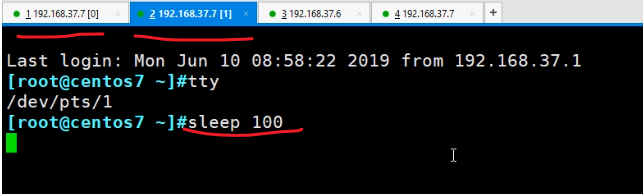
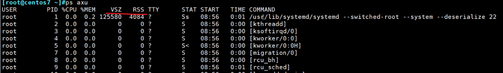
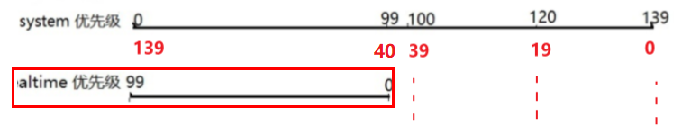

# 第2节. 进程管理工具


进程启动后，相关信息会自动放到/proc里


上图的1，就是systemd这个系统启动后的第一个进程。进去后一堆信息(比如内存、挂载等信息)通常不直接查看分析，而是通过命令去看。


ps 默认只显示当前这个tty线程的进程

 

再开第二个终端跑一个sleep

 

再开第三个终端跑一个ping


但是在第一个tty里，ps只能看到自己的进程


ps 特殊在，它是一个老牌Unix命令，支持3种风格的option选项

 

man 帮助种也是如此写道

 

```
- h   		unix风格
-- help  	GUN风格
h      		BSD风格
```

tar xvf  和 tar -xvf 都行


ps a查看各个终端窗口下的进程


a看不到守护进程，和终端没有关系的进程是看不到的。


ps x 查看并非所有进程，包含守护进程这种和终端无关的，也包含终端下运行的进程


？就是和终端无关的；终端下的也会给你显示出来的。


ps ax会多一些


ps u显示进程所有者的信息

顺便看下列标题


ping 一直在运行，但是不消耗CPU，time这一列0:00就是说占用CPU的时间片少。


ps aux 看所有进程的信息，包含守护、终端进程、带进程所有者


**▲插播-1 iptables如何实现代理**

这种方法不用动路由表，其实就好比windows的代理，就好比clash的“非<tun虚拟网卡模式>”，现在看下来这种方案更为灵活：

```
iptables -t nat -I SHADOWSOCKS 1  # 添加用
iptables -t nat -D SHADOWSOCKS 1  # 删除用
iptables -t nat -D SS -p udp -d 0.0.0.0/0 -j REDIRECT --to-ports 1080  # 删除具体


iptables -t nat -A SHADOWSOCKS -d 167.xxx.xx.xxx -j RETURN  # vpn的建立隧道地质得走本地网络出去

iptables -t nat -A SHADOWSOCKS -d 10.0.0.0/8,172.16.0.0/12,192.168.0.0/16 -j RETURN  # 私网

iptables -t nat -A SHADOWSOCKS -d 127.0.0.0/8,169.254.0.0/16 -j RETURN  # 本地回环和linklocal

iptables -t nat -A SHADOWSOCKS -d a.b.c.d/n -j RETURN  # 公司出口IP
iptables -t nat -A SHADOWSOCKS -d a.b.c.d/n -j RETURN  # IDC公网IP
iptables -t nat -A SHADOWSOCKS -d a.b.c.d/n -j RETURN  # 云上公网IP
iptables -t nat -A SHADOWSOCKS -d a.b.c.d/n -j RETURN  # 本地APP访问或者调用的外部IP，这些都是走本地网络，不走代理的。

iptables -t nat -A SHADOWSOCKS -d a.b.c.d/n -j RETURN  # 你要是闲的蛋疼，还可以加上所有国内IP地址段，你不怕CPU不忙对吧。

iptables -t nat -A SHADOWSOCKS -p tcp -d 0.0.0.0/0 -j REDIRECT --to-ports 1080  # 剩下统统走代理，注意UDP其实也需要代理，不过要排除UDP 53，同样TCP53也要排除的，这样一些新的QUIC协议就能应用了。
```


还差一个排除注意点，单个APP的她可能也会本地调用外界的公网IP(这个是不走代理的)，所以也需要排除。


▲**插播-2：业内趋势QUIC体验**

H3介绍：https://blog.51cto.com/u_14888059/3790697

https://network.51cto.com/article/625999.html

https://new.qq.com/omn/20210504/20210504A01Z1T00.html

谷歌开启H3：https://zhuanlan.zhihu.com/p/108198664

插件下载：https://chrome.google.com/webstore/detail/http2-and-spdy-indicator/mpbpobfflnpcgagjijhmgnchggcjblin

插件显示对比：绿色是H3，蓝色是部分H3没有H1，灰色是有H1。


企业微信有用QUIC也就是H3，CDN里也支持，谷歌youtube都支持--速度快很多

 


插播结束，继续linux的ps命令


ps aux看的较全，注意用户通常是root，也有非root，就是以系统账号运行的

 

切换用户看下

 


再来看下普通用户运行passwd的情况

 

发现既然是root运行的，其实这就是SUID的原因，前文已讲


所以ps aux看到的用户严格来讲是有效用户，是wang运行passwd后实际生效的运行的该命令的那个用户。


再看下ps aux的CPU占用百分比，基本都是0，搞一个不是0的。

 

 

单核是100%，两核就是200%


内存情况：



RSS是常驻内存，进程申请内存的时候，说是这么多，但并不是马上使用，所以RSS就是目前使用到的内存空间，而VSZ就是申请操作系统承诺给到的内存空间。

VSZ和RSS的单位都是以KB为单位的


tty ？就是和tty无关，不是终端上来的


STAT 状态就是进程的状态，运行态、就绪态等，其中

运行态表现为R，基本上看不到

 

因为你敲这个ps aux的时候肯定是运行态的嘛，同理


敲的就是这个命令，肯定会给你一个grep 的进程的，啊，ps aux里是没有sssss的，但是你既然grep sssss了就是要运行grep程序的，所以当下就有grep的进程了。

sleep 100 跑起来后也不是R运行态


pts /0就是不是当前的pst/0窗口


当前是pts/1终端，

好奇这个“TTY是?号非当前终端”的sleep 60哪来的啊？


这个sleep不是bash命令，估计是系统默认的，之前没关注过，我这个是centos8的，我去其他centos7上去瞧瞧还真有，rocklinux没有


最小化安装的centos7没有sleep这个东西


然后回到这个STAT 的R这些状态

 


大部分处于S休眠状态且是可中断的，

还有不可中断的休眠

T：stopped是停止态

Z：是僵死态

+：表示前台执行


 

```
l:多线程
```


 

会话表现形式有qq的一个窗口，浏览器的一个页面，而这些都是涉及到进程的，具体解释如下： 

  

https://blog.51cto.com/u_15015138/2555390


这个命令很棒，不过要区分一些ps f 和 ps -f


ps auxf 可见看见树形结构的，同级的进程，父子进程等信息👇


▲**插播-3**

hostname你真的不会改，具体如下：

https://blog.csdn.net/zhaogang1993/article/details/82769439


ps继续，START是什么时候开始的，TIME就是总的CPU时间(是按时间片分配的)


排序功能以及部分显示功能


ps o过滤

 

 

加上ax选项进一步显示所有终端的信息

 

 


按CPU排序，先搞一个消耗CPU的进程

 

ps aux k %cpu 可见排序是升序的--根据CPU的占比

 

降序怎么排，tac咯


cat和tac以及rev对不对~


上图是关闭图形界面的程序gnome，降低一些内存的消耗。


降序还可以这样


上图的--sort可以换成k的


在到centos6上看下具体的命令

 


 


 

-e等价于ax，在行数上，但是列上👇少一1列：

 


配合-F显示多一些


PID是进程id，PPID是父进程ID。

C列，表示CPU的百分比，不过是取整的。

STIME是开始时间

TIME是CPU的分配到时间片换算的累计使用CPU的时间


这个占用CPU的时间就比较多了。


```
老实讲有效和真正，并不能很好的区分两个选项的意思

-u就是程序最终谁来运行的，最终 执行 的 用户

-U就是程序开始时谁来发起运行的，开始 发起 的 用户
```

 

 

 


ps aux就看所有咯，然后但看wang用户的就用ps -u wang u，

-u wang是最终以wang用户来运行的程序

-U wang就是wang敲的命令，通常是SUID这种passwd带SUID所以wang敲命令，但是是以root运行的程序。


 

 

 

 


所以常见组合有

ps aux

ps -ef

其他就看上面的具体需求用哪个了


 

 

 

这是查命令的，敲的命令，如果时脚本呢？


直接ps -C f1.sh就行，还挺不错的 

  

 我的测试


再开一个终端，发现


并没有，赋予x执行权限再看，其实很简单，你是bash f1.sh跑的，自然要看bash进程，而不是f1.sh，你给了执行权限，直接f1.sh跑的就能看到了👇

 


注意. f1.sh这样也是看不到的


必须是f1.sh作为命令一样敲入的，而不是通过source bash 或者.来运行。具体再看看下面


bash xxx是通过bash执行的f1.sh，然后f1.sh里面又执行了ping


./f1.sh是通过文件本身什么的shell申明的类型直接执行的，ps -C f1.sh所以查得到


将bash改成sh测试把


看到没，./f1.sh就是直接执行f1.sh文件的，只不过是依据文件里定义好的shell类型去执行的，所以ps -C f1.sh就认


而换成source和.  的话又不一样了


也好理解，这两个家伙是直接在当前bash下以当前bash执行f1.sh的，不会再开启子shell进程。所以这两个家伙source和.你用ps -C bash是看不到的，因为这两种方式运行的程序他直接在当前bash跑的，所以层级比上面少一层，ps -C bash不会增加。就是这么个道理，老哥我研究得到位了把。可惜咱环境不care这些东西，呵呵。也不对，大厂的基本功也确实要求的。


再来，如果f1.sh里面就是光秃秃的一行ping 127.0.0.1

 


对比定义文件的shell后，就知道了，👆上图是文件里没有定义shell于是自动给你用当前的bash，下面是文件里定义了shell的👇，所以其实是跟着文件的shell走的，

ps -C bash和ps -C f1.sh分别查看上下两种情况，上图会多一个bash，下图是bash不多，多一个f1.sh，因为下图的shell是集成在f1.sh里的，是通过f1.sh开启的shell。

然后ps -C f1.sh上图👆肯定看不到，因为开了一个子bash；下图👇可以看到是因为是直接运行的f1.sh文件自然看得到，虽然文件里申明了shell的。


所以说一万到一千，

1、文件无执行权限

```
bash就是开启bash子进程
source或.就是直接当前bash跑的
```

2、文件有执行权限：①申明了shell；②未申明shell

```
./xxx.sh执行有申明，就是直接跑的是文件当命令执行的，利用里面的shell,跑的是文件本身；
./xxx.sh执行无申明，就是开启当前shell类型的子进程通常就是bash来执行文件的，跑的是bash；
```


**查看nice优先级**

 


-是用的系统优先级

-20这种就是nice，只是对应system priority的后面一部分[上一节里有讲]

 


  

这个不管是centos8还是centos7都是这个样子的，nice是**-20~19**没毛病

但是pri这个它实际上是翻转过来的system优先级，上图-20对应的就是39。

 

看到这我TM已经不知道优先级比小还是比大了，NND，搞这么乱的，不能统一下的吗！


通过renice调整ni值，既然是nice就只能是-20是到19之间了

-n是指定新的优先级

 

 


 

  


所以▲总结一波，ni是-20最优--比小，pri是139最优--比大。

但是官方自己都疏忽了


 


 

 

altime就是实时进程的优先级--实时优先级。


大部分进程都是nice优先级，实时优先级的少。


