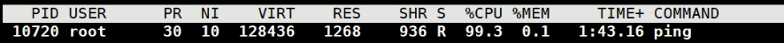

# 第3节. 进程管理和性能相关工具

  


查看某个终端tty下的进程

 


 

 

区分u和U，这个ps命令，上一篇里也有。


pgrep还支持正则

 

 

 

 

加上-l或者-a显示进程


pidof

 

虽然是软链接，但是功能不一样，也就是说，可以创建多个软链接指向同一个文件，但是每个软链接的功能不一样。


## uptime

dd if=/dev/zero of=/dev/null来消耗CPU然后uptime观察看下

 

 

load average这个数值也是进程数量的意思。

 

一个内核，一搬load average不大于3，所以24是可接受范围以内。

超过24就认为每个内核有3个以上的进程在排队，系统就非常慢了。


uptime一个是命令，一个是proc/uptime文件


单位都是秒，一个系统启动时长，一个是空闲进程总时长(按总CPU数计算的)。

 

平均下来每个CPU的空闲时间就是/8，7717秒空闲，8604s开机时间，所以大部分时候是闲着的。


w 命令和uptime也是重叠的

 


## top的一行也是uptime

 

所有进程个数是223个， 2个运行的，220睡眠的，0个停止，0个僵尸态。

cpus的分配情况，us用户空间占用了2.1%，sy内核空间占用了10%

 

其实us用户空间占用高才是好的，因为这代表着应用程序占用内核率高，而应用程序代表着生产力。

各种软件都是工作在用户空间的

从这个CPU的两个值就可以看出来，你的系统忙不忙，合不合理。


ni是进程的优先级调整

id是空闲，100就是cpu100%空闲，没事干。

wa是wait等待时间，有些进程需要等待资源的访问，准备好了才能运行。

hi是硬终端

si是软中断

st是被盗取的时间片

中断，就是打断了CPU的正常工作。中断什么时候发生呢？


看下用户空间-内核-硬件的模型图，


 


内核kernel和硬件的沟通就是通过 中断，比如键盘按一个键，内核就会捕获这个操作，用中断方式响应用户的请求。

当你每次在键盘上按下一个按键后，CPU 会被中断以使得 PC 读取用户键盘的输入。这就是硬中断，还有软中断，比如程序的异常 

 


st：steal，被盗取

早期的计算机操作系统，不支持不理解虚拟机里运行的进程，

windows任务管理器打开，看到当前进程，这些进程只是windwos里的进程，然后VMwareWorkStation里跑的进程占用的时间片，就被称为ST-被盗取的时间。


后面会讲KVM，类似于windows的VMwareWorkStation。


 

内存，总的、空闲、用了多少、被buff/cache占用了多少


然后top下面的主体部分


3s默认的刷新间隔，可改按s建后改。

默认是按CPU利用率高到低，显示的，测试，跑个dd ，top里就看到第一个了。



PID、用户名、优先级PR--这个PR是TOP的PR，它在linux优先级里的情况如下

 

NI就是nice优先级

VIRT是系统承若的内存、RES是实际使用的物理内存、SHR是共享内存

TIME+是总的CPU分配时长


 

OOM：out of memory内存泄漏

一般某个进程的内存不断在涨，就认为可能发生了OOM了。


 

 


-H显示这个进程下面打开的线程

使用pstree -p 找个多线程的进程PID

 

花括号就是多线程


 

这就打开了某个进程里的线程。

 

top -H -p \`pidof xxx\`  # 这个pid会不会pidof xxx取出来多个啊？就会出错

 


## free看内存

centos6和7不一样

 

 

6的buffer和cache是分开的，7是合二为一的

buffer是写，改一个文件后，要写数据， 要先放入buffer缓冲区的，然后buffer里按一定的队列次序写入磁盘。可能就是改一个字符不会给你存盘 就是放在buffer里，等你改了很多字符后才会统一从buffer里给你写入磁盘。这样能提供效率。

cache是读，数据的读取，放入缓存里，下次读取直接从缓存里读取就行了。

默认是KB单位


 

cp一样会增大cached

 


看下内存使用情况的计算

 

 

used - buffers - cached = 真正使用的内存空间


free + buffers + cached = 真正可用的内存空间

但其实你用echo 3 > /proc/sys/vm/drop_caches释放也不可能将buffers和cached全部释放掉的，所以也没有上面说的那么富裕。

下面是centos7的内存计算方式

 

total = used + free + buff/cache

available 是系统自动给你算的，它不是简单的free + 部分buff/cache，你看上图的available就小于free，这看起来就不科学，因为空闲的竟然不是全部可用的。之所以出现free < available，十有八九是你刚刚做了清缓存的动作，这样会释放出很多作为free，但是系统自己知道这些释放出来的也有一些很快会还回去再次被使用，所以不可能全部就作为available可用空间，这个时候你reboot一下就会发现free就恢复正常了，所谓正常就是free < available

 


注意-g的使用 不会四舍五入


1s刷一次，有助于动态观察


图形界面是很占用内存的


上面的gnome-shell,gnome-software,X,gnome-terminal都是属于图形界面的应用。

通过init 3关闭图形界面后，free大大地增加


所以工作中一般不开图形


## vmstat

 


 

解释上图

procs列：r b,1 0,这些地意思，r是运行或者可运行的进程数，b是可中断睡眠态的进程数存在阻塞了，这是被阻塞的队列的长度。1 0，1个，0个，这些是动态变化的，不是固定的。

-----memory----

swpd：被交换的内存空间

free：空闲的内存空间

buff和cache：上图buff空间小，cache空间多，说明数据上目前没有什么写操作。


----swap-----

si：进，数据进swap，就是说把内存中暂时不用的数据放到swap里，对于swap来讲是进，对于内存来讲是出。

​		可惜我们通常字面意思的理解就错了，这里的swap和后面的---io---都是以内存为参照物的in和out


so：出


测试下si so值，构建一个大内存的使用情况，超出内存，然后才会使用swap


此时内存不够用了，就会将内存中不用的数据往swap里写，so就会增长

 

如图，内存不够用，一开始就是so暴涨，到后面就有进有出了就。


-----io-----

io理论上也是磁盘的io，其对应的bi和bo理论上都是说的磁盘的in和out，但这里就不是，这就是统一指的内存的in和out。


如图从硬盘上读数据，表现在vmstat的bi暴涨：因为读数据时先读入内存

 


如果从内存中读数据，/dev/zero是个内存数据，写道硬盘上，此时---io---里就是bo暴涨

 

 

这个命令一会就能把硬盘打满。测试的时候要小心。


----system------

  

进程切换过多会影响效率的


----cpu----

这里的us  sy   id  wa  st和top里的一个意思

 


## iostat

 


iostat 1s刷新一次


开始读磁盘


读操作瞬间暴涨

 


对于系统来讲CPU、内存、硬盘、网卡，这是比较关注的4个，和性能密切相关

iftop 需要epel源安装


## iftop 可以指定监听的网卡的

iftop -n -i eth1

-n就是不做域名解析

 

q退出


## pmap，显示进程占用的内存空间

 


每个进程使用的资源都是在/proc下看的很清楚的

比方说，这里开启一个dd命令

 

这个dd命令的pid呢看下是多少

 

那么在/proc/11425下去看看


其中就有内存的使用情况 也就是maps文件，打开看看

 

显示的内容不是特别容易看懂，所以不太使用这种直接看maps文件的方式，而是使用pmap命令去看

 

这样就可以看到

 

dd就是程序本身的内存占用


stack就是栈，和堆很相似，都是每个进程占用的内存空间，这个内容讲解在本章 第1节中有讲，了解下就够了。

栈：先进后出，

 

一般函数，变量赋值，都是用栈

而堆heap，一般都是放大的数据的，面向对象开发的，一些创建的对象都是放在堆里的，堆是在内存中分散的数据块，


 

还有一些anon也就是anonymous匿名的内存空间，就是没有名字的。


 

每个应用程序会调用二级制的库，这个库也要占用内存空间，不过这个库是共享库，也会被别的程序调用的，所以这部分内存空间应该是共享的，


将来就可以用这个pmap命令来了解某个应用程序占用的具体的内存空间，比如某个JAVA程序运行的时候内存比较大，还存在不断增长的情况，你就看看，发现 唉~里面的某个模块在不断的消耗内存，这就是OOM的可能了，你就告诉他你的程序某个模块存在OOM内存泄漏的情况。


pmap工作中经常用到据说，回头我就问问应用运维


## 系统调用

strace可以跟踪 某个进程运行的时候 调用的 "系统调用", 

就是看看进程占用了哪部分 系统调用

比如说cat这个命令，运行的时候（命令也是程序啊，敲回车就开始运行了）

 

通过程序运行中调用的 系统调用，就可以发现一些异常，这其实很底层了，这需要经验积累，需要对开发了解。俺没有哦，我就是写下来了解个方向。

上面可能还要cat一些具体的文件

 


 

可以看到open的这个系统调用，而且还是RDONLY猜也知道就是readonly了。

这个其实就是

```python
with os.popen('cat ', 'r') as p:
	z = p.read()
```

strace是看的系统调用，

## 还有一个ltrace，

看函数库的调用，不是strace看的系统调用

 


函数库一般就是C语言自己的库，

## 还有一个ptrace

不太清楚了，哈哈视频中老师就提了这个名字而已，

https://bbs.pediy.com/thread-265812.htm

https://www.cnblogs.com/tangr206/articles/3094358.html

看不懂，不过知道了strace也是基于ptrace来实现的。


## glance可以实现跨网络的监控

 


 

 

然后去到远程的机器上，同样要安装glances

然后client端输入  **glances -c a.b.c.d** 就可以看到server端的性能

 

 

 

信息丰富、支持跨服务器查看

配合iptables安全策略，可以指定固定来源查看本机信息


## dstat 可以替代vmstat,isostat

 


 


usr用户空间 sys内核空间  idl空闲  wai等待 hiq 硬中断 siq软中断

读写

网卡

swap的分页

int csw 进程的内容切换

这里的int和csw应该就是vmstat的in和cs


iostat显示是某个硬盘块设备的I/O使用情况，但是不能精确到进程

 

 


和TOP很相似，显示的是某个进程的磁盘读写情况

将来发现磁盘很繁忙，进一步想知道哪个进程导致的，

 

结果肯定是看不到的/dev/zero 是内存里的，/dev/null也是在内存里，所以读写都是在内存里，iftop自然看不到，换一个命令

 

 


 

 

 


## nload查看网络实施吞吐量

 


输入nload后回车可见：

 

当前上图所示没有流量，开始制造流量


 

上图可见流量开始有了，但是图形显示不是太易读，因为curr 71.63MB/S是这么个图，curr是122MB/S也是这么个图


流量不直观啊有点


## lsof

查看某个文件夹是否被挂载或使用

查看某个文件被哪些进程打开


查看某个进程打开了哪些文件

 

 


 


工作中存在 不小心删除 正在使用的文件

 

制造一个打开的文件效果


发现正在使用的文件也可以删，当然正在使用的删除就属于误删除了，现在要修复

lsof直接回车，就会显示系统中所有的正在被打开的文件

 

注意PID 11863，同时此时进程没有停哦

 

去内存中proc里看


可见4这个文件描述符是删除状态，没关系，可以直接看

 

照样能看，因为是加载到内存里的

 

恢复以下就行了


这就找回来了使用中被误删除的文件

 

尤其日志，经常用这种方法处理。

 

 


 


