# 第5节. 计划任务实现

一次性任务用的少：at这个包提供了at和batch两个命令

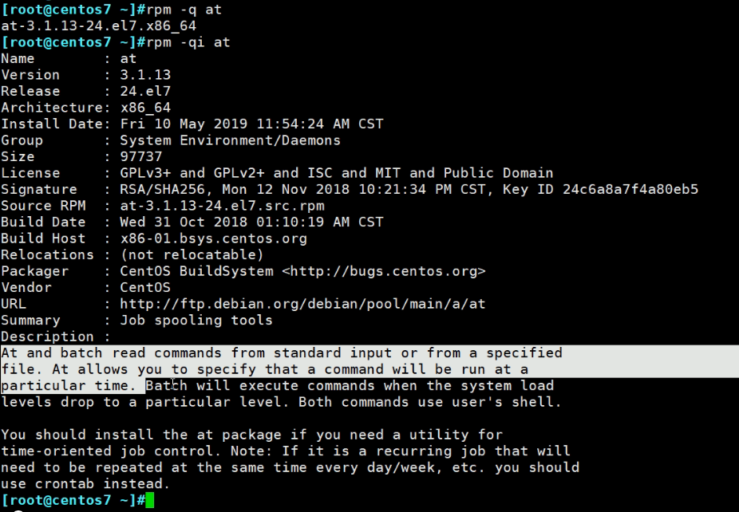

at用的多一点，batch基本不用。其实at也不怎么用

 

atq和atrm是at的扩展用法

 

atd.service必须是启动状态，这是前提

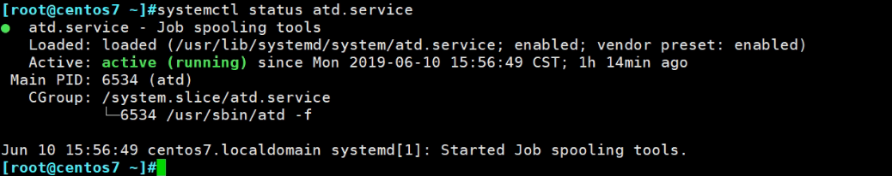 

centos6上的atd服务：

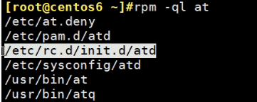 

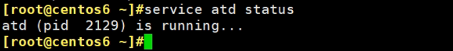 

at一般用法就是跟一个时间执行cmd

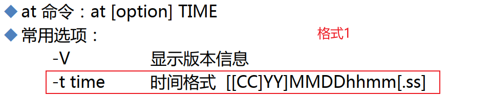

at -t的格式1和at 后不带-t的格式2

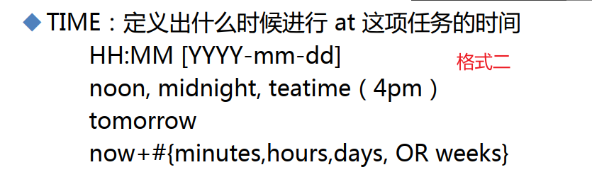

 

at回车会等STDIN，at -l查看计划任务

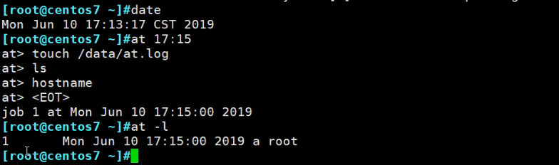

1就是第一个任务

at -c 1可以查看具体任务细节，上面都是各种变量，最下面才是任务明细

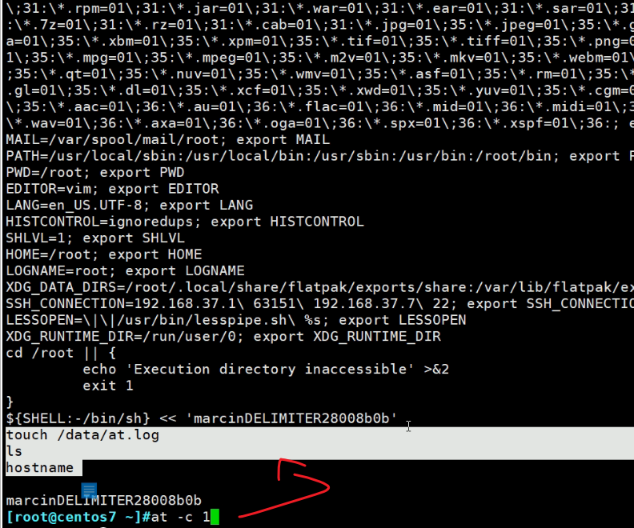 

等到时间了，任务执行完毕，就没了

 at了3个命令，第一个创建文件执行了，但是后面两个ls和hostname怎么理解呢，在哪里体现呢

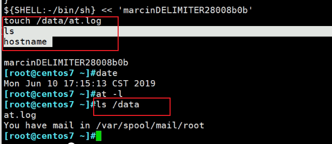

计划任务是在未来的时间执行的，ls和hostname是在当前终端tty上运行的。

而你不能确定你将来就在这个tty上，说不定别人正好撞到这个tty上了，就看到了ls猴儿hostname执行的结果了。就是你执行的命令，别人看到了，这就不合理了。

所以基于以上道理，计划任务的STDOUT标准输出不会在屏幕上打印的。虽然没有输出到屏幕，但是以邮件的形式发给你了。

由于刚才是以root用户执行的，所以邮件就发到了root：

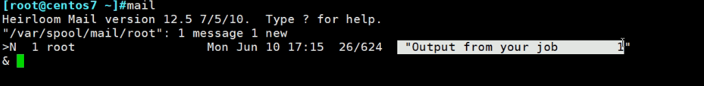 

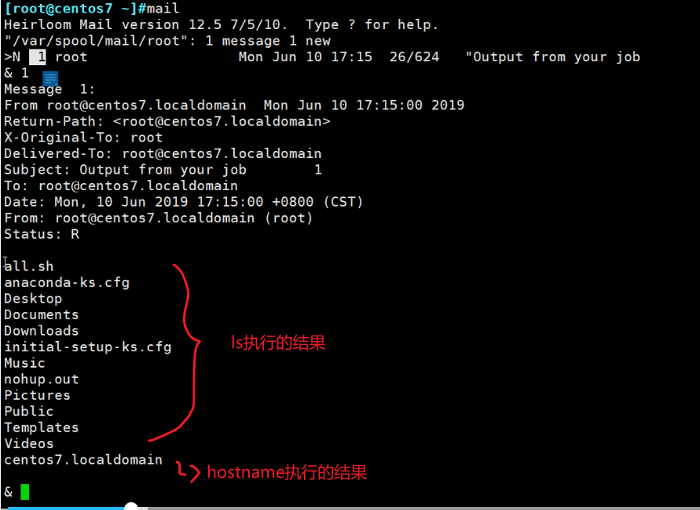 

所以方法论来了，计划任务的脚本，一般不推荐有输出，而是所有输出都扔到日志或在/dev/null里，这话我就不认同哈哈，因为我的py脚本很多还是保留了print的，这些屏幕上看得到的，当然crontab去执行的化，自然屏幕看不到了。

不对，视频老师的意思的，crontab里的脚本不要有标准输出，否则会给你发送大量邮件，emmm，这话也不对，有时候正要考这些邮件当作日志来分析是否运行了。

不过，确实很多文章上的crontab都是由* * * * /xxx/xxx/  /xxx/xxx > /dev/null的，看来不要发邮件才是比较好的一个做法。

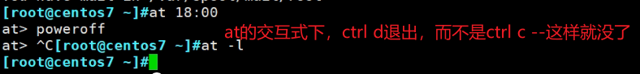 

ctrl c是强行终止

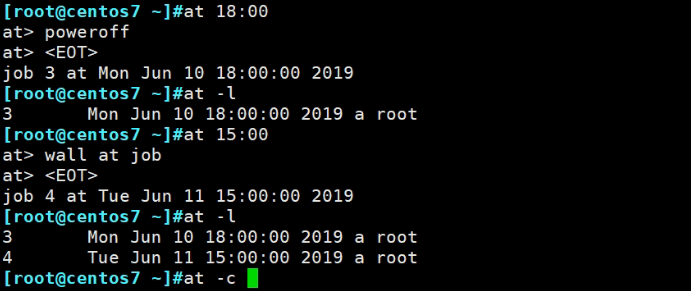 

然后reboot重启，这些计划任务还在吗？

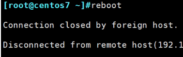 

 重启后发现at -l还在

说明重启也不会影响at的任务，说明肯定是找一个地方存起来了。肯定不是内存里放了，肯定是放到磁盘上了。

磁盘上哪里呢？👇

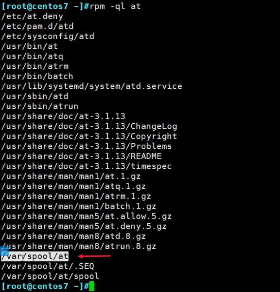

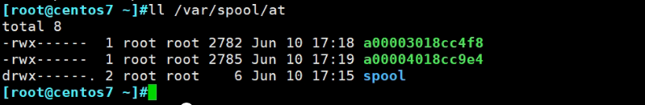

a00003xxxx和a00004就是at -l看到的3和4编号。

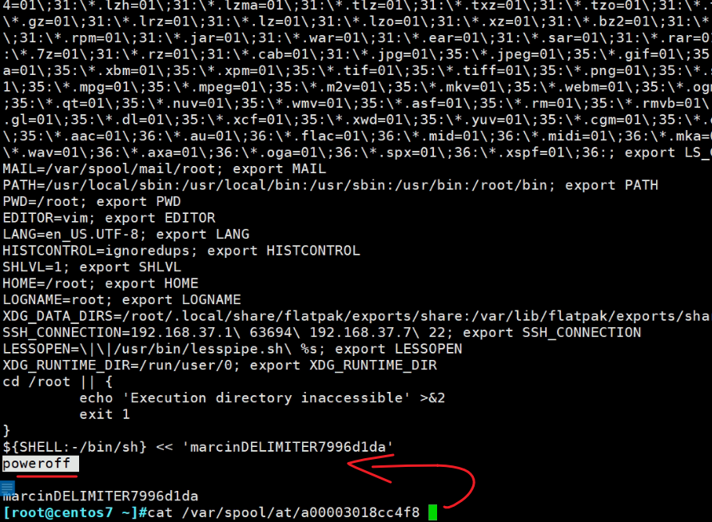 

这个cat /va/spool/at/a00003xxx文件看到的正是at -c 3看到的

这个路径的权限只有root

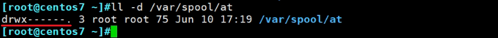

换个普通账号创建计划任务也是可以的

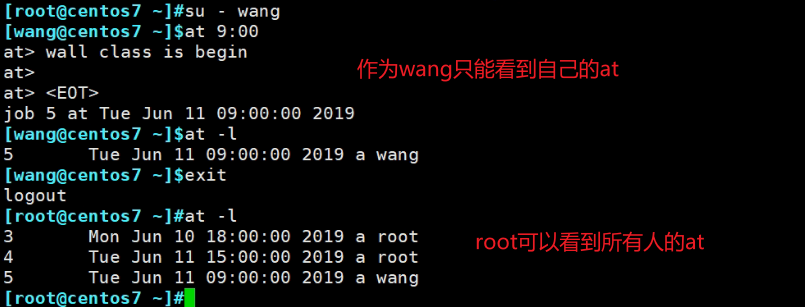 

然后wang账号的计划任务也是放在/var/spool/at路径下的

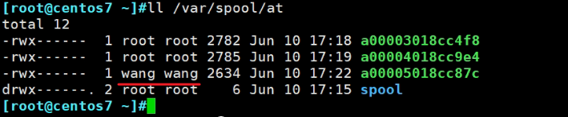 

对于wang账号来讲，/var/spool/at路径是没有权限的，但是确实将任务写进去了，说明at由SUID权限👇

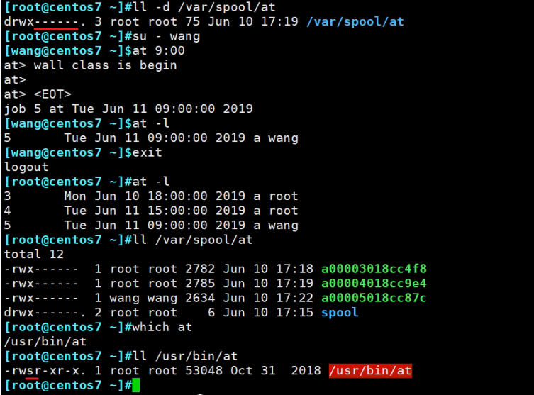

### 删除atrm或者at -d一个意思

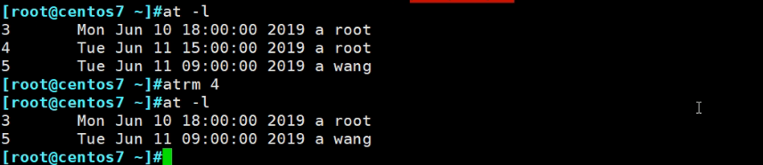 

atrm -4说白就是把/var/spool/at的对应的文件删了

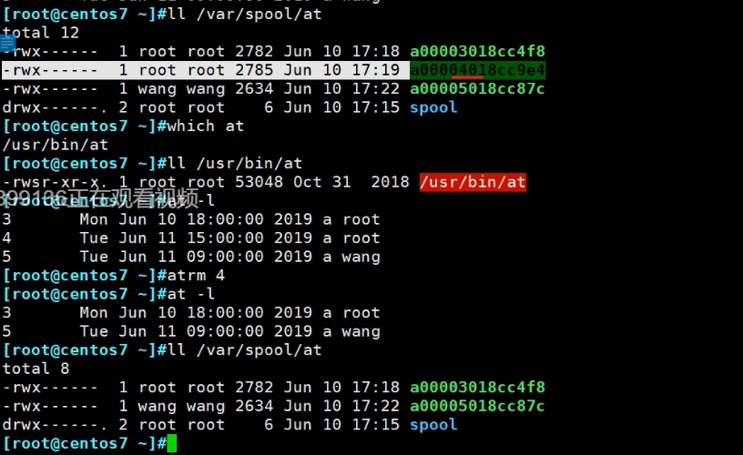 

同理，可以直接删文件，

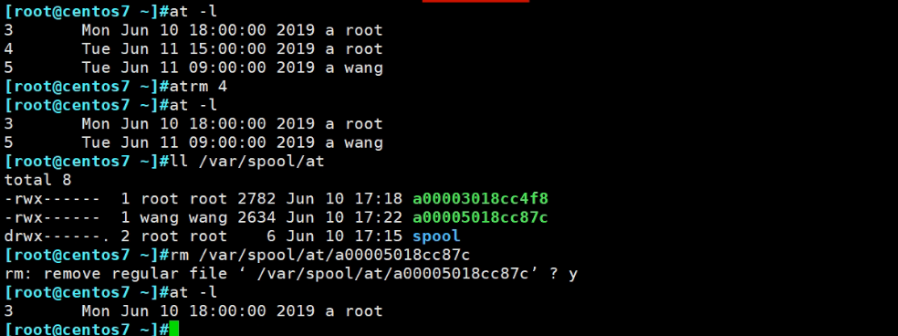

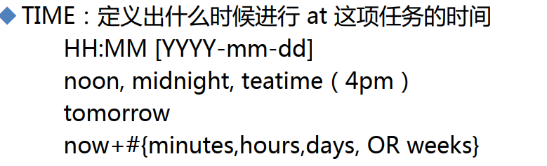 

noon：中午12点

midnigth：午夜12点，0点

teatime：下午茶时间，4点

tomorrow

now + xxx：现在往后多久时间

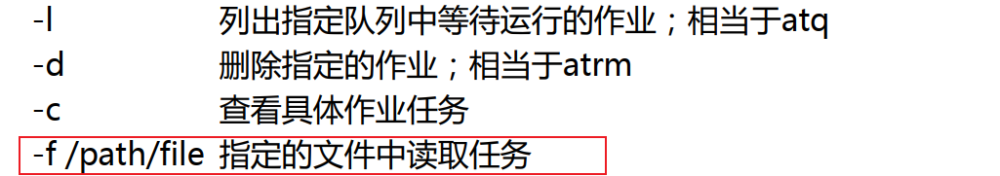 

### -f

创建一个文件

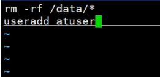 

 

-f 其实也就是利用重定向的效果：at 18:00 < atlist这样也行

 

### -m 告知计划任务有无执行

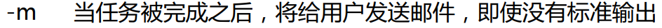 

把原来邮件删掉

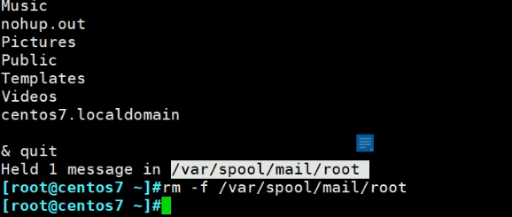 

 

1分钟后执行

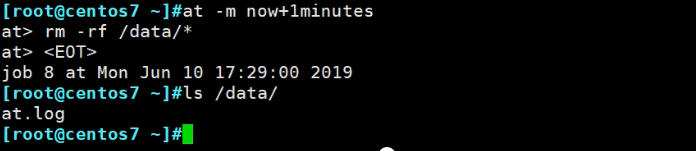 

就是个空邮件告诉你执行了

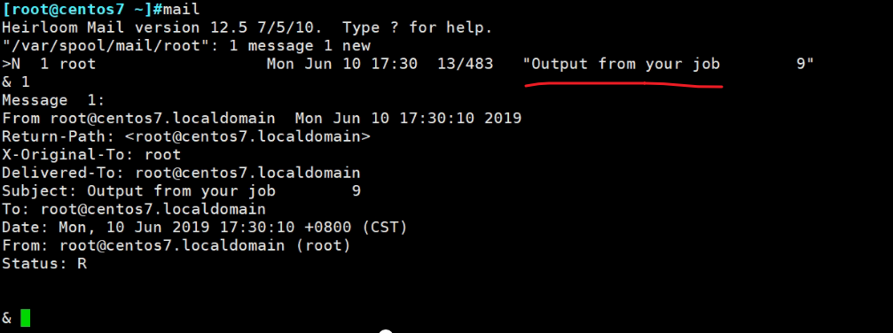

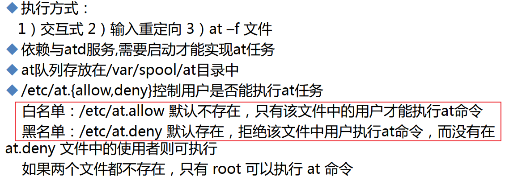 

白名单由于黑名单，如果wang既在白名单也在黑名单，白名单里有就不看黑名单了。

如果user2不在白、黑里，我分析就可以执行。

## 周期性任务用的多：crontab

对应的软件包比较多

 

cronie是主要工具包

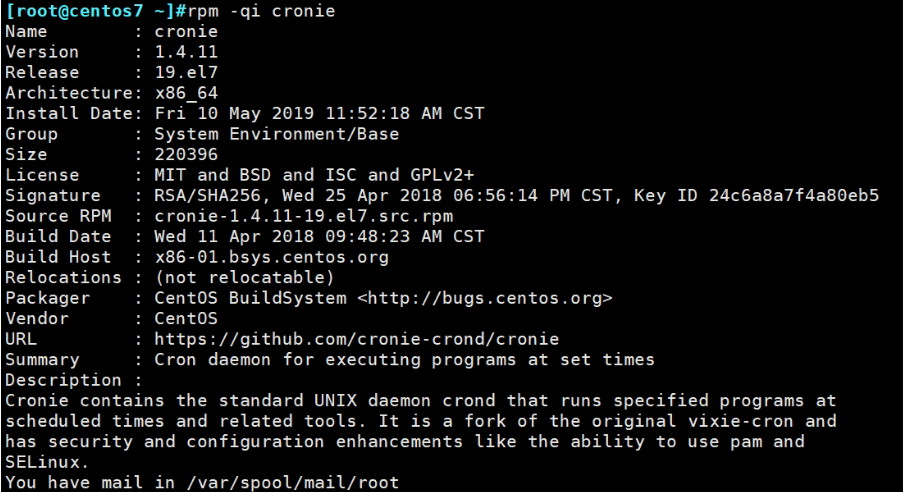 

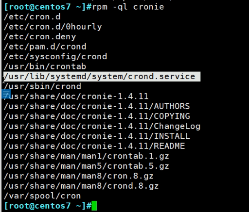 

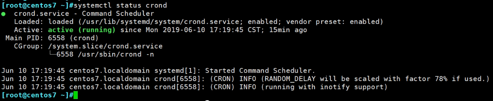

上图的 crontd是主程序，运行后会自动周期运行计划任务。

上图的 /usr/bin/crontab  # 是创建用户自己的计划任务的工具，区别于全局的/etc/crontab文件

centos6下的情况： 

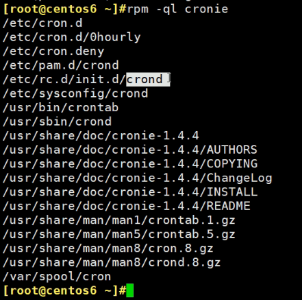 

### crontabs是创建计划任务的工具

 

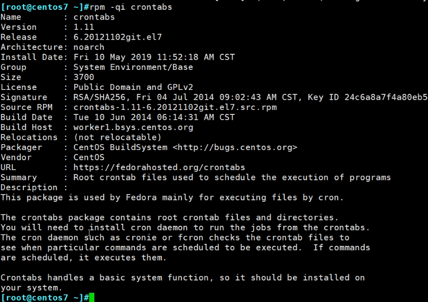 

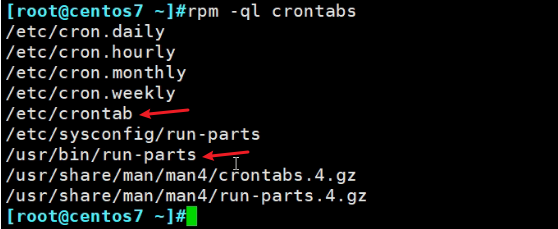 

用户自定义的计划任务

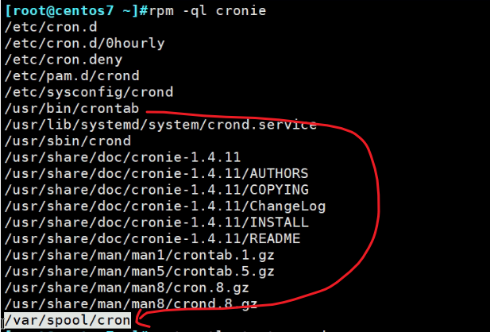 

通过crontab创建，后存放在/var/spool/cron下

这个/var/spool文件夹也是一个常用文件夹

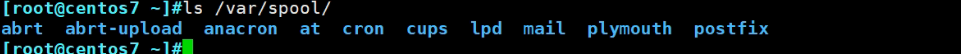

除了刚才的at和马上正在学习的cron还有mail邮件也都在这里。

### cronie-anacron补充性的包，用的不多

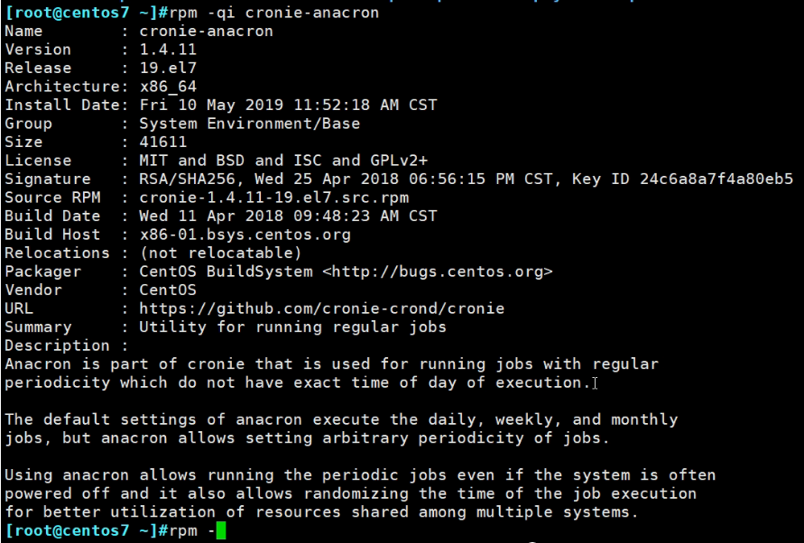 

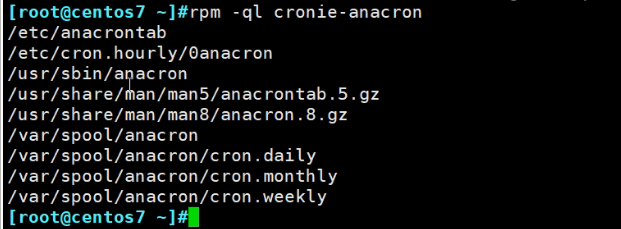 

使用场景举例：

在家用电脑中安装了一个linux，这种PC台式机不像服务器一样24小时开机的，可能定期就会自动重启的。而加入计划任务是半夜执行的，而此时你关机了，就会导致计划任务没有执行，此时就有cronie-anacron来执行。

​    当你开机后的一段时间，会自动检查时间已过了没有执行的任务，找个时间给你执行了。

通过查看/etc/crontab可知，里面的存在各种环境变量的

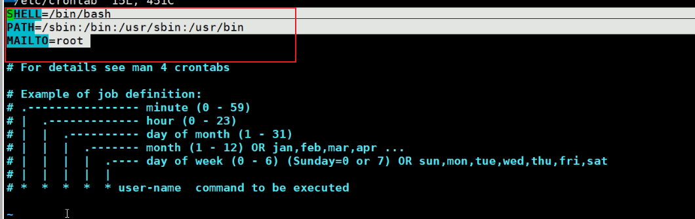 

而直接crontab -e去编辑用户自定义的任务，有时候就需要手动补上变量，比如我这种

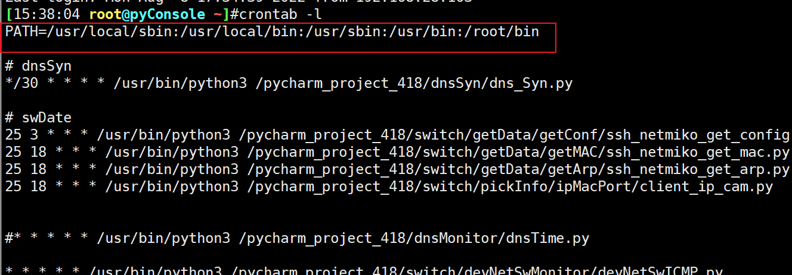 

这都是报错，后来解决的方法👆，

然后/etc/crontab还有个地方说明下

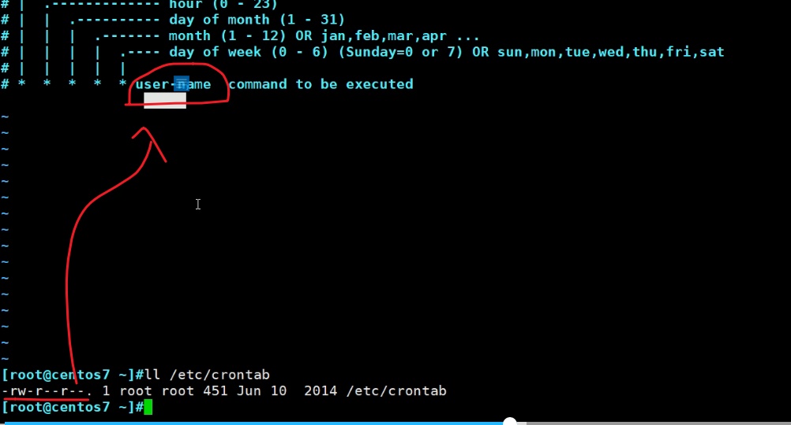 

 这个文件只有root才能读写，所以普通用户无法编辑，所以上面的user-name是root指定，意思就是这个计划任务是以某个普通用户来执行的。

写个磁盘空间告警

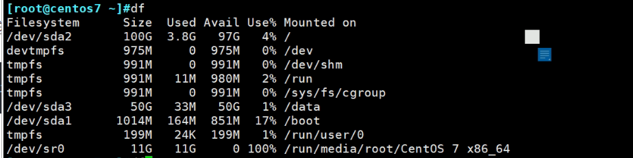

以前不太理解为什么sed 要先找到再查找替换，为什么不直接查找替换，现在案例就来了

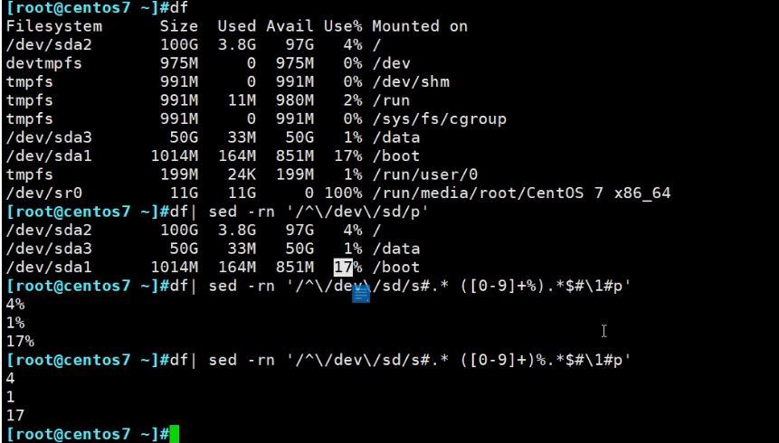

先找到/dev/sda开头的(相当于做了一步过滤)，再针对这些开头进行替换。

 

这就找到最大值了。

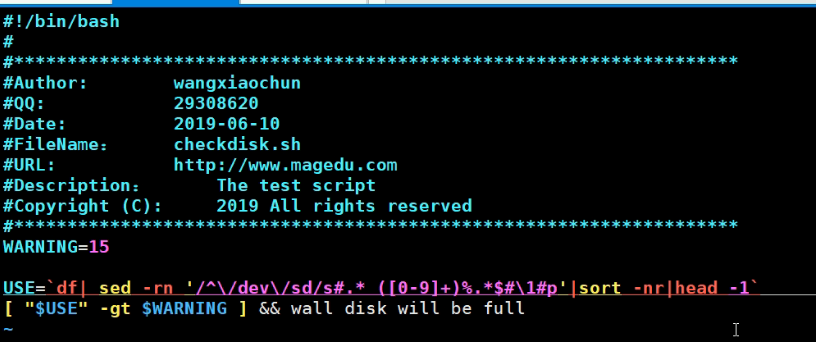 

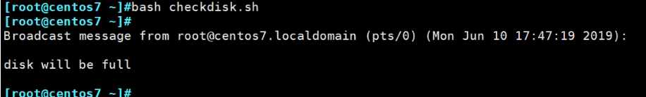 

将脚本写道crontab里

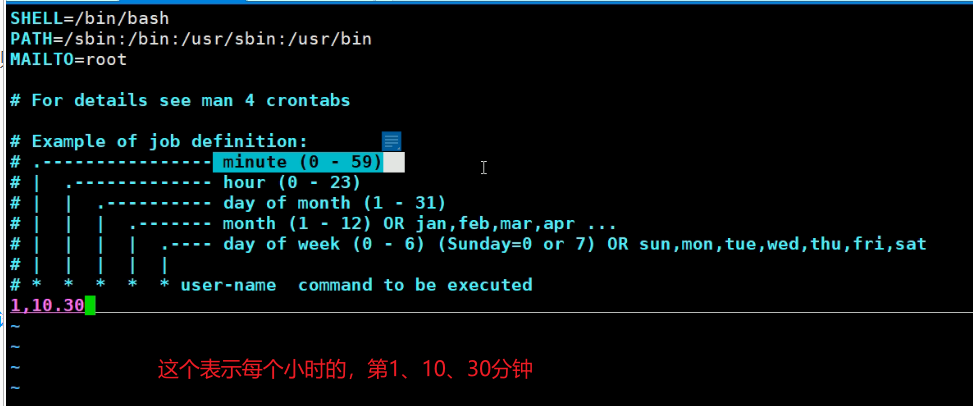 

第一个*号的意思：

**1,10,30** 	表示每小时的第1、10、30分钟

*** **      		表示每分钟

***/10** 		表示每10分钟

待会用wang普通账号去执行crontab，就是user-name写成wang，所以要看下脚本是否有权限


这样脚本wang用户就可以执行了。

然后就是 每分钟，1-5工作日，wang 去执行脚本，0或者7表示周日

 

然后跟踪下cron的日志

 

解释下面的任务

 

就是 30分 		 2点 	  1，10，20号        每月     周六或周日

问题来了，这个1号10号20号万一i不是周末了，他们之间是并取还是或的关系呢？

通过man 5 crontab可以找到逻辑关系，搜下note


either就是也，plus就是加上，这些就说明了是 或的关系。

所以每个月的1、10、20号会执行，然后每周的周6和周日也会执行。

问题来了，如果我就要并且呢，计划任务没有这功能，就需要在脚本里去判断

然后脚本里去判断是否为周末，如果是就执行。这就是且的关系的落地。

用这个命令获得今日是周几；👇man date

 

通常计划任务不会放到这个/etc/crontab里，一般就是crontab -e那个用户就是哪个创建的。

crontab -e创建的时候，就系统就自然就知道是哪个用户创建的，所以格式上就有个默认的user-name不用写了，直接 * * * * * cmd

 

 

该文件已经有执行，所以就是CMD搞定

不通用户创建的crontab -e其实就是/var/spool/cron下的不同文件

 


crontab -l看自己的，看别人的加上 -u

删除某某用户的所有计划任务

 

### 文件下的脚本都执行

 

 

 

 

每分钟，执行/data/scripts下的所有脚本，然后验证确实执行了：

 

 

 

这个次序就是按ls的次序执行的

验证上面的次序判定

 

可见/usr/bin/run-parts  /data/scripts 确实是按脚本存放路径的ls次序执行的。

### 系统本身就有的周期性任务

 

 

mlocate就是locate的依赖的默认数据库，而这个数据库是每天刷新一次的。就是靠这里。

为什么放到/etc/cron.daily下的这些脚本(这些logrotate、man-db.cron、mlocate都是独立的脚本)，为啥这些就会daily每日执行呢，其实还需要有个cron去执行他们的。


上图就是cron.hourly文件夹下的脚本都会执行的原因，因为有/etc/cron.d/0hourly去执行的。而daily文件夹下就不会执行，因为/etc/cront.d下没有对应的周期命令。

 

但其实上面的可能是执行的，因为还有


### 日志可以观察，也可以帮助还原误删除的计划任务

/var/log/cron


 

下次开机执行的方法

 

crontab -e 便捷

 

重启后可见，确实执行了


因为wall看不到广播效果，因为没法提前进到那个终端去等到广播信息

换一个方式

 

 

 

多任务时间一致，可以用分号隔开，呵呵，要考虑前一条执行花费时间哦，第二条执行有延迟的。

## anacontab

1表示1天执行一次，开机5分钟后自动运行 cron.daily

每天就是1

每周就是7

每月就是@monthly，

5 25 45就是开机后的5、25、45分钟后执行后面的脚本。


45分钟随机延迟

服务器上这个anacron用的少

## 管理临时文件

centos6上的一些文件

 

### makewhatis就是手动做了makewhatis.cron

 

### mlocate.cron相关的信息，手动就是updatedb。


### tmpwatch是清除垃圾文件

 

10天清理一次/tmp

30天清理一次/var/tmp

windows没有定时清理的功能

到了centos7就是一个服务专门来做这事了

 

原来centos6这个路径下，在7上就没有哪个tmpwatch文件了：

 

 

 

 

不希望wang执行计划任务

 

 

 

再写一个/etc/cront.allow

 

 

 

白的黑的都有wang，其实就只看白的了

crontab -e就进去了👇

 

 

这个deny只是说不能编辑，原来如果有权限的时候编辑的计划任务还是会正常工作的。

## crontab精确到s的方法

sleep可以精确到0.1s好像

但是你用sleep控制周期，就不是crontab里的每分钟--其实是到整点就执行了。sleep是真的等1s执行，那么如果之前的脚本本身执行就要花4s，那么用with os.popen阻塞的方式，其实就是5s钟才能一个周期了。而且存在队列不断加大的风险。

usleep是微妙级别的睡眠

 

## 利用crontab定期同步时间

这个是取之我们的extmail里的一个案例：

 

这是视频里老师的写法：

上图有错误，所以wq退出会报错

 

y重新edit为：

 

据说&> /dev/null是一个好习惯，否则一堆垃圾邮件。

## 习题

说是*/7不行，因为60/7除不尽，需要用sleep 420  来做，但你想想就是我说的，脚本执行如果要化10s，没关系，那也是脚本执行后sleep了7分钟才继续执行啊。所以两次周期就是严格的7分钟过了。

## sleep也是有单位的

 

 

crontab里不要用%，这个踩过坑，当然%如果在py脚本里是没有问题的，

有人想在crontab里写date +%F，这种就不行，换个思路，将date +%F写到脚本里，然后crontab里调用脚本就可以了。

还有就是上文提到过变量问题，或者叫二进制的执行文件要写绝对路径--但是有的遗漏的就是通过邮件看到日志提示

之前的坑记录如下，emmm原来慢慢吞吞都1年半下来了。太慢啦，不过这事写脚本，不算linux系统学习，也还说的过去。

 

 

 

这个还是python脚本里调用了mtr命令，然后crontab报错找不到PATH变量

 

而且，我都在py里的mtr也是写了绝对路劲的，但是就是不认，哈哈，最后还是加了一行path变量才好的。

  

