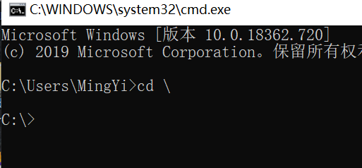
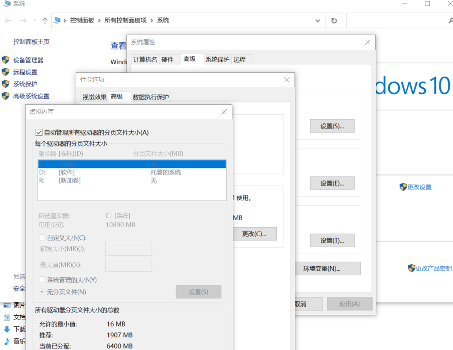
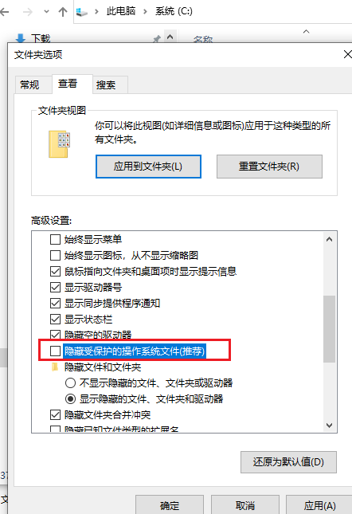

# 第1节. linux安装前准备

1、 在windows是怎么安装的，类比一下，

分区、C盘、D盘，系统、数据文件。

2、 在linux同样类似思路，逻辑卷、raid，

大多数企业选择的是分区方式，而不是逻辑卷和raid。

3、 linux一切皆文件，不同类型的资源都命名为文件了

linux的目录结构

windows的C盘，D盘，里面格式有很多文件夹

C盘的顶级目录

在windows里有几个分区，就有几个顶级目录，或者叫根目录

 

在linux只有一个根root，而且用的是正斜线，linux不管你是几个分区，它的目录结构都是不变的。

 

/usr 类似于windows里的C盘下的windows目录，都是存放操作系统文件的。

/root或者/home/xx 类似windows里的C盘下的users目录，都是存放用户自己的文件的。

此外在linux还有/boot目录，存放启动文件，比如linux内核就是放在该目录下的。

日志信息在/var/log，/var本身就是变化的意思。

/tmp存放临时数据的。

/proc是个假目录，是映射成内存数据，就是看到的是内存里的数据。正常的数据是放在磁盘上的，真正的目录都是对应磁盘上的文件夹，里面的数据都是放在磁盘上。这就是一切皆文件。

/etc就是windows里的注册表，注册表并不是单一的某一个文件，是二进制的若干个文件，不是存在在磁盘的某一处的。/etc就是各种配置文件也是文本文件。

 

linux分区和目录结构无关

linux有个目录叫/dev，存放设备的，包括，硬盘、光盘、u盘等。都是在dev下。比如机器上多块硬盘，linxu自动会出现多个文件。命名方式为，命名硬盘的方式sda,sdb,sdc这是centos6和7的命名方式，

在硬盘上还可划分分区，涉及分区类型，在windows上的分区是用盘符来命名的。分区还有扩展分区和逻辑分区。

 

分区类型：

1、 分区跟你的硬盘分区策略有关，GPT只支持主分区，暂不做讨论

2、 MBR是传统的分区法，支持主分区、扩展分区、逻辑分区（逻辑驱动器）

主分区，在单块一个硬盘上只能最多**四个**。如果有两块硬盘，其中一块可以没有主分区。在windows里主分区通常可以安装操作系统。不仅仅存放数据，如果有多个主分区，就有且仅有一个激活的主分区，OS启动的时候会去寻找激活的主分区，一个硬盘上最多有一个。

扩展分区：仅仅是主分区的话最多是4个，所以还需要扩展分区。在一个硬盘上最多**一个**扩展分区。不能直接存放数据，必须先将其划分成更小的分区-逻辑分区，

逻辑分区，扩展分区里更小的单位，这个小分区才能存数据，逻辑分区的个数可以很多。

3、 一块硬盘，主分区、主分区、大的扩展分区（里面分成若干个小的逻辑分区）

4、 linux一切皆文件，硬盘是有文件的，分区同样也是。分区是有编号的，主分区是1-4，扩展分区也是1-4，主分区+扩展分区一共最多4个，因此都是用1-4来表示的。

主分区的文件名：/dev/sda1  /dev/sda2，这个就是a硬盘上的第一个分区，第2个分区。这是主分区，扩展呢，一样也是1-4，比如/dev/sda3就可能是扩展分区。

5、 逻辑分区的编号，是从5开始编号的，/dev/sda5 /dev/sda6 dev/sda7，这三个就是在/dev/sda3上面的分区的。这个逻辑的序号是自动分配的，不能像主分区和逻辑分区那样可以人为的命名。

6、 扩展分区删除，意味着里面的逻辑分区也没了。

7、 存在不同分区的同名文件。讨论分区和目录的关系。windows是C盘下的test文件，D盘下的test文件。linux呢？是从根下面开始描述的。此时就需要把分区和某一个文件夹做关联，将来这个test就是这个关联好的目录下的文件了。

8、 将第一个硬盘分区和boot关联，boot就是对应/dev/sda1，所以要访问第一个硬盘的第一个分区就访问/boot就行了。此时第一个分区里的test就在/boot/test。第二个分区要想访问，就得先把他映射成一个目录比如叫/data，把第二个主分区/dev/sda2挂载到/data下，第二个test就在/data/test

9、 这种挂载在windows里是存在的，windows的分区也可以挂载到文件夹的。windows的e盘的盘符可以删了，此时这块空间和目录结构就没有关联没有映射了，磁盘管理就看不到e盘了，但数据还在，再加回去，可以叫其他F盘之类，还可以挂载到NFS文件夹中的这就跟linux的挂载文件一样了。

10、 没有独立出来挂载分区的文件夹，都是跟在根下的，都在根所在的分区里，有些是不能独立挂载的，必须和根在一起，比如/etc  /dev ， /proc是虚拟文件夹内存来着更加不能独立了。

11、 理论上一个分区也是阔以的，但是肯定不安全，一个分区挂了，就完了。

12、 一般分区这样

/dev/sda 200g硬盘的推荐分区：

**/dev/sda1 mount  /boot 1G**

这是引导目录不需要太多空间200M的实际占用，也不是给你存放数据的，你的数据也别扔这里面，1G空间足足有余了。这个目标文件夹就叫mount point挂载点。

**/dev/sda2 mount  /  100G**

根上，根下存放的数据就比较多了，如果linux安装不是最小化安装，光是系统本身就要几个G的数据，如果是最小安装，至少1g。

 

**/dev/sda3 mount /data  50G**  测试练习用的文件夹，学习用的，工作中，用户会用来存放数据库单独占一个分区。

 

**/dev/sda4      swap 4G**，这里不能叫mount挂载，因为swap不是个文件夹，它是分区，不能叫挂载，挂载都是设备往文件里挂。

 

如果这样划分的话，我们知道一个硬盘上最多4个主分区，意味着200G剩下50G的空间用free，将来不能再分区了，因为4个分区满了，逻辑分区是在扩展分区里分的，扩展分区是占主分区的1-4这个编号的，现在没地儿了。所以上面的分区得改。

**/dev/sda4     extend  剩下的所有空间（除了上面分的所有空间剩下的45G）**

**/dev/sda5**     **逻辑分区  swap  4G**  sda5就是在sda4上面分的了

还可以继续分小的逻辑分区。比如**/dev/sda6**等。

13、 swap 交换

早期机器内存小2G 4G swap就是4g 8g的分配，

现在服务器你的内存都很大256g 512g，swap肯定不能乘以2了，swap一般就是8g 16g就足够了。

 

14、 linux的swap和windows里的pagefile.sys文件是一回事

15、 GPT不支持扩展分区和逻辑分区

 

4、 在使用vmware worksation安装镜像的时候，光盘需要最后挂载，不然系统自动安装不会让自己分区的，而且还是最小化安装。

5、 os下载，可以到阿里云上下载，

6、 vmware的lck缓存文件注意一下，突然断电关机了，lck可能需要手动删除才能保证VM正常开机。

 

