# 第3节. linux入门操作和基础命令


## 入门操作

1、看版本 cat 

```
[root@localhost ~]# cat /etc/os-release
NAME="Rocky Linux"
VERSION="8.5 (Green Obsidian)"
ID="rocky"
ID_LIKE="rhel centos fedora"
VERSION_ID="8.5"
PLATFORM_ID="platform:el8"
PRETTY_NAME="Rocky Linux 8.5 (Green Obsidian)"
ANSI_COLOR="0;32"
CPE_NAME="cpe:/o:rocky:rocky:8.5:GA"
HOME_URL="https://rockylinux.org/"
BUG_REPORT_URL="https://bugs.rockylinux.org/"
ROCKY_SUPPORT_PRODUCT="Rocky Linux"
ROCKY_SUPPORT_PRODUCT_VERSION="8"
```

```
[root@localhost ~]# cat /etc/centos-release
Rocky Linux release 8.5 (Green Obsidian)
[root@localhost ~]# cat /etc/redhat-release
Rocky Linux release 8.5 (Green Obsidian)
[root@localhost ~]# cat /etc/rocky-release
Rocky Linux release 8.5 (Green Obsidian)
```

```
[18:27:16 root@pyConsole ~]#lsb_release -a
bash: lsb_release: command not found...
Install package 'redhat-lsb-core' to provide command 'lsb_release'? [N/y] y


 * Waiting in queue...
 * Loading list of packages.... Failed to install packages: Could not depsolve transaction; 1 problem detected:
 Problem: conflicting requests
  - nothing provides ncurses-compat-libs(x86-64) needed by redhat-lsb-core-4.1-47.el8.x86_64

[18:27:22 root@pyConsole ~]#cat /etc/centos-release
CentOS Linux release 8.2.2004 (Core)

```


2、看内核 uname -r


3、关闭GUI，free可见 700M+的内存使用量，关闭前后的内存使用对比，init 3 关闭GUI，进入纯字符界面。再来看free 还剩200M+，一下500M的量省了。linux的图形界面相当于linux的一个软件可以开关。


5、runlevel 可见 5 3，说明之前是5模式切换到3的。

6、init 5如果你有图形的话，可以切回去。

7、who 不仅看当前登入的人  who -r可见这用户用的哪个运行模式，如果上一次是其他模式，也有last关键字看到

 

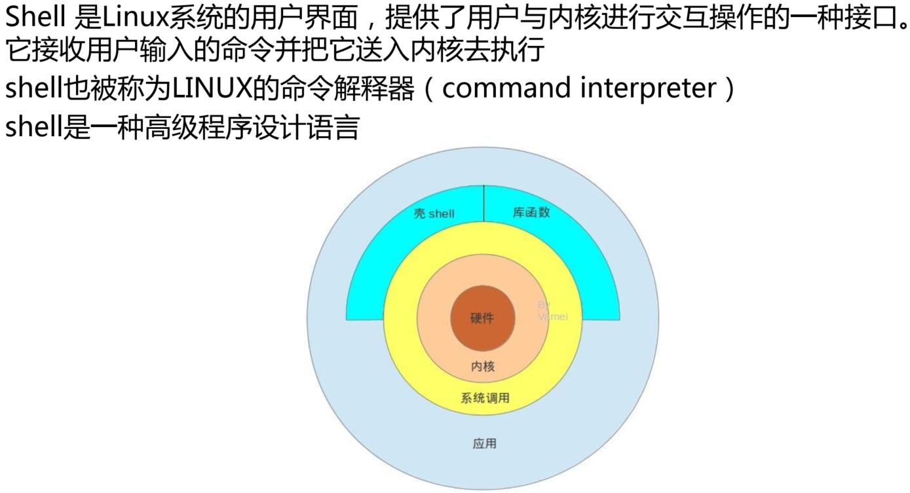


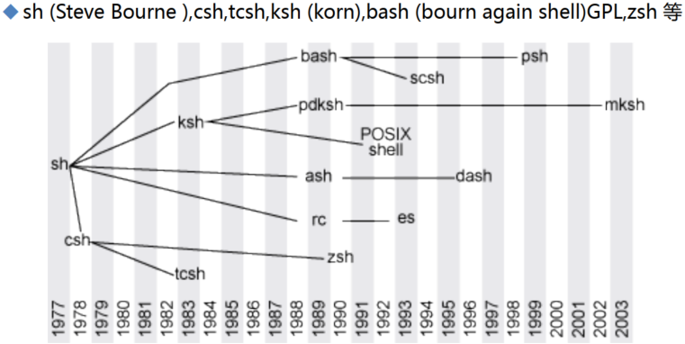


## 基础cli-1

1、root也不一定就是管理员，这是由UID的设置来影响的，UID=0就是超级用户 也就是管理员。

2、id 就能看到，id -u 显示当前用户的uid，id -u xx 显示xx用户的uid（从1000开始的）


3、centos6 新建用户默认从500开始，centos7和ubuntu默认冲1000开始

4、1000或500以内是特殊保留的数字

5、xx账号的uid改成0，xx就是超级用户了。

6、ll /dev/console 救援模式用的就是console终端，一般用不到

7、cat /etc/shells 可见目前支持的shell类型，在ubuntu上支持的并不相同。

8、/sbin/nologin 是一个特殊shell，禁止登入，当用户使用这种类型的shell的时候，就是不能登入的，软件运行的时候是后台运行的，但是不需要用户登入就能运行的。nologin其实就是无需登入就能运行的意思。

9、主机名：bj-yz-k8s-node1-100-10.XXX.com，北京亦庄k8snode1节点X.X.100.10.域名

10、echo $PS1 可见默认值，\u就是用户名 \h主机名  \w当前目录  ，可以加上颜色

11、字体颜色  31-37 7种颜色，背景颜色 41-47 也是7种颜色  ， 1和5 就是亮色和闪烁。

PS1="[\u@\h \W]\$" 这是默认值

PS1="\[\e[1;5;41;33m\][\u@\h \W]\\$\[\e[0m\]"

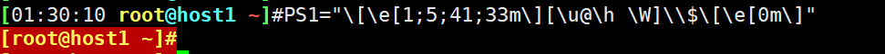

PS1="\[\e[1;32m\][\[\e[0m\]\t \[\e[1;33m\]\u\[\e[36m\]@\h\[\e[1;31m\] \W\[\e[1;32m\]]\[\e[0m\]\\$"


12、配置文件のPS1，**ls /etc/profile.d/xx.sh**  名字无所谓后缀要求是sh。


13、ubuntu切root, sudo -i 输入当前用户的口令就行了。

14、centos的PS1配置文件可以放在**/etc/profile.d/xx.sh** 或者和ubuntu一样放到/etc/profile文件下，unbutnu实在**~/.profile**，在每个账号的家目录下。

15、**/etc/profile**是统一的配置文件，这个文件影响范围大，配置要小心。

16、sleep 10，然后看pstree -p可以看到bash下面有一个sleep


17、还有很多程序不依赖于bash，不需要和人进行交互，后台直接运行了。

18、shell自身提供的内部命令、非shell自身提供的，磁盘上其他程序


19、bash里面集成了很多工具，就是内部命令，bash运行了，这些内部命令是加载到了内存中的。

20、cat /etc/profile.d/env.sh，这个cat就是bin下的cat


cat就不是bash下内部命令了。是独立的二进制程序，这就是外部命令。

21、外部命令需要找到磁盘的存放路径，内部命令不需要会开机加载到内存中的

22、type用来查看命令是内部还是外部。


23、内部命令是集成在shell中的，而shell用户一登入就加载到内存里了；而外部命令表现为磁盘上的某个文件，所以内部命令速度更快。

24、如果有一个命令即使内部命令又是外部命令，那么内部命令优先生效，比如echo

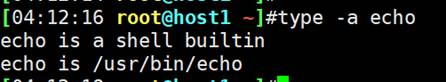

当执行echo命令的时候，系统自动选择第一个内部命令。

25、为啥有一个内部命令了，还需要一个外部命令存在呢？因为内部命令是存在某个特定shell里的，echo在bash里，但是不一定在csh等其他shell里，所以需要外部命令来保证命令的普遍适用性。

26、切换shell


27、help可以列出所有内部命令的帮助。不多


28、外部命令就多了，表现为磁盘文件，ls /bin/ 或ls/sbin/


29、enable会列出所有内部命令的列表


enable -n echo禁用echo后，echo就只有外部命令了，就表现为磁盘文件了，所以如上图。

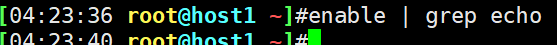

禁用后，就看不到echo了

help里还可以看到一个*号

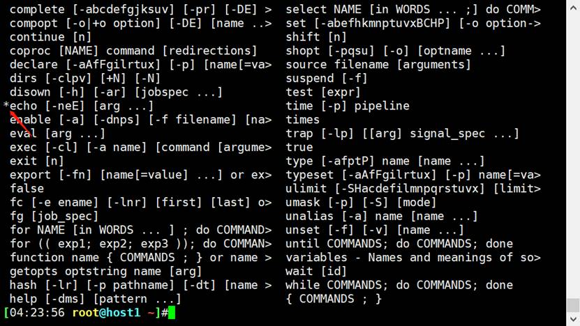

enable echo就再次启用了

30、enable -n enable


 

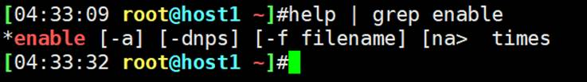

 

enable enable不可能了，因为enable已经禁用了，退出重进就行了，或新开一个终端。

 

31、which专用用来查看文件的路径，自然可以查看外部命令了（外部命令就是磁盘的一个二进制bin文件）


32、bc了解一下

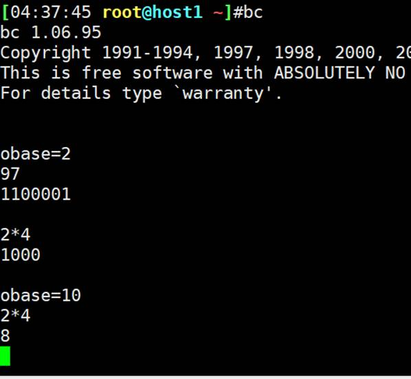

obase=2输出为二进制或10进制

ibase=2输入为二进制，默认都是obase=10，ibase=10.


32、whereis不仅仅显示文件（外部命令）的存放路径，还显示了相关文档帮助也显示出来了，


这是man帮助

 

33、外部命令，系统是怎么找到的，PATH变量了解一下


PATH变量就是存放了一个个文件夹，

1、当你输入一个命令，系统首先判断是否有别名，是执行，不是继续。

2、如果是内部命令，执行，如果不是，继续

3、如果是外部命令，就搜索PATH变量里的路径。前面的目录找到了，后面就不会找了。

4、其实也不是每次执行外部命令，都搜一遍PATH变量的路径的。为了加快访问速度，比如有一个文件我经常访问，linux就会将其缓存在内存中，因为内存中已经有了，就直接在内存中访问就行了。这也是linux的一个经常的思路。这就是所谓的缓存技术。

5、第一次执行hostname的时候，会按PATH变量里的路径来搜，一旦找到后，就会把hostname的路径缓存在内存里HASHE。下次执行hostname的时候，先从内存的HASH表里去搜索，如果查到内存中有这个路径，就不按照PATH变量搜索了，直接按HASH的记录的上次缓存的路径直接去到那个路径找到hostname文件去执行。

6、这里面还有一个细节，就是除了HASH，其实还有一个HASH对应的明文（路径的明文），这个一般不会给你讲这么细，网工会有这个思路可能。

7、这样的一个漏洞或缺点就是，如果外部命令hostname被移动了，那么HASH缓存的路径就不对了，这样命令执行就会报错。如下图


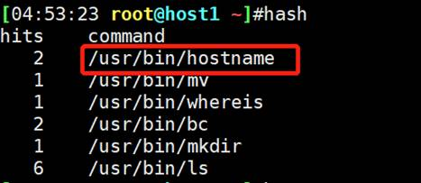

图示为hash记录的上一次hostname的路径。

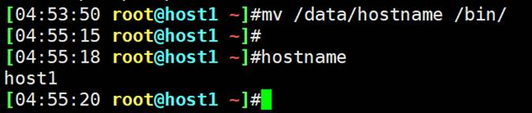

再移回去就可以了，

疑点：我明明移动的是/bin/hostname而不是/user/bin/hostname，为啥一个效果！

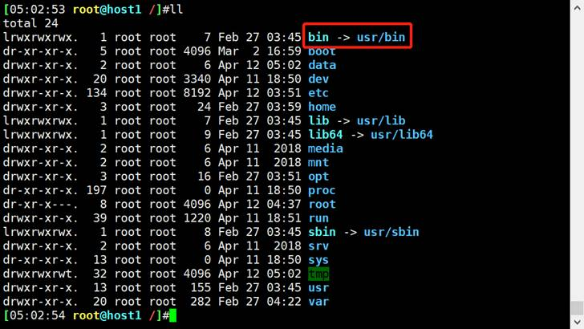

因为bin就是/usr/bin的快捷方式-软连接，所以一回事了。

再来一遍完整的：

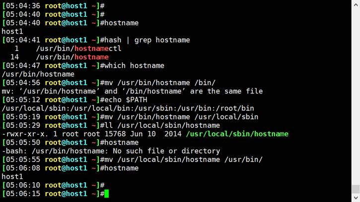

8、上面的也可以不将外部命令移回去，可以清一下缓存就行了。

hash -d hostname 就行了

hash -r 全删

删掉了后，由于缓存没了，所以就会重新搜索，然后再次hash缓存到内存中了。

 

9、上面就意味着，自己做的程序，就要放到PATH变量里的路径或加一个新路径。


## 基础cli-2

 1、内部命令和外部命令的本质区别，首先都会放入内存中的，本质区别是，内部命令在shell（bin/bash）二进制文件中；外部命令不在二进制文件里，是独立的文件。还一个内存方面一个是登入加载，一个是首次运行加载。

内外之分在于是否在/bin/bash文件里，在就是内部，不在就是外部。

 

2、问题：内部命令放在/bin/bash下，那么外部命令放在哪？首先放哪都行，关键是外部命令要运行，就得保证PATH变量里有该路径，然后规范行为是，外部命令放到PATH变量下的路径里去。所以外部命令一般来讲就在PATH下。

 

3、除了内部命令和外部命令，还有别名。 

**alias cdnet="cd /etc/sysconfig/network-scripts/"**

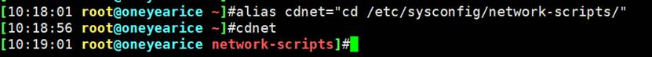

退出后失效，要想存住，就要将其放到文件里，别名的文件在家目录里的.bashrc里

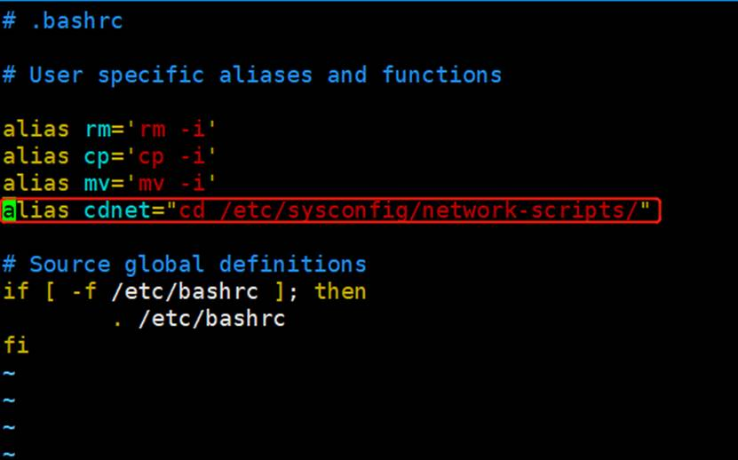

重新登入后依然有效

 

4、alias列出所有别名，unalias cdnet可以临时删掉，但由于之前写在了配置文件里，所以重新登入后，还是没删掉 还在。所以配置文件的需要进配置文件删除

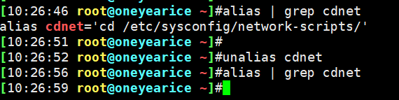

 

5、如果有一个字符串，既是 别名、又是内部命令、还是外部命令，那么执行的顺序是什么，这就是命令的执行优先级问题。

以echo（这个即使内部又是外部命令）为例，将其定义成别名，进行测试

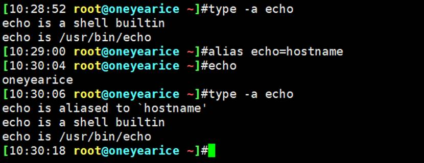

说明，别名优先

**总结：命令的执行顺序：**

①**首先判断是否是别名，如果是别名，别名是在内存中定义的，所以直接就执行了**。所谓直接就是指已经在内存中了，不像外部命令那样首次执行还需要在PATH变量里进行查找。

助记词alias别名

②**其次，如果不是别名，判读是否是内部命令，如果是，直接执行内部命令**（因为内部命令是内置在shell中的，用户登入就已经加载到内存中了），

助记词 内部命令

③**最后，如果既不是别名也不是内部命令，那就按外部命令处理，就会看HASH表**（表里记录了已经被执行过了外部命令的路径）**，如果HASH表里有该命令，就按表内记录的路径去搜索该外部命令去执行；如果HASH表里没有，就在PATH变量里查找，找到后执行。**当然所谓执行也是加载到内存中执行的。对于首次运行的外部命令，也会产生的新的HASH表项。

助记词 外部命令（hash $PATH变量）

④**如果找不着，就报错，此命令不存在**。

 

PS：缓存为王，如果想提供一个慢速设备上（比如硬盘）的数据的执行效率，就把它放到内存里，下次从内存访问，速度就提升了。外部命令就是该逻辑思想。后面还有很多次这种套路。

 

6、加别名用~/.bashrc，这是只针对当前用户有效，家目录嘛，肯定的了。

对所有用户有效是编辑/etc/bashrc

 

7、别名修改后使之生效的方法，这也是很多配置文件修改后使其生效的通用方法：

**source /path/to/config_file** #就是source 后跟你的配置文件路径

**. /path/to/config_file** # 就是. 后跟配置文件全路径

比如 **. ~/.bashrc**

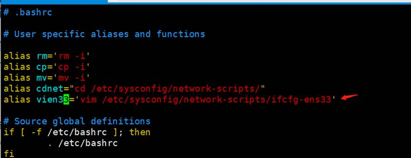

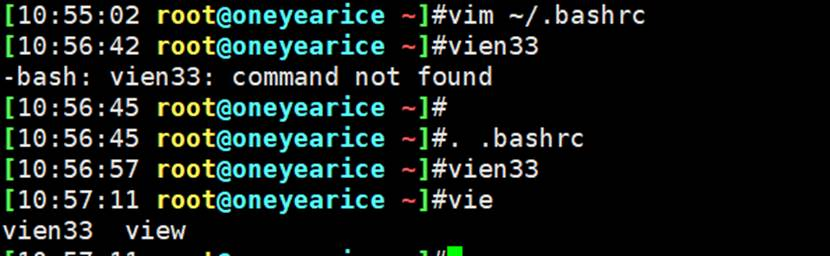

比如：


 

 

8、之前的echo既是别名又是内部命令还是外部命令，如何不执行默认的别名优先呢，

<font color=red>\ </font> **和**<font color=red> ‘ </font> **以及**<font color=red> “ </font>**或者** <font color=red>路径</font> **再次**<font color=red>command</font>都是可以的

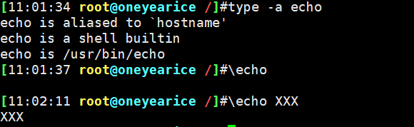

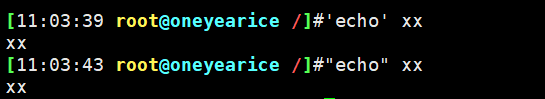


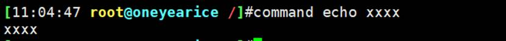

 

9、命令的格式，COMMAND [OPTIONS…] [ARGUMENTS…]

这点可以联系网络设备的cli 以及python argparse 自定义命令的格式或者规范问题。

-c 这种短选项，以及bsd风格的只有c没有-的用法，freeBSD这种好像cisco的wsa esa底层是这个。

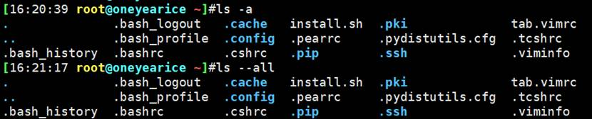

ls -l 这个l就没有长格式

很多命令使用风格已经变了

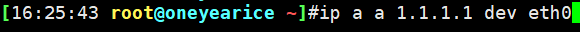

可以理解成多层子命令的嵌套

 

10、ctrl+d 是正常退出

sleep 100就不能ctrl+d正常退出，得用ctrl+c强行退出。

 

11、ctrl+z

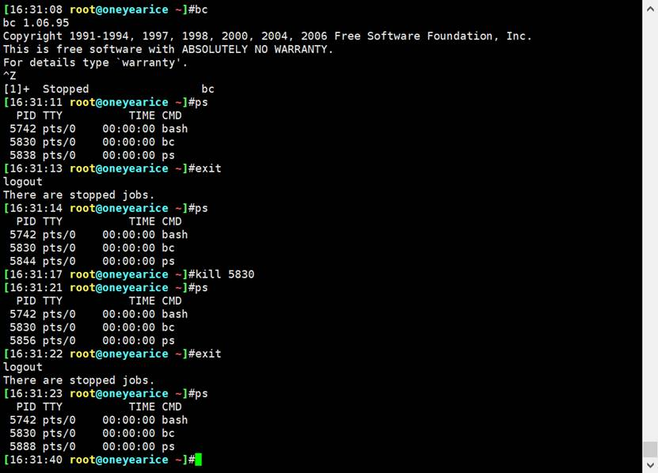

12、多个命令写在一行里用分号隔开

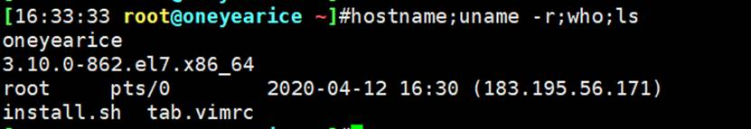

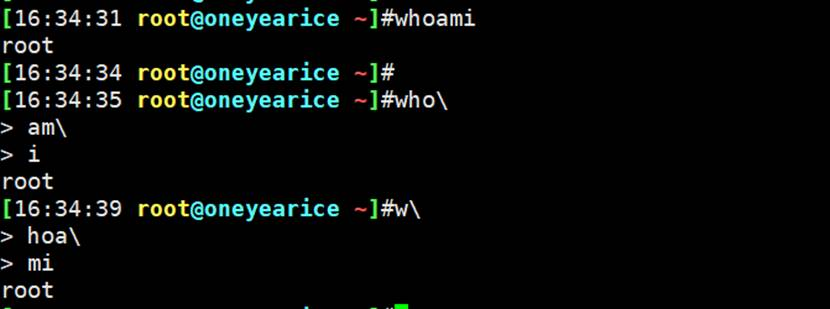

上图就是命令太长后认为换行用的。比如pycharm里面也是这么玩的。不过pycharm后来新版本直接回车也没有\了，也能实现一套命令认为换行的效果。

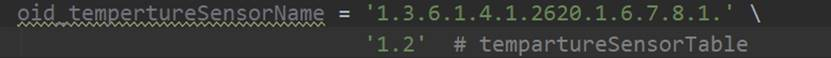

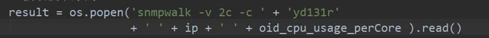

 

13、date

系统时间：有软件操系统内核维护，通过CPU的工作频率维护的，date查看

硬件时间：主板上的CMOS，有块小电池（银币状）可供电5年。clock查看

 

timedatectl 看的最全

clock -s 将system time改一下，改成硬件时间

clock -w 将hardware time改一下，改成系统时间。

date -s ‘20200101 12:02:01’

系统时间和硬件时间

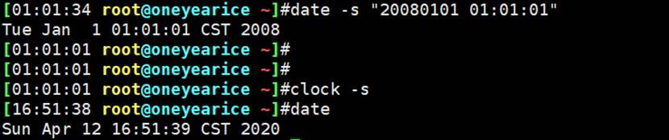


或者date 010101012008.01


缺点就是看着乱七八糟，优点就是不用写引号便于python调用时的字符串拼接入库啥的。

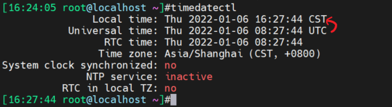

 上图GMT+8


14、时间其实内部一般用NTP去同步的 


这里我先停掉ntpd服务，再去同步时间就好了

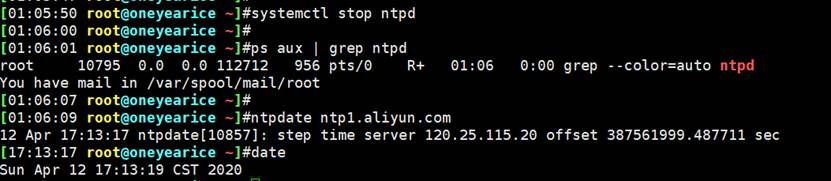

注意，ntp只会同步系统时间，不会同步硬件时间。

如果硬件时间不对，就先ntp保证系统时间准确后，再clock -w让硬件时间去同步系统时间就可以了。

 

15、ntp后面细讲，如果企业里时间不同步，涉及加密、集群就会出问题。

 

16、查看隐藏文件的方法

推荐第一种

```
l. -l
ll -ad .*
ll -a |grep -E " \."
```

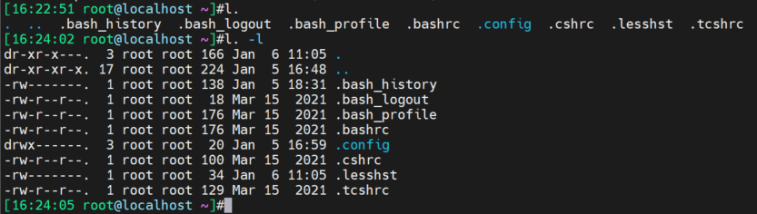

-----------


a

alias

b

basename

bc

c

cal 9 1752

chkconfig iptables off

cd

command

clock(hwclock)

cat /etc/rehat-release /proc/maminfo  /proc/partitions

d

dir类似ls

dirname

df

du

date

e

enable enable -n

exit

echo

f

free -h

g

getenforce disabled

h

hexdump -C

halt

history

hostname

help

hash

i

iptables -vnL

init 3字符模式  5图形   0是关机  6是重启

info

ifconfig 

id

j

k

l

lsblk

logout

ls

lsb_release -a

lshw

m

mount /dev/sr0 /mnt挂光盘到/mnt下

man

mv

mandb

n

ntpdate

o

p

ps

pwd

poweroff

ping

pstree

q

r

rpm -ivh 

rm

rz

runlevel查看当前运行模式的

s

systemctl disable firewalld

stat

shutdown

screen

sleep

source(.)

sz

sudo -i

t

touch

tty 看在哪个终端里

type

u

uname -r

unalias

v

vdir类似ll

w

which

whereis

whoami who -r

whatis

x

xxd 等价于hexdump -C

y

z

  

rz后再按esc可以产生如下图效果，并排两个提示符😶

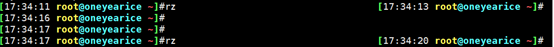

