# 第5节. linux入门命令

## 1、localectl list-locales查看所支持的语言

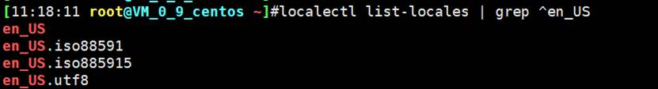

```
[11:45:53 root@localhost ~]#localectl list-locales | grep ^en_US
en_US
en_US.iso88591
en_US.iso885915
en_US.utf8
[11:46:02 root@localhost ~]#
[11:46:02 root@localhost ~]#localectl set-locale LANG=en_US.utf8
```


这是界面风格是英文，不是说不支持中文，因为UTF-8全球语言都支持，之前的文章也讲过UTF-8是unicode全球文职字符集的编码格式。

 

## 2、时区文件/etc/localtime

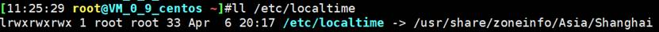

这个时区文件Shanghai也是个二进制文件

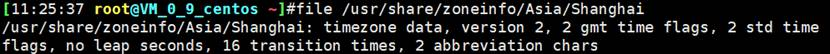

 

## 3、timedatectl list-timezones


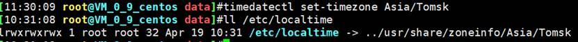


 

 

## 4、cal显示日历

-h看一下就好

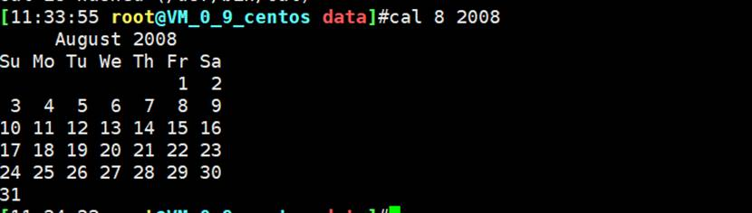

```
[11:49:22 root@localhost ~]#cal 9 1752
   September 1752
Su Mo Tu We Th Fr Sa
       1  2 14 15 16
17 18 19 20 21 22 23
24 25 26 27 28 29 30
```

 

## 5、halt，poweroff，reboot，shutdown

关机：halt,poweroff

重启：reboot

​    -f: 强制，不调用shutdown

​    -p: 切断电源

关机或重启：shutdown

shutdown [OPTION]... [TIME] [MESSAGE]

-r: reboot

-h: halt

-c: cancel

TIME: 

不指定，默认就是+1（CentOS7），相对当前时间过一分钟后执行相关动作

​    now: 立刻关机，等于+0;

​    +m: 例如+3，表示3分钟后；

​    hh:mm: 绝对时间表示，特定时间执行相关动作。

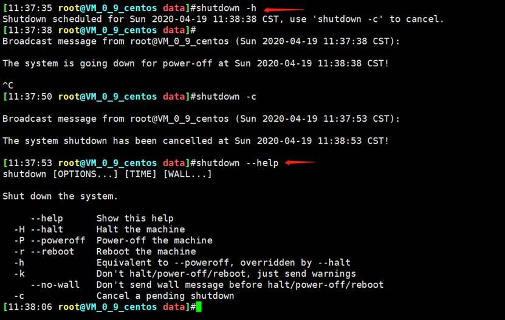

哈哈哈，shtudown -h查看帮助？想当然了，小心误操作哦。

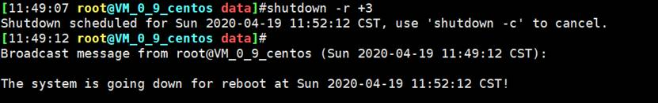

 

```
[11:50:25 root@localhost ~]#shutdown
Shutdown scheduled for Fri 2022-01-07 11:53:15 CST, use 'shutdown -c' to cancel.
[11:52:15 root@localhost ~]#shutdown -c
[11:52:22 root@localhost ~]#
[11:52:36 root@localhost ~]#shutdown -h
Shutdown scheduled for Fri 2022-01-07 11:53:38 CST, use 'shutdown -c' to cancel.
[11:52:38 root@localhost ~]#shutdown -c
[11:52:41 root@localhost ~]#

```

## 6、windows也有shutdown命令

 1小时后关机

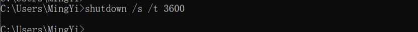

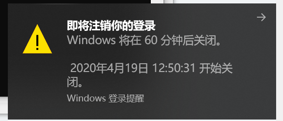

 

取消


 

还支持远程关机


 

 

## 7、who 和 who am I 以及w

who，当前有哪些用户登入上来

who am I 或who x x只看当前用户

w 显示谁在登入，运行了那些程序

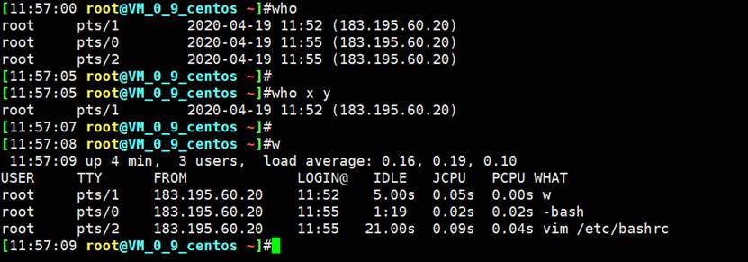

有点监控的意思了,并没有。

 

## 8、screen的用法

虚拟多个屏幕用

首先找到光盘进行安装，当然也用直接yum

VmwareWorkstation 连接光盘后，使用非GUI界面相同账号登入(这里是root)，即可完成挂载光盘。哈哈，就这么挂，怎么滴~，当然我现在是mini没GUI。

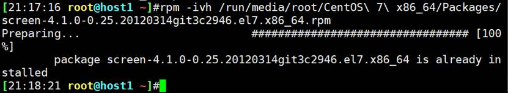

rpm有tab自动补齐啊，上次怎么没有呢，不管了。


举例1：防止ssh断开导致ping或tftp断开

如果ping着的时候，关闭ssh窗口，ping就停了，证明方法ps aux |grep ping

问题就来了，如果我在备份数据的时候，ssh断了，那备份就失败了，所以screen有用武之地了。

 

screen -S ming # 创建ming命名的新的屏幕

screen -ls # 查看开启的屏幕有哪些

screen -r ming 进入ming命名的屏幕

 

 

举例2：屏幕协助

screen -S ming # A开启一个屏幕

screen -x ming # B进入这个屏幕，此时两个人就共享一个屏幕了。

screen -x ming # C同样可以可以进入该屏幕，此时就三个人共享一个屏幕了，那么问题来了上限是多少人呢？没兴趣知道。哈哈

  

ctrl+a+d # 注意手法，不能先按ctrl+d，因为ctrl+d是退出的快捷键（等价于exit）；临时剥离该屏幕，但是其他共享屏幕的人看不到的，此时可以干一些不想共享给别人知道的事，然后完了再screen -x ming切回去，就有成了大家共享一个屏幕的情况了。

exit # 一人退出共享屏幕，全部菜单都退出了。

 

 

## 9、echo，回显用

尝试使用帮助看echo，①type echo 发下是内部命令，②所以使用help echo看帮助

```
[root@centos7 ~]# type echo
echo is a shell builtin
[root@centos7 ~]# help echo
echo: echo [-neE] [arg ...]
    Write arguments to the standard output.

    Display the ARGs on the standard output followed by a newline.

    Options:
      -n        do not append a newline
      -e        enable interpretation of the following backslash escapes
      -E        explicitly suppress interpretation of backslash escapes

    `echo' interprets the following backslash-escaped characters:
      \a        alert (bell)
      \b        backspace
      \c        suppress further output
      \e        escape character
      \f        form feed
      \n        new line
      \r        carriage return
      \t        horizontal tab
      \v        vertical tab
      \\        backslash
      \0nnn     the character whose ASCII code is NNN (octal).  NNN can be
        0 to 3 octal digits
      \xHH      the eight-bit character whose value is HH (hexadecimal).  HH
        can be one or two hex digits

    Exit Status:
    Returns success unless a write error occurs.

```


功能：显示字符

语法：echo [-neE][字符串]

说明：echo会将输入的字符串送往标准输出，输出的字符串间以空白字符隔开，并在最后加上换行符。

选项：

​    -E （默认）不支持\解释功能，也就是\的转义功能；

​    -e  启动\解释功能，也就是启动转义；

​    -n 不自动换行，类似python的print(‘xxx’,end=’’)

显示变量的值

​    echo “$VAR_NAME” # 显示变量的值

​    echo ‘$VAR_NAME’ # 这里讲的其实不是echo的事情了，是引号的用法，单引号就是里面都是原封不动的字符串，不会给你查找变量或命令的。

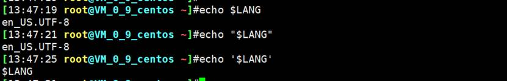

单引号，最笨，里面是什么就是什么

双引号，普通，里面的变量能够解释出来，里面的命令不识别 原样输出；

反向单引号，最聪明，里面的变量、命令，统统给你识别并解释运行个结果出来。

echo只是结合echo来回显而已。

 

举个栗子

echo -e “\a” # 可以发出声音，一般用在代码跑完后滴一声提示。


注意这个linux是在远端PC上，不是本地，但是声音却是本地声音

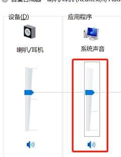

 

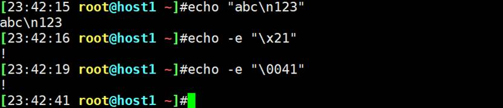


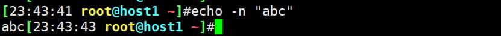

 

 

## 10、echo显示颜色


```
echo -e '\033[43;31;5mICE\e[0m'
```

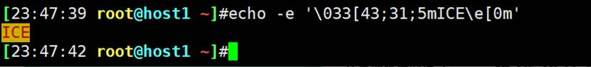前景颜色43、背景颜色31、5是闪烁‘

注意43和31位置互换效果一样的，看的其实是4X就是背景色、3X就是字体色

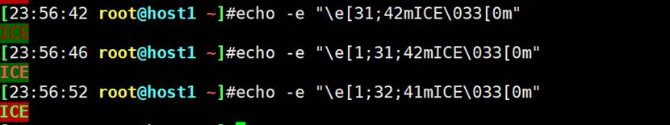

注意\e也就是\033前后都有。颜色数字顺序不重要，然后上图是大家喜爱的红配绿。

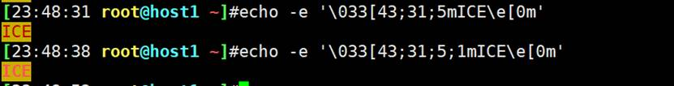

1m的1是亮色

注意\033等价于\e


 

linux里很多信息都是带颜色的，比如

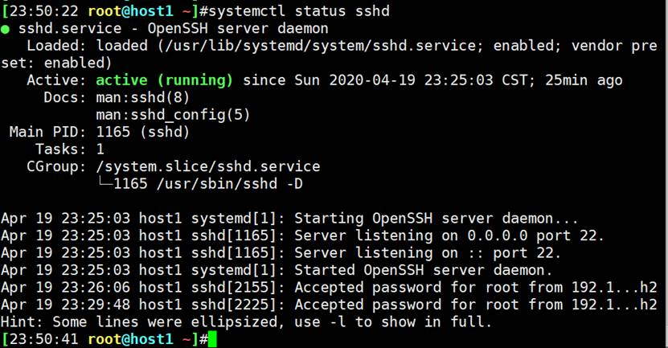

我们自己也可以做出该效果

比如echo：

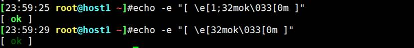

上图是1是加亮，下图5是闪烁

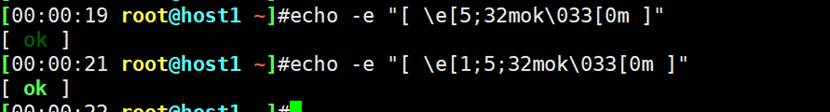

 

将来shell脚本，需要屏幕上显示一些东西带颜色，就这么玩。

 

 

## 11、一些编码转换和查询

之前一篇说过字符集和编码也就是unicode和UTF-8的事情，下面是工具网站

http://www.chi2ko.com/tool/CJK.htm

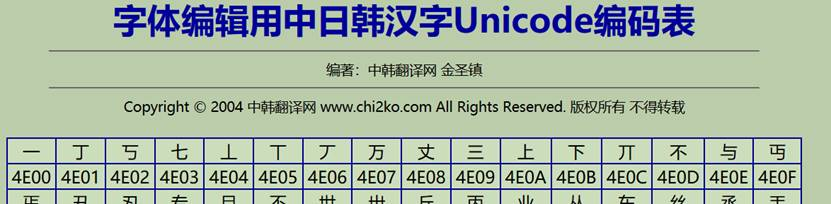

 

https://javawind.net/tools/native2ascii.jsp?action=transform

 

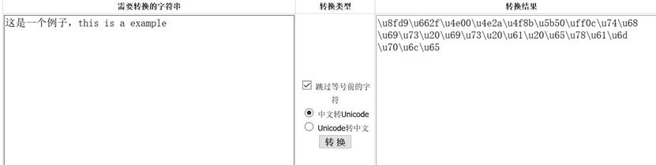

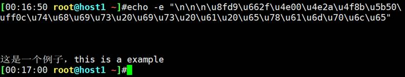

 

http://tool.oschina.net/encode

类似的网站

 

 

 

## 12、命令行扩展、被括起来的集合

很多时候会用到3种引号

‘’   单引号

“”  双引号

``   反向单引号 等价于 $()

注意凡是在word或execl中的引号不能直接复制到linux或python里运行，不管你是否是英文的，复制过去就是不对，基本上需要重新键入引号。后面才知道word本身可以设置引号为英文的，这样就可以统一了。

 

花括号

echo file {1,3,5}

rm -f file{1,3,5}

echo {1..10}

echo {a..z}

echo {000..20..2} 


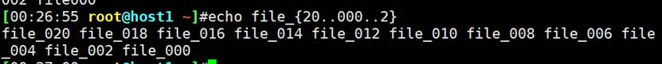


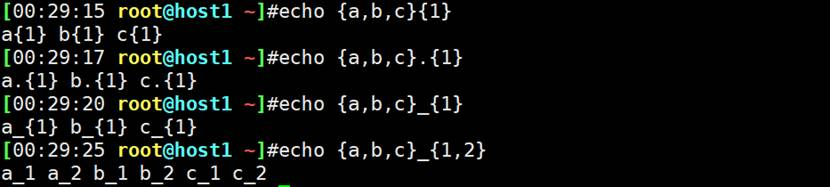

花括号里面的就是选择或者递增的关系，花括号外面的_是必然有的。

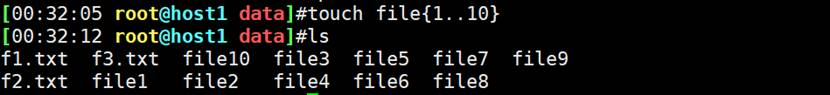

批量创建文件、用户等。

 

 

双引号、单引号、反向单引号，针对不同的场景，作用不同，

针对echo的，针对shell编程的，不同应用地方的作用是不同的。

 

 

## 1、引号在echo处的作用

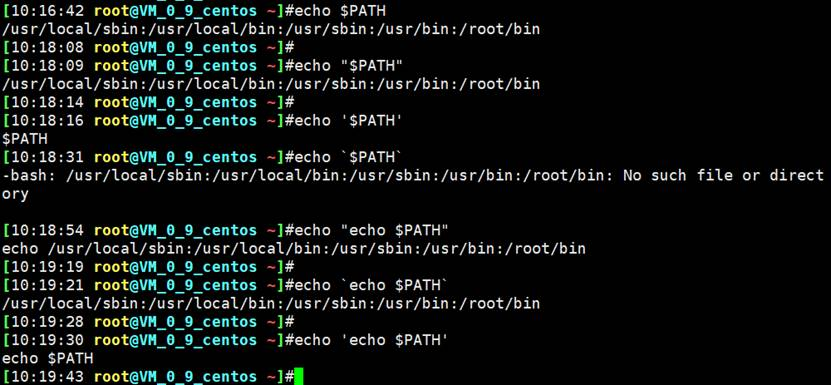

单引号：里面全是字符串，他大舅他二舅都是他舅。

反向单引号：能识别里面的命令和变量。

双引号：不能识别里面的命令，只能识别里面的变量。

 

## 2、一个命令调用另一个命令的结构的时候，经常使用反向单引号。


问题来了


data后面的要引起来，所改成双引号，但是问题如下


结合下图


结论date ‘+%F %T’得到的是两个值，所以touch的时候才会创建两个文件

都是空格惹的祸

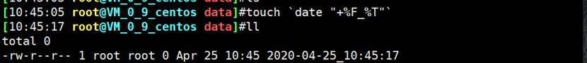

所以最终的方法如下

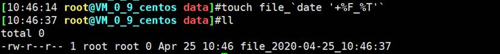

结论：touch创建一个文件的时候不能带空格，有了就是两个文件了。上面的’+%F_T’可以不用引号了，因为本身就是一个整体了。

但文件名应该可以带空格的，虽然不太好，windows就是


 

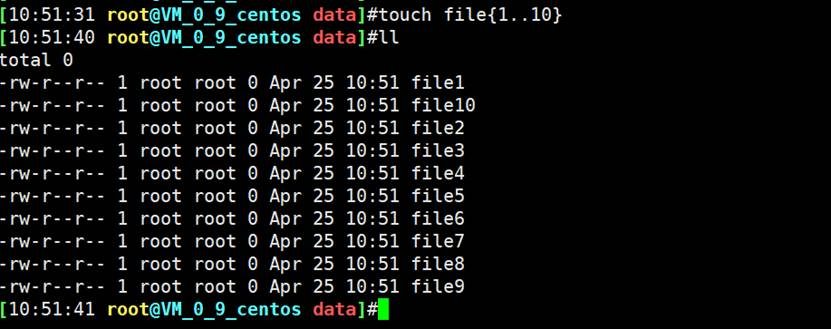


 

## 3、反向单引号和$()是等价的

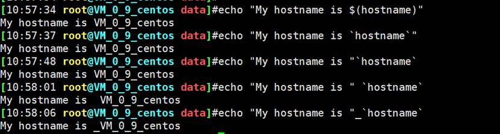

结论：反向单引号作为一个单元在其他引号内部出现，不影响效果。

 

所以上面的也可以这么写

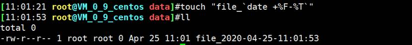

 

 

## 4、每晚12点01分执行备份日志等操作，并保存为前一天的时间


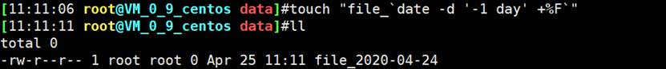

 

 

## 5、tab补全

命令补全（命令的option也是可以补全的，按两下tab会出来一推）

路径补全

文件补全

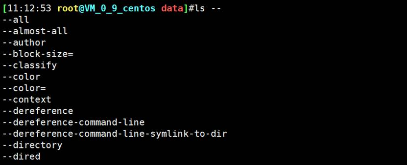

虽然没神马用。

 

 

## 6、命令行历史

linux输入的每个命令默认都是有历史记录的，除非在键入命令的时候加入特别选项（也很方便做到）。

这些输入的命令记录会放在内存的缓存区里。内存里有一个历史列表，存放了输入的这些命令。

突然断电，或者直接关闭xshell，这些记录就有可能没了，可能就没写到.bash_history文件里。

一般系统会自动保存到文件里，

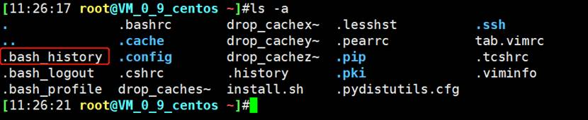

 

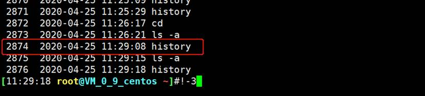

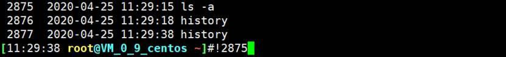

 

history的ctrl r快速搜

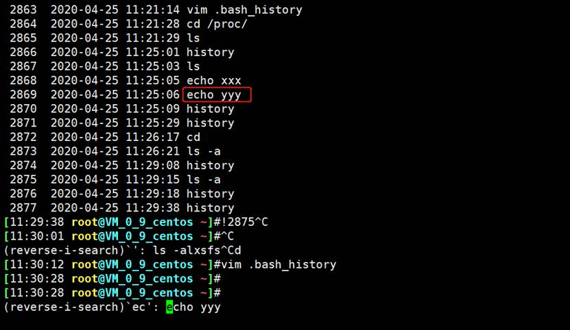

上图的操作为：!然后按ctrl r，输入echo，就会从history里找到最近的一次包含echo的命令，我经常用来做snmpwalk -v -2c xxx 10.1.1.1 .1.3.6.1 x.x.x.x.x 这种历史的调用。

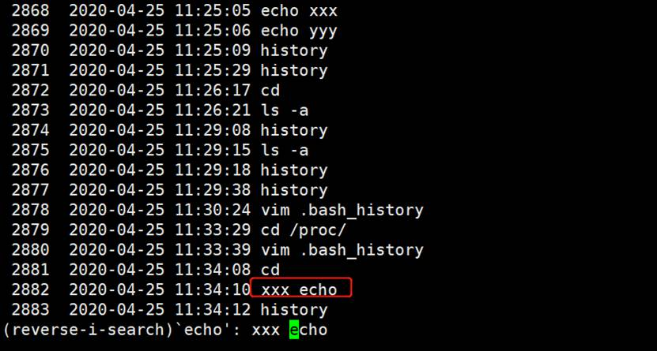

这是包含，下面的水以什么开头的最近的一次历史命令

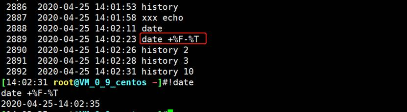

下面是包含什么的最近的一次历史命令

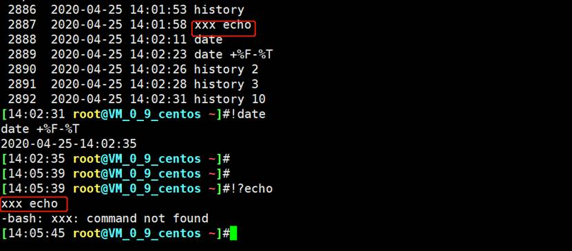

 

 

## 10、把上一条命令的前面的换掉

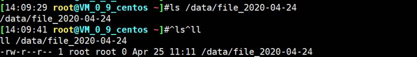

 

## 11、上面的ctrl r修正一下

不需要输入history在按ctrl r直接ctrl r就行ctrl g是退出


 

 

## 12、非常实用的命令,把前一个命令的最后一个参数调出来

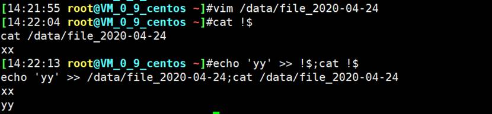

 

上面的!$调用比较方便，还有交互式下的快捷键可用来替代!$，比如

按esc松开不松开都可以再按.

或者按alt . 考虑到xshell的默认快捷键冲突，所以建议改一改，这么改就行

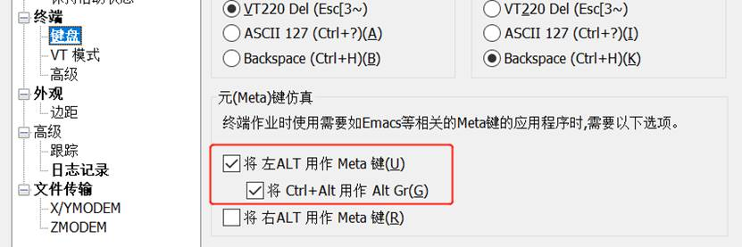

 

 

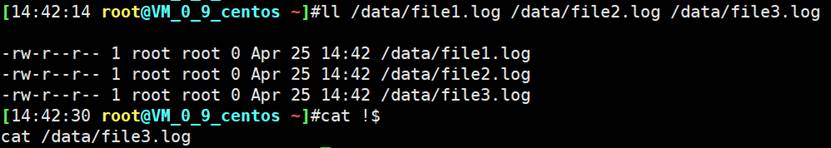

需要更加多样的调用，实际上!$是上一个命令的最后一个参数，!^是就是第一个参数，其他还有很多类似用法，但是我觉得没必要了，其他的不实用。

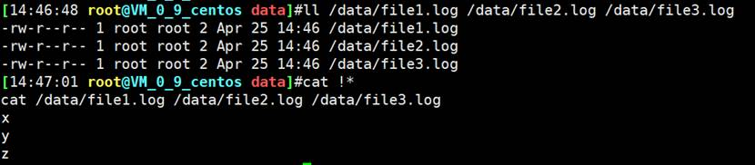

 

## 13、history命令选项用法继续


 

①history会默认记录命令，现在考虑安全，可以清除历史

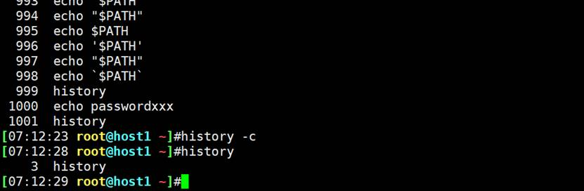

这个history -c是清楚的内存中的历史，而历史命令不仅仅是内存中有，还有磁盘文件也有。


但是这个文件放的是以前的历史命令。不是现在的几条。退出重进，发现echo passwordxxx确实不在，其实就是趁着内存中的命令还没自动放进./.bash_history里history -c直接就清掉了。

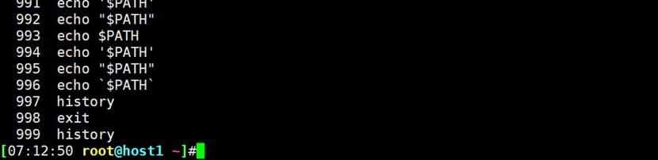

但是腾讯云上显然不是这样，应该是有了优化（内存中的命令会立刻存到.bash_history文件中的，如下图。）

 

①history会默认记录命令，现在考虑安全，可以清除历史

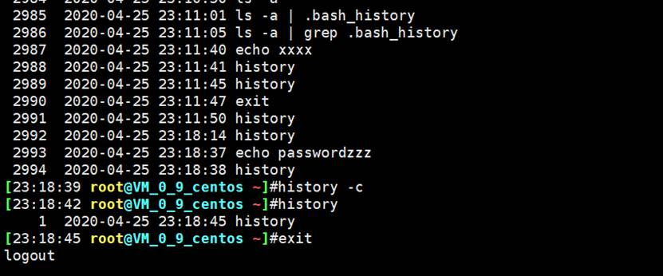

这个history -c是清楚的内存中的历史，而历史命令不仅仅是内存中有，还有磁盘文件也有。


而且腾讯云的VPS，内存里的命令清了，立即退出，重进，会发现命令还在的，说明内存和.bash_history磁盘文件是实时同步的。


为了确认一下，可以cat看一下


注意#1587828143这些是时间应该

 

上面写错了，不是腾讯云的优化，是这个原因：


我把历史命令前面的时间格式取消后，发现内存的命令不会自动同步进.bash_history了。


果然又再次秒同步了。

最后再验证一下


懵逼了，


 

终于知道什么因果关系了：将将将将~

一般情况内存的命令不会实时同步进.bash_history文件里的。

想要实时同步，可以这么做，在history显示行首加上时间格式就能促使命令的实时存盘。

但是需要注意的事


即使注释了这行，还是会实时同步的，如下图，


但是如果你使用；去注释改行，那么 


 export HISTTIMEFORMAT="%F %T "

 

①没有做时间格式的历史记录，但是命令实时同步进.bash_history


②做了时间格式，命令也是实时同步的

③用#注释时间格式，命令还是实时同步的

④用;号注释时间格式，命令就不再实时同步了。

什么鬼。。。睡觉

反正记着有办法让内存的命令实时同步就行了。方法之一就有上面的思路。

上面瞎折腾，靠谱的还是参考下面人家的

https://developer.aliyun.com/article/637427

 

 

 

## 14、history默认是1000条最近的记录


也可以在/etc/profile里写


退出重登，发现还是3000的历史记录，说明etc/bashrc优先

验证，去etc/bashrc下注释掉那行，退出重进，发现此时是10条记录了


 

 

history -d 36就是清第36条

 

怎么删除一个范围？


-a ，追加经磁盘文件

-r , 将历史文件的记录读到内存中的history记录下，默认用户登入的时候就会读取，执行该动作。

 

-w , 将当前的history内存记录存到指定文件中，比-a多了个路径，-a是默认的.bash_history


 

 


所以 -p 是不存在历史内存列表中，而且是将命令按空格展开成多行。

 

 


-s 是制造虚假的历史命令，实际未执行。


 

## 15、history命令历史的相关环境变量

HSITSIZE：命令历史的记录条数是内存中的记录条数

HISTFILE：指定历史文件，默认为~/.bash_history

HISTFILESIZE：命令历史文件记录历史的条数，这个其实用HISTSIZE控制内存中的记录条数，就能控制文件的条数了，对了，默认HISTFILESIZE多大？也是1000条。

HISTTIMEFORMAT=”%F %T ”，显示时间，指定格式，也可以写到/etc/profile.d/env.sh下。PS1就是写在这个下面的


 

HISTIGNORE=”str1:str2*:...” 忽略str1命令，str2开头的历史命令。用法如下


安全敏感的不记录

 

HISTCONTROL：控制命令历史的记录方式，该环境变量的值如下：

​    ignoredups 默认值，忽略重复的命令，连续且相同的为“重复”.不过腾讯云主机是unset没有默认值的：


如图，不赘述

​    ignorespace 忽略以空白开头的命令（类似HISIGNORE=”str1:str2*...”），如下图


 

​    ignoreboth 相当于ignoredups,ignorespace的组合

​    

​    erasedups 删除重复命令，不同于ignoredups(连续的相同命令只留一条随机的？)。erasedups是不连续的也删。


 

这些变量的赋值，上图是直接HISTCONTORL=XXX，这种不会保存在配置文件里，退出用户丢失。可以保存在/etc/profile或/etc/profile.d/env.sh或~/.bash_profile或/etc/bashrc，可以看看云主机的一些环境变量的保存路径，初步总结下来，只要大的路径对了，就行了，比如tab.vimrc不一定非要独立的文件的。感觉腾讯云这么做也无所谓规范不规范的。


 

## 16、快捷键

在xshell里没问题，但是在摸粑粑里有的不灵

ctrl + l 等价于clear清屏

ctrl + o 执行键入的命令，并重新显示出来，这玩意有延迟的，需要将命令打在屏幕上等一会，在按ctrl + o 才对，不让出来的命令是之前的

ctrl + s 锁屏，用来盲敲的

ctrl + q 解锁，恢复输入可见

crtl + c 强制退出

ctrl + d 规范退出，正常退出

ctrl + z 挂起命令  


bg 恢复后就停不下来了，除非退出xshell。

fg 比较好，可以退出ctrl c ctrl z在挂起都行

 

 

## 17、一些有用的快捷键

ctrl+w，往前删除，一段一段的删，就是遇到空格就停下了

ctrl+k 和 ctrl+u相反，光标处删到行尾

alr+r 删除整行 和xshell冲突

ctrl + xx 光标在行首和当前位置切换
