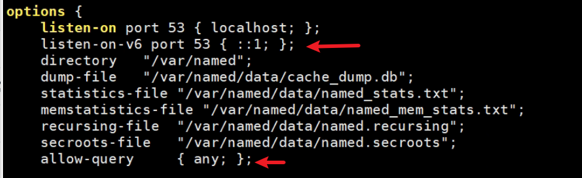
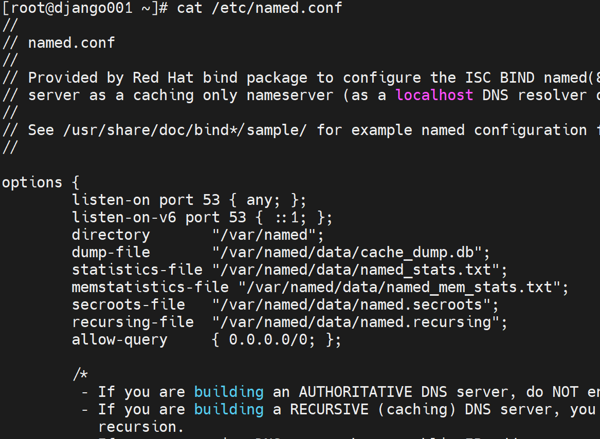
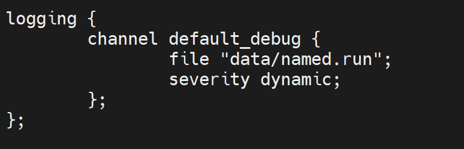
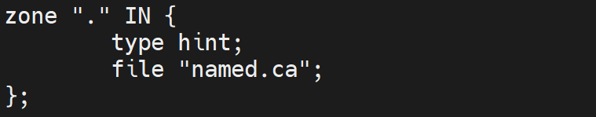
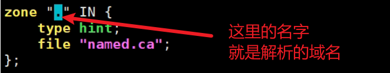

# 第3节. DNS主服务器实现

dnsmasq就是比较简单的hosts复用就行

bind的它分域，针对一个一级域名进行其下域名解析记录的编写。

前2节内容说白了，就是两行的事

 

下面继续了解其他配置，针对xxx.com某个域进行dns服务，

### 第一步，打开主配置文件

配置文件类似C预言风格，都是;分号结尾的

其中有options语句块，用{}花括号括起来的。定义了dns的选项

 

下面还有logging日志的语句块。

 

要建立的DNS域信息，区域zone就是针对某个域建立dns解析用的。

  

zone : 

oneyearice.asia <---> dbfile1			   #   zone就是一级域名对应的数据库文件

xkyearsice.asia<--->dbfile2  # 这是第二个区域

 

上图的file就是数据库的文件名

还有dns是主还是从

图中的.就是根咯，因为这里填的是域名，而根的域名就是个.点，所以file指向的是named.ca文件，该文件里放的及时13个根域。

