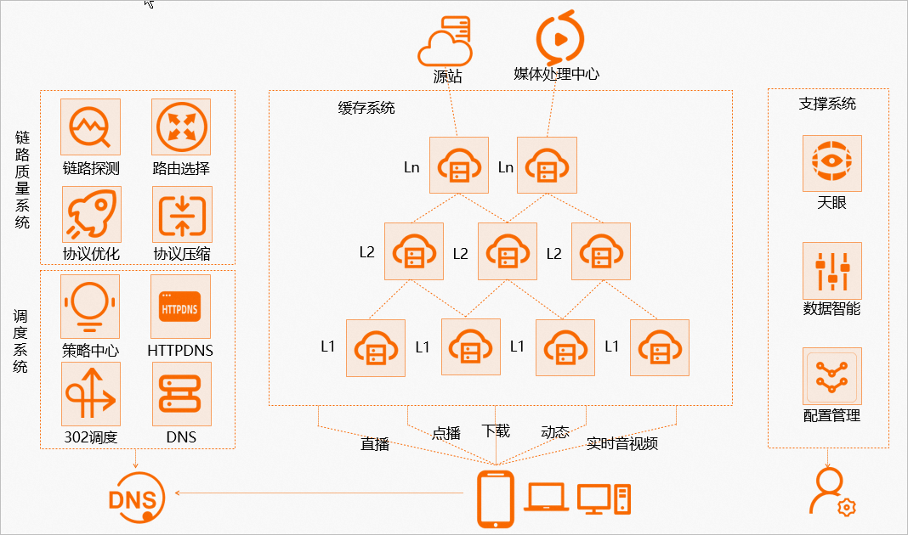

# 第6节. CDN和GSLB工作原理及智能DNS实现

## 1、CDN

开局一张图，后面接着编..........................................................................................................................................写

请把CMD里的dig CNAME的信息画到上面的逻辑交互图上去，你就会发现，早期的图里有一个错误

 

而现在的文档，语文老师估计水平也不行

1、站在用户角度来讲(其实我不喜欢这里我的用词)，应该改成用户请求域名的IP地址，从浏览器打开www.bing.com，F12可见，或者ping www.bing.com 可见就是一个IP啊，只不过dig nlsookup给你看到了交互的信息。

那么为什么cmd里可以看到 LOCAL DNS处理的CNAME呢，用户只有1 6 7 8 理论上用户不知道中间的CNAME啊，

那么肯定是7的内容里带上了2 3 4 5 记录，但是不全，因为你看不到DNS调度系统的IP地址，

难不成是这个NS？

这个ns应该不是dns调度系统的IP。而作为LOCALDNS一定是知道调度系统的IP的，但是cmd里看不到，说明CMD的信息是报文里携带得到的。

正儿八经CMD里的信息，终端使用的其实就一个第一个问的域名得到的IP地址。

这话也不对，LOCAL DNS他应该不是指的企业内部的，而是ISP的或者是223，114这些公共的LOCAL DNS也就是网卡上能配上去的。这点不纠结，算他没毛病。然后LOCAL DNS请求的看来不是13个根，而是直接抵达权威DNS，这点就和我之前理解的少了很多，我理解是迭代那套，想想也对，LOCAL DNS不可能每次都去国外13个根绕一圈，所以LOCAL DNS肯定直接问的权威--也就是你自己发布的解析--在哪里配置的就是哪里。

所以

1、CNAME一条记录里就有了两个信息，①LOCAL DNS 询问对象--阿里的DNS调度系统；②LOCAL DNS询问内容--CNAME的域名。

2、而常规的DNS迭代查询，LOCAL DNS询问对象都是固定的，比如先问根，根说你去找.com，.com说你去找bing.com，这一套的①询问对象迭代出来的②询问内容就是域名啦，这两个信息是分开来的。

​		就是CNAME里询问，你看不到权威DNS说LOCAL DNS你去DNS调度系统，没有这个独立的动作，它是直接给你一个CNAME，比如cn-bing-com.cn.a-0001.a-msedge.net.   这个就明确的说明了是谁谁谁的调度系统，已经要问这个调度系统的域名(CNAME本身就是一个域名)

3、实际操作LOCALDNS可能直接询问权威。
