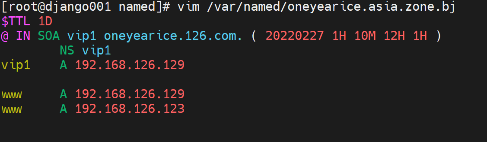

# 第6节. CDN和GSLB工作原理及智能DNS实现


## 1、CDN


开局一张图，后面接着编..........................................................................................................................................写


请把CMD里的dig CNAME的信息画到上面的逻辑交互图上去，你就会发现，早期的图里有一个错误

 

而现在的文档，语文老师估计水平也不行


1、站在用户角度来讲(其实我不喜欢这里我的用词)，应该改成用户请求域名的IP地址，从浏览器打开www.bing.com，F12可见，或者ping www.bing.com 可见就是一个IP啊，只不过dig nlsookup给你看到了交互的信息。

那么为什么cmd里可以看到 LOCAL DNS处理的CNAME呢，用户只有1 6 7 8 理论上用户不知道中间的CNAME啊，

那么肯定是7的内容里带上了2 3 4 5 记录，但是不全，因为你看不到DNS调度系统的IP地址，


难不成是这个NS？


这个ns应该不是dns调度系统的IP。而作为LOCALDNS一定是知道调度系统的IP的，但是cmd里看不到，说明CMD的信息是报文里携带得到的。

正儿八经CMD里的信息，终端使用的其实就一个第一个问的域名得到的IP地址。


这话也不对，LOCAL DNS他应该不是指的企业内部的，而是ISP的或者是223，114这些公共的LOCAL DNS也就是网卡上能配上去的。这点不纠结，算他没毛病。然后LOCAL DNS请求的看来不是13个根，而是直接抵达权威DNS，这点就和我之前理解的少了很多，我理解是迭代那套，想想也对，LOCAL DNS不可能每次都去国外13个根绕一圈，所以LOCAL DNS肯定直接问的权威--也就是你自己发布的解析--在哪里配置的就是哪里。


所以：

1、CNAME一条记录里就有了两个信息，①LOCAL DNS 询问对象--阿里的DNS调度系统；②LOCAL DNS询问内容--CNAME的域名。

2、而常规的DNS迭代查询，LOCAL DNS询问对象都是固定的，比如先问根，根说你去找.com，.com说你去找bing.com，这一套的①询问对象迭代出来的②询问内容就是域名啦，这两个信息是分开来的。

​		就是CNAME里询问，你看不到权威DNS说LOCAL DNS你去DNS调度系统，没有这个独立的动作，它是直接给你一个CNAME，比如cn-bing-com.cn.a-0001.a-msedge.net.   这个就明确的说明了是谁谁谁的调度系统，已经要问这个调度系统的域名(CNAME本身就是一个域名) <font color=red> 废话--就是常规的套路--拿到cn-bing-com.cn.a-0001.a-msedge.net.后，就会找.a-0001.a-msedge.net.   而这个域里自然有智能调度出来的cn-bing-com.cn.a-0001.a-msedge.net. 的IP地址。</font>

3、实际操作LOCALDNS猜测可能直接询问权威。


### GLSB


图片还是两家都更新了，^_^；阿里的风格变了，立项了？可能，腾讯基本没变。不过隐藏了GLSB关键信息。


 


关于"DNS的调度系统"，这里弱化为BIND的智能DNS，其中就涉及VIEW和ACL的使用

题外话：acl：路由器交换机里的acl、linux文件的fileacl、还有这里的dns的acl；其实acl叫access list，所以都是过滤而已。


 


### 实验-智能DNS


 

#### 然后创建ACL

推荐写到named.conf的options之前，便于后面调用，匹配是顺序匹配的，所以小网段写到前面。

 


#### 编写view

写了view后zone文件就都得放入view视图里，

1、将文尾的include "/etc/named.rfc1912.zones.bj文件放入view里，并分别命令区分，稍后要创建这些文件。

2、将原先的根域的配置段👇删除后，合并到上面view里的各个zone文件里。

```
zone "." IN {
        type hint;
        file "named.ca";
};
```

  

###### +易犯错误1>> acl名称这里调用别写错，复制过来


#### 创建编写好各个view指向的zones配置文件

```
[root@django001 ~]# cp -a /etc/named.rfc1912.zones /etc/named.rfc1912.zones.bj
[root@django001 ~]# cp -a /etc/named.rfc1912.zones /etc/named.rfc1912.zones.sh

```

 

###### +易犯错误2>> view里的include的文件路径和名称对应的文件要创建好，

###### +易犯错误3>> 对应的zone定义文件的权限也要注意


##### 将根的zone配置段，从/etc/named.conf里复制进这些区域文件

 y

 

思考，zone里的顺序问题，恩，思考，先把上面的other后面的;分号补上。

###### +易犯错误4>> 格式要注意，分号会频繁出现，类似 python里的并发args传参的写法，最后一个参数也要后跟一个分号。


##### 创建编写好各个zone数据库文件

 

###### +易犯错误5>>注意zone数据文件通常是vim直接创建，所以权限必然不对，需要改。

 


 

奇怪了，不奇怪！因为配置文件里没有语法错误，知识named.conf的VIEW里的路径---zone定义文件的路径----zone数据库文件名称，没有对应上。

 


哪里没有终结，代码块的东西


奇怪

发现named.conf里写的名字不对


反正各种名称路径写错，真TM操蛋


又把asia写成了aisa。


测试下

这个是外面宿主机直接cmd 去dig的，源IP为192.168.126.1，命中的acl是othernet：

 


192.168.126.131命中acl shanghai，通过zone配置文件指向到了 zone数据库结果正确

 


再来看192.168.126.130，发现有点问题


排错1：


排错2：

 

写错了，老是这样，操


OK了


这就实现了源IP地址的分流，所谓的归属地的查询--智能DNS多少就有这个影子在里面，至于是具体是不是写了很多IP段在里面就不得而知了，我尝试过acl里写正则，都失败了，也没有找到相关资料。


测试匹配次序

 

这样三个都是beijing acl索引过去的zone数据库文件了


 

 


 

汇总：

```
1、主配置文件
        vim /etc/named.conf
        acl beijingnet {
                192.168.126.0/24;
        };
        acl shanghainet {
                192.168.126.131;
        };
        acl othernet {
                any;
        };

        # 删除zone . IN 根的那段，将include "/etc/named.rfc1912.zones同样删除，

        view view_beijing {
                match-clients {beijingnet;};
                include "/etc/named.rfc1912.zones.bj";
        };
        view view_shanghai {
                match-clients {shanghainet;};
                include "/etc/named.rfc1912.zones.sh";
        };
        view view_other {
                match-clients {othernet;};
                include "/etc/named.rfc1912.zones";
        };


2、区域配置文件
vim /etc/named.rfc1912.zones
        zone "." IN {
                type hint;
                file "named.ca";
        };

        zone "oneyearice.asia" {
                type master;
                file "oneyearice.asia.zone.other";
        };

vim /etc/named.rfc1912.zones.sh
        zone "." IN {
                type hint;
                file "named.ca";
        };

        zone "oneyearice.asia" {
                type master;
                file "oneyearice.asia.zone.sh";
        };

vim /etc/named.rfc1912.zones.bj
        zone "." IN {
                type hint;
                file "named.ca";
        };

        zone "oneyearice.asia" {
                type master;
                file "oneyearice.asia.zone.bj";
        };


3、编写zone数据库文件
vim /var/named/oneyearice.asia.zone.other
        $TTL 86400
        @       IN SOA ns1  admin  ( 2023022150 1M 10M 12H 1 )
                   NS  ns1
        ns1        A   192.168.126.129
        websrv     A   10.2.1.100
        websrv     A   10.2.1.101
        www        CNAME websrv

vim /var/named/oneyearice.asia.zone.sh
        $TTL 1D
        @ IN SOA vip1 oneyearice.126.com. ( 20220227 1H 10M 12H 1H )
                NS vip1
        vip1    A 192.168.126.129

        www     A 192.168.100.150


vim /var/named.oneyearice.asia.zone.bj
        $TTL 1D
        @ IN SOA vip1 oneyearice.126.com. ( 20220227 1H 10M 12H 1H )
                NS vip1
        vip1    A 192.168.126.129

        www     A 192.168.100.100


4、
amed-checkconf
named-checkzone oneyearice.asia /var/named/oneyearice.asia.zone.other
named-checkzone oneyearice.asia /var/named/oneyearice.asia.zone.bj
named-checkzone oneyearice.asia /var/named/oneyearice.asia.zone.sh


```

同样别人的配置来一份：

 

 


 


 


##### 学习了这个VIEW也就是智能dns，还需要再次知道一下，这东西是落在哪里的，是落在CNAME过来的DNS调度系统上的，如下图


尝试做一个完整版的，

### 原来的智能DNS修改一下

cnd的域名后缀修改为tbcdn.com也就是www.oneyearice.tcdn.com

而www.oneyearice就是tcdn.com的子域，可以建一个下级域

### 前面顶一个权威DNS


NXDOMAIN就是$minum缓存时间里的查不到记录的结果，NX就是**N**ot e**X**ist


 

 


DNS本身的负载均衡效果


这是ping 两个解析后的IP都不通，所以看不出来DNS是否有默认 健康性检查的效果，改成一个通一个不通的情况测试


发现全是129通的那个ip


DNS虽然解析是由100不通的那个IP的，但是这里的ping以及包括CURL的测试，进一步包括浏览器打开都是不会负载到不通的那个IP的。


做成负载的两个IP都通的情况，测试

发现统统变成了131


改回只有一个129通



rndc reload后发现，又只有129了


再次改成都不通，又轮询负载均衡了


 要查资料了


这次看到了不一样的效果，.1其实是我的宿主，通的，但是icmp被防火墙干掉了，ping是NG的。

再131上ping ，130上firewall firewall-cmd --permanent --add-icmp-block-inversion 禁掉了ping，结果还是给我一直解析的是130.


### ping测试负载没有健康检测，而且负载轮询不可靠


### 再看看http的情况


并没有负载

然后129好的130好了就抢先了，


停掉130，129就回来了，是有健康检测机制的


### 关于DNS的rr轮询查资料：

https://blog.csdn.net/zhu_tianwei/article/details/45071085

还得看官网

https://bind9.readthedocs.io/en/v9_19_9/reference.html


1、默认行为

轮询，通过nslookup可见每次的顺序是轮询的，

通过顺序不一样，来引导客户端自己选择不同，

所以决策者还是client端。

2、人工干预

