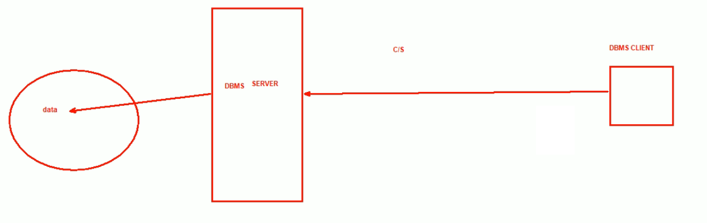
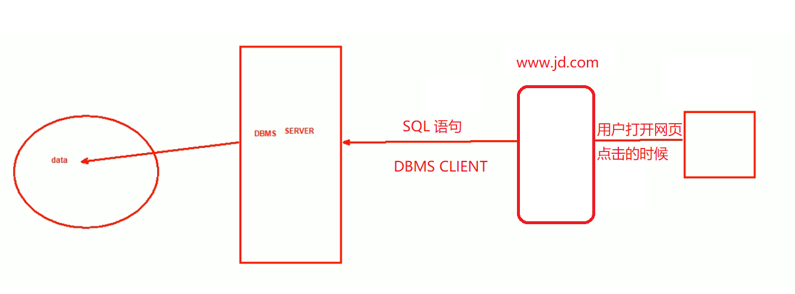
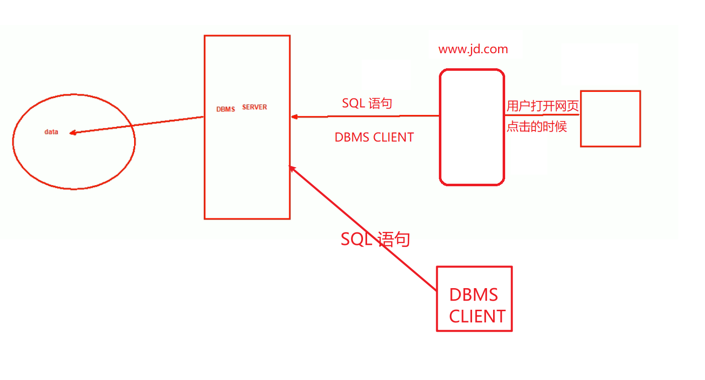
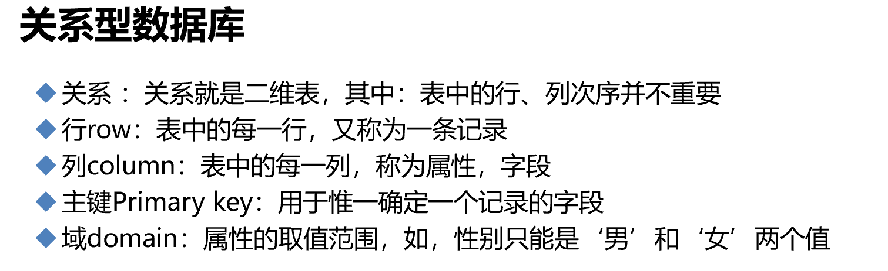

# 第1节. 数据库基础原理1

开具一张图：

 

DBMS server:比如mysql-server；DBMS client：比如mysql-client

 

 

tidb：天生分布式，兼容mysql，程序可能无需改动。

mysql 这些库里：

一行row就是一条记录record，

一列columm就是各种属性的数值

 

null表示该字段未空，没有赋值，pk主键是不能为null的

... ...

