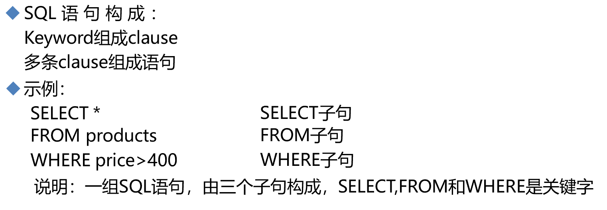

# 第6节. sql各种语句1


### 基础概念

IBM开发出来的SQL语言


SQL语言规范

 


命名规范


常见SQL语句

DDL：CREATE,DROP,ALTER

DML：INSERT,DELETE,UPDATE

DCL：GRANT,REVOKE,COMMIT,ROOLBACK

DQL：SELECT


 


```
创建数据库：
CREATE DATABASE|SCHEMA [IF NOT EXISTS] 'DB_NAME';
CHARACTER SET 'character set name’COLLATE 'collate name'
修改数据库：
ALTER DATABASE DB_NAME character set utf8;
删除数据库
DROP DATABASE|SCHEMA [IF EXISTS] 'DB_NAME';
查看支持所有字符集：SHOW CHARACTER SET;
查看支持所有排序规则：SHOW COLLATION;
获取命令使用帮助：
mysql> HELP KEYWORD;
查看数据库列表：
mysql> SHOW DATABASES;
```


### 创建数据库


```
Name: 'CREATE DATABASE'
Description:
Syntax
------

CREATE [OR REPLACE] {DATABASE | SCHEMA} [IF NOT EXISTS] db_name
  [create_specification] ...

# create_specification就是指定的属性，包括
# CHARACTER SET 默认字符集：明确当前默认字符集是什么 show character set
# DEFULAT COLLATE 默认排序规则

create_specification:
  [DEFAULT] CHARACTER SET [=] charset_name
 | [DEFAULT] COLLATE [=] collation_name
 | COMMENT [=] 'comment'

Description
-----------

CREATE DATABASE creates a database with the given name. To use this statement,
you need the CREATE privilege for the database. CREATE SCHEMA is a synonym for
CREATE DATABASE.

# SCHEMA和DATABASE是同义词
```


gb2312是简体中文

big5是繁体字

utf8 全球语言编码

图中Default collcation是排序规则，就是最左边一列的字符集，它默认使用的排序规则是什么，通过show collation查看一下排序规则的具体内容


这👆就是以排序方式作为线索的表单，最左边是排序方式，第二列是可以使用该排序方式的字符集，同时第三列就是字符集是否默认使用的这行的顶头那种排序。


现在不主用UTF8了，数据库里要存放表情包之类的符号，就需要👇utf8mb4才是推荐。


占用字节也是比较大的4个字节，UTF8时3个字节。空间也就是硬盘也便宜。


创建db，实际上的默认语句，其中默认字符集时latin1_swedish_ci，默认数据库就是不支持中文的，需要修改。


创建的时候制定字符集


此时去DB文件里看看


db.opt里两行内容，默认的字符集，默认的排序规则

一个数据库就用统一的字符集，虽然可以针对某个字段设置字符集，但是非常不推荐。


##### 修改数据库的字符集

ALTER DATABASE DB_NAME character set utf8;

如果DB里已经放了数据了，所以调的时候就要小心了。一般不会改。


删除数据库

DROP DATABASE|SCHEMA [IF EXISTS] 'DB_NAME';


三种创建方法，主用第一种


data_type数据类型

tinyint:8bit，正好是IPv4地址一段的空间。可用在此处规范格式

数据库存角、分，也是单独建立字段角、分，都是整数型而不是小数型。


##### 查看官方文档里的定长和变长

https://dev.mysql.com/doc/refman/8.0/en/char.html


CAHR(4) : 代表，不管多少，多砍少补，视频里老师讲是4个字符而不是4个字节，就是说最多可以存4个汉字的。


##### 修饰符

比如员工编号自动增长可以用AUTO_INCREMENT

确保全是正数没有负数，可以使用UNSIGNED

tinyint  8bit  最高位如果为0就是正数，为1就是负数。所以真正的数据也就是7位。使用UNSIGNED后符号位就去掉了，8bit全是整数，范围从0-255了

DEFAULT  没赋值的默认值，比如IT行业默认值设定为男...


```sql
create table student(id int unsigned auto_increment primary key,name varchar(20) not null,gender ENUM('m','f') default 'm',mobile char(11) );
```

定义了id为int类型，有点大好处嘛不烦神，坏处就是4B占空间，用不了这么多可能，unsigned就是都是正数，auto_increment自增长的id序号，主键默认就是not null

name就是varchar类型20个字符，注意是字符。not null不为空，

gender类型是ENUM枚举表示几个中选择一个，default默认值为m，

mobile手机号就是，char(11)个字符串，注意手机用数字int这种不合适，因为还要进一步做138开头的匹配过滤操作。数字可能不行，regex好像针对的是字符串来匹配的。


查看默认字符集拉丁，不支持中文。


表格式不要改，能改的不多，比如varchar(20)就不能改小了会造成数据截断，改大倒是可以。


DROP TABLE

ALTER TABLE


