# 第4节. mysql架构和存储引擎详解

## 权限类别

管理、程序、数据库、表、字段，这些都可以设置权限

管理类：create、shutdown、show databases、

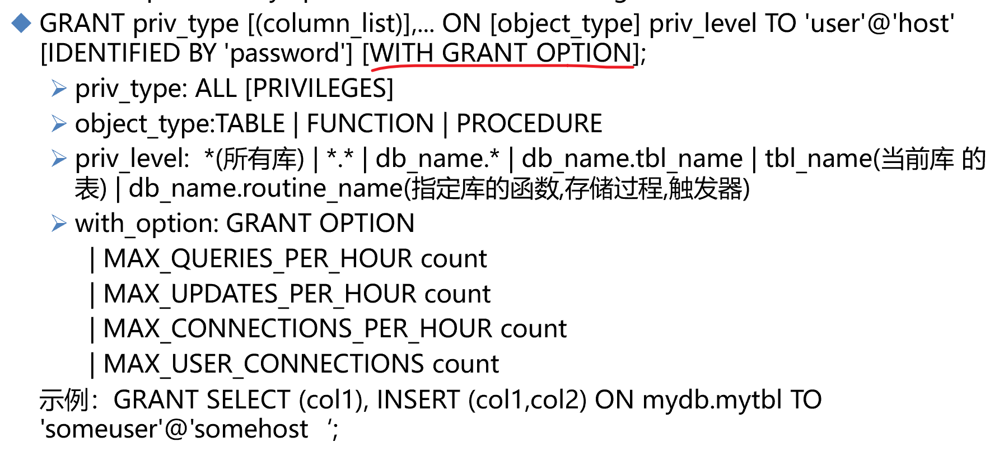

结尾带上：with grant option就是被授权的用户拿到权限可以转赠给别人。

GRANT SELECT (col1), INSERT (col1,col2) ON mydb.mytbl TO 'someuser'@'somehost';

PS：授权，只能select col1只能查询col1这个字段，只能对col1和col2进行插入赋值，在mydb.mytbl这个库的这个表上，针对‘someuser’@'somehost'这个用户。

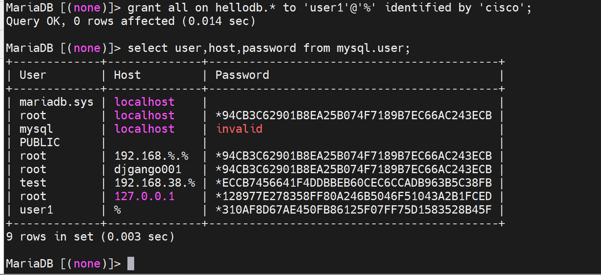

就OK啦；所以现在的新版本依然可以用grant去授权的时候直接创建用户。

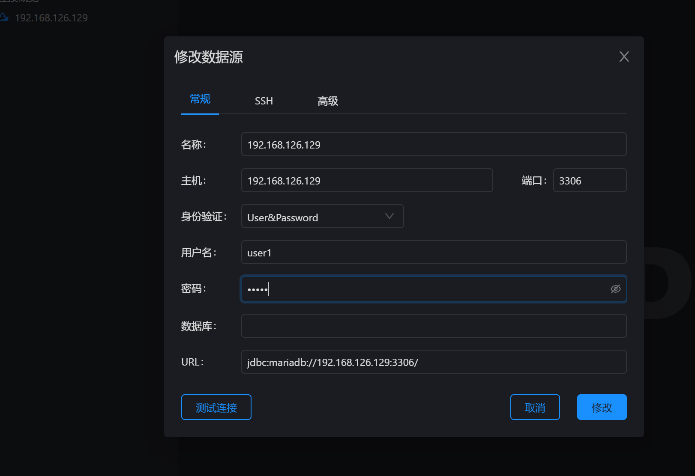

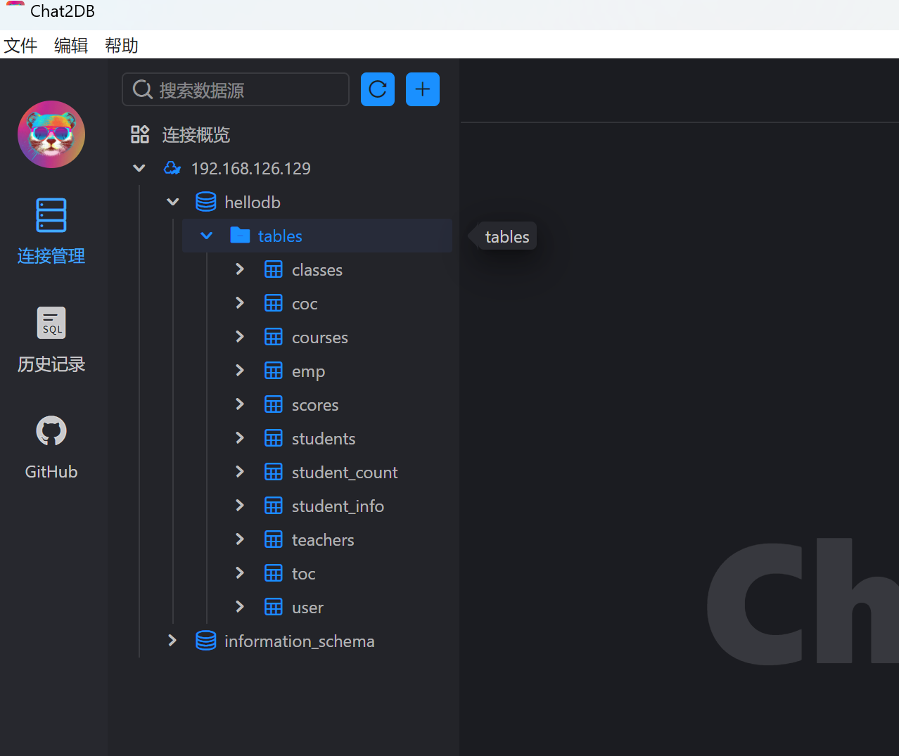

### 取消授权REVOKE

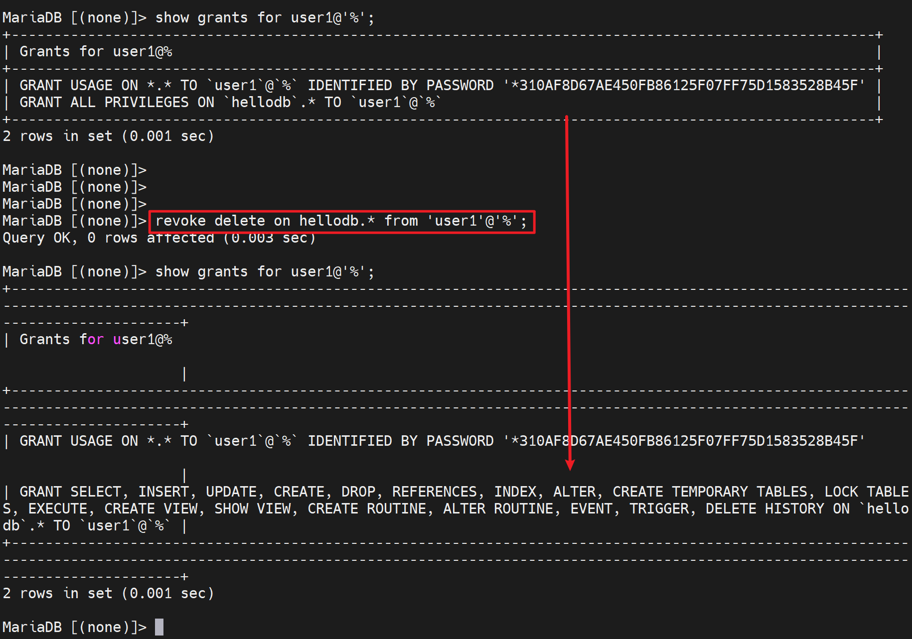

上图就是ALL里面单单去掉了delete权限。

### 查看当前用户权限

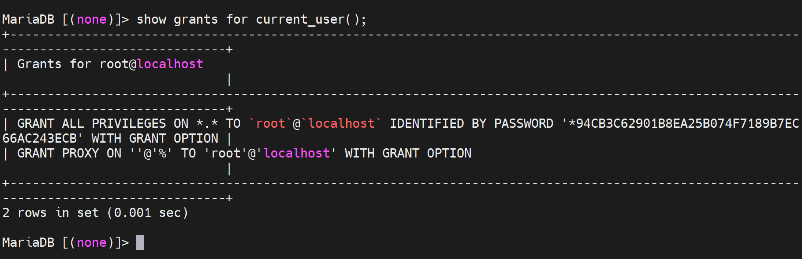

一般授权可能需要结合flush privileges使之生效，有时候也不用补。当然忘记密码的步骤里需要改密码cli前flush一次。而授权这里通常是授权cli后补一个flush。

### 单单授权cli

就是

第一步，创建用户

​	create user user2@'127.0.0.1' identified by 'centos';

PS：identified by 'centos' 不管在create user还是在grant 授权里出现都是设定密码了。

第二步，授权

​	grant all on hellodb.* to 'user2'@'%';

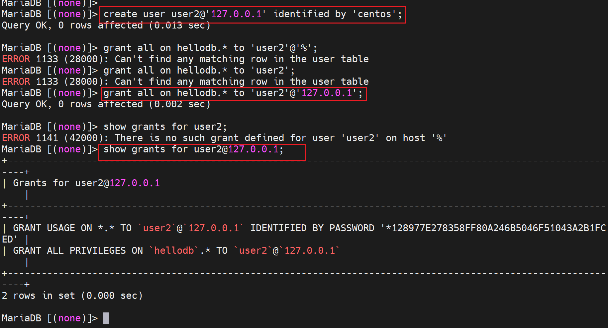

## mysql的架构

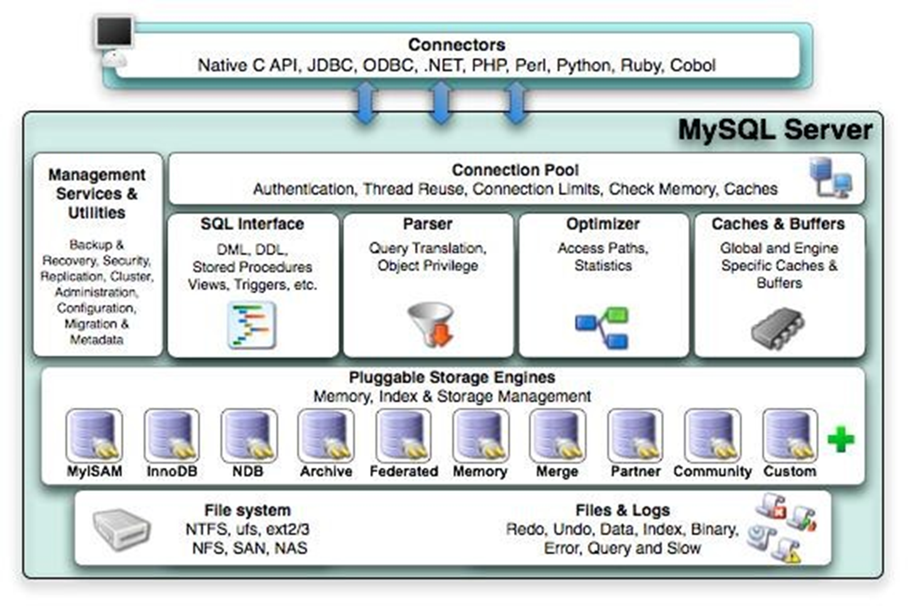

### 1、connector：连接器也就是API：

理解：各种API咯，JDBC就是jAVA调库的API，此外还有python和其他语言调用mysql的API。

### 2、connection pool：连接过来后要验证身份、分配线程、等等，这些处理模块就是connection pool连接池：

authentication，就是验证是不是合法的用户，验证完了以后，系统会分配一个为你服务的线程。

thread ，就是mysql是单进程多线程的服务。用户上来，验证过了后，分配的就是一个线程。

reuse，用户使用线程查询完后，断开了，线程不会销毁。系统会清理该线程的用户信息，然后重新使用，叫reuse重新使用。

thread，其实有一个pool，池子。从池子里取线程分配。如果池子里总共有1000个线程，来了1w个用户连接，此时就超量了，就有一个连接限制connection limit。这个默认连接数是100，我以前批量并发获取400台SW信息并发写道mysql里就遇到了这个问题，最后查出来就是连接数限制要调大些就好了。

生产中这个连接数的值肯定要调大的。

还有check Memory和cache都是在连接池子connection pool里

cache下文介绍

### 3、SQL接口

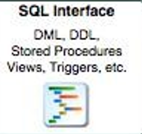

用户通过connection pool拿到线程服务了，就可以通过线程向mysql发送指令了。而client发送过去的cli，server就会检查cli的语法，检查语法就是靠SQL Interface接口来完成的。

SQL语法检查通过了以后就进入了下一阶段

#### 4、Parser：解析器

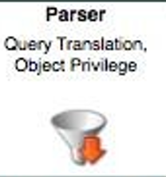

把用户发来的cli解释成SQL自己身能理解的内容。

在做解析的时候，同时要做权限检查，应该是给到具体的权限吧。然后还要做优化

### 5、Optimizer,优化

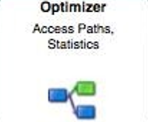

DB在资源访问的时候，访问方式不是单一的，比如：用索引和不用索引。

到底用索引好还是不用索引号，就需要一个优化。

根据这个优化，最终判断出来这个最佳的路径，来进行查询。

6、Caches和Buffers

如果查询过了，则可以利用缓存。

如果缓存里也没有，就需要去磁盘找了那些数据了。

### 7、数据是放在文件系统上的db格式

数据库底层的数据，除了 数据库本身--db文件，还有一些日志也很重要。日志是一个大的话题，后面会讲各种各样的日志。正常软件就一个日志，而数据库里的日志就很多：redo、undo、Binary、error、查询、慢查询。

这些db文件要对其进行访问，就需要存储引擎进行支持

### 8、存储引擎

存储引擎负责和磁盘打交道

数据库通过存储引擎连接到磁盘文件系统上来访问磁盘的文件里的数据。

历史上有上百种引擎，目前都是使用innoDB了。

### 9、数据库其他功能

备份、还原、

