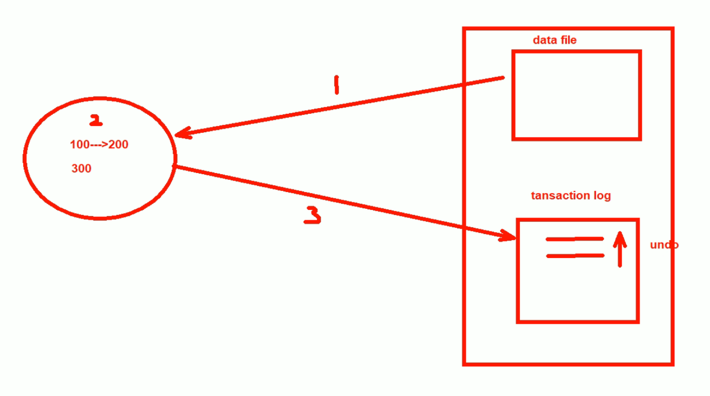
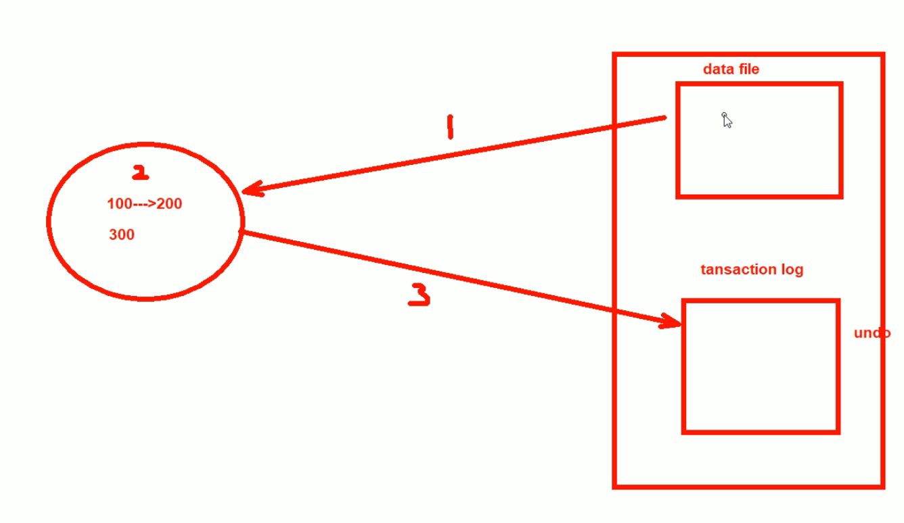
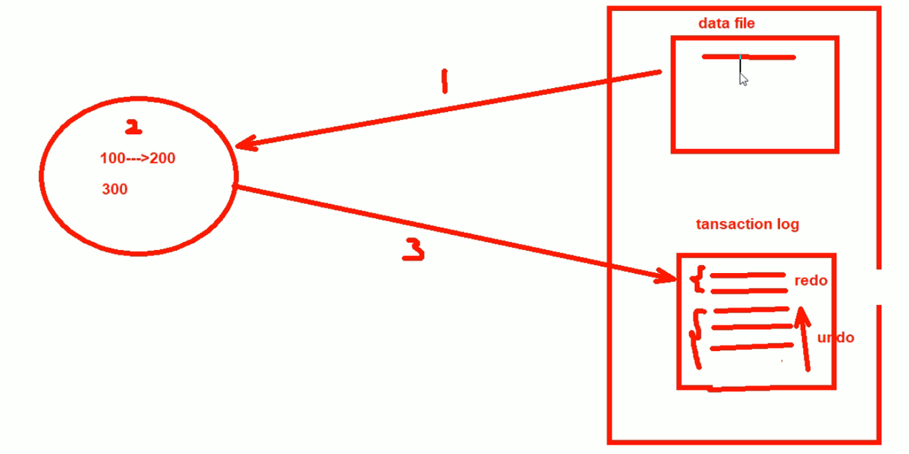
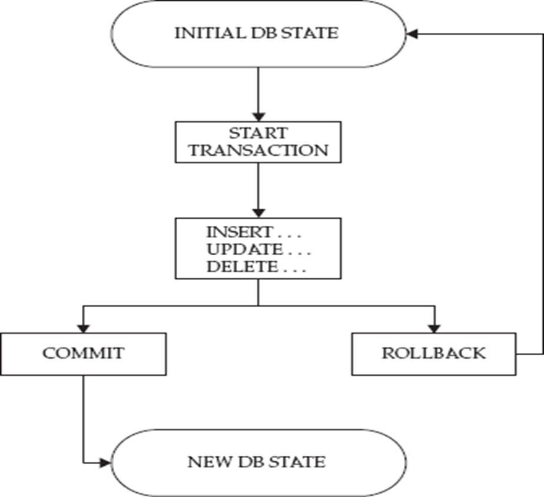
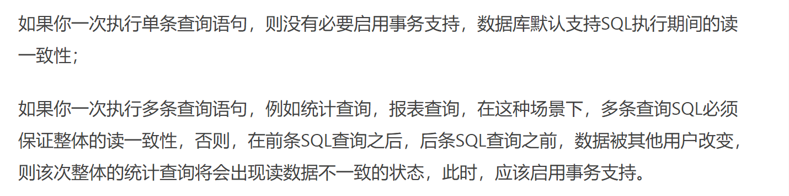

# 第3节. 事务特性和四种隔离级别

## 事务的概念

事务Transactions：一组原子性的SQL语句，或一个独立工作单元
事务日志：记录事务信息，实现undo,redo等故障恢复功能
ACID特性：
A：atomicity原子性；整个事务中的所有操作要么全部成功执行，要么全部 失败后回滚

C：consistency一致性；数据库总是从一个一致性状态转换为另一个一致性 状态

I：Isolation隔离性；一个事务所做出的操作在提交之前，是不能为其它事务 所见；隔离有多种隔离级别，实现并发。

​		隔离有隔离级别：一个修改事务过程中，另一个事务能否看到是取决于隔离级别的，比如你你修改1000未1100，别人不一定能看到1100。

​		一个事务没有结束，中间过程的数据就叫做“脏数据”。

D：durability持久性；一旦事务提交，其所做的修改会永久保存于数据库中

撤销叫做回滚，commit就确定了就永久保存在数据库中了。

### 事务日志类似于ext3的文件系统日志

1、100变成200，200变成300，然后还没来得及commit就停电了

此时后面来电mysql起来后，会对这个100->200,200->300的 事务日志 做undo撤销动作。

1、2、3本来只是完成到事务的日志记录，实际上并未提交

此时就是100大不了没有改成300，就是100不变。

事务日志已经commit提交的是一个完整的事务，就redo--在数据库里重新执行一遍写进数据文件里，没有的undo撤销。

所以事务日志里有redo日志和undo日志。

### 事务的执行过程

1、刚开始数据库是初始化状态

2、开始一个事务，事务开始的标志是：人工手动，或者 隐式的开始

3、事务中：增、删、改；查应该不算在是事务里了，看来不是说算不算的问题，而是你放不放的问题，你手动制动select就是事务里的，就是啦，隐式估计不放吧。

4、commit，如果事务确定要提交了也就是结束了，就是commit。相当于订单提交，不过也可能是加入购入车哈哈。

5、rollback
