# 第4节. 各种日志管理

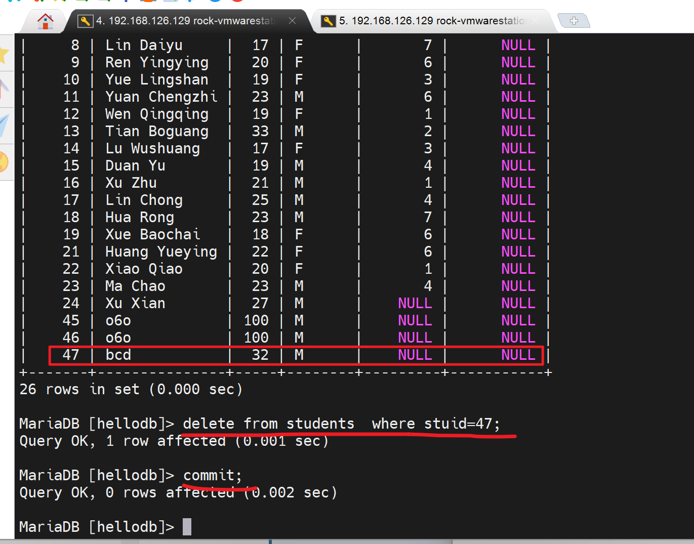

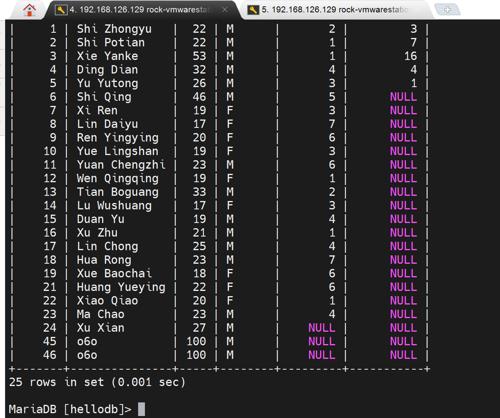

已经删掉了这一行，且提交，由于默认的事务级别是 "可重复读"，所以另一个窗口由于实现开启了事务，所以还是可以看到整个被删掉的数据的。

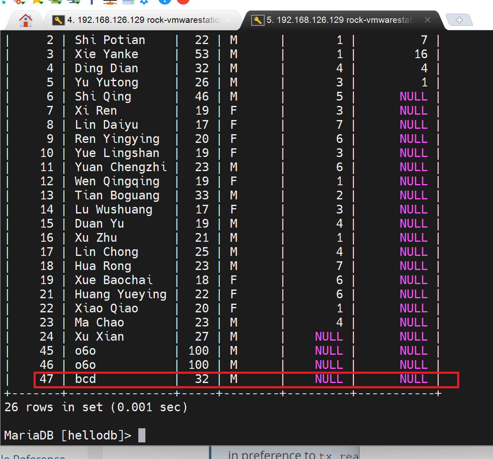

既然这个用户出现了幻读，那么站在他的角度就是可以改的，看看效果

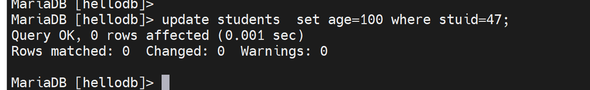

结果发现没有变化

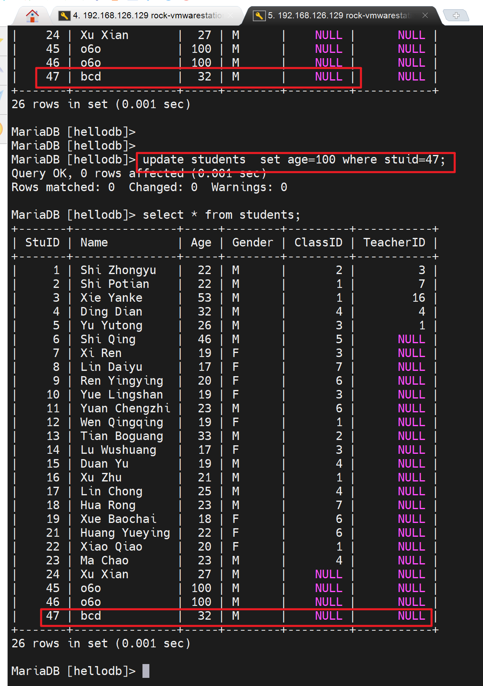

delete也看起来可以敲下去，但是并不会变化，幻读的结果还是比较稳定的，这种"可重复读"的机制，不仅仅是当初修改的人怎么修改提交，这边都看到的是进入事务的时候的看到的值；而且不管自己怎么改、删，自己看到的值还是当初进入事务的时候看到的值，所以这里又对REPEATABLE-READ有了新的认识。

而且敲下去显示的结果是0行受到了影响。

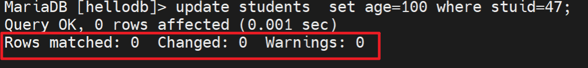

## 事务日志

MyISAM是没有事务日志的，所以改数据是直接修改的，怎么个直接修改呢，就是把数据库里的数据调到内存里，内存里改完后，直接覆盖到磁盘上的数据库的文件里去了。

InnoDB是有事务日志的，是把数据库的数据调到内存中，把内存里的数据修改后，存放到事务日志中，把什么存放到事务日志中，把内存中修改的过程。事务日志操作一段时间后，再把数据库的更改写入磁盘里。

​		写入事务日志有磁盘I/O，将事务日志的更改写入数据库也有磁盘I/O。效率就收到影响。但是多了一层I/O也没有太大问题，因为两个I/O没错，但是事务日志的I/O其实就是类似echo  xxx >> filexxx 这种顺序磁盘I/O，然后有无事务都涉及的数据库的修改的磁盘I/O这个是随机的，因为你也不清楚数据库上修改的是哪一行，哪一个数据块（因为你可能是改的第一条记录，也可能是改的第二条记录），所及磁盘I/O。

​		事务日志就是追加的磁盘I/O，是顺序性的。所以性能消耗没啥。

预写式的，write ahead logging其实就是，有I/O log的一半都是先写日志，再写磁盘，类似ext3文件系统。

## 数据库的日志文件

### 事务日志 transaction log

##### 1、规范：和数据文件分开放，好像log和data本来就得分开来，就像程序和data一样--否则项目程序文件移植后，数据混在里面会有问题。

我遇到得问题就是我是 windows本地编辑，远程调试得，结果呢数据也是放在同级别的代码目录的，所以我的windows上的项目程序里式没有数据的，而远端linux上的项目文件里是有数据的。移植起来就不能说windows同步到另一台linux上，这样没有实时数据支撑，代码的结果可能就不是最新的也就不对了。

##### 2、事务日志的相关信息

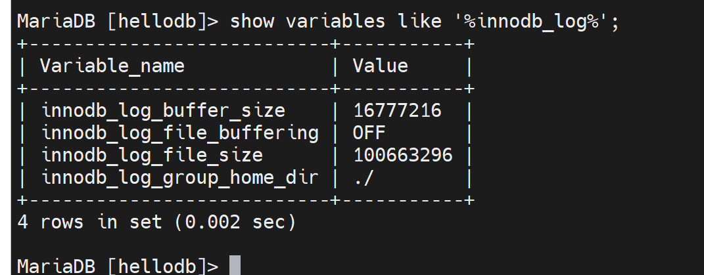

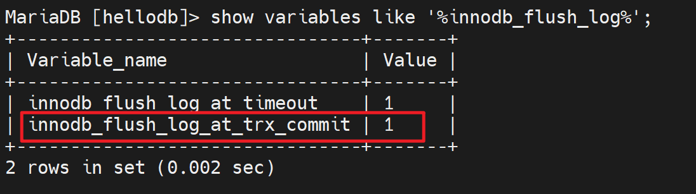

innodb_log_buffer_size：

innodb_log_file_buffering：

innodb_log_file_size

innodb_log_group_home_dir  		事务日志存放路径，默认写的是相对路径./ 其实就是当前数据库的路径也就是/var/lib/mysql/下，具体的文件就是这两个文件ib_logfile0和ib_logfile1。写满0号文件，然后去写1号文件，写满1号文件后再覆盖0号文件，就是这样来回写。

​		为什么是2个，因为变量innodb_log_files_in_group，同时它也是服务器选项。但是我修改了重启服务后，还是看不到该变量，不过默认倒是1，因为ll /var/lib/mysql里就看到1个ib_logfile0。

参考一下视频里老师的变量情况吧，聊胜于无看看呗

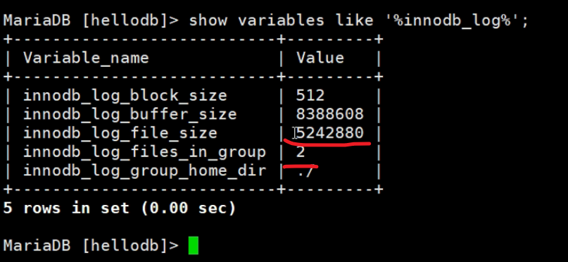

上图👆这个file_size就是ib_logfile0/1的大小5M，而in_group 2就是有两个ib_logfile0/1的原因。生产中 大小和数量都需要调大一些。为什么呢，举例①如果一个大事务，第一个文件ib_logfile0写满了，然后写ib_logfile1又写满了，然后有翻过头来写ib_logfile0这样一个事务日志都不全了。

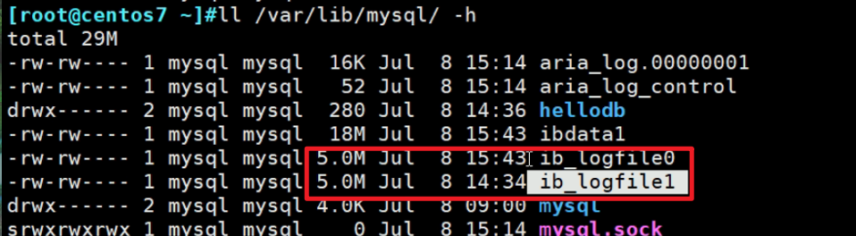

此外上上图还有个buffer_size8M，是缓存

还有个bock_size块大小，512字节，

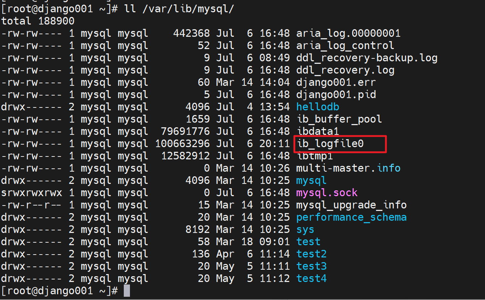

顺带一提ibdata1就是 包含了 数据库的数据+索引。当使用服务器选项innodb_file_per_table后就会拆分出来放到每个数据库目录里，具体见https://oneyearice.github.io/25-MYSQL%E6%95%B0%E6%8D%AE03/1-%E7%B4%A2%E5%BC%95%E7%B1%BB%E5%9E%8B%E5%92%8C%E7%BB%93%E6%9E%84%E5%8E%9F%E7%90%86.html?h=innodb_file_per_table

#### 看下重要变量：

innodb_flush_log_at_trx_commit

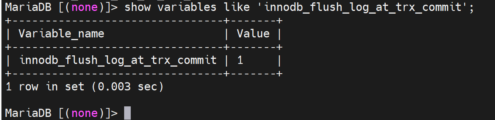

看到了1这个值，其实一共可以设置成0 1 2 3 4个值。

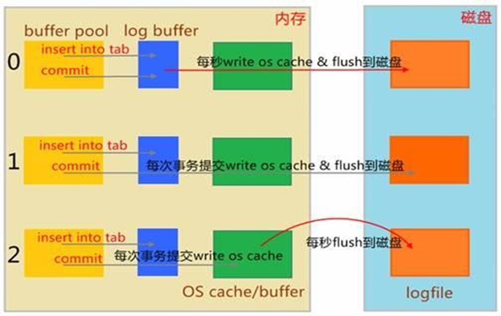

1、理解buffer(缓冲)和cache(缓存)，浏览器的叫什么叫cache

 

飞机着陆叫什么缓冲，所以一般来讲，读-缓存，写-缓冲。

2、上图没有画出来的是磁盘里面也有自己的缓冲buffer。

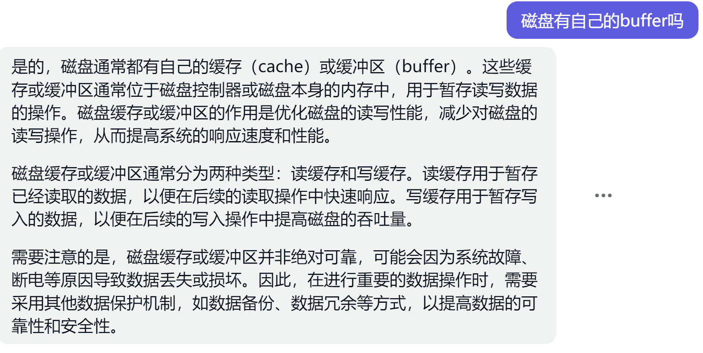 

3、然后才是上图本身要表达的意思

0 ，该机制，当你insert into tab 并且提交的时候；首先提交到日志的缓冲log buffer；然后每秒写到系统内存并且紧接着写到磁盘里去，到了磁盘自然就是磁盘的缓冲啦，那个这里不讨论。

1，该机制，插入，提交后；首先一样也是提交到logbuffer里，于此同时立刻写到系统缓冲里紧接着写道磁盘里，就是说commit一提交，就直奔磁盘去了，中间该走的log buffer,system memory就按部就班的走。      这个机制磁盘I/O消耗大，磁盘停不下来。

2，该机制，插入，先提交到logbuffer里，紧接着写入os cache，然后1s一次写入磁盘。也就是说你可能1s中有大量事务并发到os cache里后，才会一起写入磁盘，这就降低了磁盘的I/O。 缺点：1s没到呢，还没写磁盘呢，如果此时有100个事务已经提交logbuffer+写入os cache里，此时断电了，还没写入磁盘呢，所以数据就丢了。是确确实实丢失了100次事务，100次的订单提交，100次啊，一百遍,一百遍,啥看不懂，唐伯虎点秋香啦。

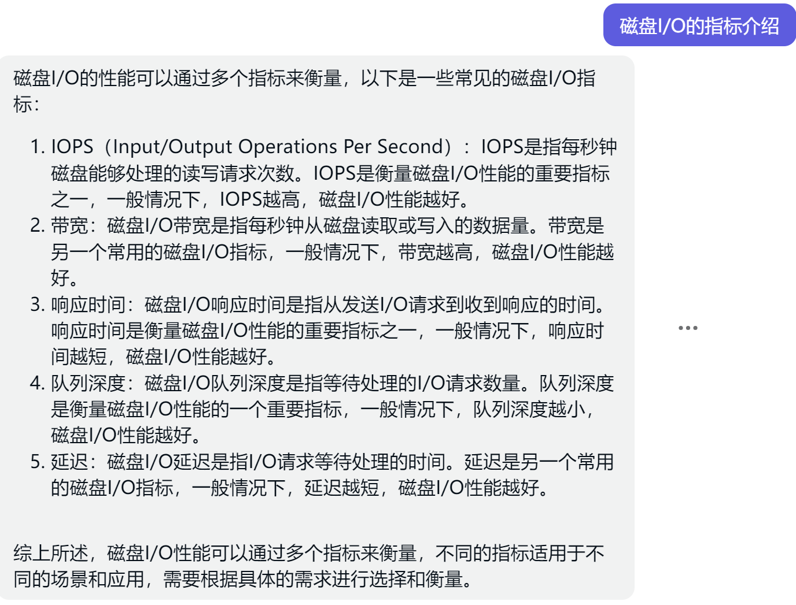

其实很好理解和记忆啦

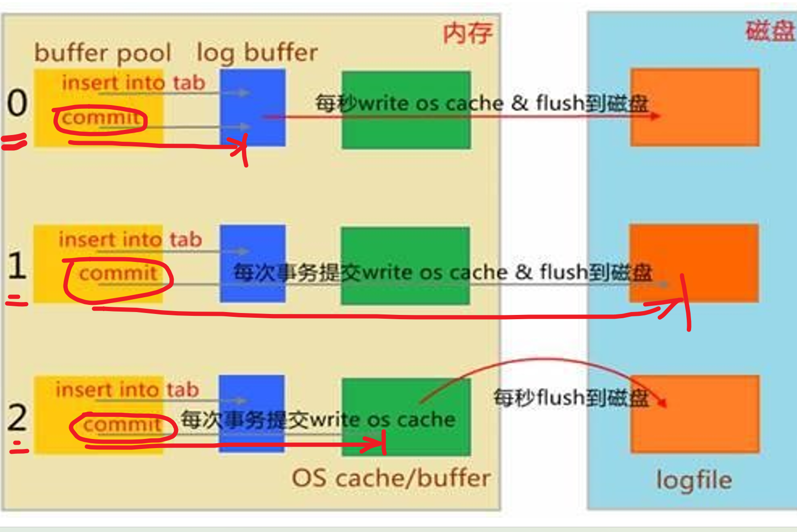

你要问我推荐哪个，我从来不推荐，我强制你用1，哈哈~，买高IOPS的硬盘得了。

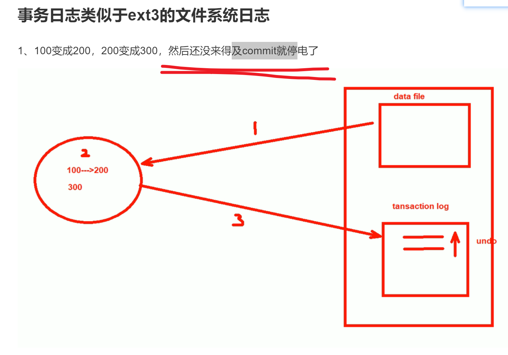

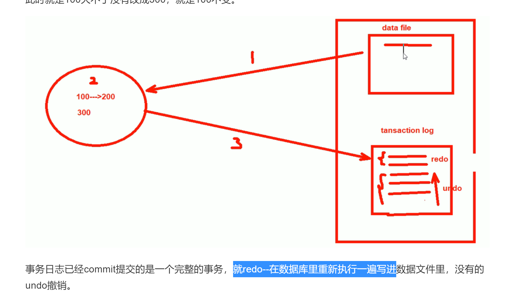

你看哦，之前我们提到事务日志的好处，就说了如果没commit提交断电了故障了，于是有这个undo，如果commit了出了问题就会redo。

​		那好，问题来了，commit了，0 1 2 甚至没讲的3 都出现问题，怎么不redo了？啊，啊字在这里是语气助词，表强调，恩，恩在这里也是语气助词，同样表强调，对，对在这里...哈哈哈，哈哈哈给个屁，傻逼东西，redo是会发生的，人家讨论的是事务的ACID没了，又没讲redo不做了。这是两码事，事务的commit后数据没落地本身就丢失了一致性，但是还有redo来保证，也许可以用2这个机制？

​		研究下这个redo 和0 1 2的问题；

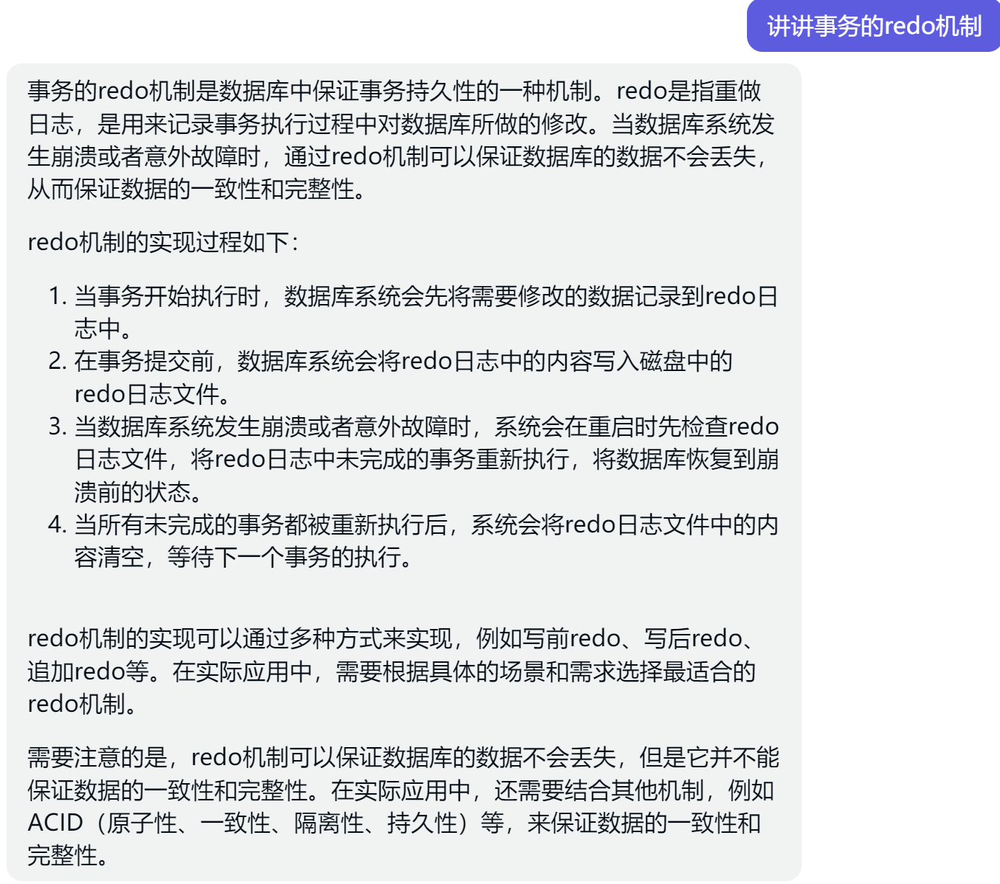

回答的太好了，虽然我没看懂~但是它明确的知道了redo和事务日志优化0 12 的区别。

redo不能保障ACID，同样事务日志commit提交按理说能够了，其实commit，哦我知道

总结

1、事务的ACID是通过一系列操作的整体堪称原子，原子性，就是要么都行，要么都不行。所以commit提交了意味着一个原子诞生了，了结了。但是从实际上来看，commit了，数据其实可能是还没落到磁盘上，甚至除了问题都不会落到磁盘上！所以事务的原子性没了！所以1 commit直达磁盘的机制会更加能够保障ACID。

2、再来说redo，可能就是commit了，但是数据库文件里没有，他就redo了。

不知道瞎几把讲的什么东西~，继续学，后面好像专门有讲redo日志。那里肯定有我要的答案。

mysql的磁盘I/O是比较频繁的，监控一定要做磁盘I/O的。

事务日志要放在一个专门的性能好的磁盘上，SSD固态是必要的。①事务日志是顺序往里写的，不存在随机访问的问题，要放在干净的独立的哪怕不是一个硬盘，至少是也给分区也是好的。为什么分区/磁盘要独立的啊，因为你不把事务日志独立开来，你和其他日志也好，数据也好合在一起，虽然事务日志是顺序的，但是一个分区来看数据块由于还有别的日志/数据往里写，所以数据块(磁盘空间)对于事务日志来讲就不是连续的了。什么磁盘碎片化就不连续了。

​		那么放到一个独立的磁盘或者分区就是修改这个值了

### 错误日志 error log

### 通用日志 general log

### 慢查询日志 slow query log

### 二进制日志 binary log

### 中继日志 reley log

