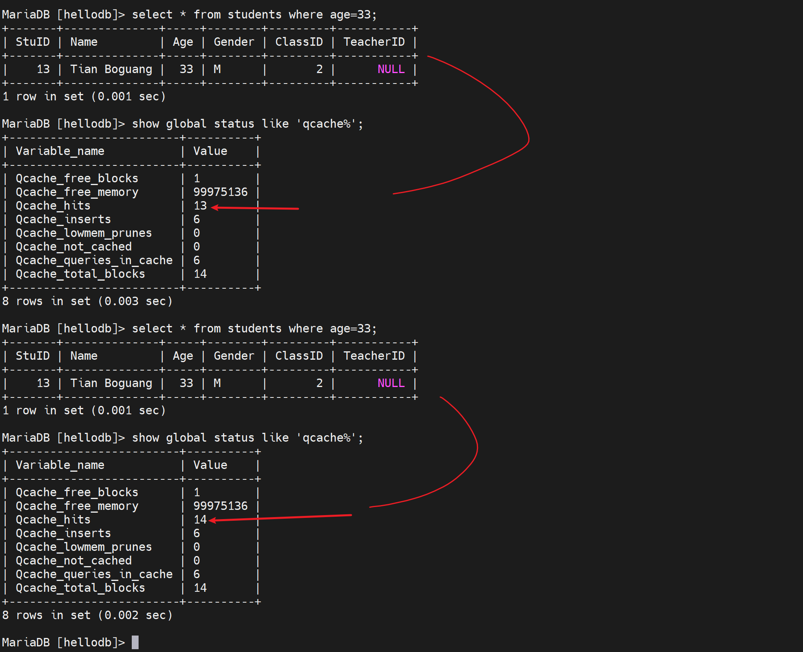

# 第4节. 各种日志管理


已经删掉了这一行，且提交，由于默认的事务级别是 "可重复读"，所以另一个窗口由于实现开启了事务，所以还是可以看到整个被删掉的数据的。


既然这个用户出现了幻读，那么站在他的角度就是可以改的，看看效果


结果发现没有变化


delete也看起来可以敲下去，但是并不会变化，幻读的结果还是比较稳定的，这种"可重复读"的机制，不仅仅是当初修改的人怎么修改提交，这边都看到的是进入事务的时候的看到的值；而且不管自己怎么改、删，自己看到的值还是当初进入事务的时候看到的值，所以这里又对REPEATABLE-READ有了新的认识。


而且敲下去显示的结果是0行受到了影响。


## 事务日志

MyISAM是没有事务日志的，所以改数据是直接修改的，怎么个直接修改呢，就是把数据库里的数据调到内存里，内存里改完后，直接覆盖到磁盘上的数据库的文件里去了。

InnoDB是有事务日志的，是把数据库的数据调到内存中，把内存里的数据修改后，存放到事务日志中，把什么存放到事务日志中，把内存中修改的过程。事务日志操作一段时间后，再把数据库的更改写入磁盘里。

​		写入事务日志有磁盘I/O，将事务日志的更改写入数据库也有磁盘I/O。效率就收到影响。但是多了一层I/O也没有太大问题，因为两个I/O没错，但是事务日志的I/O其实就是类似echo  xxx >> filexxx 这种顺序磁盘I/O，然后有无事务都涉及的数据库的修改的磁盘I/O这个是随机的，因为你也不清楚数据库上修改的是哪一行，哪一个数据块（因为你可能是改的第一条记录，也可能是改的第二条记录），所及磁盘I/O。

​		事务日志就是追加的磁盘I/O，是顺序性的。所以性能消耗没啥。

预写式的，write ahead logging其实就是，有I/O log的一半都是先写日志，再写磁盘，类似ext3文件系统。


## 数据库的日志文件


### 事务日志 transaction log

##### 1、规范：和数据文件分开放，好像log和data本来就得分开来，就像程序和data一样--否则项目程序文件移植后，数据混在里面会有问题。

我遇到得问题就是我是 windows本地编辑，远程调试得，结果呢数据也是放在同级别的代码目录的，所以我的windows上的项目程序里式没有数据的，而远端linux上的项目文件里是有数据的。移植起来就不能说windows同步到另一台linux上，这样没有实时数据支撑，代码的结果可能就不是最新的也就不对了。

##### 2、事务日志的相关信息


innodb_log_buffer_size：

innodb_log_file_buffering：

innodb_log_file_size

innodb_log_group_home_dir  		事务日志存放路径，默认写的是相对路径./ 其实就是当前数据库的路径也就是/var/lib/mysql/下，具体的文件就是这两个文件ib_logfile0和ib_logfile1。写满0号文件，然后去写1号文件，写满1号文件后再覆盖0号文件，就是这样来回写。

​		为什么是2个，因为变量innodb_log_files_in_group，同时它也是服务器选项。但是我修改了重启服务后，还是看不到该变量，不过默认倒是1，因为ll /var/lib/mysql里就看到1个ib_logfile0。


参考一下视频里老师的变量情况吧，聊胜于无看看呗


上图👆这个file_size就是ib_logfile0/1的大小5M，而in_group 2就是有两个ib_logfile0/1的原因。生产中 大小和数量都需要调大一些。为什么呢，举例①如果一个大事务，第一个文件ib_logfile0写满了，然后写ib_logfile1又写满了，然后有翻过头来写ib_logfile0这样一个事务日志都不全了。


此外上上图还有个buffer_size8M，是缓存

还有个bock_size块大小，512字节，


顺带一提ibdata1就是 包含了 数据库的数据+索引。当使用服务器选项innodb_file_per_table后就会拆分出来放到每个数据库目录里，具体见https://oneyearice.github.io/25-MYSQL%E6%95%B0%E6%8D%AE03/1-%E7%B4%A2%E5%BC%95%E7%B1%BB%E5%9E%8B%E5%92%8C%E7%BB%93%E6%9E%84%E5%8E%9F%E7%90%86.html?h=innodb_file_per_table


#### 看下重要变量：

innodb_flush_log_at_trx_commit


看到了1这个值，其实一共可以设置成0 1 2 3 4个值。


1、理解buffer(缓冲)和cache(缓存)，浏览器的叫什么叫cache

 

飞机着陆叫什么缓冲，所以一般来讲，读-缓存，写-缓冲。

2、上图没有画出来的是磁盘里面也有自己的缓冲buffer。

 

3、然后才是上图本身要表达的意思

0 ，该机制，当你insert into tab 并且提交的时候；首先提交到日志的缓冲log buffer；然后每秒写到系统内存并且紧接着写到磁盘里去，到了磁盘自然就是磁盘的缓冲啦，那个这里不讨论。

1，该机制，插入，提交后；首先一样也是提交到logbuffer里，于此同时立刻写到系统缓冲里紧接着写道磁盘里，就是说commit一提交，就直奔磁盘去了，中间该走的log buffer,system memory就按部就班的走。      这个机制磁盘I/O消耗大，磁盘停不下来。

2，该机制，插入，先提交到logbuffer里，紧接着写入os cache，然后1s一次写入磁盘。也就是说你可能1s中有大量事务并发到os cache里后，才会一起写入磁盘，这就降低了磁盘的I/O。 缺点：1s没到呢，还没写磁盘呢，如果此时有100个事务已经提交logbuffer+写入os cache里，此时断电了，还没写入磁盘呢，所以数据就丢了。是确确实实丢失了100次事务，100次的订单提交，100次啊，一百遍,一百遍,啥看不懂，唐伯虎点秋香啦。


其实很好理解和记忆啦


你要问我推荐哪个，我从来不推荐，我强制你用1，哈哈~，买高IOPS的硬盘得了。


你看哦，之前我们提到事务日志的好处，就说了如果没commit提交断电了故障了，于是有这个undo，如果commit了出了问题就会redo。

​		那好，问题来了，commit了，0 1 2 甚至没讲的3 都出现问题，怎么不redo了？啊，啊字在这里是语气助词，表强调，恩，恩在这里也是语气助词，同样表强调，对，对在这里...哈哈哈，哈哈哈给个屁，傻逼东西，redo是会发生的，人家讨论的是事务的ACID没了，又没讲redo不做了。这是两码事，事务的commit后数据没落地本身就丢失了一致性，但是还有redo来保证，也许可以用2这个机制？

​		研究下这个redo 和0 1 2的问题；


回答的太好了，虽然我没看懂~但是它明确的知道了redo和事务日志优化0 12 的区别。

redo不能保障ACID，同样事务日志commit提交按理说能够了，其实commit，哦我知道

总结

1、事务的ACID是通过一系列操作的整体堪称原子，原子性，就是要么都行，要么都不行。所以commit提交了意味着一个原子诞生了，了结了。但是从实际上来看，commit了，数据其实可能是还没落到磁盘上，甚至除了问题都不会落到磁盘上！所以事务的原子性没了！所以1 commit直达磁盘的机制会更加能够保障ACID。

2、再来说redo，可能就是commit了，但是数据库文件里没有，他就redo了。


不知道瞎几把讲的什么东西~，继续学，后面好像专门有讲redo日志。那里肯定有我要的答案。


mysql的磁盘I/O是比较频繁的，监控一定要做磁盘I/O的。

事务日志要放在一个专门的性能好的磁盘上，SSD固态是必要的。①事务日志是顺序往里写的，不存在随机访问的问题，要放在干净的独立的哪怕不是一个硬盘，至少是也给分区也是好的。为什么分区/磁盘要独立的啊，因为你不把事务日志独立开来，你和其他日志也好，数据也好合在一起，虽然事务日志是顺序的，但是一个分区来看数据块由于还有别的日志/数据往里写，所以数据块(磁盘空间)对于事务日志来讲就不是连续的了。什么磁盘碎片化就不连续了。

​		那么放到一个独立的磁盘或者分区就是修改这个值了


1、加一块硬盘2G的

我用的VMwareWorkstation

2、发现硬盘


3、分区


看情况lsblk看不到就同步一下👇


4、格式化


5、挂载

创建文件夹用来挂载


挂载


修改所有者所属组为mysql


6、修改mysql的对应变量


重启后报错了


当然status也能看，但是对比journalctl看，可知


还是缺少文件的原因，

缺少就拷过去，就OK了，老师演示的直接就是重启自动生成日志文件了，无需像我一样复制或移动过去，不过我用的高版本的mariadb。


再检查下变量


这样就是得到了一个干净的分区，且分区时高速磁盘哦你要生产中换成SSD之类的硬盘的。


### 错误日志 error log

错误日志不仅仅时错误日志，还包含数据库的启动关闭日志也里面。一些重要事件可能也会放在里面。


我的mariadb时空值


还是和mysql不太一样，这个是默认空值，然后默认文件是


而且现在的配置方法也变了


视频里的默认值这是之前的版本

该值来源于


测试错误日志


重启服务后，就看到错误日志👇


##### 报警信息log_warnings


这是视频里的值

现在的版本值是2，估计是level，从2级开始记录的意思咯，0就是不记录咯，我猜的。


告警也是放在error日志里的，只不过是👇用括号Warning括起来了。


一个error 日志里不仅仅是error还有很多其他的


### 通用日志 general log

记录的是各种数据库的操作，比如sql语句


中间断了一下重连了，就是因为另外开了窗口去添加了服务器选项打开了普通日志


通用日志的文件


此时就可以看到通用日志了，比如show 比如select


这个文件就是刚才①配置文件里加了选项②重启了服务后才生成的。本来generl_log是OFF，文件时不存在的。


然后写错命令也一样也看得到


一般不推荐启用，估计也就是找bug找故障的时候才会开一下，毕竟什么都记录太费磁盘，费IO了。


进一步思考，这些通用日志，本身也是数据，何不把日志放到数据库里呢！找张表放呗

这个值👇


FILE就是将log输出到FILE文件，改一改，改成输出到数据库也就是将FILE改成TABLE表，而这个表就是mysql库里的general_log表👇

 


好，改一下


此时日志就要去mysql.general_log里看了


这个通用日志可以用来干啥呢，有个debug的好处，就是程序开发写的web页面，页面上点点点比如购物，其实底层就是去数据库上select 的，可以看到开发程序上写的的sql语句是不是合适~是不是有优化的空间~。


### 慢查询日志 slow query log

1、打开页面慢，通过浏览器比如chrome的F12查看network的响应时间，也可以通过curl分析http的性能

```bash
 curl -Lo /dev/null -s -w time_namelookup:"\t"%{time_namelookup}"\n"time_connect:"\t\t"%{time_connect}"\n"time_appconnect:"\t"%{time_appconnect}"\n"time_pretransfer:"\t"%{time_pretransfer}"\n"time_starttransfer:"\t"%{time_starttransfer}"\n"time_total:"\t\t"%{time_total}"\n"time_redirect:"\t\t"%{time_redirect}"\n" https://oneyearice.github.io/
```

一旦发现是TTFB耗时时间长，就可以判断是服务响应慢，而服务响应慢，基本上对于一个业务系统来讲，大概率就是数据库的慢查询了。


2、默认是10s


系统认为10s以上才是一个慢的查询，所以不行，得改。

而且只是有个10s的定界值，实际上没有启用慢查询日志，通过查看slow_query_log可见

 

 

同时3s就认为是慢查询了。

 

此时就看到了慢查询日志xxxslow.log


打开挂着看效果


然而并没有，原因就是我的配置里还保留这上一次配置的log_output=table这就是所有日志输出都不走文件，

 

查看就去mysql.slow_log表里看


恢复输出为文件

 

重启服务后


要注意都是DML语句执行结束后，那边才会有日志，当然慢查询日志可不是仅仅select，通过之前的call pro_testlog可知也包括了一个慢的存储过程--其中就是循环了很多次的insert。


·

另外log_slow_filter就规定了哪些类的查询会记录慢查询日志，就是当这些操作超出long_query_time的时候。一般不会改这个值，还有就是这里面没有列出的既是超出long_query_time也不会记录到慢查询日志里。


问题来了，如果一个查询速度没有超出long_query_time，但是有提速空间，比如没有利用索引，可以利用起来加速以下，这种查询操作能否也记录下来呢？

log_queries_not_using_indexes=ON，开启后就会同样记录在慢查询中。

默认是关闭的


 

开启后确认


此时，哪怕查询没有超出long_query_time，只要没有使用索引，也会记录在慢查询日志中。

select * from students where stuid=20;   这就会利用主键索引进行查询了

1、全表查询肯定不会涉及索引，此时慢查询里就有日志了


2、使用where查询对比有索引和没索引的日志

没有利用索引的就会log_queries_not_using_indexes=ON记录在慢查询里


你再看这个利用索引的查询


此时慢查询里就没有日志啦，因为这是利用了主键查询，是用到了主键索引的，所以log_queries_not_using_indexes=ON不会记录了。

再来，刚才select * from students where name='o6o';是记录在慢查询里的，现在添加name的索引后，就不会记录在慢查询里了。

 

 


mariadb的特有配置

log_slow_rate_limit ，就是慢查询达到一定占比此以上才开始记录到 慢查询日志里，图中将1改成5试试，所以这个5不是5次，而是5%的意思。


空的，然后输出格式是


改一下


重启后确认


但是要注意哦，如果连着两下或多次select同样的命令，就会有重复的日志记录了哦，因为有命中缓存了我觉得，所以就不会记录在不利用索引的日志里了。


复习下缓存吧👇




然后explain xxx 每次都是记录的


如果查到确实存在一条慢查询了，那么像继续深入研究下这条语句到底慢在哪里，可以这么看，一个负复杂的select语句说不定里面还带有子查询什么的，甚至涉及连接、多表查询等。到底这个复杂的语句中哪一块导致它慢了？

​     举例：select sleep(1) from students;  这个是每一行休眠1s的意思；该表里一共20几条记录，大概就要20几秒才能执行完。


通过tail /var/lib/mysql/tail -f django001-slow.log可见


我把这个slow_log的格式恢复成默认形式先

 

注销掉，恢复成默认空值👇


再看看slow_log就恢复成原来的简短格式了


然后继续深入研究慢在哪里，就得看profiling这个变量


简单点，就用cli开启了，不配置服务器选项了

然后再次执行慢查询的语句，当然此时就会担心会不命中缓存，不是哦，"索引利用不到"本该记录slow_log但是却命中缓存所以不会记录；而这里确实不会命中缓存，所以会每次都记录slow_log的。


然后show profiles可见


关注这个Query_ID，输入show profile for query 7;查看具体**详情**


可以看到sleep了这么多，

图中涉及一些时间

checking permssions 检查权限

opening tables打开表

等等，发现其中sleep 好多花了很久，而在生成中这个sleep很有可能就是某些sql语句。

##### 👆这招很有意义的


#### 再看个其他例子


默认是分开来放的👆


跑一下这个存储过程，就会导致数据库文件不断变大


然后以事务的方式跑这个存储过程

 

在跑到时候，就可以看到testlog.ibd这个数据库文件在不断的变大；**就是说事务的写法不是说单纯地只写道事务日志里地，其实也会写道磁盘里的，其实就是那个事务优化地0 1 2级别好像是**


不过我的这个以事务运行的怎么还卡这么久啊，都TM5分钟过去了


好了


此时记住这个数据库文件大小


此时rollback，撤销，数据就写入，理论上应该文件大小会缩回去，但是不是！


大小是不变的


**也就是说事务撤销了，数据不写到表里了已经，但是数据库文件大小还是涨上去了，不变地。**

然后再看不以事务方式，就是真正地往里面添加记录了；注意此时testlog.ibd的大小还是上图的33554432字节。

 

等你执行完，真正添加记录进去后，就会发现testlog.ibd文件大小没有变化


1、rollback，后悔了表里的内容请了，文件大小不会缩回去

2、说明增加的空间大小，其实里面内容是空的，占了磁盘空间，但是里面没有内容。就相当于一个空文件。

3、所以如果把这个表整个情况了，还是一样的ibd文件大小还是不变


所以你就会发现命名数据都没了，数据文件大小还是老样子。数据都没了，还占什么空间呢。


4、所以可以做一下优化，optimize table testlog;整理一下，


之前的占用的空文件就释放了👇这样testlog.ibd大小就缩回去：


数据库的操作日志

用户账号家目录里的隐藏文件


### 二进制日志 binary log

见下篇

### 中继日志 reley log

见下篇

