# 第5节. 二进制日志管理

## 介绍

二进制日志就是二进制数据，不是文本文件

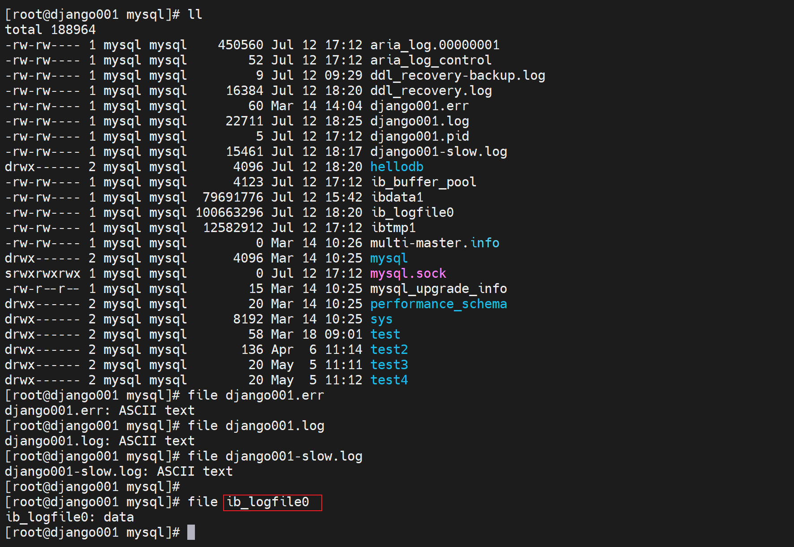

上图可见之前学习的各种日志都是文本文件，事务日志也不是文本文件。

事务日志就是利用事务的操作记录，但是几个文件反复覆盖保存的，只是记录最近的操作，就几个文件来回写的。

二进制日志不依赖于存储引擎，不是说一定要支持事务才行。不管是MyISAM还是InnoDB都可以使用二进制日志。

二进制日志记录的就是对数据库的增删改，不清理的，不断记录的，如果能够打开这个二进制日志就可以知道，什么时间做了哪些操作。

默认二进制日志没有启用的，微软的SQL Server和oracle也是一样都默认没有开启二进制日志的，也是只有事务日志，其中oracle不叫这个名字，而是叫"在线的重做日志"；其中二进制日志叫"归档(重做)日志"。

二进制日志不仅仅是审计，关键知道做了哪些增删改，所以还可以做数据库的还原。

1、完全备份结合二进制日志就可以做到恢复数据

2、比如上图的周五数据崩了，你用周一2:00的完全备份+之后到周五的二进制日志进行"重放"就可以恢复数据。

3、启用二进制日志后，默认是和数据库文件放在一个目录下的。

默认sql_log_bin是开启的，但是还不够，磁盘上还看不到二进制日志文件，

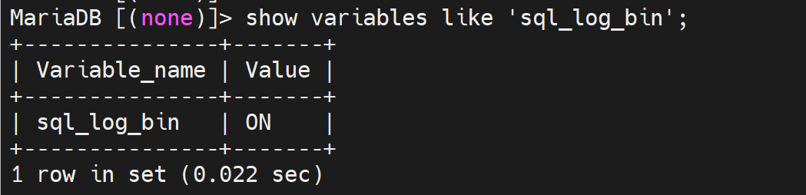

还需开启另一个日志开关--log_bin

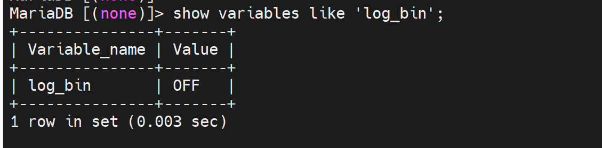

sql_log_bin和log_bin都启用才行，才算启用二进制日志功能。

可能正常会觉的开关设置两个有毛病，其实还真不是，sql_log_bin可以临时在会话里修改，log_bin只能在服务器选项也就是配置文件里修改。

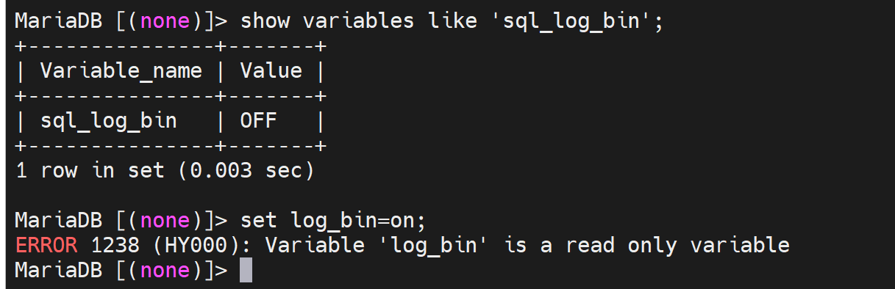

所以一般玩法：①log_bin在配置文件里开启②然后用sql_log_bin去临时关闭二进制（潜台词就是sql_log_bin就是默认开启的）③也就是说一般都是开启二进制，然后要临时禁掉就用sql_log_bin去在会话里禁掉就行了，而且也只是session级别的，不是全局的。这样就比较好些。

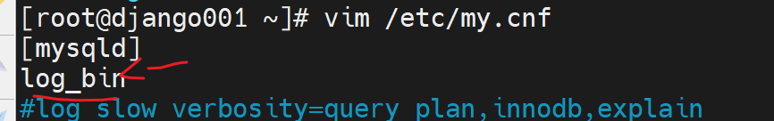 

这里有个点，就是log_bin=ON和log_bin=1和上图只写log_bin的区别。都是开启，但是有文件名生成的区别。①log_bin=xx，二进制日志的名称就是xx.00001和xx.index②所以log_bin=xx，xx是用来表示的文件名的前缀。

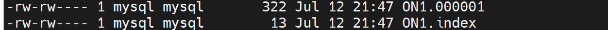

而不管xx写啥，进去看变量都是ON的。

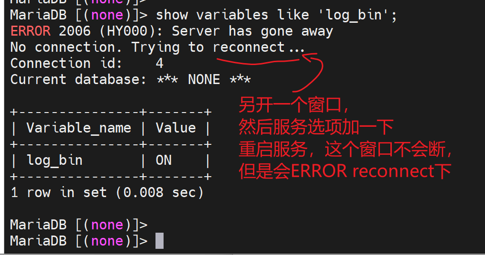 

然后就看到二进制文件了，不过时间好像有点奇怪，不奇怪，看清楚啊，是一致的，只不过data看到的是PM，而ll看到的时间是+12的。

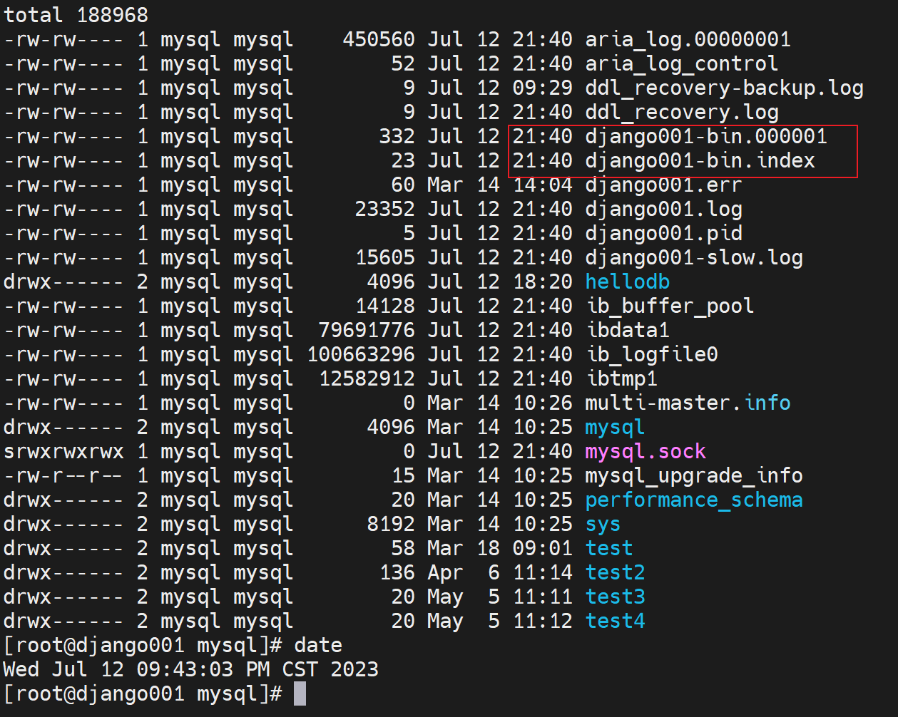

如果时间真的不一致，是因为mysql有自己的时区设置不是用的SYSTEM了吧，下图倒是用的系统时。

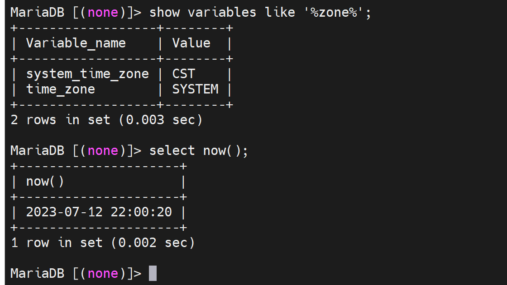

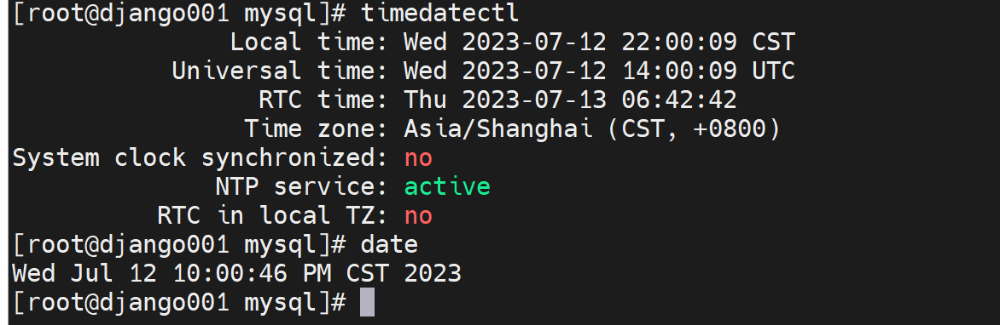

然后思考一下由于默认binlog是和数据库文件放在同一个路径下的，万一数据库挂了，宿主机挂了，都GG了。

所以：1、数据完全异地备份；2、二进制文件和数据文件分开也要异地备份

### 将bin-log放到别处

1、创建文件夹，同样最好单独一个磁盘SSD的，binLOG肯定也是和事务日志一样顺序I/O的。这里就利用之前事务日志存放的磁盘了做实验，实际生产中肯定要单独存放的。

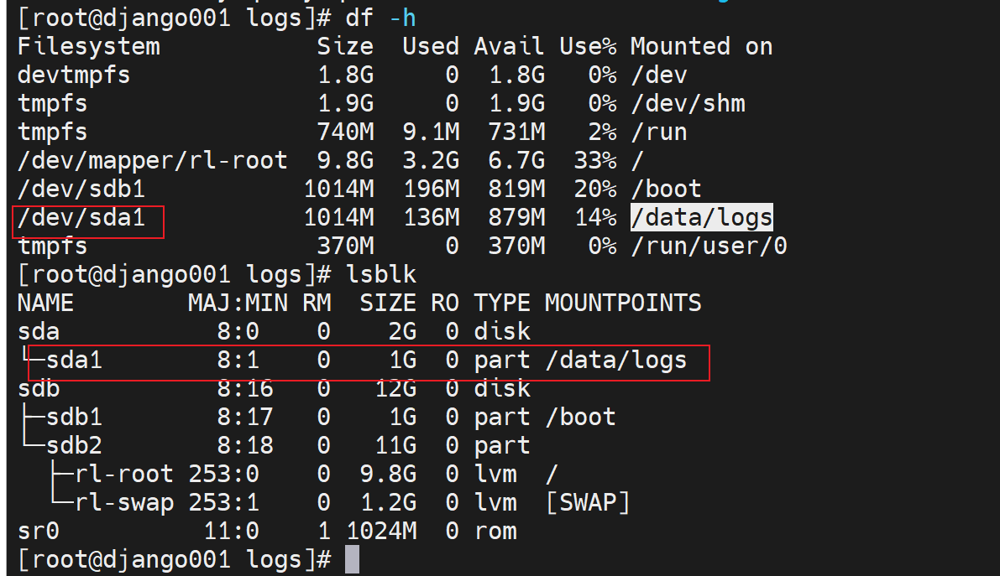

文件夹也要注意权限

3、修改配置文件里的服务器选项，并制定路径和前缀

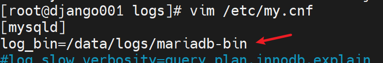

mariadb-bin就是将来生产的binlog的文件名的前缀，重启服务器后👇

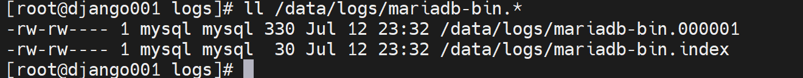

刚开始就是330个字节，后面随着增删改操作越来越多，该文件就会越来越大，增长速度非常快；更可怕的是bin-log的大小要远远大于数据本身(testlog.ibd)的大小

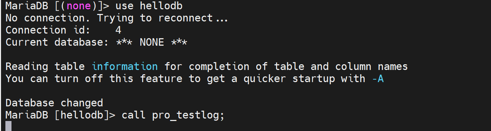

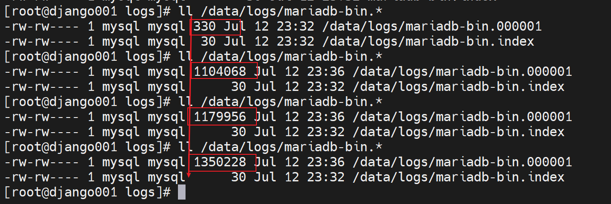

二进制文件我们知道可以dump的，具体就是hexdump -C

hexdump -C mariadb-bin.000001

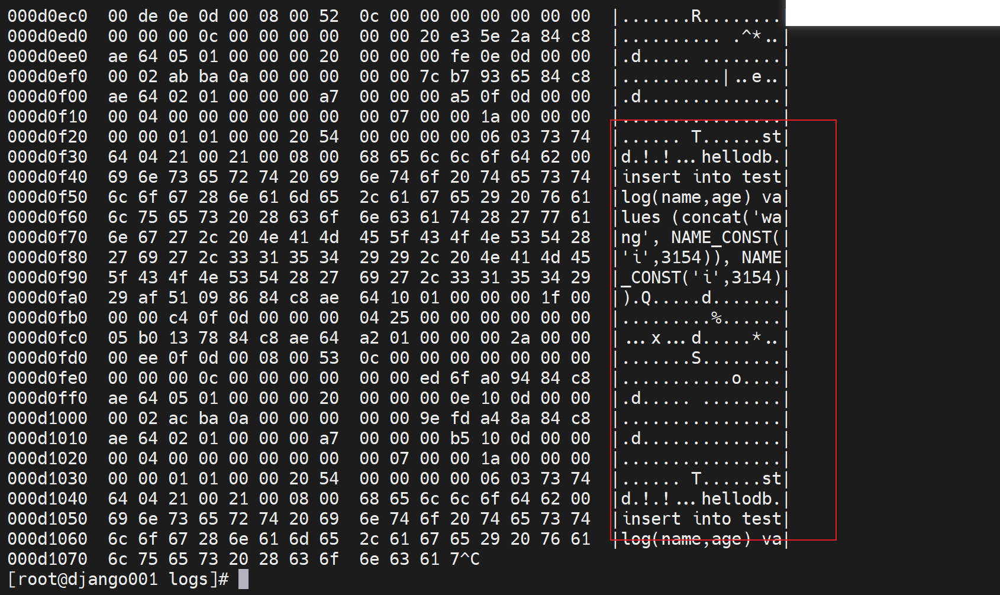

不过不是这样看的，这样只是二进制的一个通用性看法，聊胜于无的看看。

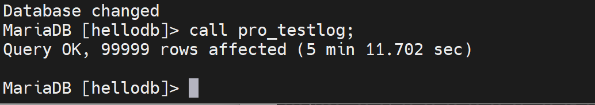

一个call pro_testlog就是往testlog表里增加10W行记录，

①数据库本身增长多大

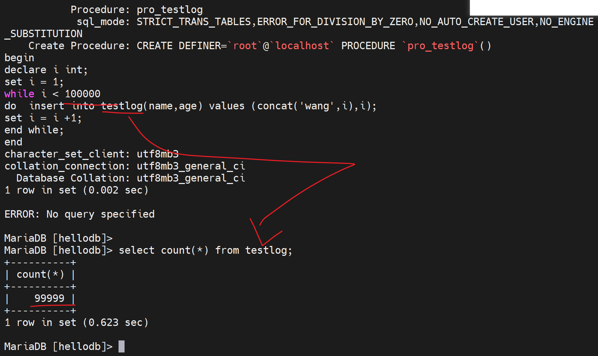

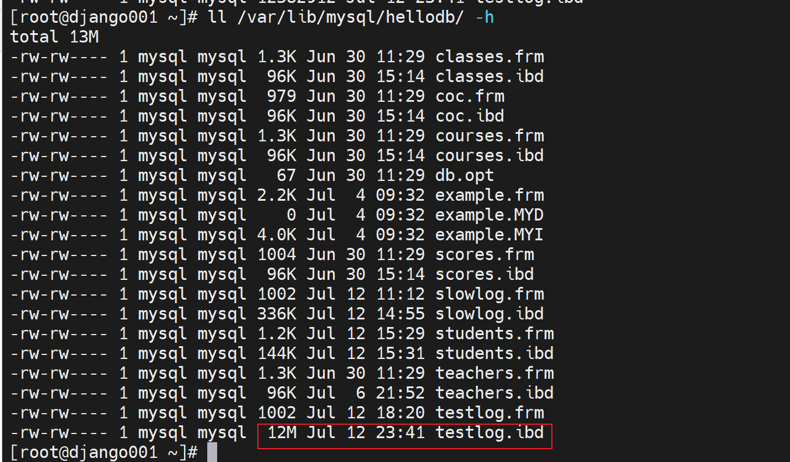

②bin log日志增长多大：27M，近似于数据文件大小的2倍。

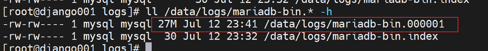

所以binlog要找一个 大硬盘、ssd的独立就给他存放。

此时如果将sql_log_bin置为OFF，此时binlog就不会增加了。这是种临时处理方法

注意一定是同一session，因为sql_log_bin我们通常就是临时在交互模式里手动改一下改成OFF的，所以必须在原来置为OFF的窗口或者会话里DML才不会导致binlog增长，别的会话不受影响--也就是别的会话如果有增删改还是会导致binlog继续增加的。实验就是在OFF的窗口进行DML，然后观察binlog就会停止增长。

说是DML，其实DML不涉及select查操作，也就是select不会导致binlog的增加，

### 二进制日志binLog存放的数据的格式

STATEMNT、ROW、MIXED 3种格式：

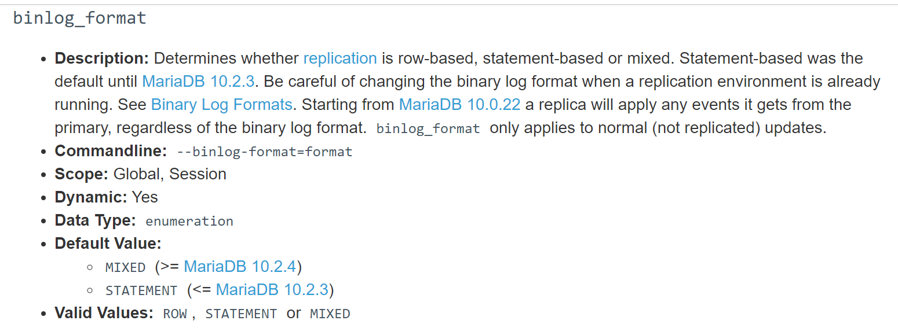

举例，delete from testlog; 这个testlog一共有10W行，问，binlog里记录的是一条delete语句还是删了10W条的动作。

1、STATEMENT：表示记录的是delete from testlog;本身这条语句；

2、ROW：表示根据sql修改的哪些行，就记录那行记录的，100W条删除就会记录100W条。

默认格式新版的mariadb是MIXED

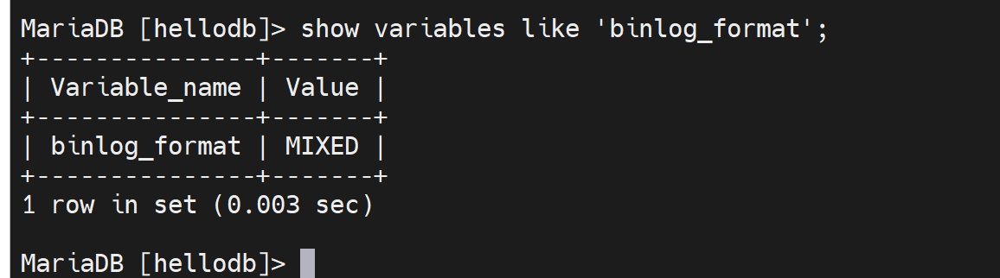

改一下，然后看下STATEMENT的效果

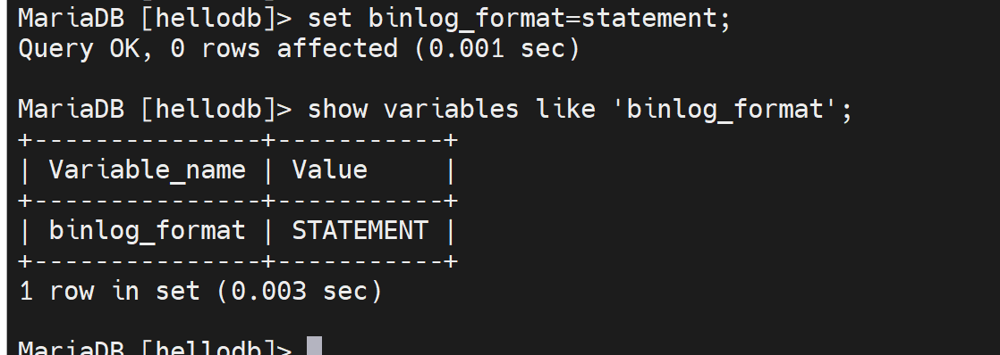

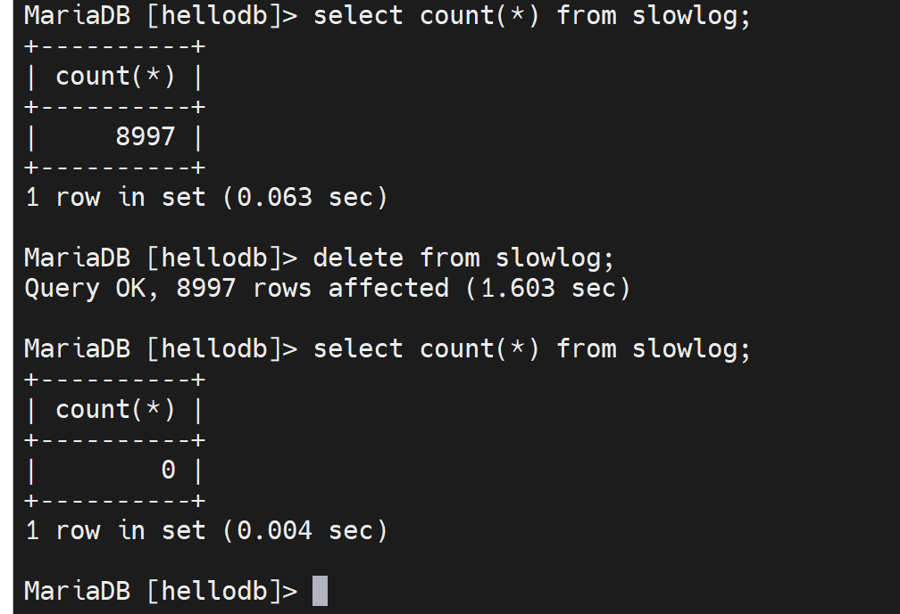

由于STATEMENT只是记录你敲的原本命令行，所以binlog二进制日志大小增长的很少

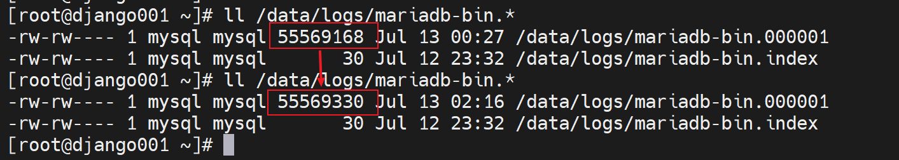

现在改成ROW模式，看看大小增长的幅度，因为ROW模式是你虽然敲的是一条CLI，但是影响了多少条，就记下来多少条。

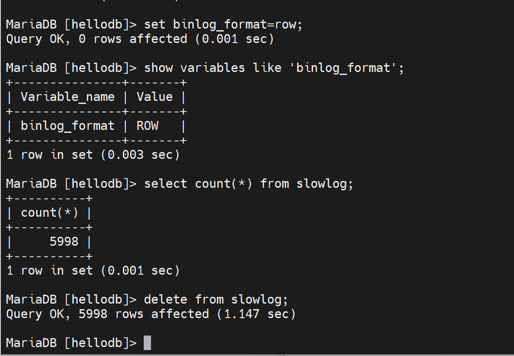

可以看到同一条delete语句，binlog选择ROW模式就要比STATEMENT模式，实际记录的内容多很多很多

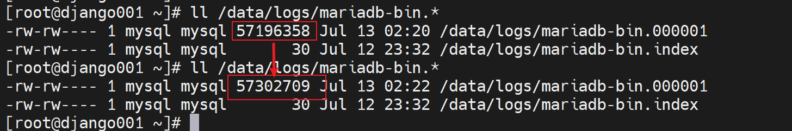

再来，刚才STATEMENT格式下，delete from testlog;是一条语句咯，如果同样模式下用call pro_slowlog;就不是一条语句咯，这个存储过程里其实是2999条的insert，对吧，我们知道binlog，啊你们不知道，哦没事我知道就行了，我知道binlog呵呵，通过上文介绍知道binlog是记录了增删改的操作而不是存储过程的一条操作，所以一个存储过程里while循环了多少次增删改，就会有多少条需要去记录到binlog，而格式又是STATEMENT，所以此时binglog就记录存储过程里循环的insert条数了。

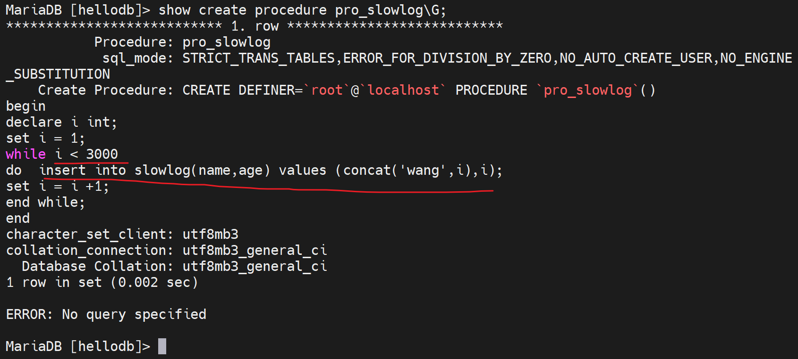

然后通过服务器选项--也就是配置文件里修改的方式来做binlog的格式修改

1、首先，你会发现重启服务后，binlog会新建一个文件来保存，原来的文件留着的。

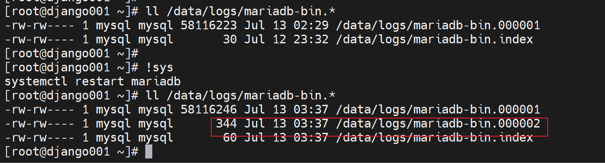

不管你该不该配置文件，只要重启，就会另外创建binlog文件。

### 对比下STATEMENT和ROW

举例，update test set col1=now();   这句话就是把col1列改成当前时间，如果你用的是

①STATEMENT，就是这句话原封不动记录下来，这就危险了，十天后DB故障，你恢复就会错误的恢复成现在的时间，而不是十天前的时间。

②ROW，就不会，就会真正的记录当前的时间，而不是now()这个函数本身，所以就可以保真，所以生产种推荐使用ROW格式。

但是为什么是MIXED默认呢，也许MIXED才是比较合适的。

首先ROW太占空间了对吧，既是数据库自身判断，如果安全起见就用ROW比如它发现insert里有now()可能就会用ROW，而发现没有歧义就可能节省空间使用STATEMENT格式。

### 二进制日志可以定义自动删除规则

通过expire_logs_days来做，默认0就是为空了，就是不限不删除

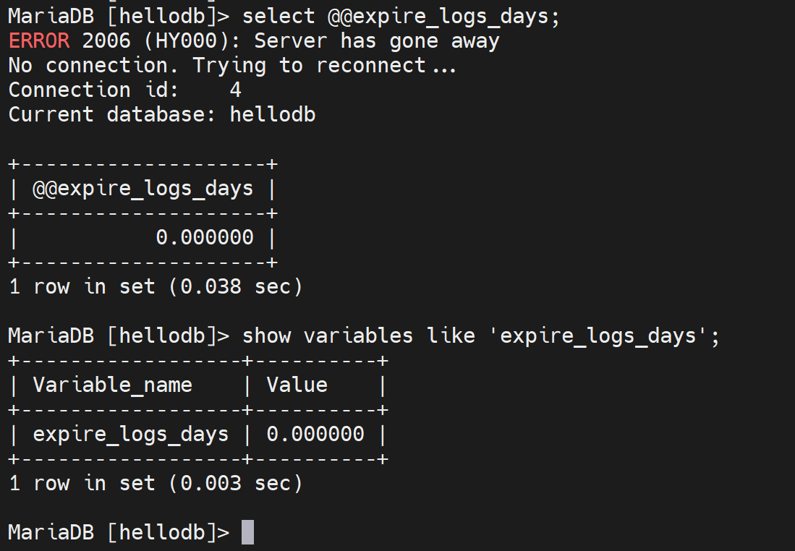

反正要监控磁盘的

### 二进制日志的最大值

max_binlog_size

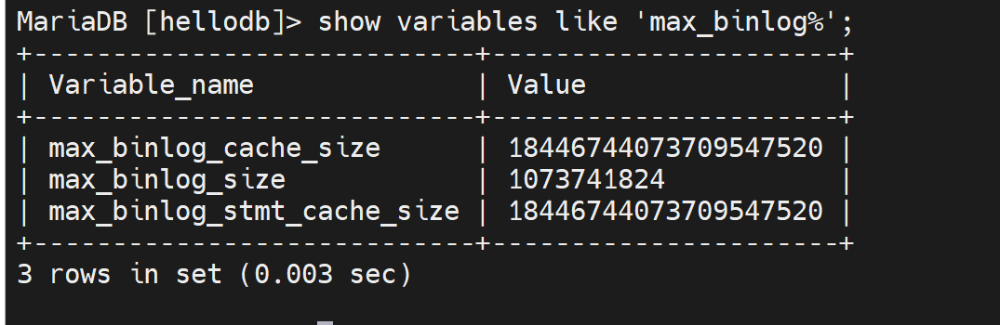

最大值size文件满了怎么办，没事就新建一个呗都是自动的。

### syn_binlog类似事务日志的优化级别012这种

就是是否理解写磁盘，就是binlog文件里先不捉急写，先放在缓存里；

事务日志那会讲过类似的机制，是数据不捉急写磁盘文件里，而是先写内存里再写道磁盘的日志文件里。

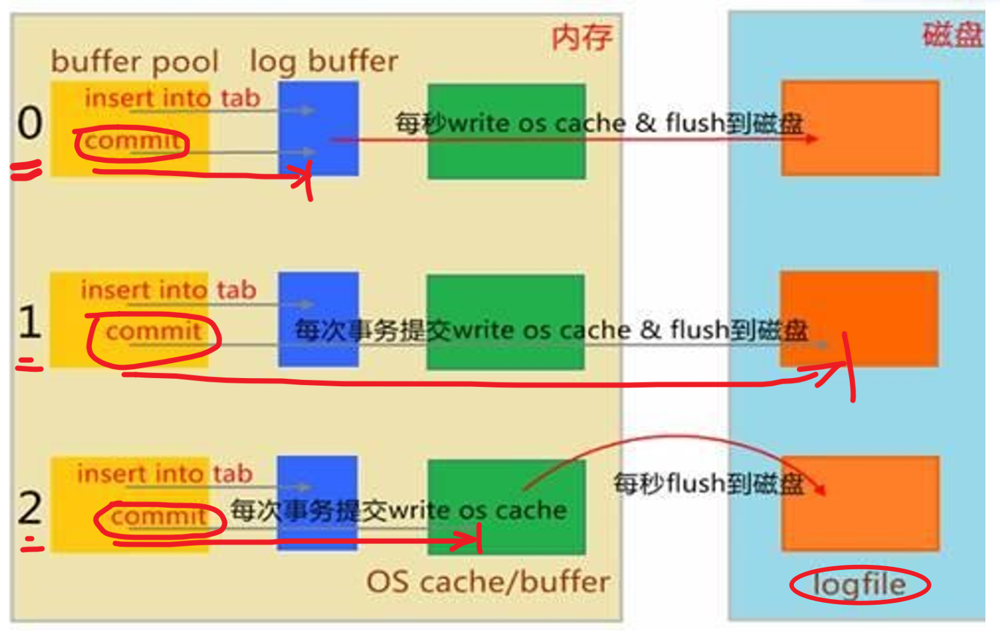

syn_binlog=1：只要发生二级制binlog就立即写磁盘logfile，当然这里的logfile就是binglogfile。  这种和之前事务日志1一样会带来磁盘I/O飙高不是合适。

syn_binlog=0：就是操作系统来决定什么时候同步到日志文件，哎，是OS啊，我以为是数据库呢。哦对的，是数据由mysql放到OS的缓冲buffer区，然后就交给OS自己调度了，人家OS看系统进程资源去安排调度什么时候轮到你写道磁盘文件里去。

### index文件就是记录了一共由几个binlog

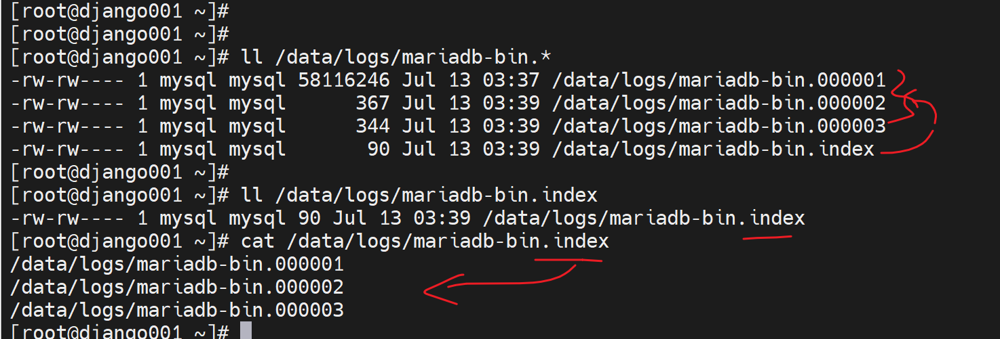

## binLog的管理方式

是通过mysql自身命令来操作的

### 1、比如看binlog大小，不用跑到磁盘上去ls看，肯定一样的

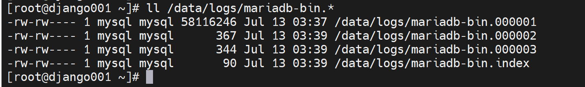

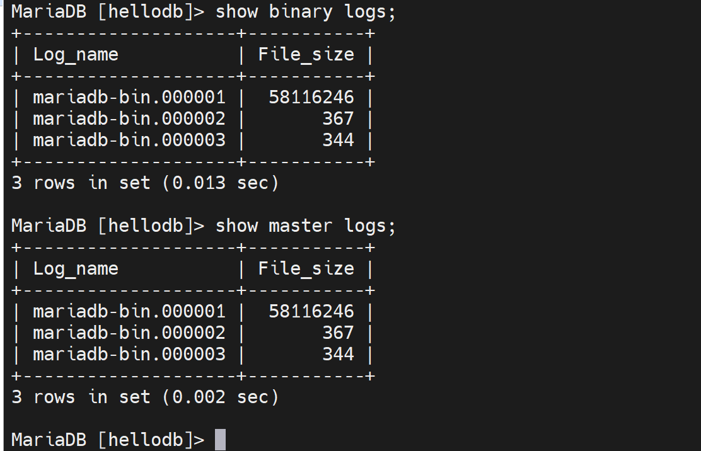

show binary 和show master一样的哦。

### 2、显示当前正在用的binlog文件信息

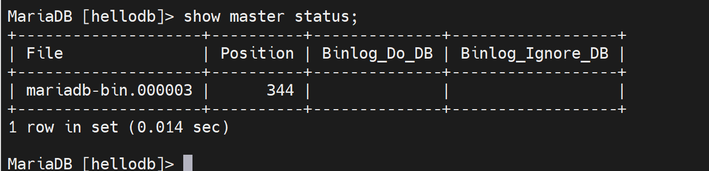

注意这个344看着是Position位置，其实对比上上图344就是文件大小的意思。当然叫position位置也没错，就是新发生日志数据往这个位置以后去写的意思。

#### 这个Position位置有啥用，首先大小字节是它的单位，将来操作的时候就知道从这个position之前的是旧数据，用于定位恢复数据的。

比如：早上10点不小心执行了一个drop table误删了表，就可以通过binlog把删表的这个位置给找到，找到这个位置用来定位故障点，进而想办法来还原数据库。emm这边比如比如的不太好，后买你看例子吧。

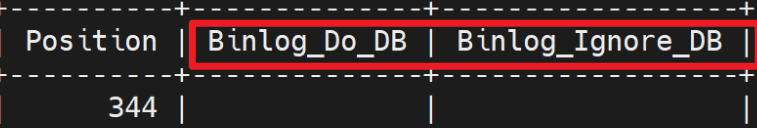

后面两个参数是数据复制用的，后文讲。

### 3、查看binlog内容

cat基本是乱码看不掉，虽然binlog不是纯粹的二进制文件，cat可以看到一些明文信息，但是肯定不能这么看啦

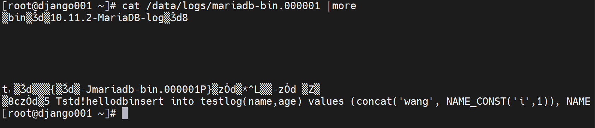

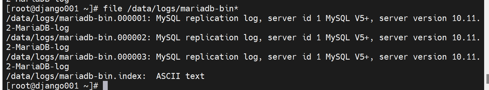

show binlog events in 'binglog文件名称'就行了

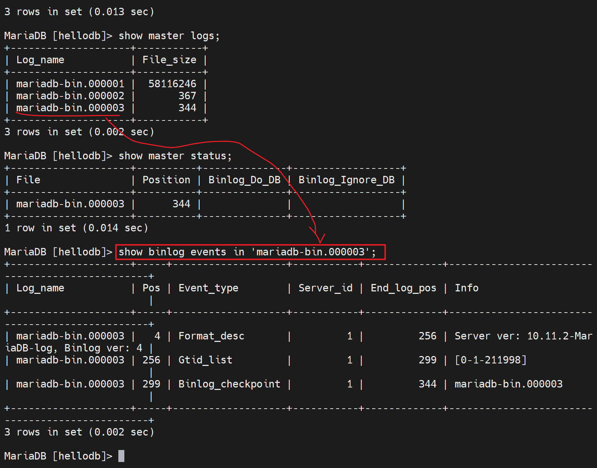

上图看了寂寞，是个空文件，看看实的吧

show binlog events in 'mariadb-bin.000001';  👇

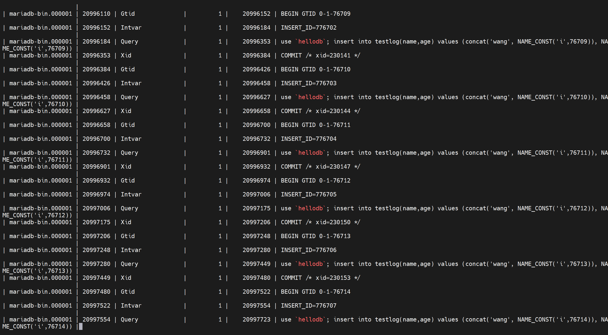

具体的cli完整版是这样的，还可以指定查看的日志的位置

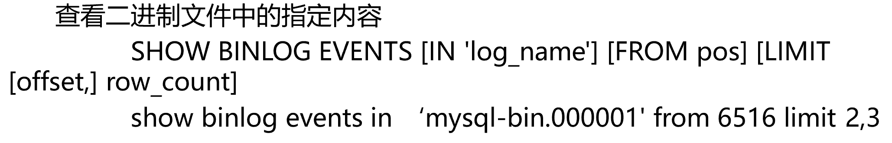

